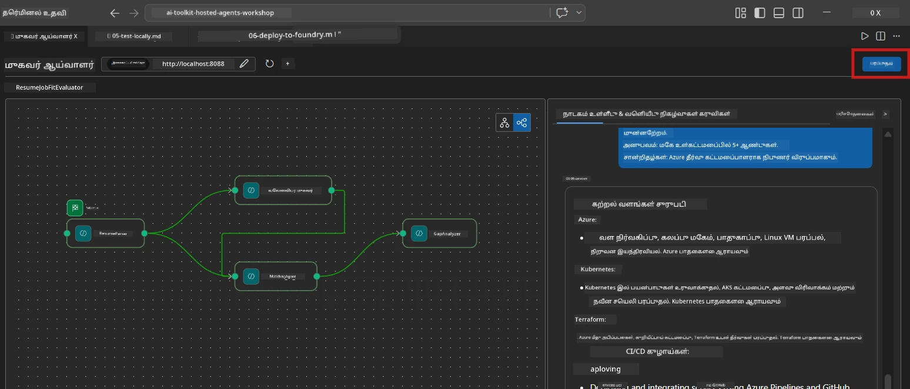
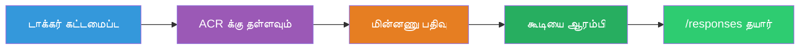
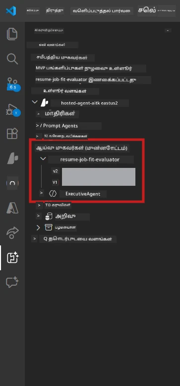

# Module 6 - Foundry முகவர் சேவையில் வெளியிடுதல்

இந்த Module-ல், நீங்கள் உள்ளூரில் சோதிக்கப்பட்ட மைகி-ஏஜெண்ட் வேலைப்பாட்டை [Microsoft Foundry](https://learn.microsoft.com/azure/foundry/agents/concepts/hosted-agents) இல் **Hosted Agent** ஆக வெளியிடுவீர்கள். வெளியீட்டு செயல்முறை ஒரு Docker container படம் உருவாக்குகிறது, அதை [Azure Container Registry (ACR)](https://learn.microsoft.com/azure/container-registry/container-registry-intro) க்கு தள்ளுகிறது, மற்றும் [Foundry Agent Service](https://learn.microsoft.com/azure/foundry/agents/how-to/publish-agent) இல் ஒரு hosted agent பதிப்பை உருவாக்குகிறது.

> **Lab 01-இல் இருந்து முக்கிய வேறுபாடு:** வெளியீட்டு செயல்முறை ஒரேபோல உள்ளது. Foundry உங்கள் மைகி-ஏஜெண்ட் வேலைப்பாட்டை ஒரு தனி hosted agent ஆக பார்க்கிறது - சிக்கல் கன்டெய்னருக்குள் உள்ளது, ஆனால் வெளியீட்டு மேற்பரப்பு அதே `/responses` இறுதி பாயிண்ட்.

---

## முன்னிருப்பு சரிபார்ப்பு

வெளியிடத்துக்கு முன், கீழ்காணும் எதார்த்தங்களை சரிபார்க்கவும்:

1. **ஏஜெண்ட் உள்ளூரில் smoke சோதனைகளை ஓர் செயலுக்கு கடந்துவிட்டது:**
   - நீங்கள் அனைத்து 3 சோதனைகளையும் [Module 5](05-test-locally.md) இல் முடித்து, வேலைப்பாடு முழுமையான வெளியீட்டை கணியார் gap கார்டுகள் மற்றும் Microsoft Learn URL-களுடன் சித்தரித்தது.

2. **உங்களுக்கு [Azure AI User](https://learn.microsoft.com/azure/foundry/concepts/rbac-foundry) பங்கு உள்ளது:**
   - இது [Lab 01, Module 2](../../lab01-single-agent/docs/02-create-foundry-project.md) இல் நியமிக்கப்பட்டது. சரிபார்க்க:
   - [Azure Portal](https://portal.azure.com) → உங்கள் Foundry **திட்ட** வளம் → **அணுகல் கட்டுப்பாடு (IAM)** → **பங்கு நியமனங்கள்** → உங்கள் கணக்குக்கான **[Azure AI User](https://aka.ms/foundry-ext-project-role)** பட்டியலில் உள்ளதா என உறுதி செய்யவும்.

3. **VS Code இல் Azure-க்கு உள்நுழையப்பட்டிருக்கிறீர்கள்:**
   - VS Code இன் கீழே இடது மூலைகணையில் உள்ள கணக்கு ஐகானை சரிபார்க்கவும். உங்கள் கணக்கு பெயர் தெரிய வேண்டும்.

4. **`agent.yaml` இல் சரியான மதிப்புகள் உள்ளன:**
   - `PersonalCareerCopilot/agent.yaml` ஐ திறந்து சரிபார்க்கவும்:
     ```yaml
     environment_variables:
       - name: PROJECT_ENDPOINT
         value: ${PROJECT_ENDPOINT}
       - name: MODEL_DEPLOYMENT_NAME
         value: ${MODEL_DEPLOYMENT_NAME}
     ```
   - இவை உங்கள் `main.py` வாசிக்கும் env மாற்றிகளுடன் பொருந்த வேண்டும்.

5. **`requirements.txt` இல் சரியான பதிப்புகள் உள்ளன:**
   ```
   agent-framework-azure-ai==1.0.0rc3
   agent-framework-core==1.0.0rc3
   azure-ai-agentserver-agentframework==1.0.0b16
   azure-ai-agentserver-core==1.0.0b16
   debugpy
   agent-dev-cli --pre
   ```

---

## படி 1: வெளியீட்டினைத் தொடங்கு

### விருப்பம் A: Agent Inspector இல் இருந்து வெளியிடுதல் (பரிந்துரைக்கப்பட்டது)

ஏஜெண்ட் F5 மூலம் இயக்கப்படும்போது Agent Inspector திறந்திருந்தால்:

1. Agent Inspector பேனலின் **மேல்-வலது மூலை** பார்க்கவும்.
2. **Deploy** பொத்தானை (மேல் அம்பு ↑ கொண்ட மேக ஐகான்) கிளிக் செய்யவும்.
3. வெளியீட்டு வழிகாட்டி திறக்கப்படும்.



### விருப்பம் B: Command Palette இல் இருந்து வெளியிடுதல்

1. `Ctrl+Shift+P` அழுத்தி **Command Palette** திறக்கவும்.
2. தட்டச்சு செய்யவும்: **Microsoft Foundry: Deploy Hosted Agent** மற்றும் தேர்வு செய்யவும்.
3. வெளியீட்டு வழிகாட்டி தோன்றும்.

---

## படி 2: வெளியீட்டை அமைக்கவும்

### 2.1 இலக்கு திட்டத்தை தேர்வு செய்க

1. ஒரு dropdown உங்கள் Foundry திட்டங்களை காட்டு.
2. பணிமடு முழுவதும் பயன்படுத்திய திட்டத்தைத் தேர்ந்தெடுக்கவும் (உதாரணமாக, `workshop-agents`).

### 2.2 கன்டெய்னர் ஏஜெண்ட் கோப்பை தேர்வு செய்க

1. ஏஜெண்ட் நுழைவு புள்ளியை தேர்ந்தெடுக்க கேட்கப்படும்.
2. `workshop/lab02-multi-agent/PersonalCareerCopilot/` என்ற பாதையை பின்பற்றி **`main.py`** தேர்ந்தெடுக்கவும்.

### 2.3 வளங்களை அமைக்கவும்

| அமைப்பு | பரிந்துரைக்கப்படும் மதிப்பு | குறிப்புகள் |
|---------|------------------|-------|
| **CPU** | `0.25` | இயல்புநிலை. மைகி-ஏஜெண்ட் வேலைப்பாடுகள் கூடுதலான CPU தேவையில்லை ஏனெனில் மாதிரி அழைப்புகள் I/O-பிணைக்கப்பட்டவை |
| **சிறப்பிடம்** | `0.5Gi` | இயல்புநிலை. பெரிய தரவுக் கையாளும் கருவிகள் சேர்த்தால் `1Gi` ஆக அதிகரிக்கவும் |

---

## படி 3: உறுதி செய்து வெளியிடு

1. வழிகாட்டி வெளியீட்டு சாராம்பை காண்பிக்கும்.
2. பரிசீலனை செய்து **Confirm and Deploy** கிளிக் செய்யவும்.
3. VS Code இல் முன்னேற்றத்தை கவனிக்கவும்.

### வெளியீட்டு போது என்ன நடக்கும்

VS Code இன் **Output** பேனலை ( "Microsoft Foundry" dropdown தேர்வு செய்யவும்) கவனியுங்கள்:


1. **Docker கட்டமைப்பு** - உங்கள் `Dockerfile` இலிருந்து கன்டெய்னரை கட்டும்:
   ```
   Step 1/6 : FROM python:3.14-slim
   Step 2/6 : WORKDIR /app
   ...
   Successfully built abc123def456
   ```

2. **Docker தள்ளுதல்** - படத்தை ACR-க்கு தள்ளுகிறது (முதல் வெளியீட்டில் 1-3 நிமிடங்கள் ஆகலாம்).

3. **ஏஜெண்ட் பதிவு செயல்** - Foundry `agent.yaml` மெட்டாடேட்டா மூலம் ஒரு hosted agent உருவாக்குகிறது. ஏஜெண்ட் பெயர் `resume-job-fit-evaluator`.

4. **கன்டெய்னர் தொடக்கம்** - கன்டெய்னர் Foundry நிர்வகிக்கும் பராமரிக்கப்பட்ட இயந்திரத்தில் தொடங்கும்.

> **முதல் வெளியீடு சற்று மெதுவாக இருக்கும்** (Docker அனைத்து அடுக்குகளையும் தள்ளுகிறது). பிற வெளியீடுகள் கேஷ் அடுக்குகளை பயன்படுத்தி வேகமாக இருக்கும்.

### மைகி-ஏஜெண்ட் தொடர்பான குறிப்புகள்

- **அனைத்து நான்கு ஏஜெண்ட்களும் ஒரே கன்டெய்னரில் உள்ளன.** Foundry ஒரு hosted agent உள்ளது என்று காண்கிறது. WorkflowBuilder வரைபடம் உள்ளகமாக இயக்கப்படுகிறது.
- **MCP அழைப்புகள் வெளியே செல்கின்றன.** கன்டெய்னர் இணைய அணுகலில் இருக்க வேண்டும் `https://learn.microsoft.com/api/mcp` க்கு செல்ல. Foundry பராமரிக்கப்படும் அமைப்பு இது இயல்புச் செய்யும்.
- **[நிர்வகிக்கப்படும் அடையாளம்](https://learn.microsoft.com/python/api/overview/azure/identity-readme#managed-identity-support).** Hosted சுற்றுப்புறத்தில், `main.py` இலுள்ள `get_credential()` `ManagedIdentityCredential()` ஐ (ஏனெனில் `MSI_ENDPOINT` அமைக்கப்பட்டது) திருப்புகிறது. இது தானாக நடக்கும்.

---

## படி 4: வெளியீட்டு நிலையை உறுதி செய்க

1. **Microsoft Foundry** பக்கவமைப்பை திறக்கும் (செயல் பட்டியலில் Foundry ஐகானை கிளிக் செய்யவும்).
2. உங்கள் திட்டத்தின் கீழ் **Hosted Agents (Preview)** விரிக்கவும்.
3. **resume-job-fit-evaluator** (அல்லது உங்கள் ஏஜெண்ட் பெயர்) கண்டறியவும்.
4. ஏஜெண்ட் பெயரை கிளிக் செய்து பதிப்புகளை (எ.கா., `v1`) விரிவுபடுத்தவும்.
5. பதிப்பை கிளிக் செய்து **Container Details** → **Status** யை சரிபார்க்கவும்:



| நிலை | பொருள் |
|--------|---------|
| **தொடங்கியுள்ளன** / **ஏற்படுத்தப்பட்டு இயங்கும்** | கன்டெய்னர் இயங்கி உள்ளது, ஏஜெண்ட் தயார் |
| **நிலுவையில்** | கன்டெய்னர் ஆரம்பிக்கிறது (30-60 வினாடிகள் காத்திருக்கவும்) |
| **தோல்வியடைந்தது** | கன்டெய்னர் துவங்கவில்லை (பதிவுகளை சரிபார்க்கவும்) |

> **மைகி-ஏஜெண்ட் தொடக்கம் தனி ஏஜெண்டுக்கானதைவிட நீண்டு கொண்டிருக்கும்** ஏனெனில் கன்டெய்னர் ஆரம்பத்தில் 4 ஏஜெண்ட் உதாரணங்களை உருவாக்குகிறது. "நிலுவையில்" 2 நிமிடங்கள் வரை சாதாரணம்.

---

## பொதுவான வெளியீட்டு பிழைகள் மற்றும் தீர்வுகள்

### பிழை 1: அனுமதி மறுக்கப்பட்டது - `agents/write`

```
Error: lacks the required data action 
Microsoft.CognitiveServices/accounts/AIServices/agents/write
```

**தீர்வு:** திட்ட நிலைமையில் **[Azure AI User](https://learn.microsoft.com/azure/foundry/concepts/rbac-foundry)** பங்கை நியமிக்கவும். படி படியாக உட்பட [Module 8 - Troubleshooting](08-troubleshooting.md) காணவும்.

### பிழை 2: Docker இயங்கவில்லை

```
Error: Docker build failed / Cannot connect to Docker daemon
```

**தீர்வு:**
1. Docker Desktop ஐத் தொடங்கவும்.
2. "Docker Desktop is running" வரை காத்திருங்கள்.
3. சரிபார்க்கவும்: `docker info`
4. **Windows:** Docker Desktop அமைப்புகளில் WSL 2 பின்நிலை இயக்கப்பட்டிருக்க வேண்டும்.
5. மீண்டும் முயற்சிக்கவும்.

### பிழை 3: Docker கட்டுமானத்தில் pip நிறுவல் தோல்வி

```
Error: Could not find a version that satisfies the requirement agent-dev-cli
```

**தீர்வு:** `requirements.txt` இல் உள்ள `--pre` கொடி Docker இல் தனித்துவமாக கையாளப்படுகின்றது. உங்கள் `requirements.txt` இல்:
```
agent-dev-cli --pre
```

Docker இன்னும் தோல்வி அடைந்தால், `pip.conf` உருவாக்கவும் அல்லது build argument மூலம் `--pre` ஐ அனுப்பவும். [Module 8](08-troubleshooting.md) உள்ள வழிகாட்டி பார்க்கவும்.

### பிழை 4: Hosted agent இல் MCP கருவி தோல்வி

Deployment சார்ந்து பின்னர் Gap Analyzer Microsoft Learn URL-களை உருவாக்க மறுத்தால்:

**மூல காரணம்:** கன்டெய்னர் இணைய வெளியே HTTPS க்கு தடையிடப்பட்டிருக்கலாம்.

**தீர்வு:**
1. இது Foundry-இன் இயல்புநிலை அமைப்புக்கு பொருளல்ல.
2. இருந்தால், Foundry திட்டத்தின் மெய்நிகர் வலைப்பின்னல் உள்ள NSG வெளி HTTPS வழிநடத்தலை தடுக்கும் என்பதைச் சரிபார்க்கவும்.
3. MCP கருவி fallback URL-களை உடன் கொண்டது, ஆகையால் ஏஜெண்ட் வெளியீட்டை (செயல்படக்கூடிய URL-களை தவிர) இன்னும் உருவாக்கும்.

---

### சாதனைகள் நுழைவு புள்ளி

- [ ] VS Code இல் பிழைகள் இல்லாமல் வெளியீட்டு கட்டளை முடிந்தது
- [ ] Foundry பக்கவமைப்பில் **Hosted Agents (Preview)** இல் ஏஜெண்ட் தோன்றியது
- [ ] ஏஜெண்ட் பெயர் `resume-job-fit-evaluator` (இல்லையெனில் நீங்கள் தேர்ந்தெடுத்த பெயர்)
- [ ] கன்டெய்னர் நிலை **தொடங்கியுள்ளன** அல்லது **ஏற்படுத்தப்பட்டு இயங்கும்** காட்டுகிறது
- [ ] (பிழைகள் இருந்தால்) பிழையை கண்டறிந்து, தீர்வை நிறுவி மீண்டும் வெளியிட்டீர்கள்

---

**முன்பு:** [05 - உள்ளூரில் சோதனை](05-test-locally.md) · **அடுத்து:** [07 - Playground-இல் சரிபார்க்கவும் →](07-verify-in-playground.md)

---

<!-- CO-OP TRANSLATOR DISCLAIMER START -->
**முகாமைத்துவ அறிவிப்பு**:  
இந்த ஆவணம் AI மொழிபெயர்ப்பு சேவை [Co-op Translator](https://github.com/Azure/co-op-translator) பயன்படுத்தி மொழிமாற்றம் செய்யப்பட்டுள்ளது. நம்பகத்தன்மைக்காக நாம் முயலினாலும், தானியங்கி மொழிபெயர்ப்புகளில் பிழைகள் அல்லது தவறான தகவல்கள் இருக்கக்கூடும் என்பதை கவனத்தில் கொள்ளுங்கள். மூல ஆவணம் அதன் இயற்கை மொழியில் ஊற்றுநிலை ஆதாரமாக கருதப்பட வேண்டும். முக்கியமான தகவல்களுக்கு, தொழில்முறை மனித மொழிபெயர்ப்பைக் கையாள பரிந்துரைக்கப்படுகிறது. இந்த மொழிபெயர்ப்பின் பயன்பாட்டினால் ஏற்படும் எந்த தவறுகளுக்கும் அல்லது தவறான விளக்கங்களுக்கும் நாங்கள் பொறுப்பானவர்கள் அல்ல.
<!-- CO-OP TRANSLATOR DISCLAIMER END -->