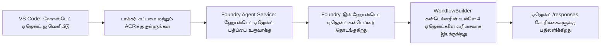
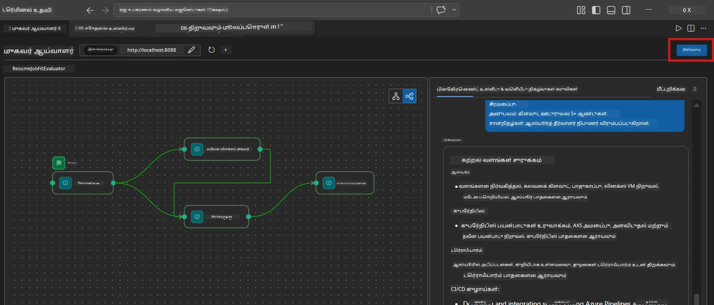
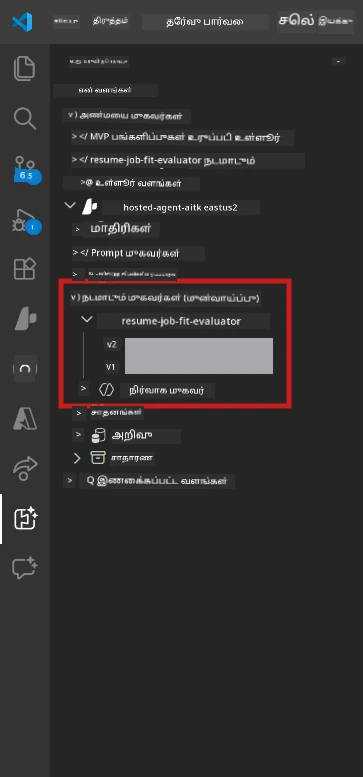

# Module 6 - Foundry Agent சேவைக்கு 배포 செய்யவும்

⏱️ ~10 நிமிடங்கள்

இந்த மூட்யூலில், நீங்கள் உள்ளூர் சோதிக்கப்பட்ட பல-ஏஜென்ட் வேலைநிரல் [Microsoft Foundry](https://learn.microsoft.com/azure/foundry/agents/concepts/hosted-agents) இல் ஒரு **ஓவிய ஏஜென்ட்** ஆக 배포 செய்கிறீர்கள். 배포 செயல்முறை ஒரு Docker தொகுப்பு படம் உருவாக்கி, அதை [Azure Container Registry (ACR)](https://learn.microsoft.com/azure/container-registry/container-registry-intro) க்கு அனுப்பி, [Foundry Agent Service](https://learn.microsoft.com/azure/foundry/agents/how-to/publish-agent) இல் ஓவிய ஏஜென்ட் பதிப்பை உருவாக்குகிறது.

> **Lab 01 லிருந்து முக்கிய வித்தியாசம்:** 배포 செயல்முறை அதேவே. Foundry உங்கள் பல-ஏஜென்ட் வேலைநிரலை ஒரு ஒற்றை ஓவிய ஏஜென்ட் என கருதுகிறது - சிக்கல் தொகுப்புக்குள் இருப்பதால், 배포 பகுதி அதே `/responses` முடிவென்றலில் உள்ளது.

### 배포 குழாய்


```mermaid
flowchart LR
    A[VS Code: ஹோஸ்டெட் ஏஜென்ட் ஐ வெளியிடு] --> B[டாக்கர் கட்டமை மற்றும் ACRக்கு தள்ளுங்கள்]
    B --> C[Foundry Agent Service: ஹோஸ்டெட் ஏஜென்ட் பதிப்பை உருவாக்கு]
    C --> D[Foundry இல் ஹோஸ்டெட் ஏஜென்ட் கன்டெய்னர் தொடங்குகிறது]
    D --> E[WorkflowBuilder கன்டெய்னரின் உள்ளே 4 ஏஜென்ட்களை வரிசையாக இயக்குகிறது]
    E --> F[ஏஜென்ட் /responses கோரிக்கைகளுக்கு பதிலளிக்கிறது]
```

---

## முன் தேவைகள் சோதனை

배포 செய்யும்முன், கீழ்க்கண்ட அனைத்தையும் சரிபார்க்கவும்:

1. **ஏஜென்ட் உள்ளூர் புகைத்தெறிவு சோதனைகளை கடந்து உள்ளது:**
   - நீங்கள் [Module 5](05-test-locally.md) இல் உள்ள 3 சோதனைகளையும் முடித்துள்ளீர்கள் மற்றும் வேலைநிரல் முழுமையான வெளியீட்டை உருவாக்கியது உருவகக் கார்ட்கள் மற்றும் Microsoft Learn URL களை உடையது.

2. **நீங்கள் [Foundry User](https://learn.microsoft.com/azure/foundry/concepts/rbac-foundry) பங்கு பெற்றிருக்கிறீர்கள்** (배포க்கு, குறைந்தபட்சமாக **Foundry Project Manager** பங்கு திட்ட இலவசத்தில் தேவை):

   > **குறிப்பு:** Foundry RBAC பணிகள் சமீபத்தில் பெயர் மாற்றம் செய்யப்பட்டுள்ளன - **Foundry User**, **Foundry Owner**, மற்றும் **Foundry Project Manager** முன்பாக Azure AI User, Azure AI Owner மற்றும் Azure AI Project Manager ஆக அழைக்கப்பட்டன. பங்கு IDs மற்றும் அனுமதிகள் மாற்றப்படவில்லை.

   - [Azure Portal](https://portal.azure.com) → உங்கள் Foundry **திட்டம்** வளம் → **Access control (IAM)** → **Role assignments** நுழைந்து உங்கள் கணக்கிற்கான **Foundry User** (அதாவது மேலதிகம்) பட்டியலிடப்பட்டுள்ளதா என உறுதிப்படுத்தவும்.

3. **நீங்கள் VS Code இல் Azure இல் உள்நுழைந்துள்ளீர்கள்:**
   - VS Code இன் கீழ் இடது மூலையில் உள்ள கணக்கு ஐகானை சரிபார்க்கவும். உங்கள் கணக்கு பெயர் காணப்படுகிறது.

4. **`agent.yaml` சரியான மதிப்புகளை கொண்டுள்ளது:**
   - `PersonalCareerCopilot/agent.yaml` ஐ திறந்து சரிபார்க்கவும்:
     ```yaml
     environment_variables:
       - name: AZURE_AI_MODEL_DEPLOYMENT_NAME
         value: ${AZURE_AI_MODEL_DEPLOYMENT_NAME}
     ```
   - `FOUNDRY_PROJECT_ENDPOINT` இங்கு பட்டியலிடப்படவில்லை - Foundry இதை இயக்க நேரத்தில் ஊட்டுகிறது. `AZURE_AI_MODEL_DEPLOYMENT_NAME` மட்டும் அறிவிக்க வேண்டும்.

5. **`requirements.txt` சரியான பதிப்புகளை கொண்டுள்ளது:**
   ```
   agent-framework-foundry
   agent-framework-foundry-hosting
   mcp<2,>=1.24.0
   debugpy
   ```

---

## படி 1: 배포 ஆரம்பிக்கவும்

### விருப்பம் A: Agent Inspector இலிருந்து 배포 (பரிந்துரை செய்யப்பட்ட)

ஏஜென்ட் F5 மூலம் இயக்கப்பட்டு Agent Inspector திறக்கப்பட்டிருந்தால்:

1. Agent Inspector பேனலின் **மேல்தெரிவு கუთხில்** பாருங்கள்.
2. **Deploy** பொத்தானை கிளிக் செய்க (மேல்திசை அம்பு கொண்ட மேகம் ஐகான் ↑).
3. 배포 ஜன்னல் திறக்கும்.



### விருப்பம் B: கட்டளை பட்டியலிலிருந்து 배포

1. `Ctrl+Shift+P` அழுத்தி **Command Palette** திறக்கவும்.
2. தட்டச்சு செய்யவும்: **Foundry Toolkit: Deploy Hosted Agent** மற்றும் தேர்வு செய்யவும்.
3. 배포 ஜன்னல் திறக்கும்.

---

## படி 2: 배포 கட்டமைக்கவும்

### 2.1 இலக்கு திட்டத்தை தேர்வு செய்யவும்

1. ஒரு டிராப்டவுன் உங்கள் Foundry திட்டங்களை காட்டும்.
2. பணிமனை முழுவதும் பயன்படுத்திய திட்டத்தை தேர்வு செய்யவும் (உதாரணமாக, `workshop-agents`).

### 2.2 டொக்கர் ஏஜென்ட் கோப்பை தேர்வு செய்யவும்

1. நீங்கள் ஏஜென்ட் நுழைவு புள்ளியை தேர்ந்தெடுக்க கேட்கப்படுவீர்கள்.
2. `workshop/lab02-multi-agent/PersonalCareerCopilot/` யில் சென்று **`main.py`** ஐ தேர்வு செய்யவும்.

### 2.3 வளங்களை கட்டமைக்கவும்

| அமைப்பு | பரிந்துரைக்கபட்ட மதிப்பு | குறிப்புகள் |
|---------|------------------|-------|
| **배포 முறை** | **Container** (பரிந்துரை செய்யப்பட்ட) அல்லது **Code** | தொகுப்பு Docker படம் உருவாக்கும்; Code மூலத்துடன் ZIP ஆக பதிவேற்றம் செய்கிறது (முன் காட்சி) |
| **Container Registry** | **Default ACR** | Foundry உங்கள் பெயரில் மற்றும் நிர்வகிப்பதில் ஒன்றை உருவாக்குகிறது |
| **CPU** | `0.25` | இயல்புநிலை. பல-ஏஜென்ட் வேலைநிரல்கள் அதிக CPU தேவையில்லை ஏனெனில் மாடல் அழைப்புகள் I/O-பிலவையாக இருக்கின்றன |
| **Memory** | `0.5Gi` | இயல்புநிலை. பெரும் தரவு செயலாக்க கருவிகள் சேர்த்தால் `1Gi` ஆக அதிகரிக்கவும் |

---

## படி 3: உறுதி செய்து 배포 செய்யவும்

1. ஜன்னல் 배포 சுருக்கத்தை காட்டும்.
2. பரிசீலித்து **Confirm and Deploy** கிளிக் செய்யவும்.
3. VS Code இல் முன்னேற்றத்தை கவனிக்கவும்.

### 배포 நேரத்தில் என்ன நிகழ்கிறது

VS Code **Output** பகுதியை கவனிக்கவும் (விருப்பமாக "Microsoft Foundry" டிராப்டவுன் தேர்வு செய்யவும்):

1. **Docker build** - உங்கள் `Dockerfile` இலிருந்து தொகுப்பை உருவாக்குகிறது
   ```
   Step 1/6 : FROM python:3.12-slim
   Step 2/6 : WORKDIR /app
   ...
   Successfully built abc123def456
   ```

2. **Docker push** - படம் ACR க்கு அனுப்பப்படுகிறது (முதல் 배포க்கு 1-3 நிமிடங்கள்).

3. **ஏஜென்ட் பதிவு** - Foundry `agent.yaml` இயல்பு தகவலுடன் ஓவிய ஏஜென்ட் உருவாக்குகிறது. ஏஜென்ட் பெயர் `resume-job-fit-evaluator`.

4. **தொகுப்பு துவக்கம்** - Foundry நிர்வகிக்கும் கட்டமைப்பில் தொகுப்பு துவங்குகிறது, கணினி-நிர்வகிக்கப்பட்ட அடையாளத்துடன்.

> **முதல் 배포 மெல்லிசை** (Docker அனைத்து அடுக்குகளை அனுப்புகிறது). அடுத்த 배포 இல் பதியப்பட்ட அடுக்குகளை மீண்டும் பயன்படுத்தி வேகமானது.

### பல-ஏஜென்ட் குறிப்புகள்

- **அனைத்து நான்கு ஏஜென்டுகள் ஒரு தொகுப்புக்குள் உள்ளன.** Foundry ஒரு ஒரே ஓவிய ஏஜென்ட் காண்கிறது. WorkflowBuilder வரைபடம் அலைபோக்கு இயக்கத்தில் ஓடுகிறது.
- **MCP அழைப்புகள் புறமாக செல்கின்றன.** தொகுப்பு இணைய அணுகலை தேவைப்படுத்துகிறது `https://learn.microsoft.com/api/mcp` ஐ அணுக. Foundry நிர்வகிக்கும் கட்டமைப்பு தானாக இதை வழங்குகிறது.
- **[நிர்வகிக்கப்பட்ட அடையாளம்](https://learn.microsoft.com/azure/foundry/agents/concepts/agent-identity).** Foundry 배포 நேரத்தில் ஒவ்வொரு ஓவிய ஏஜென்ட் க்கும் தனி Entra அடையாளத்தை தானாக உருவாக்குகிறது. ஓவிய சூழலில் `DefaultAzureCredential` தானாக இந்த ஏஜென்ட் அடையாளத்தைக் காண்கிறது - கைமுறை நிர்வகிக்கப்பட்ட அடையாள அமைப்பு தேவை இல்லை.

---

## படி 4: 배포 நிலையை உறுதி செய்யவும்

1. **Microsoft Foundry** பக்கம் திறக்கவும் (Activity Bar இல் உள்ள Foundry ஐகானை கிளிக் செய்யவும்).
2. உங்கள் திட்டத்திலிருந்து **Hosted Agents (Preview)** விரிவாக்கவும்.
3. **resume-job-fit-evaluator** (அல்லது உங்கள் ஏஜென்ட் பெயர்) கண்டு பிடிக்கவும்.
4. ஏஜென்ட் பெயரை கிளிக் செய்யவும் → பதிப்புகள் (உதா., `v1`) விரிவாக்கவும்.
5. பதிப்பை கிளிக் செய்யவும் → **Container Details** → **நிலை** பார்க்கவும்:



| நிலை | பொருள் |
|--------|---------|
| **செயலில்** | ஏஜென்ட் இயங்குகிறது மற்றும் கோரிக்கைகளை ஏற்ற தயாராக உள்ளது |
| **தயாராகிறது** | தொகுப்பு துவங்குகிறது (30–60 வினாடிகள் காத்திருங்கள்) |
| **தோல்வி** | தொகுப்பு துவங்க முடியவில்லை (லாக் களை சரிபார்க்கவும் - கீழே காண்க) |

> **குறிப்பு:** VS Code பக்கம் "Running" அல்லது "Started" போன்ற லேபிள்களை காட்டலாம் ஆனால் அடிப்படை API நிலை `active`/`creating` ஆக இருக்கிறது. இரண்டும் அதே நிலையை குறிக்கிறது.

> **பல-ஏஜென்ட் துவக்கம் ஒரே-ஏஜென்ட் விட நீண்ட நேரம் எடுக்கலாம்** ஏனெனில் தொகுப்பு துவக்கத்தில் 4 ஏஜென்ட் பிரதி உருவாக்குகிறது. `creating` 2 நிமிடங்கள் வரை இயல்பானது.

---

## பொதுவான 배포 பிழைகள் மற்றும் திருத்தங்கள்

### பிழை 1: அனுமதி மறுக்கப்பட்டது - `agents/write`

```
Error: lacks the required data action 
Microsoft.CognitiveServices/accounts/AIServices/agents/write
```

**திருத்தம்:** **[Foundry User](https://learn.microsoft.com/azure/foundry/concepts/rbac-foundry)** பங்கு (முந்தைய **Azure AI User**) **திட்ட** மட்டத்தில் ஒதுக்கவும். படி-படி வழிகாட்டலுக்கு [Module 8 - Troubleshooting](08-troubleshooting.md) பார்க்கவும்.

### பிழை 2: Docker இயங்கவில்லை

```
Error: Docker build failed / Cannot connect to Docker daemon
```

**திருத்தம்:**
1. Docker Desktop ஐ துவக்கவும்.
2. "Docker Desktop is running" வரைக்கும் காத்திருக்கவும்.
3. சரிபார்க்கவும்: `docker info`
4. **Windows:** Docker Desktop அமைப்புகளில் WSL 2 பின்புலம் இயக்கப்பட்டிருக்க வேண்டும்.
5. மறுபடியும் முயற்சி செய்யவும்.

### பிழை 3: Docker கட்டுக்கு போது pip நிறுவல் தோல்வி

```
Error: Could not find a version that satisfies the requirement agent-framework-foundry
```

**திருத்தம்:** `requirements.txt` பொருந்துகிறதா என சரிபார்க்கவும்:
```
agent-framework-foundry
agent-framework-foundry-hosting
mcp<2,>=1.24.0
debugpy
```

கட்டடை இன்னும் தோல்வியடையும் என்றால், உங்கள் Docker நெட்வொர்க் PyPI ஐ தடுக்கும். `docker info` இல் பிரதிநிதி அமைப்புகளை பாருங்கள்.

### பிழை 4: MCP கருவி ஓவிய ஏஜென்டில் தோல்வி

배포க்குப் பிறகு Gap நிலைகருதுநர் Microsoft Learn URL களை உருவாக்க रोकுகிறது என்றால்:

**மூலக்காரணம்:** நெட்வொர்க் கொள்கை தொகுப்பிலிருந்து புறநக ஒரு HTTPS தடை செய்யலாம்.

**திருத்தம்:**
1. இது பொதுவாக Foundry இன் இயல்புநிலை கட்டமைப்பில் பிரச்சனை இல்லை.
2. இது நிகழின், உங்கள் Foundry திட்டத்தின் காட்சி நெட்வொர்கில் உள்ள NSG புறநக HTTPS ஐ தடுக்கும் என்று சரிபார்க்கவும்.
3. MCP கருவியில் உள்ளேFallback URL கள் உள்ளன, அதனால் ஏஜென்ட் இன்னும் வெளியீடு (உற்சுடர் URL இல்லாமல்) வழங்கும்.

---

### சரிபார்ப்பு புள்ளி

- [ ] 배포 கட்டளை VS Code இல் பிழைகளை இல்லாமல் நிறைவேறியது
- [ ] Foundry பக்கக்கூறு இல் **Hosted Agents (Preview)** கீழ் ஏஜென்ட் தோன்றியது
- [ ] ஏஜென்ட் பெயர் `resume-job-fit-evaluator` (அல்லது நீங்கள் தேர்ந்தெடுத்த பெயர்)
- [ ] தொகுப்பு நிலை **Started** அல்லது **Running** காட்டுகிறது
- [ ] (பிழைகள் இருந்தால்) நீங்கள் பிழையை கண்டறிந்து, திருத்தத்தை பதியவும் மற்றும் மீண்டும் 배포 செய்து வெற்றிபடுத்தினீர்

---

**முந்தைய:** [05 - உள்ளூர் சோதனை](05-test-locally.md) · **அடுத்து:** [07 - Playground இல் உறுதி செய்யவும் →](07-verify-in-playground.md)

---

<!-- CO-OP TRANSLATOR DISCLAIMER START -->
**மறுப்பு**:
இந்த ஆவணம் AI மொழிபெயர்ப்பு சேவை [Co-op Translator](https://github.com/Azure/co-op-translator) பயன்படுத்தி மொழிபெயர்க்கப்பட்டுள்ளது. நாங்கள் துல்லியத்திற்காக முயற்சி செய்துள்ளோம், ஆனால் தானாக செய்யப்படும் மொழிபெயர்ப்புகளில் பிழைகள் அல்லது தவறுகள் இருக்கலாம் என்பதை கவனத்தில் கொள்ளவும். அசல் ஆவணம் அதன் தாய்மொழியில் அதிகாரப்பூர்வ ஆதாரமாக கருதப்பட வேண்டும். முக்கியமான தகவல்களுக்கு, தொழில்நுட்பமான மனித மொழிபெயர்ப்பு பரிந்துரைக்கப்படுகிறது. இந்த மொழிபெயர்ப்பைப் பயன்படுத்துவதால் ஏற்படும் எந்த தவறான புரிதல்கள் அல்லது தவறான விளக்கத்திற்கும் நாங்கள் பொறுப்பில்வில்லை.
<!-- CO-OP TRANSLATOR DISCLAIMER END -->