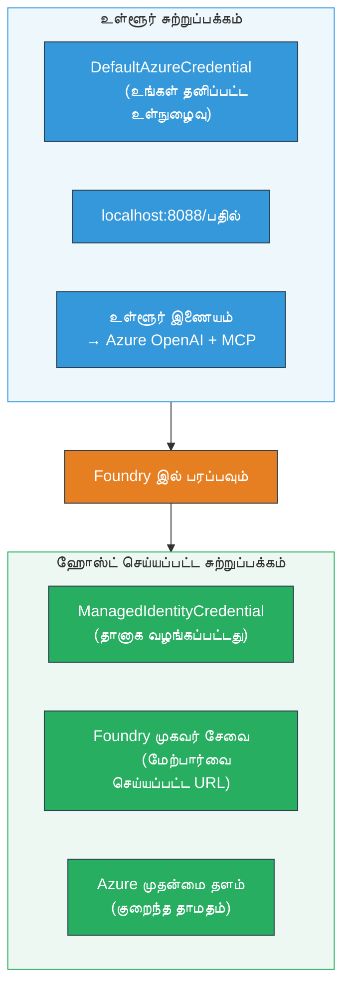

# Module 7 - விளையாட்டுத்தளத்தில் சரிபார்க்கவும்

இந்த தொகுதியில், நீங்கள் உங்கள் நிறுவப்பட்ட பல முகவரிகள் பணிவழிச் செயல்பாட்டை **VS கோட்** மற்றும் **[Foundry Portal](https://ai.azure.com)** இல் சோதித்து, முகவர் உள்ளூர் சோதனைத்துடனே ஒத்துக்கொள்கிறதா என்று உறுதிப்படுத்துவீர்கள்.

---

## நிறுவிய பின்னர் ஏன் சரிபார்க்க வேண்டும்?

உங்கள் பல முகவரிகள் பணிவழிச் செயல்பாடு உள்ளூரில் சிறப்பாக இயங்கியது, எனவே மீண்டும் ஏன் சோதிக்க வேண்டும்? ஹோஸ்ட் செய்யப்பட்ட சூழல் பல்வேறு வழிகளில் வேறுபடுகிறது:


| வேறுபாடு | உள்ளூர் | ஹோஸ்ட் செய்யப்பட்டுள்ளதா |
|-----------|-------|--------|
| **அடையாளம்** | [`DefaultAzureCredential`](https://learn.microsoft.com/azure/developer/python/sdk/authentication/credential-chains#defaultazurecredential-overview) (உங்கள் தனிப்பட்ட உள்நுழைவு) | [`ManagedIdentityCredential`](https://learn.microsoft.com/python/api/overview/azure/identity-readme#managed-identity-support) (தானாக வழங்கப்பட்டது) |
| **முடிவுச்சுடர்** | `http://localhost:8088/responses` | [Foundry Agent Service](https://learn.microsoft.com/azure/foundry/agents/concepts/hosted-agents) முடிவுச்சுடர் (மேற்கொள்ளப்பட்ட URL) |
| **பிணையம்** | உள்ளூர் கணினி → Azure OpenAI + MCP வெளியேற்றம் | Azure மூலம் (சேவைகளுக்கு இடையில் குறைந்த தாமதம்) |
| **MCP இணைப்பு** | உள்ளூர் இணையம் → `learn.microsoft.com/api/mcp` | தொட்டி வெளியேற்றம் → `learn.microsoft.com/api/mcp` |

எந்தவொரு சூழல் மாறி தவறாக அமைக்கப்பட்டிருந்தாலும், RBAC வேறுபடினாலும் அல்லது MCP வெளியேற்றம் தடைபட்டிருந்தாலும், நீங்கள் அதை இங்கே கண்டு பிடிப்பீர்கள்.

---

## விருப்பம் A: VS கோட் விளையாட்டுத்தளத்தில் சோதிக்கவும் (முதலில் பரிந்துரைக்கப்படுகிறது)

[Foundry விரிவாக்கம்](https://marketplace.visualstudio.com/items?itemName=TeamsDevApp.vscode-ai-foundry) ஒரு ஒருங்கிணைந்த விளையாட்டுத்தளத்தை கொண்டுள்ளது, அது நீங்கள் நிறுவிய முகவரியுடன் VS கோட்டை விட்டு வெளியேறாமல் உரையாட அனுமதிக்கிறது.

### படி 1: உங்கள் ஹோஸ்ட் செய்யப்பட்ட முகவரிக்கு செல்லவும்

1. VS கோட் **Activity Bar** (இடது பக்கத் பட்டை) இல் உள்ள **Microsoft Foundry**アイகானை கிளிக் செய்து Foundry குழுவை திறக்கவும்.
2. உங்கள் இணைக்கப்பட்ட திட்டத்தை விரிவாக்கவும் (எ.கா., `workshop-agents`).
3. **Hosted Agents (Preview)** ஐ விரிவாக்கவும்.
4. உங்கள் முகவர் பெயர் (எ.கா., `resume-job-fit-evaluator`) காட்சி பெறும்.

### படி 2: ஒரு பதிப்பை தேர்வு செய்யவும்

1. முகவர் பெயரை கிளிக் செய்து அதன் பதிப்புகளை விரிவாக்கவும்.
2. நீங்கள் நிறுவிய பதிப்பை கிளிக் செய்யவும் (எ.கா., `v1`).
3. **விவரக் குழு** திறக்கப்பட்டு தொட்டி விவரங்களை காட்டும்.
4. நிலை **Started** அல்லது **Running** என்பதை உறுதிசெய்யவும்.

### படி 3: விளையாட்டுத்தளத்தை திறக்கவும்

1. விவரக் குழுவில், **Playground** பொத்தானை கிளிக் செய்யவும் (அல்லது பதிப்பை இறுதியில் கிளிக் செய்து → **Open in Playground**).
2. VS கோட் தாவலில் ஒரு உரையாடல் இடைமுகம் திறக்கும்.

### படி 4: உங்கள் புகிக்கப்பட்ட சோதனைகளை இயக்கவும்

[Module 5](05-test-locally.md) இல் இருந்த அதே 3 சோதனைகளை விளையாட்டுத்தள உள்ளீட்டு பெட்டிகளில் تایப் செய்து **Send** (அல்லது **Enter**) அழுத்தவும்.

#### சோதனை 1 - முழு வாழ்க்கை வரலாறு + வேலைவாய்ப்பு விளக்கம் (சாதாரண ஓட்டம்)

Module 5, சோதனை 1 (ஜேன் டோ + Contoso லிமிடெட் முந்தைய மேகம் பொறியாளர்) இலிருந்து முழு வாழ்க்கை வரலாறு + வேலைவாய்ப்பு விளக்கம் பிராம்ப்டை ஒட்டவும்.

**எதிர்பார்ப்பு:**
- 100 புள்ளி அளவுகோல் உடன் பொருத்த மதிப்பீடு உடனான பகுப்பாய்வு கணக்கு
- பொருந்தும் திறன்கள் பகுதி
- காணாமல் இருக்கும் திறன்கள் பகுதி
- **ஒவ்வொரு காணாமல் இருக்கும் திறனுக்கும் ஒரு இடைவெளி அட்டை** Microsoft Learn URL களுடன்
- காலஅளவைக் கொண்டு கற்றல் திட்டம்

#### சோதனை 2 - விரைவு குறுகிய சோதனை (குறைந்த உள்ளீடு)

```
RESUME: 3 years Python developer, knows Django and PostgreSQL, no cloud experience.

JOB: Cloud DevOps Engineer requiring AWS, Kubernetes, Terraform, CI/CD. 5 years needed.
```

**எதிர்பார்ப்பு:**
- குறைந்த பொருத்த மதிப்பீடு (< 40)
- நேர்மையான மதிப்பீடு மற்றும் கட்டுப்படுத்தப்பட்ட கற்றல் பாதை
- பல இடைவெளி அட்டைகள் (AWS, Kubernetes, Terraform, CI/CD, அனுபவ இடைவெளி)

#### சோதனை 3 - உயர்ந்த பொருத்த நபர்

```
RESUME:
10 years Azure Cloud Architect. AZ-305 certified. Expert in AKS, Terraform, Azure DevOps, 
Azure Functions, Helm, Prometheus, Grafana, Python, Go. Led platform team of 8.

JOB:
Senior Cloud Engineer. Required: AKS, Terraform, Azure DevOps, Python. Preferred: Helm, Go.
5+ years experience. AZ-305 preferred.
```

**எதிர்பார்ப்பு:**
- உயர்ந்த பொருத்த மதிப்பீடு (≥ 80)
- நேர்காணல் தயார் மற்றும் பளபளப்பான நிலை மீது கவனம்
- சில இடைவெளி அட்டைகள் அல்லது எதுவும் இல்லாதவை
- தயாரிக்க கவனம் திருப்பு குறுகிய கால நிரல்

### படி 5: உள்ளூர் முடிவுகளுடன் ஒப்பிடவும்

Module 5 இல் நீங்கள் சேமித்த உள்ளூர் பதில்கள் உள்ள நோட்டுகளோடு அல்லது உலாவிக் கட்டுகளைத் திறந்து ஒவ்வொரு சோதனைக்கும்:

- பதில் **இதே கட்டமைப்போடு** இருக்கிறதா (பொருத்த மதிப்பீடு, இடைவெளி அட்டைகள், கற்றல் திட்டம்)?
- **இதே மதிப்பீட்டு விதிகள்** (100 புள்ளிப் பகுப்பாய்வு) பின்பற்றப்படுகிறதா?
- இடைவெளி அட்டைகளில் **Microsoft Learn URL கள்** இன்னும் உள்ளதா?
- **ஒவ்வொரு காணாமல் இருக்கும் திறனுக்கும் ஒரு இடைவெளி அட்டை** இருக்கிறதா (முற்றிலும் இல்லை)?

> **சிறிய சொற்றொடர் வேறுபாடுகள் இயல்பானவை** - மாதிரி தனிப்பட்டது. கட்டமைப்பு, மதிப்பீட்டு ஒருமித்தம் மற்றும் MCP கருவி பயன்பாட்டில் கவனம் செலுத்தவும்.

---

## விருப்பம் B: Foundry Portal இல் சோதிக்கவும்

[Foundry Portal](https://ai.azure.com) ஒரு வலை அடிப்படையிலான விளையாட்டுத்தளத்தை வழங்குகிறது, இது குழுக்களோடு அல்லது பங்குதாரர்களோடு பகிர சுலபம்.

### படி 1: Foundry Portal ஐத் திறக்கவும்

1. உலாவி திறந்து [https://ai.azure.com](https://ai.azure.com) செல்லவும்.
2. விசேஷமாக இந்த ஒருங்கிணைப்பு முழுவதும் பயன்படுத்திய Azure கணக்கில் உள்நுழையவும்.

### படி 2: உங்கள் திட்டத்திற்கு செல்லவும்

1. முகப்புத் தளத்தில், இடது பக்கத் பட்டையில் **Recent projects** காணவும்.
2. உங்கள் திட்டப் பெயரை கிளிக் செய்யவும் (எ.கா., `workshop-agents`).
3. அது காட்சியளிப்படவில்லை என்றால், **All projects** கிளிக் செய்து தேடவும்.

### படி 3: உங்கள் நிறுவிய முகவரியை கண்டுபிடிக்கவும்

1. திட்டத்தின் இடது வழிசெலுத்தலில், **Build** → **Agents** (அல்லது **Agents** பகுதியை தேடவும்) கிளிக் செய்யவும்.
2. முகவரிகளின் பட்டியல் காணப்படும். உங்கள் நிறுவிய முகவரியைத் தொடங்கவும் (எ.கா., `resume-job-fit-evaluator`).
3. முகவர் பெயரை கிளிக் செய்து விவரப் பக்கத்தைத் திறக்கவும்.

### படி 4: விளையாட்டுத்தளத்தை திறக்கவும்

1. முகவர் விவரப் பக்கத்தில், மேலான கருவிப்பட்டியலைக் காணவும்.
2. **Open in playground** (அல்லது **Try in playground**) கிளிக் செய்யவும்.
3. ஒரு உரையாடல் இடைமுகம் திறக்கும்.

### படி 5: அதே புகைப்பட சோதனைகளை இயக்கவும்

மேலுள்ள VS Code விளையாட்டுத்தளத் துண்டில் உள்ள 3 சோதனைகளை மீண்டும் செய்யவும். ஒவ்வொரு பதிலும் உள்ளூர் முடிவுகள் (Module 5) மற்றும் VS Code விளையாட்டுத்தள முடிவுகளுடன் (விருப்பம் A மேலே) ஒப்பிடவும்.

---

## பல முகவர் தொடர்பான குறிப்பிட்ட சரிபார்ப்பு

அடிப்படை சரியானதைக் கடந்த, இவை பல முகவர் தொடர்பான நடத்தைகளை சரிபார்க்கவும்:

### MCP கருவி செயல்திறன்

| சரிபார்ப்பு | எப்படி சரிபார்க்கலாம் | தேர்ச்சி நிலை |
|------------|--------------------|--------------|
| MCP அழைப்புகள் வெற்றியடையும் | இடைவெளி அட்டைகளில் `learn.microsoft.com` URL கள் உள்ளன | உண்மை URL கள், மாற்று செய்திகள் இல்லை |
| பல MCP அழைப்புகள் | ஒவ்வொரு உயர்/நடுத்தர முன்னுரிமை இடைவெளிக்கும் வளங்கள் உள்ளன | முதல் இடைவெளி அட்டைக்கே மட்டுமல்ல |
| MCP மாற்றுக் கோப்புகள் செயல்படும் | URL கள் காணவில்லை என்றால் மாற்றுக் உரை இருக்கிறது | முகவர் இடைவெளி அட்டைகளை உருவாக்குகிறது (URL உடன் அல்லது இல்லாமல்) |

### முகவர் ஒருங்கிணைப்பு

| சரிபார்ப்பு | எப்படி சரிபார்க்கலாம் | தேர்ச்சி நிலை |
|------------|--------------------|--------------|
| அனைத்து 4 முகவரிகளும் இயங்கின | வெளியீடு பொருத்த மதிப்பிடலும் இடைவெளி அட்டைகளும் கொண்டது | மதிப்பெண் MatchingAgent இலிருந்து, அட்டைகள் GapAnalyzer இலிருந்து |
| இணைக்கப்பட்ட பிரிக்கப்பட்ட துவக்கம் | பதில் நேரம் உடனடி (< 2 நிமிடங்கள்) | > 3 நிமிடங்கள் என்றால் இணைக்கப்பட்ட செயல்பாடு இயங்கியது தவிர |
| தரவு ஒழுங்குத்தன்மை | இடைவெளி அட்டைகள் வேலைவாய்ப்பு அறிக்கையிலுள்ள திறன்களை குறிக்கின்றன | வேலைவாய்ப்பில் இல்லாத புருஷ்டி திறன்கள் இல்லை |

---

## மதிப்பீட்டுக் குறிப்பேடு

உங்கள் பல முகவர் பணிவழிச் செயல்பாட்டின் ஹோஸ்ட் செய்யப்பட்ட நடத்தை மதிப்பீட்டிற்கு இதைப் பயன்படுத்தவும்:

| # | மதிப்பீடுக் குறிப்பு | தேர்ச்சி நிலை | தேர்ச்சி? |
|---|------------------|--------------|----------|
| 1 | **செயல்பாட்டுச் சரியானது** | முகவர் வாழ்க்கை வரலாற்றுடன்+வேலைவாய்ப்பு விளக்கம் பொருத்த மதிப்பீடு மற்றும் இடைவெளி பகுப்பாய்வு செய்கிறது | |
| 2 | **மதிப்பீடு ஒருமித்தம்** | பொருத்த மதிப்பீடு 100 புள்ளி அளவுகோல் உடன் கணக்கிடப்படுகிறது | |
| 3 | **இடைவெளி அட்டை முழுமை** | ஒவ்வொரு காணாமல் இருக்கும் திறனுக்கும் ஒரு அட்டை (இணைந்ததோ இல்லையோ) | |
| 4 | **MCP கருவி இணைப்பு** | இடைவெளி அட்டைகள் உண்மை Microsoft Learn URL களை உள்ளடக்குகின்றன | |
| 5 | **கட்டமைப்பு ஒருமித்தம்** | உள்ளூர் மற்றும் ஹோஸ்ட் செய்யப்பட்ட ஓட்டங்களில் வெளிப்பாடு ஒத்துள்ளது | |
| 6 | **பதில் நேரம்** | ஹோஸ்ட் செய்யப்பட்ட முகவர் முழு மதிப்பீட்டுக்கு 2 நிமிடங்கள் வெளியீடு செய்கிறது | |
| 7 | **ত্রুটிகள் இல்லை** | HTTP 500 பிழைகள், நேர எல்லைகள் அல்லது காலியாக்கப்பட்ட பதில்கள் இல்லை | |

> "தேர்ச்சி" என்பது குறைந்தபட்சம் ஒரு விளையாட்டுத்தளத்தில் (VS Code அல்லது போர்டல்) அனைத்து 7 மதிப்பீடு குறியீடுகளும் 3 புகைப்பட சோதனைகளுக்கும் பூர்த்தியானதாயிருக்கின்றது என பொருள்.

---

## விளையாட்டுத்தளம் சிக்கல்களை தீர்க்கும்

| அறிகுறி | சாத்தியமான காரணம் | சரி செய்யும் வழி |
|----------|-----------------|------------------|
| விளையாட்டுத்தளம் ஏற்றப்படவில்லை | தொட்டி நிலை "Started" இல்லை | [Module 6](06-deploy-to-foundry.md) க்கு செல்லவும், நிறுவல் நிலையை உறுதிப்படுத்தவும். "Pending" என்றால் காத்திருங்கள் |
| முகவர் காலியாக பதில் அளிக்கிறான் | மாதிரி நிறுவல் பெயர் பொருந்தவில்லை | `agent.yaml` → `environment_variables` → `MODEL_DEPLOYMENT_NAME` உங்கள் நிறுவிய மாதிரியை பொருந்துகிறதா சரிபார்க்கவும் |
| முகவர் பிழை செய்தி தருகிறான் | [RBAC](https://learn.microsoft.com/azure/foundry/concepts/rbac-foundry) அனுமதி இல்லை | திட்ட அளவில் **[Azure AI User](https://aka.ms/foundry-ext-project-role)** பொறுப்பு வழங்கவும் |
| இடைவெளி அட்டைகளில் Microsoft Learn URL இல்லை | MCP வெளியேற்றம் தடுக்கப்பட்டு அல்லது MCP சேவையகம் இல்லை | தொட்டி `learn.microsoft.com` ஐச் சென்றுகொள்ளக்கூடுமா சரிபார்க்கவும். [Module 8](08-troubleshooting.md) பார்க்கவும் |
| ஒரே இடைவெளி அட்டை (முற்றிலும் இல்லை) | GapAnalyzer கட்டளைகளில் "CRITICAL" பிளாக்குகள் இல்லை | [Module 3, படி 2.4](03-configure-agents.md) ஐ சரிபார்க்கவும் |
| உள்ளூரில் இருந்து பொருத்த மதிப்பெண் மிக வேறுபாடு | வெவ்வேறு மாதிரி அல்லது கட்டளைகள் நிறுவப்பட்டுள்ளன | `agent.yaml` சூழல் மாறி களை உள்ளூரில் `.env` உடன் ஒப்பிடுக. தேவையானால் மறுநிறுவவும் |
| போர்டலில் "Agent not found" | நிறுவல் இன்னும் பரவ வேலை செய்கிறது அல்லது தோல்வி | 2 நிமிடங்கள் காத்திருங்கள், புதுப்பிக்கவும். இன்னும் குறைவானால் [Module 6](06-deploy-to-foundry.md) இலிருந்து மறுநிறுவவும் |

---

### சரிபார்ப்பு பட்டியல்

- [ ] VS Code விளையாட்டுத்தளத்தில் முகவரியை சோதித்தேன் - அனைத்து 3 புகைப்பட சோதனைகளும் கடந்து விட்டன
- [ ] [Foundry Portal](https://ai.azure.com) விளையாட்டுத்தளத்தில் முகவரியை சோதித்தேன் - அனைத்து 3 புகைப்பட சோதனைகளும் கடந்து விட்டன
- [ ] பதில்கள் உள்ளூரில் சோதனை செய்யும் கட்டமைப்புடன் ஒத்திருக்கிறன (பொருத்த மதிப்பீடு, இடைவெளி அட்டைகள், திட்டம்)
- [ ] Microsoft Learn URL கள் இடைவெளி அட்டைகளில் உள்ளன (MCP கருவி ஹோஸ்ட் சூழலில் வேலை செய்கிறது)
- [ ] ஒவ்வொரு காணாமல் இருக்கும் திறனுக்கும் ஒரு இடைவெளி அட்டை உள்ளது (முற்றிலும் இல்லை)
- [ ] சோதனை நேரத்தில் எதுவும் பிழைகள் அல்லது நேர எல்லைகள் இருந்த жоқ
- [ ] மதிப்பீட்டு குறிப்பேடு பூர்த்தி (அனைத்து 7 குறியீடுகளும் தேர்ச்சி)

---

**முந்தையது:** [06 - Deploy to Foundry](06-deploy-to-foundry.md) · **அடுத்தது:** [08 - Troubleshooting →](08-troubleshooting.md)

---

<!-- CO-OP TRANSLATOR DISCLAIMER START -->
**அறிவிப்பு**:  
இந்த ஆவணம் AI மொழிமாற்று சேவை [Co-op Translator](https://github.com/Azure/co-op-translator) மூலம் மொழிமாற்றம் செய்யப்பட்டுவந்தது. நாங்கள் துல்லியத்திற்காக முயற்சிப்பavatar_s streams, தானாகக் கூடிய மொழிமாற்றங்களில் பிழைகள் அல்லது தவறுகள் உள்ளிருக்க வாய்ப்பு இருக்கின்றது என்பதை தயவுசெய்து கவனிக்கவும். மூல ஆவணம் அதன் தாய்மொழியில் அதிகாரப்பூர்வமாக கருதப்பட வேண்டும். முக்கியமான தகவல்களுக்காக, தொழில்நுட்ப மனித மொழிமாற்று பரிந்துரைக்கப்படுகிறது. இந்த மொழிமாற்றத்தின் பயன்படுத்தல் காரணமாக நேர்ந்த எந்த விதமான தவறுமுறை அல்லது தவறான புரிதலுக்கும் நாங்கள் பதிலுக்கு இணையவில்லை.
<!-- CO-OP TRANSLATOR DISCLAIMER END -->