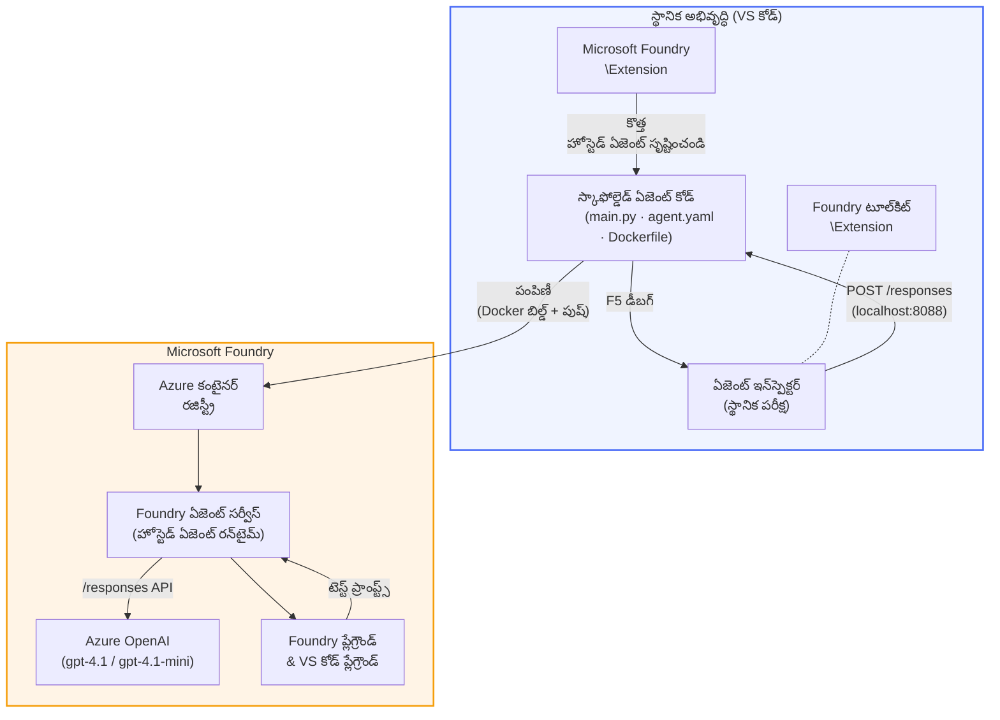

# Foundry Toolkit + Foundry Hosted Agents వర్క్‌షాప్

[](https://www.python.org/)
[](https://github.com/microsoft/agents)
[](https://learn.microsoft.com/azure/ai-foundry/agents/concepts/hosted-agents/)
[](https://ai.azure.com/)
[](https://learn.microsoft.com/azure/ai-services/openai/)
[](https://learn.microsoft.com/cli/azure/install-azure-cli)
[](https://learn.microsoft.com/azure/developer/azure-developer-cli/install-azd)
[](https://www.docker.com/)
[](https://marketplace.visualstudio.com/items?itemName=ms-windows-ai-studio.windows-ai-studio)
[](LICENSE)

**Microsoft Foundry Agent Service**కి AI ఏజెంట్లను **Hosted Agents**గా నిర్మించండి, పరీక్షించండి మరియు డిప్లాయ్ చేయండి - పూర్వం నుండి VS కోడ్ ఉపయోగించి **Microsoft Foundry విస్తరణ** మరియు **Foundry Toolkit** సహాయంతో.

> **Hosted Agents ప్రస్తుతం ప్రివ్యూ లో ఉన్నాయి.** మద్దతు చేసే రీజియన్లు పరిమితంగా ఉన్నాయి - [రిజియన్ అందుబాటు](https://learn.microsoft.com/azure/foundry/agents/concepts/hosted-agents#region-availability) చూడండి.

> ప్రతి ల్యాబ్ లోని `agent/` ఫొల్డర్ **Foundry విస్తరణ చేత ఆటోమేటిక్‌గా స్కాఫోల్డింగ్** చేయబడుతుంది - తరువాత మీరు కోడ్‌ను అనుకూలీకరించి, లోకల్‌గా పరీక్షించి, డిప్లాయ్ చేయవచ్చు.

<!-- CO-OP TRANSLATOR LANGUAGES TABLE START -->
[Arabic](../ar/README.md) | [Bengali](../bn/README.md) | [Bulgarian](../bg/README.md) | [Burmese (Myanmar)](../my/README.md) | [Chinese (Simplified)](../zh-CN/README.md) | [Chinese (Traditional, Hong Kong)](../zh-HK/README.md) | [Chinese (Traditional, Macau)](../zh-MO/README.md) | [Chinese (Traditional, Taiwan)](../zh-TW/README.md) | [Croatian](../hr/README.md) | [Czech](../cs/README.md) | [Danish](../da/README.md) | [Dutch](../nl/README.md) | [Estonian](../et/README.md) | [Finnish](../fi/README.md) | [French](../fr/README.md) | [German](../de/README.md) | [Greek](../el/README.md) | [Hebrew](../he/README.md) | [Hindi](../hi/README.md) | [Hungarian](../hu/README.md) | [Indonesian](../id/README.md) | [Italian](../it/README.md) | [Japanese](../ja/README.md) | [Kannada](../kn/README.md) | [Khmer](../km/README.md) | [Korean](../ko/README.md) | [Lithuanian](../lt/README.md) | [Malay](../ms/README.md) | [Malayalam](../ml/README.md) | [Marathi](../mr/README.md) | [Nepali](../ne/README.md) | [Nigerian Pidgin](../pcm/README.md) | [Norwegian](../no/README.md) | [Persian (Farsi)](../fa/README.md) | [Polish](../pl/README.md) | [Portuguese (Brazil)](../pt-BR/README.md) | [Portuguese (Portugal)](../pt-PT/README.md) | [Punjabi (Gurmukhi)](../pa/README.md) | [Romanian](../ro/README.md) | [Russian](../ru/README.md) | [Serbian (Cyrillic)](../sr/README.md) | [Slovak](../sk/README.md) | [Slovenian](../sl/README.md) | [Spanish](../es/README.md) | [Swahili](../sw/README.md) | [Swedish](../sv/README.md) | [Tagalog (Filipino)](../tl/README.md) | [Tamil](../ta/README.md) | [Telugu](./README.md) | [Thai](../th/README.md) | [Turkish](../tr/README.md) | [Ukrainian](../uk/README.md) | [Urdu](../ur/README.md) | [Vietnamese](../vi/README.md)

> **స్థానికంగా క్లోన్ చెయ్యాలనుకుంటున్నారా?**
>
> ఈ రిపోజిటరీ 50+ భాషా అనువాదాలతో కూడుకొని, డౌన్‌లోడ్ పరిమాణం పెరుగుతుంది. అనువాదాలు లేకుండా క్లోన్ చేయాలనుకుంటే స్పార్స్ చెకౌట్ ఉపయోగించండి:
>
> **Bash / macOS / Linux:**
> ```bash
> git clone --filter=blob:none --sparse https://github.com/microsoft-foundry/Foundry_Toolkit_for_VSCode_Lab.git
> cd Foundry_Toolkit_for_VSCode_Lab
> git sparse-checkout set --no-cone '/*' '!translations' '!translated_images'
> ```
>
> **CMD (Windows):**
> ```cmd
> git clone --filter=blob:none --sparse https://github.com/microsoft-foundry/Foundry_Toolkit_for_VSCode_Lab.git
> cd Foundry_Toolkit_for_VSCode_Lab
> git sparse-checkout set --no-cone "/*" "!translations" "!translated_images"
> ```
>
> ఇది కోర్సు పూర్తిచేయటానికి కావలసిన ప్రతీదాన్ని చాలా వేగంగా డౌన్‌లోడ్ చేసే విధంగా ఇస్తుంది.
<!-- CO-OP TRANSLATOR LANGUAGES TABLE END -->

---

## ఆర్కిటెక్చర్


**ఫ్లో:** Foundry విస్తరణ ఏజెంట్ని స్కాఫోల్డ్ చేస్తుంది → మీరు కోడ్ & సూచనలను అనుకూలీకరిస్తారు → Agent Inspector ద్వారా లోకల్‌గా పరీక్షిస్తారు → Foundryకి డిప్లాయ్ చేస్తారు (Docker ఇమేజ్ ACRకి పుష్ అవుతుంది) → Playgroundలో ధృవీకరించండి.

---

## మీరు నిర్మించేది

| ల్యాబ్ | వివరణ | స్థితి |
|-----|-------------|--------|
| **ల్యాబ్ 01 - సింగిల్ ఏజెంట్** | **"నన్ను ఎగ్జిక్యూటివ్‌గా వివరించు" ఏజెంట్**ను తయారుచేసి, లోకల్‌గా పరీక్షించి, Foundryకి డిప్లాయ్ చేయండి | ✅ అందుబాటు లో ఉంది |
| **ల్యాబ్ 02 - బహు-ఏజెంట్ వర్క్‌ఫ్లో** | **".Resume → Job Fit Evaluator"** - 4 ఏజెంట్లు కలిసి రిజూమే ఫిట్ నెంబర్ చేస్తూ, నేర్చుకునే రోడ్‌మ్యాప్ రూపొందిస్తాయి | ✅ అందుబాటు లో ఉంది |

---

## ఎగ్జిక్యూటివ్ ఏజెంట్ ని పరిచయం చేయండి

ఈ వర్క్‌షాప్‌లో మీరు **"నన్ను ఎగ్జిక్యూటివ్‌గా వివరించు" ఏజెంట్** ను నిర్మిస్తారు - ఇది ఒక AI ఏజెంట్, ఇది క్లిష్టమైన సాంకేతిక భాషను శాంతమైన, బోర్డ్రూమ్-తయారు సరాంశాలలోకి అనువదిస్తుంది. నిజంగా చెప్పాలంటే, C-సూట్ లో ఎవ్వరూ "v3.2 లో పరిచయమైన synchronous calls కారణంగా thread pool exhaustion జరిగింది" గురించి వినదలచుకోరు.

నేను ఈ ఏజెంట్‌ను తయారు చేసినప్పుడు చాలా సార్లు నా సంపూర్ణమైన పోస్ట్-మార్టెంలకు ప్రతిస్పందన వచ్చినది: *"అంటే... వెబ్‌సైట్ దిగిపోయిందా లేదా?"*

### ఇది ఎలా పనిచేస్తుంది

మీరు దానికి సాంకేతిక నవీకరణ ఇస్తారు. ఇది తిరిగి ఒక ఎగ్జిక్యూటివ్ సారాంశం ఇస్తుంది - మూడు బుల్లెట్ పాయింట్లు, జార్గన్ లేకుండా, స్టాక్ ట్రేస్‌లు లేకుండా, ఎలాంటి భయాలు లేకుండా. కేవలం **ఏం జరిగింది**, **వ్యవహార ప్రభావం**, మరియు **తర్వాతి దశ**.

### దీన్ని క్రియాశీలంగా చూడండి

**మీరు చెప్పాలి:**
> "API లేటెన్సీ v3.2 లో పరిచయమైన synchronous calls కారణంగా thread pool exhaustion వల్ల పెరిగింది."

**ఏజెంట్ ప్రతిస్పందన:**

> **ఎగ్జిక్యూటివ్ సారాంశం:**
> - **ఏం జరిగింది:** తాజా విడుదల తర్వాత సిస్టమ్ నెమ్మదిగా పని చేయటమైంది.
> - **వ్యవహార ప్రభావం:** కొంత మంది వినియోగదారులు సేవ ఉపయోగించేటప్పుడు ఆలస్యం అనుభవించారు.
> - **తర్వాతి దశ:** మార్పు తిరిగి తీసుకువెళ్ళబడింది, మరమ్మత్తు చేస్తూ ఉంటారు, తదుపరి డిప్లాయ్ కు సిద్ధం.

### ఈ ఏజెంట్ ఎందుకు?

ఇది ఒక సులభమైన, ఏక-ప్రయోజన గల ఏజెంట్ - హోస్టెడ్ ఏజెంట్ వర్క్‌ఫ్లోని మొదలు నుండి ముగింపు వరకు నేర్చుకోవడానికి అద్భుతం, సంక్లిష్ట టూల్ చైన్స్ లో చిక్కుకోకుండా. నిజాయతీగా చూచుంటే? ప్రతి ఇంజనీరింగ్ టీమ్ కి ఈ తరహా ఏజెంట్ అవసరం.

---

## వర్క్‌షాప్ నిర్మాణం

```
📂 Foundry_Toolkit_for_VSCode_Lab/
├── 📄 README.md                      ← You are here
├── 📂 ExecutiveAgent/                ← Standalone hosted agent project
│   ├── agent.yaml
│   ├── Dockerfile
│   ├── main.py
│   └── requirements.txt
└── 📂 workshop/
    ├── 📂 lab01-single-agent/        ← Full lab: docs + agent code
    │   ├── README.md                 ← Hands-on lab instructions
    │   ├── 📂 docs/                  ← Step-by-step tutorial modules
    │   │   ├── 00-prerequisites.md
    │   │   ├── 01-install-foundry-toolkit.md
    │   │   ├── 02-create-foundry-project.md
    │   │   ├── 03-create-hosted-agent.md
    │   │   ├── 04-configure-and-code.md
    │   │   ├── 05-test-locally.md
    │   │   ├── 06-deploy-to-foundry.md
    │   │   ├── 07-verify-in-playground.md
    │   │   └── 08-troubleshooting.md
    │   └── 📂 agent/                 ← Reference solution (auto-scaffolded by Foundry extension)
    │       ├── agent.yaml
    │       ├── Dockerfile
    │       ├── main.py
    │       └── requirements.txt
    └── 📂 lab02-multi-agent/         ← Resume → Job Fit Evaluator
        ├── README.md                 ← Hands-on lab instructions (end-to-end)
        ├── 📂 docs/                  ← Step-by-step tutorial modules
        │   ├── 00-prerequisites.md
        │   ├── 01-understand-multi-agent.md
        │   ├── 02-scaffold-multi-agent.md
        │   ├── 03-configure-agents.md
        │   ├── 04-orchestration-patterns.md
        │   ├── 05-test-locally.md
        │   ├── 06-deploy-to-foundry.md
        │   ├── 07-verify-in-playground.md
        │   └── 08-troubleshooting.md
        └── 📂 PersonalCareerCopilot/ ← Reference solution (multi-agent workflow)
            ├── agent.yaml
            ├── Dockerfile
            ├── main.py
            └── requirements.txt
```

> **గమనిక:** ప్రతి ల్యాబ్ లోని `agent/` ఫొల్డర్ **Microsoft Foundry విస్తరణ** ద్వారా `Microsoft Foundry: Create a New Hosted Agent` కమాండ్ పాలెట్ నుండి నడిపించినప్పుడు సరకుగా రూపొందించబడుతుంది. ఫైళ్లను తర్వాత మీ ఏజెంట్ సూచనలు, టూల్స్, కాన్ఫిగరేషన్ తో అనుకూలీకరించవచ్చు. ల్యాబ్ 01 ఈ ప్రక్రియను మినీహెచ్ స్క్రాచ్ నుండి మీకు చూపిస్తుంది.

---

## ప్రారంభించండి

### 1. రిపోజిటరీ ని క్లోన్ చేయండి

```bash
git clone https://github.com/microsoft-foundry/Foundry_Toolkit_for_VSCode_Lab.git
cd Foundry_Toolkit_for_VSCode_Lab
```

### 2. Python వర్చువల్ ఎన్‌విరాన్‌మెంట్ సెట్ చేయండి

```bash
python -m venv venv
```

దాన్ని యాక్టివేట్ చేయండి:

- **Windows (PowerShell):**
  ```powershell
  .\venv\Scripts\Activate.ps1
  ```
- **macOS / Linux:**
  ```bash
  source venv/bin/activate
  ```

### 3. డిపెండెన్స్‌లను ఇన్‌స్టాల్ చేయండి

```bash
pip install -r workshop/lab01-single-agent/agent/requirements.txt
```

### 4. ఎన్విరాన్‌మెంట్ వేరియబుల్స్ కాన్ఫిగర్ చేయండి

ఏజెంట్ ఫోల్‌డ్ లో ఉన్న ఉదాహరణ `.env` ఫైల్‌ను కాపీ చేసి మీ విలువలు భర్తీ చేయండి:

```bash
cp workshop/lab01-single-agent/agent/.env.example workshop/lab01-single-agent/agent/.env
```

`workshop/lab01-single-agent/agent/.env` ను ఎడిట్ చేయండి:

```env
AZURE_AI_PROJECT_ENDPOINT=https://<your-account>.services.ai.azure.com/api/projects/<your-project>
MODEL_DEPLOYMENT_NAME=<your-model-deployment-name>
```

### 5. వర్క్‌షాప్ ల్యాబ్‌లను అనుసరించండి

ప్రతి ల్యాబ్ స్వతంత్ర మాడ్యూల్స్‌తో ఉంటుంది. ప్రాథమిక నిపుణ్యతల కోసం **ల్యాబ్ 01**తో ప్రారంభించండి, తరువాత బహుళ ఏజెంట్ వర్క్‌ఫ్లోలకు **ల్యాబ్ 02** కన్నడం కొనసాగించండి.

#### ల్యాబ్ 01 - సింగిల్ ఏజెంట్ ([పూర్తి సూచనలు](workshop/lab01-single-agent/README.md))

| # | మాడ్యూల్ | లింక్ |
|---|--------|------|
| 1 | మునుపటి అవసరాలను చదవడం | [00-prerequisites.md](workshop/lab01-single-agent/docs/00-prerequisites.md) |
| 2 | Foundry Toolkit & Foundry విస్తృతి ఇన్‌స్టాల్ చేయడం | [01-install-foundry-toolkit.md](workshop/lab01-single-agent/docs/01-install-foundry-toolkit.md) |
| 3 | Foundry ప్రాజెక్ట్ సృష్టించడం | [02-create-foundry-project.md](workshop/lab01-single-agent/docs/02-create-foundry-project.md) |
| 4 | హోస్టెడ్ ఏజెంట్ సృష్టించడం | [03-create-hosted-agent.md](workshop/lab01-single-agent/docs/03-create-hosted-agent.md) |
| 5 | సూచనలు & ఎన్విరాన్‌మెంట్ కాన్ఫిగర్ చేయడం | [04-configure-and-code.md](workshop/lab01-single-agent/docs/04-configure-and-code.md) |
| 6 | లోకల్‌లో పరీక్షించడం | [05-test-locally.md](workshop/lab01-single-agent/docs/05-test-locally.md) |
| 7 | Foundryకి డిప్లాయ్ చేయడం | [06-deploy-to-foundry.md](workshop/lab01-single-agent/docs/06-deploy-to-foundry.md) |
| 8 | ప్లేగ్రౌండ్‌లో ధృవీకరించడం | [07-verify-in-playground.md](workshop/lab01-single-agent/docs/07-verify-in-playground.md) |
| 9 | సమస్యలు పరిష్కరించడం | [08-troubleshooting.md](workshop/lab01-single-agent/docs/08-troubleshooting.md) |

#### ల్యాబ్ 02 - బహుళ ఏజెంట్ వర్క్‌ఫ్లో ([పూర్తి సూచనలు](workshop/lab02-multi-agent/README.md))

| # | మాడ్యూల్ | లింక్ |
|---|--------|------|
| 1 | ముందస్తు అవసరాలు (ల్యాబ్ 02) | [00-prerequisites.md](workshop/lab02-multi-agent/docs/00-prerequisites.md) |
| 2 | బహుళ ఏజెంట్ ఆర్కిటెక్చర్ అర్థం చేసుకోవడం | [01-understand-multi-agent.md](workshop/lab02-multi-agent/docs/01-understand-multi-agent.md) |
| 3 | బహుళ ఏజెంట్ ప్రాజెక్ట్ స్కాఫోల్డ్ చేయడం | [02-scaffold-multi-agent.md](workshop/lab02-multi-agent/docs/02-scaffold-multi-agent.md) |
| 4 | ఏజెంట్‌లను & ఎన్విరాన్‌మెంట్‌ను కాన్ఫిగర్ చేయడం | [03-configure-agents.md](workshop/lab02-multi-agent/docs/03-configure-agents.md) |
| 5 | ఆర్కెస్ట్రేషన్ ప్యాటర్న్స్ | [04-orchestration-patterns.md](workshop/lab02-multi-agent/docs/04-orchestration-patterns.md) |
| 6 | లోకల్‌లో పరీక్షించండి (బహుళ ఏజెంట్) | [05-test-locally.md](workshop/lab02-multi-agent/docs/05-test-locally.md) |
| 7 | Foundry కి పంపండి | [06-deploy-to-foundry.md](workshop/lab02-multi-agent/docs/06-deploy-to-foundry.md) |
| 8 | ప్లేగ్రౌండ్ లో సరిచూడండి | [07-verify-in-playground.md](workshop/lab02-multi-agent/docs/07-verify-in-playground.md) |
| 9 | సమస్య పరిష్కారం (మ‌ల్టీ-ఏజెంట్) | [08-troubleshooting.md](workshop/lab02-multi-agent/docs/08-troubleshooting.md) |

---

## నిర్వహణకర్త

<table>
<tr>
    <td align="center"><a href="https://github.com/ShivamGoyal03">
        <br />
        <sub><b>శివం గోయల్</b></sub>
    </a><br />
    </td>
</tr>
</table>

---

## అవసరమైన అనుమతులు (త్వరిత సూచిక)

| పరిస్థితి | అవసరమైన పాత్రలు |
|----------|-----------------|
| కొత్త Foundry ప్రాజెక్ట్ సృష్టించండి | Foundry వనరు పై **Azure AI యజమాని** |
| ఉన్న ప్రాజెక్టుకు (కొత్త వనరులు) పంపండి | సబ్‌స్క్రిప్షన్ పై **Azure AI యజమాని** + **కాంట్రిబ్యూటర్** |
| పూర్తిగా కాన్ఫిగర్ చేసిన ప్రాజెక్టుకు పంపండి | ఖాతాలో **వ్యవహారదారు** + ప్రాజెక్ట్ లో **Azure AI వాడుకరి** |

> **ముఖ్యమైనది:** Azure యొక్క `యజమానికి` మరియు `కాంట్రిబ్యూటర్` పాత్రలు *మేనేజ్‌మెంట్* అనుమతులు మాత్రమే కలిగి ఉంటాయి, *డెవలప్‌మెంట్* (డేటా చర్య) అనుమతులు కాకుండా. ఏజెంట్లను నిర్మించడానికి మరియు పంపించడానికి మీరు **Azure AI వాడుకరి** లేదా **Azure AI యజమాని** కావాలి.

---

## సూచనలు

- [త్వరిత ప్రారంభం: మీ మొదటి హోస్టెడ్ ఏజెంట్ పంపండి (VS Code)](https://learn.microsoft.com/azure/foundry/agents/quickstarts/quickstart-hosted-agent)
- [హోస్టెడ్ ఏజెంట్స్ అంటే ఏమిటి?](https://learn.microsoft.com/azure/foundry/agents/concepts/hosted-agents)
- [VS Code లో హోస్టెడ్ ఏజెంట్ వర్క్‌ఫ్లో సృష్టించండి](https://learn.microsoft.com/azure/foundry/agents/how-to/vs-code-agents-workflow-pro-code)
- [హోస్టెడ్ ఏజెంట్ పంపించండి](https://learn.microsoft.com/azure/foundry/agents/how-to/deploy-hosted-agent)
- [Microsoft Foundry కోసం RBAC](https://learn.microsoft.com/azure/foundry/concepts/rbac-foundry)
- [ఆర్కిటెక్చర్ రివ్యూ ఏజెంట్ నమూనా](https://github.com/Azure-Samples/agent-architecture-review-sample) - MCP ఉపకరణాలతో, ఎక్స్కాలిడ్రా చిత్రాలతో, మరియు డ్యుయల్ పంపిణీతో నిజ జీవిత హోస్టెడ్ ఏజెంట్

---


## లైసెన్స్

[MIT](../../LICENSE)

---

<!-- CO-OP TRANSLATOR DISCLAIMER START -->
**అస్పష్టత**:
ఈ డాక్యుమెంట్‌ను AI అనువాద సేవ [Co-op Translator](https://github.com/Azure/co-op-translator) ఉపయోగించి అనువదించారు. మేము ఖచ్చితత్వానికి ప్రయత్నించినప్పటికీ, ఆటోమేటెడ్ అనువాదాలలో తప్పులు లేదా అసత్యతలు ఉండవచ్చు. మూల డాక్యుమెంట్ దాని స్థానిక భాషలో అధికారం కలిగిన మూలంగా పరిగణించాలి. ముఖ్యమైన సమాచారానికి, ప్రొఫేషనల్ మానవ అనువాదం సూచించబడుతుంది. ఈ అనువాదం వాడకంలో జరిగే ఏ రకమైన తప్పుదారితనం లేదా తప్పు అర్థం చేసుకోవడంపై మేము బాధ్యత వహిస్తామని కాదు.
<!-- CO-OP TRANSLATOR DISCLAIMER END -->