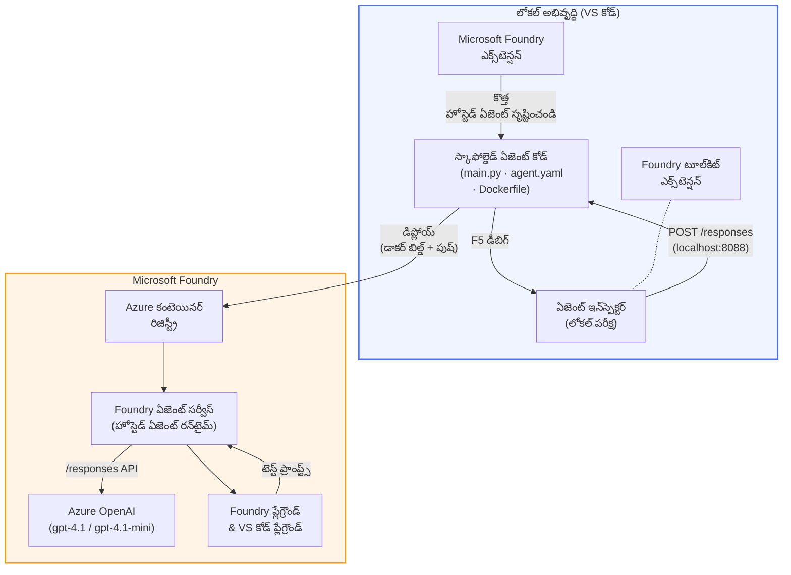

# Foundry Toolkit + Foundry Hosted Agents వర్క్‌షాప్

[](https://www.python.org/)
[](https://github.com/microsoft/agents)
[](https://learn.microsoft.com/azure/ai-foundry/agents/concepts/hosted-agents/)
[](https://ai.azure.com/)
[](https://learn.microsoft.com/azure/ai-services/openai/)
[](https://learn.microsoft.com/cli/azure/install-azure-cli)
[](https://learn.microsoft.com/azure/developer/azure-developer-cli/install-azd)
[](https://www.docker.com/)
[](https://marketplace.visualstudio.com/items?itemName=ms-windows-ai-studio.windows-ai-studio)
[](LICENSE)

**Microsoft Foundry Agent Service** కు **Hosted Agents** గా AI ఏజెంట్స్‌ను నిర్మించండి, పరీక్షించండి మరియు విస్తరించండి - మొత్తం VS Code నుండి **Microsoft Foundry ఎక్స్‌టెన్షన్** మరియు **Foundry Toolkit** ఉపయోగించి.

> **Hosted Agents ప్రస్తుతం ప్రివ్యూ లో ఉన్నాయి.** మద్దతు ఇచ్చే ప్రాంతాలు సరిహద్దు చెందాయి - [ప్రాంతం అందుబాటులో ఉండటం](https://learn.microsoft.com/azure/foundry/agents/concepts/hosted-agents#region-availability) చూడండి.

> ప్రతి లాబ్ లోని `agent/` ఫోల్డర్ **Foundry ఎక్స్‌టెన్షన్** ద్వారా ఆటోమేటిక్‌గా స్కాఫోల్డింగ్ చేయబడుతుంది - దీని తరువాత మీరు కోడ్‌ను అనుకూలీకరించి, స్థానికంగా పరీక్షించి, విస్తరించండి.

### 🌐 బహుభాషా మద్దతు

#### GitHub యాక్షన్ ద్వారా మద్దతు (ఆటోమేటిక్ & ఎప్పుడూ తాజా)

<!-- CO-OP TRANSLATOR LANGUAGES TABLE START -->
[Arabic](../ar/README.md) | [Bengali](../bn/README.md) | [Bulgarian](../bg/README.md) | [Burmese (Myanmar)](../my/README.md) | [Chinese (Simplified)](../zh-CN/README.md) | [Chinese (Traditional, Hong Kong)](../zh-HK/README.md) | [Chinese (Traditional, Macau)](../zh-MO/README.md) | [Chinese (Traditional, Taiwan)](../zh-TW/README.md) | [Croatian](../hr/README.md) | [Czech](../cs/README.md) | [Danish](../da/README.md) | [Dutch](../nl/README.md) | [Estonian](../et/README.md) | [Finnish](../fi/README.md) | [French](../fr/README.md) | [German](../de/README.md) | [Greek](../el/README.md) | [Hebrew](../he/README.md) | [Hindi](../hi/README.md) | [Hungarian](../hu/README.md) | [Indonesian](../id/README.md) | [Italian](../it/README.md) | [Japanese](../ja/README.md) | [Kannada](../kn/README.md) | [Khmer](../km/README.md) | [Korean](../ko/README.md) | [Lithuanian](../lt/README.md) | [Malay](../ms/README.md) | [Malayalam](../ml/README.md) | [Marathi](../mr/README.md) | [Nepali](../ne/README.md) | [Nigerian Pidgin](../pcm/README.md) | [Norwegian](../no/README.md) | [Persian (Farsi)](../fa/README.md) | [Polish](../pl/README.md) | [Portuguese (Brazil)](../pt-BR/README.md) | [Portuguese (Portugal)](../pt-PT/README.md) | [Punjabi (Gurmukhi)](../pa/README.md) | [Romanian](../ro/README.md) | [Russian](../ru/README.md) | [Serbian (Cyrillic)](../sr/README.md) | [Slovak](../sk/README.md) | [Slovenian](../sl/README.md) | [Spanish](../es/README.md) | [Swahili](../sw/README.md) | [Swedish](../sv/README.md) | [Tagalog (Filipino)](../tl/README.md) | [Tamil](../ta/README.md) | [Telugu](./README.md) | [Thai](../th/README.md) | [Turkish](../tr/README.md) | [Ukrainian](../uk/README.md) | [Urdu](../ur/README.md) | [Vietnamese](../vi/README.md)

> **ప్రాధాన్యత కలిగి లోకల్‌గా క్లోన్ చేయాలనుకుంటున్నారా?**
>
> ఈ రిపాజిటరీ లో 50+ భాషా అనువాదాలు ఉన్నాయి, ఇవి డౌన్లోడ్ పరిమాణాన్ని గణనీయంగా పెంచతాయి. అనువాదాలు లేకుండా క్లోన్ చేయడానికి, స్పార్స్ చెకౌట్ ఉపయోగించండి:
>
> **Bash / macOS / Linux:**
> ```bash
> git clone --filter=blob:none --sparse https://github.com/microsoft-foundry/Foundry_Toolkit_for_VSCode_Lab.git
> cd Foundry_Toolkit_for_VSCode_Lab
> git sparse-checkout set --no-cone '/*' '!translations' '!translated_images'
> ```
>
> **CMD (Windows):**
> ```cmd
> git clone --filter=blob:none --sparse https://github.com/microsoft-foundry/Foundry_Toolkit_for_VSCode_Lab.git
> cd Foundry_Toolkit_for_VSCode_Lab
> git sparse-checkout set --no-cone "/*" "!translations" "!translated_images"
> ```
>
> ఇది మీకు కోర్సును పూర్తి చేయడానికి అవసరమైన ప్రతిటినీ చాలా వేగంగా డౌన్లోడ్ చేస్తుంది.
<!-- CO-OP TRANSLATOR LANGUAGES TABLE END -->

---

## ఆర్కిటెక్చర్


**ఫ్లో:** Foundry ఎక్స్‌టెన్షన్ ఏజెంట్ను స్కాఫోల్డ్ చేస్తుంది → మీరు కోడ్ & సూచనలను అనుకూలీకరించండి → Agent Inspector తో స్థానికంగా పరీక్షించండి → Foundry లో విస్తరించండి (Docker ఇమేజ్ ACR కి పంపబడుతుంది) → ప్లేగ్రౌండ్ లో నిర్ధారించండి.

---

## మీరు ఏమి నిర్మించబోతున్నారు

| లాబ్ | వివరణ | స్థితి |
|-----|-------------|--------|
| **లాబ్ 01 - సింగిల్ ఏజెంట్** | **"Explain Like I'm an Executive" ఏజెంట్** ను నిర్మించి, స్థానికంగా పరీక్షించి, Foundry కు విస్తరించండి | ✅ అందుబాటులో ఉంది |
| **లాబ్ 02 - మల్టీ-ఏజెంట్ వర్క్‌ఫ్లో** | **"Resume → Job Fit Evaluator"** - 4 ఏజెంట్లు కలిసి రిజ్యూమె ఫిట్‌ను స్కోర్ చేసి, నేర్చుకునే రోడ్‌మాప్‌ను రూపొందిస్తారు | ✅ అందుబాటులో ఉంది |

---

## ఎగ్జిక్యూటివ్ ఏజెంట్ ను కలవండి

ఈ వర్క్‌షాప్ లో మీరు **"Explain Like I'm an Executive" ఏజెంట్** ను నిర్మించబోతున్నారు - ఇది ఒక AI ఏజెంట్, ఎంతో క్లిష్టమైన సాంకేతిక పదజాలాన్ని తీసుకొని, నిశ్చలంగా ఉన్న, బోర్డ్రూమ్ సిద్ధమైన సారాంశాలుగా మారుస్తుంది. ఎందుకంటే నిజం చెప్పాలంటే, C-సూట్ ఎవ్వరూ "v3.2 లో పరిచయమైన సింక్రొనస్ కాల్స్ వల్ల ఏర్పడిన థ్రెడ్ పూల్ ఎగ్జాస్ట్షన్" గురించి వినాలి అనిపించదు.

నాకు నా సరిగ్గా రూపొందించిన పోస్ట్-మార్టెం కి ప్రతిస్పందన వచ్చిన తర్వాతనే నేను ఈ ఏజెంట్ నిర్మించాన‌ని: *"అంటే... వెబ్‌సైట్ డౌన్ అయ్యింది గదా లేదా?"*

### ఇది ఎలా పనిచేస్తుంది

మీరు దీనికి సాంకేతిక అప్‌డేట్ ఇస్తారు. ఇది ఒక ఎగ్జిక్యూటివ్ సారాంశాన్ని ఇస్తుంది - మూడు బులెట్ పాయింట్లు, పదజాలం లేదు, స్టాక్ ట్రేసులు లేవు, భయభీతులేమీ లేవు. కేవలం **ఏం జరిగింది**, **వ్యవसाय ప్రభావం**, మరియు **తర్వాతి దశ**.

### దీన్ని ప్రకటనలో చూడండి

**మీరు చెబుతారు:**
> "API లేటెన్సీ v3.2 లో పరిచయమైన సింక్రోనస్ కాల్స్ వల్ల ఏర్పడిన థ్రెడ్ పూల్ ఎగ్జాస్ట్షన్ వల్ల పెరిగింది."

**ఏజెంట్ సమాధానం ఇస్తుంది:**

> **ఎగ్జిక్యూటివ్ సారాంశం:**
> - **ఏం జరిగింది:** తాజా రిలీజ్ తర్వాత, సిస్టమ్ మందగించింది.
> - **వ్యవసాయ ప్రభావం:** కొన్ని వాడుకదారులు సేవ ఉపయోగించేటప్పుడు ఆలస్యం అనుభవించారు.
> - **తర్వాతి దశ:** మార్పు రద్దు చేయబడింది మరియు తిరిగి పంపిణీకి ముందు ఒక పరిష్కారం సిద్ధం చేస్తోంది.

### ఈ ఏజెంట్ ఎందుకు?

ఇది ఒక సాదాసీదా, ఒకే ఉద్దేశ్యంతో ఉండే ఏజెంట్ - hosted ఏజెంట్ వర్క్‌ఫ్లో ను సులభంగా పూర్తిగా నేర్చుకోవడానికి అనువైనది. నిజంగా? ప్రతి ఇంజనీరింగ్ జట్టు దీన్ని ఉపయోగించుకోవచ్చు.

---

## వర్క్‌షాప్ నిర్మాణం

```
📂 Foundry_Toolkit_for_VSCode_Lab/
├── 📄 README.md                      ← You are here
├── 📂 ExecutiveAgent/                ← Standalone hosted agent project
│   ├── agent.yaml
│   ├── Dockerfile
│   ├── main.py
│   └── requirements.txt
└── 📂 workshop/
    ├── 📂 lab01-single-agent/        ← Full lab: docs + agent code
    │   ├── README.md                 ← Hands-on lab instructions
    │   ├── 📂 docs/                  ← Step-by-step tutorial modules
    │   │   ├── 00-prerequisites.md
    │   │   ├── 01-install-foundry-toolkit.md
    │   │   ├── 02-create-foundry-project.md
    │   │   ├── 03-create-hosted-agent.md
    │   │   ├── 04-configure-and-code.md
    │   │   ├── 05-test-locally.md
    │   │   ├── 06-deploy-to-foundry.md
    │   │   ├── 07-verify-in-playground.md
    │   │   └── 08-troubleshooting.md
    │   └── 📂 agent/                 ← Reference solution (auto-scaffolded by Foundry extension)
    │       ├── agent.yaml
    │       ├── Dockerfile
    │       ├── main.py
    │       └── requirements.txt
    └── 📂 lab02-multi-agent/         ← Resume → Job Fit Evaluator
        ├── README.md                 ← Hands-on lab instructions (end-to-end)
        ├── 📂 docs/                  ← Step-by-step tutorial modules
        │   ├── 00-prerequisites.md
        │   ├── 01-understand-multi-agent.md
        │   ├── 02-scaffold-multi-agent.md
        │   ├── 03-configure-agents.md
        │   ├── 04-orchestration-patterns.md
        │   ├── 05-test-locally.md
        │   ├── 06-deploy-to-foundry.md
        │   ├── 07-verify-in-playground.md
        │   └── 08-troubleshooting.md
        └── 📂 PersonalCareerCopilot/ ← Reference solution (multi-agent workflow)
            ├── agent.yaml
            ├── Dockerfile
            ├── main.py
            └── requirements.txt
```

> **గమనిక:** ప్రతి లాబ్ లోని `agent/` ఫోల్డర్ **Microsoft Foundry ఎక్స్‌టెన్షన్** `Microsoft Foundry: Create a New Hosted Agent` ను కమాండ్ ప్యాలెట్ నుంచి నడిపిస్తే సృష్టిస్తుంది. ఆ ఫైళ్లను తర్వాత మీ ఏజెంట్ సూచనలు, పరికరాలు, మరియు కాన్ఫిగరేషన్ తో అనుకూలీకరించబడతాయి. లాబ్ 01 మీరు దీనిని ప్రారంభం నుండి తిరిగి సృష్టించే విధంగా నడిపిస్తుంది.

---

## ప్రారంభించండి

### 1. రిపోజిటరీని క్లోన్ చెయ్యండి

```bash
git clone https://github.com/microsoft-foundry/Foundry_Toolkit_for_VSCode_Lab.git
cd Foundry_Toolkit_for_VSCode_Lab
```

### 2. Python వర్చువల్ ఎన్విరాన్మెంట్ సెట్ చేయండి

```bash
python -m venv venv
```

దాన్ని యాక్టివేట్ చేయండి:

- **Windows (PowerShell):**
  ```powershell
  .\venv\Scripts\Activate.ps1
  ```

- **macOS / Linux:**
  ```bash
  source venv/bin/activate
  ```

### 3. డిపెండెన్సీలను ఇన్‌స్టాల్ చేయండి

```bash
pip install -r workshop/lab01-single-agent/agent/requirements.txt
```

### 4. ఎన్విరాన్మెంట్ వేరియబుల్స్ కాన్ఫిగర్ చేయండి

ఏజెంట్ ఫోల్డర్ లోని ఉదాహరణ `.env` ఫైల్ ను నకిలీ చేసి, మీ విలువలు నింపండి:

```bash
cp workshop/lab01-single-agent/agent/.env.example workshop/lab01-single-agent/agent/.env
```

`workshop/lab01-single-agent/agent/.env` ను సవరించండి:

```env
AZURE_AI_PROJECT_ENDPOINT=https://<your-account>.services.ai.azure.com/api/projects/<your-project>
MODEL_DEPLOYMENT_NAME=<your-model-deployment-name>
```

### 5. వర్క్‌షాప్ లాబ్లను అనుసరించండి

ప్రతి లాబ్ తన స్వంత మాడ్యూల్స్ తో స్వతంత్రంగా ఉంటుంది. **లాబ్ 01** తో ప్రాథమికాలు నేర్చుకొని, తర్వాత **లాబ్ 02** కు వెళ్లి మల్టీ-ఏజెంట్ వర్క్‌ఫ్లోలపై పని చేయండి.

#### లాబ్ 01 - సింగిల్ ఏజెంట్ ([పూర్తి సూచనలు](workshop/lab01-single-agent/README.md))

| # | మాడ్యూల్ | లింక్ |
|---|--------|------|
| 1 | ముందస్తు అర్హతలు చదవండి | [00-prerequisites.md](workshop/lab01-single-agent/docs/00-prerequisites.md) |
| 2 | Foundry Toolkit & Foundry ఎక్స్‌టెన్షన్ ఇన్‌స్టాల్ చేయండి | [01-install-foundry-toolkit.md](workshop/lab01-single-agent/docs/01-install-foundry-toolkit.md) |
| 3 | Foundry ప్రాజెక్ట్ సృష్టించండి | [02-create-foundry-project.md](workshop/lab01-single-agent/docs/02-create-foundry-project.md) |
| 4 | Hosted ఏజెంట్ సృష్టించండి | [03-create-hosted-agent.md](workshop/lab01-single-agent/docs/03-create-hosted-agent.md) |
| 5 | సూచనలు & పరిసరాలు కాన్ఫిగర్ చేయండి | [04-configure-and-code.md](workshop/lab01-single-agent/docs/04-configure-and-code.md) |
| 6 | స్థానికంగా పరీక్షించండి | [05-test-locally.md](workshop/lab01-single-agent/docs/05-test-locally.md) |
| 7 | Foundry కి విస్తరించండి | [06-deploy-to-foundry.md](workshop/lab01-single-agent/docs/06-deploy-to-foundry.md) |
| 8 | ప్లేగ్రౌండ్ లో నిర్ధారించండి | [07-verify-in-playground.md](workshop/lab01-single-agent/docs/07-verify-in-playground.md) |
| 9 | సమస్యలను పరిష్కరించడం | [08-troubleshooting.md](workshop/lab01-single-agent/docs/08-troubleshooting.md) |

#### లాబ్ 02 - మల్టీ-ఏజెంట్ వర్క్‌ఫ్లో ([పూర్తి సూచనలు](workshop/lab02-multi-agent/README.md))

| # | మాడ్యూల్ | లింక్ |
|---|--------|------|
| 1 | ముందస్తు అర్హతలు (లాబ్ 02) | [00-prerequisites.md](workshop/lab02-multi-agent/docs/00-prerequisites.md) |
| 2 | మల్టీ-ఏజెంట్ ఆర్కిటెక్చర్ అర్థం చేసుకోండి | [01-understand-multi-agent.md](workshop/lab02-multi-agent/docs/01-understand-multi-agent.md) |
| 3 | మల్టీ-ఏజెంట్ ప్రాజెక్ట్ స్కాఫోల్డ్ చేయండి | [02-scaffold-multi-agent.md](workshop/lab02-multi-agent/docs/02-scaffold-multi-agent.md) |
| 4 | ఏజెంట్లు & పరిసరాలు కాన్ఫిగర్ చేయండి | [03-configure-agents.md](workshop/lab02-multi-agent/docs/03-configure-agents.md) |
| 5 | ఆర్కేస్ట్రేషన్ నమూనాలు | [04-orchestration-patterns.md](workshop/lab02-multi-agent/docs/04-orchestration-patterns.md) |
| 6 | స్థానికంగా పరీక్షించండి (మల్టీ-ఏజెంట్) | [05-test-locally.md](workshop/lab02-multi-agent/docs/05-test-locally.md) |
| 7 | Foundry కి పంపండి | [06-deploy-to-foundry.md](workshop/lab02-multi-agent/docs/06-deploy-to-foundry.md) |
| 8 | ప్లేగ్రౌండ్లో ధృవీకరించండి | [07-verify-in-playground.md](workshop/lab02-multi-agent/docs/07-verify-in-playground.md) |
| 9 | సమస్యలను సరిచూడటం (బహుళ-ఏజెంట్) | [08-troubleshooting.md](workshop/lab02-multi-agent/docs/08-troubleshooting.md) |

---

## నిర్వహణకర్త

<table>
<tr>
    <td align="center"><a href="https://github.com/ShivamGoyal03">
        <br />
        <sub><b>శివం గోయల్</b></sub>
    </a><br />
    </td>
</tr>
</table>

---

## అవసరమైన అనుమతులు (శీఘ్రమైన రిఫరెన్స్)

| పరిస్థితి | అవసరమైన పాత్రలు |
|----------|----------------|
| కొత్త Foundry ప్రాజెక్ట్ సృష్టించండి | Foundry వనరుపై **Azure AI యజమాని** |
| ఉన్న ప్రాజెక్ట్ (కొత్త వనరులు) కు పంపండి | సబ్‌స్క్రిప్షన్‌పై **Azure AI యజమాని** + **కాంట్రిబ్యూటర్** |
| పూర్తిగా కాన్ఫిగర్ చేసిన ప్రాజెక్ట్‌కు పంపండి | ఖాతాపై **రీడర్** + ప్రాజెక్టుపై **Azure AI వినియోగదారు** |

> **ముఖ్యమైనది:** Azure `యజమాని` మరియు `కాంట్రిబ్యూటర్` పాత్రలు *నిర్వహణ* అనుమతులను మాత్రమే కలిగి ఉంటాయి, *డెవలప్‌మెంట్* (డేటా చర్య) అనుమతులను కాదు. ఏజెంట్లను తయారు చేసి పంపడానికీ **Azure AI వినియోగదారు** లేదా **Azure AI యజమాని** అవసరం.

---

## సూచనలు

- [క్విక్‌స్టార్ట్: మీ మొదటి హోస్టెడ్ ఏజెంట్ డిప్లాయ్ చేయండి (VS కోడ్)](https://learn.microsoft.com/azure/foundry/agents/quickstarts/quickstart-hosted-agent)
- [హోస్టెడ్ ఏజెంట్లు ఏమిటి?](https://learn.microsoft.com/azure/foundry/agents/concepts/hosted-agents)
- [VS కోడ్‌లో హోస్టెడ్ ఏజెంట్ వర్క్‌ఫ్లోలను సృష్టించండి](https://learn.microsoft.com/azure/foundry/agents/how-to/vs-code-agents-workflow-pro-code)
- [హోస్టెడ్ ఏజెంట్‌ను పంపండి](https://learn.microsoft.com/azure/foundry/agents/how-to/deploy-hosted-agent)
- [Microsoft Foundry కోసం RBAC](https://learn.microsoft.com/azure/foundry/concepts/rbac-foundry)
- [ఆర్కిటెక్చర్ రివ్యూ ఏజెంట్ సాంపిల్](https://github.com/Azure-Samples/agent-architecture-review-sample) - MCP టూల్స్, ఎక్స్కాలిడ్రా ఆర్ట్ డయాగ్రామ్స్, మరియు ద్వైద్ పంపణితో వాస్తవ ప్రపంచ హోస్టెడ్ ఏజెంట్

---

## లైసెన్స్

[MIT](../../LICENSE)

---

<!-- CO-OP TRANSLATOR DISCLAIMER START -->
**తప్పిదులు**:  
ఈ డాక్యుమెంట్‌ను AI అనువాద సేవ [Co-op Translator](https://github.com/Azure/co-op-translator) ఉపయోగించి అనువదించబడింది. మేము సరిగా ఉపయోగించడానికి ప్రయత్నించినప్పటికీ, ఆటోమేటెడ్ అనువాదాల్లో పొరపాట్లు లేదా తప్పులు ఉండవచ్చు అనే విషయాన్ని దయచేసి గమనించండి. మూల డాక్యుమెంట్ ఆది భాషలోనే అధికారిక మూలంగా పరిగణించబడాలి. కీలక సమాచారం కోసం, నైపుణ్యమైన మానవ అనువాదం అవసరం. ఈ అనువాదం వలన జరిగే ఏవైనా అర్థం తెలియకపోవడం లేదా తప్పుదిద్దుటలకు మేము బాధ్యులను కావం.
<!-- CO-OP TRANSLATOR DISCLAIMER END -->