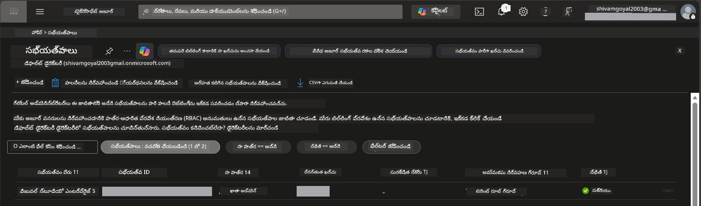

# Module 0 - ముందస్తు అవసరాలు

వర్క్‌షాప్ ప్రారంభించే ముందు, క్రింది టూల్స్, యాక్సెస్ మరియు వాతావరణం సిద్ధంగా ఉన్నాయని నిర్ధారించుకోండి. దిగువ ప్రతి దశను పాటించండి - ముందుకు దాటవేయవద్దు.

---

## 1. అజ్యూర్ ఖాతా & సబ్‌స్క్రిప్షన్

### 1.1 మీ అజ్యూర్ సబ్‌స్క్రిప్షన్ సృష్టించండి లేదా నిర్ధారించుకోండి

1. ఒక బ్రౌజర్ తెరిచి [https://azure.microsoft.com/free/](https://azure.microsoft.com/free/) కి వెళ్ళండి.
2. మీకు అజ్యూర్ ఖాతా లేని సందర్భంలో, **Start free** క్లిక్ చేసి సైన్-అప్ ప్రాసెస్ ను అనుసరించండి. మీకు ఒక Microsoft ఖాతా (లేదా ఒకటి సృష్టించుకోండి) మరియు గుర్తింపు ధృవీకరణ కోసం క్రెడిట్ కార్డ్ అవసరం.
3. మీకు ఇప్పటికే ఖాతా ఉన్నా, [https://portal.azure.com](https://portal.azure.com) లో సైన్ ఇన్ అవ్వండి.
4. పోర్టల్‌లో, ఎడమవైపు నావిగేషన్‌లో ఉన్న **Subscriptions** బ్లేడ్ క్లిక్ చేయండి (లేదా పై సెర్చ్ బార్‌లో "Subscriptions" అన్వేషించండి).
5. కనీసం ఒక **Active** సబ్‌స్క్రిప్షన్ ఉందని నిర్ధారించుకోండి. **Subscription ID** ను గమనించుకోండి - దీనిని తరువాత ఉపయోగించుకోవాలి.



### 1.2 అవసరమైన RBAC పాత్రలను అర్థం చేసుకోండి

[Hosted Agent](https://learn.microsoft.com/azure/foundry/agents/concepts/hosted-agents) డిప్లాయ్‌మెంట్‌కు **డేటా చర్యల** అనుమతులు అవసరం అవుతాయి, ఇవి సాంప్రదాయ అజ్యూర్ `Owner` మరియు `Contributor` పాత్రలలో **లేవు**. మీరు ఈ క్రింది [పాత్ర పాలనలను](https://learn.microsoft.com/azure/foundry/concepts/rbac-foundry#built-in-roles) అవసరం:

| పరిస్థితి | కావలసిన పాత్రలు | వాటిని ఎక్కడ నియమించాలి |
|----------|---------------|----------------------|
| కొత్త Foundry ప్రాజెక్ట్ సృష్టించండి | Foundry వనరుపై **Azure AI Owner** | అజ్యూర్ పోర్టల్‌లో Foundry వనరు |
| ఉన్న ప్రాజెక్ట్‌కు (కొత్త వనరులు) డిప్లాయ్ చేయండి | సబ్‌స్క్రిప్షన్‌పై **Azure AI Owner** + **Contributor** | సబ్‌స్క్రిప్షన్ + Foundry వనరు |
| పూర్తిగా కాన్ఫిగర్ అయిన ప్రాజెక్ట్‌కు డిప్లాయ్ | ఖాతాపై **Reader** + ప్రాజెక్ట్‌పై **Azure AI User** | ఖాతా + ప్రాజెక్ట్ అజ్యూర్ పోర్టల్‌లో |

> **ముఖ్యమైన విషయం:** అజ్యూర్ `Owner` మరియు `Contributor` పాత్రలు కేవలం *మేనేజ్మెంట్* అనుమతులు (ARM ఆపరేషన్స్) మాత్రమే కవర్ చేస్తాయి. మీరు ఏజెంట్లు సృష్టించడానికి మరియు డిప్లాయ్ చేయడానికి అవసరమైన `agents/write` వంటి *డేటా చర్యల* కొరకు [**Azure AI User**](https://learn.microsoft.com/azure/foundry/concepts/rbac-foundry#built-in-roles) (లేదా అంతకంటే ఉన్నత) పాత్ర అవసరం. ఈ పాత్రలను మీరు [Module 2](02-create-foundry-project.md) లో నియమిస్తారు.

---

## 2. స్థానిక టూల్స్ సంస్థాపన

క్రింది ప్రతి టూల్ ను ఇన్స్టాల్ చెయ్యండి. ఇన్స్టాలేషన్‌ తర్వాత, చెలామణి చెయ్యడం కోసం చెక్ కమాండ్ నడపండి.

### 2.1 Visual Studio Code

1. [https://code.visualstudio.com/](https://code.visualstudio.com/) కి వెళ్ళండి.
2. మీ OS (విండోస్/మ్యాక్/లినక్స్) కు గాను ఇన్స్టాలర్ డౌన్లోడ్ చేసుకోండి.
3. డిఫాల్ట్ సెట్టింగ్స్‌తో ఇన్స్టాలర్ నడపండి.
4. VS Code తెరవండి మరియు అది సక్రమంగా స్టార్ట్ అవుతోందని నిర్ధారించుకోండి.

### 2.2 Python 3.10+

1. [https://www.python.org/downloads/](https://www.python.org/downloads/)కి వెళ్ళండి.
2. Python 3.10 లేదా అంతకన్నా కొత్త సిరీస్ ని డౌన్లోడ్ చేసుకోండి (3.12+ సిఫార్సు చెయ్యబడింది).
3. **విండోస్:** ఇన్స్టాలేషన్ సమయంలో, మొదటి స్క్రీన్‌లో **"Add Python to PATH"** ను ఎంచుకోండి.
4. ఒక టెర్మినల్ తెరువు మరియు నిర్ధారించుకోండి:

   ```powershell
   python --version
   ```

   అందుబాటులో ఉన్న అవుట్‌పుట్: `Python 3.10.x` లేదా అంతకన్నా పైన వర్షన్.

### 2.3 Azure CLI

1. [https://learn.microsoft.com/cli/azure/install-azure-cli](https://learn.microsoft.com/cli/azure/install-azure-cli) కి వెళ్ళండి.
2. మీ OS కోసం ఇన్స్టాలేషన్ సూచనలు అనుసరించండి.
3. నిర్ధారించుకోండి:

   ```powershell
   az --version
   ```

   కావలసినది: `azure-cli 2.80.0` లేదా అంతకన్నా పైన వర్షన్.

4. సైన్ ఇన్ అవ్వండి:

   ```powershell
   az login
   ```

### 2.4 Azure Developer CLI (azd)

1. [https://learn.microsoft.com/azure/developer/azure-developer-cli/install-azd](https://learn.microsoft.com/azure/developer/azure-developer-cli/install-azd)కి వెళ్ళండి.
2. మీ OS కోసం ఇన్స్టాలేషన్ సూచనలు అనుసరించండి. విండోస్ లో:

   ```powershell
   winget install microsoft.azd
   ```

3. నిర్ధారించుకోండి:

   ```powershell
   azd version
   ```

   కావలసినది: `azd version 1.x.x` లేదా అంతకన్నా పైన వర్షన్.

4. సైన్ ఇన్ అవ్వండి:

   ```powershell
   azd auth login
   ```

### 2.5 Docker Desktop (ఐచ్ఛికం)

డాకర్ అవసరం ఉంటే, మీరు గమనించి పర్యావరణాన్ని ఏర్పాటు చేసిన తర్వాత స్థానికంగా కంటైనర్ ఇమేజ్‌ను నిర్మించడానికి మరియు పరీక్షించడానికి మాత్రమే అవసరం. Foundry ఎక్స్‌టెన్షన్ డిప్లాయ్‌మెంట్ సమయంలో కంటైనర్ బిల్డ్‌లను ఆటోమేటిక్‌గా నిర్వహిస్తుంది.

1. [https://docs.docker.com/get-docker/](https://docs.docker.com/get-docker/) కి వెళ్ళండి.
2. మీ OS కోసం Docker Desktop డౌన్లోడ్ చేసి ఇన్స్టాల్ చేసుకోండి.
3. **విండోస్:** ఇన్స్టాలేషన్ సమయంలో WSL 2 బ్యాక్‌ఎండ్ ఎంచుకునేందుకు నిర్ధారించుకోండి.
4. Docker Desktop ప్రారంభించి సిస్టమ్ ట్రే ఐకాన్ పై **"Docker Desktop is running"** అని చూపు వచ్చే వరకూ వేచి ఉండండి.
5. ఒక టెర్మినల్ తెరువు మరియు నిర్ధారించుకోండి:

   ```powershell
   docker info
   ```

   ఈ ఆదేశం ఎలాంటి లోపాలు లేకుండా Docker సిస్టమ్ సమాచారం ప్రదర్శించాలి. మీరు `Cannot connect to the Docker daemon` అని చూస్తే, Docker పూర్తిగా ప్రారంభం కావడానికి కొద్దిసేపు వేచి ఉండండి.

---

## 3. VS Code ఎక్స్‌టెన్షన్స్ ఇన్స్టాల్ చేయండి

మూడు ఎక్స్‌టెన్షన్లు అవసరం. వర్క్‌షాపు ప్రారంభం కాకముందే వాటిని ఇన్స్టాల్ చేయండి.

### 3.1 Microsoft Foundry for VS Code

1. VS Code తెరువు.
2. `Ctrl+Shift+X` నొక్కి ఎక్స్‌టెన్షన్ ప్యానెల్ తెరువు.
3. సెర్చ్ బాక్స్ లో **"Microsoft Foundry"** టైప్ చెయ్యండి.
4. **Microsoft Foundry for Visual Studio Code** (పబ్లిషర్: Microsoft, ID: `TeamsDevApp.vscode-ai-foundry`) కనుగొనండి.
5. **Install** క్లిక్ చేయండి.
6. ఇన్స్టాలేషన్ తర్వాత, Activity Bar (ఎడమ సైడ్బార్) లో **Microsoft Foundry** ఐకాన్ కనబడాలి.

### 3.2 Foundry Toolkit

1. ఎక్స్‌టెన్షన్ ప్యానెల్‌లో (`Ctrl+Shift+X`) **"Foundry Toolkit"** సెర్చ్ చెయ్యండి.
2. **Foundry Toolkit** (పబ్లిషర్: Microsoft, ID: `ms-windows-ai-studio.windows-ai-studio`) కనుగొనండి.
3. **Install** క్లిక్ చేయండి.
4. Activity Bar లో **Foundry Toolkit** ఐకాన్ కనబడాలి.

### 3.3 Python

1. ఎక్స్‌టెన్షన్ ప్యానెల్‌లో **"Python"** సెర్చ్ చేయండి.
2. **Python** (పబ్లిషర్: Microsoft, ID: `ms-python.python`) కనుగొనండి.
3. **Install** క్లిక్ చేయండి.

---

## 4. VS Code నుండి అజ్యూర్‌లో సైన్ ఇన్ అవ్వండి

[Microsoft Agent Framework](https://learn.microsoft.com/agent-framework/overview/) [`DefaultAzureCredential`](https://learn.microsoft.com/azure/developer/python/sdk/authentication/credential-chains#defaultazurecredential-overview) ను ఆథెంటికేషన్ కోసం ఉపయోగిస్తుంది. మీరు VS Code లో అజ్యూర్‌లో సైన్ ఇన్ అయి ఉండాలి.

### 4.1 VS Code ద్వారా సైన్ ఇన్ అవ్వండి

1. VS Code దిగువ ఎడమ మూలలో ఉన్న **Accounts** ఐకాన్ (వ్యక్తి ఆకారపు అకారం) క్లిక్ చేయండి.
2. **Sign in to use Microsoft Foundry** (లేదా **Sign in with Azure**) క్లిక్ చేయండి.
3. ఒక బ్రౌజర్ విండో తెరుచుకుని, మీ సబ్‌స్క్రిప్షన్ యాక్సెస్ కలిగిన అజ్యూర్ ఖాతాతో సైన్ ఇన్ అవ్వండి.
4. VS Codeకి తిరిగి వచ్చి, దిగువ ఎడమ మూలలో మీ ఖాతా పేరు కనిపించేలా చూసుకోండి.

### 4.2 (ఐచ్ఛికం) Azure CLI ద్వారా సైన్ ఇన్

మీరు Azure CLI ఇన్స్టాల్ చేసి CLI-ఆధారిత ఆథెంటికేషన్ ఉపయోగించాలనుకుంటే:

```powershell
az login
```

ఇది బ్రౌజర్ తెరిచి సైన్ ఇన్ కోసం అవకాశం ఇస్తుంది. సైన్ ఇన్ అయిన తర్వాత, సరైన సబ్‌స్క్రిప్షన్ సెట్చేయండి:

```powershell
az account set --subscription "<your-subscription-id>"
```

నిర్ధారించుకోండి:

```powershell
az account show --query "{name:name, id:id, state:state}" --output table
```

మీ సబ్‌స్క్రిప్షన్ పేరు, ID మరియు స్థితి = `Enabled` అని చూపించాలి.

### 4.3 (వికల్పంగా) సర్వీస్ ప్రిన్సిపల్ ఆథ్

CI/CD లేదా షేర్ చేసిన వాతావరణాల కోసం, కింది ఎన్విరాన్‌మెంట్ వేరియబుల్స్ అమర్చండి:

```powershell
$env:AZURE_TENANT_ID = "<your-tenant-id>"
$env:AZURE_CLIENT_ID = "<your-client-id>"
$env:AZURE_CLIENT_SECRET = "<your-client-secret>"
```

---

## 5. ప్రివ్యూ పరిమితులు

ముందుగా తీసుకునే దశకి ముందు ప్రస్తుతం ఉన్న పరిమితులను గమనించండి:

- [**Hosted Agents**](https://learn.microsoft.com/azure/foundry/agents/concepts/hosted-agents) ప్రస్తుతం **పబ్లిక్ ప్రివ్యూ** లో ఉన్నాయి - ప్రొడక్షన్ వర్క్‌లోడ్స్ కొరకు సిఫార్సు చేయబడలేదు.
- **మద్దతు ఉన్న ప్రాంతాలు పరిమితంగా ఉన్నాయి** - వనరులు సృష్టించే ముందు [ప్రాంత అందుబాటు](https://learn.microsoft.com/azure/foundry/agents/concepts/hosted-agents#region-availability) ను చూడండి. మద్దతు లేని ప్రాంతాన్ని ఎంచుకుంటే, డిప్లాయ్‌మెంట్ విఫలమవుతుంది.
- `azure-ai-agentserver-agentframework` ప్యాకేజీ ప్రీ-రివల్స్ (వర్షన్ `1.0.0b16`) లో ఉంది - APIలు మారవచ్చు.
- స్కేల్ పరిమితులు: hosted agents 0-5 రెప్లికాస్ మద్దతు ఇస్తాయి (స్కేల్-టు-జీరో సహా).

---

## 6. ప్రిఫ్లైట్ చెక్లిస్ట్

క్రింద ప్రతి అంశాన్ని పరీక్షించండి. ఏదైనా దశ విఫలమైతే, తిరిగి వెళ్ళి సరిచూడండి.

- [ ] VS Code ఎర్రర్లు లేకుండా తెరుస్తోంది
- [ ] Python 3.10+ PATH లో ఉంది (`python --version` ఫలితం `3.10.x` లేదా పైన)
- [ ] Azure CLI ఇన్స్టాల్ అయింది (`az --version` ఫలితం `2.80.0` లేదా పైన)
- [ ] Azure Developer CLI ఇన్స్టాల్ అయింది (`azd version` లో వర్షన్ సమాచారం)
- [ ] Microsoft Foundry ఎక్స్‌టెన్షన్ ఇన్స్టాల్ అయింది (Activity Bar లో ఐకాన్ కనిపిస్తోంది)
- [ ] Foundry Toolkit ఎక్స్‌టెన్షన్ ఇన్స్టాల్ అయింది (Activity Bar లో ఐకాన్ కనిపిస్తోంది)
- [ ] Python ఎక్స్‌టెన్షన్ ఇన్స్టాల్ అయింది
- [ ] VS Codeలో అజ్యూర్ లో సైన్ ఇన్ అయ్యారు (దిగువ ఎడమ Accounts ఐకాన్ చూడండి)
- [ ] `az account show` మీ సబ్‌స్క్రిప్షన్ చూపిస్తుంది
- [ ] (ఐచ్ఛికం) Docker Desktop నడుస్తోంది (`docker info` లో లోపాలు లేవు)

### చెక్‌పాయింట్

VS Code Activity Bar తెరిచి **Foundry Toolkit** మరియు **Microsoft Foundry** సైడ్బార్ వీక్షణలు రెండూ కనిపిస్తున్నాయో నిర్ధారించండి. అవి ఎటువంటి లోపాలు లేకుండా లోడ్ అయ్యేలా ప్రతి ఒక్కదానిపై క్లిక్ చేసి తనిఖీ చెయ్యండి.

---

**తదుపరి:** [01 - Install Foundry Toolkit & Foundry Extension →](01-install-foundry-toolkit.md)

---

<!-- CO-OP TRANSLATOR DISCLAIMER START -->
**మూల్యనిర్నయపు అంగీకారం**:  
ఈ పత్రం AI అనువాద సేవ [Co-op Translator](https://github.com/Azure/co-op-translator) ఉపయోగించి అనువదించబడింది. మేము ఖచ్చితత్వాన్ని అందించాలని ప్రయత్నించినప్పటికీ, ఆటోమేటెడ్ అనువాదాల్లో లోపాలు లేదా అశుద్ధతలు ఉండవచ్చు. స్థానిక భాషలో ఉన్న అసలు పత్రం అధికారం కలిగిన మూలంగా పరిగణించబడాలి. కీలక సమాచారం కోసం, వృత్తిపరమైన మానవ అనువాదాన్ని సిఫార్సు చేస్తాము. ఈ అనువాదాన్ని ఉపయోగించడంలో కలిగే ఏవైనా అపార్థాలు లేదా తప్పుదోవలకు మేము బాధ్యత వహించము.
<!-- CO-OP TRANSLATOR DISCLAIMER END -->