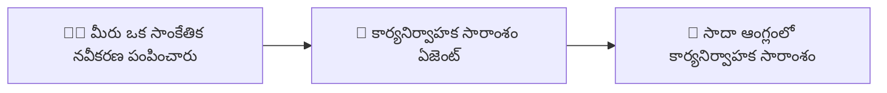

# మాడ్యూల్ 0 - పరిచయం

⏱️ ~10 నిమిషాలు

> [!WARNING]
> **ప్రివ్యూ & పరిమితులు:** [Hosted Agents](https://learn.microsoft.com/azure/foundry/agents/concepts/hosted-agents) ప్రస్తుతానికి **పబ్లిక్ ప్రివ్యూ** లో ఉన్నాయి - ప్రొడక్షన్ లోడ్‌లకు సిఫార్సు చేయబడలేదు. క్రింది విషయాలను గుర్తుంచుకోండి:
> - **మద్దతు పొందిన ప్రాంతాలు పరిమితం చేయబడ్డవి** - రిసోర్సులు సృష్టించే ముందు [ప్రాంత లభ్యత](https://learn.microsoft.com/azure/foundry/agents/concepts/hosted-agents#region-availability) తనిఖీ చేసుకోండి. మీరు మద్దతు లేని ప్రాంతాన్ని ఎంచుకున్నట్లయితే, డిప్లాయ్‌మెంట్ విఫలమవుతుంది.
> - `azure-ai-agentserver-agentframework` ప్యాకేజ్ ప్రీ-రెలీజు - APIలు సంస్కరణల మధ్య మారవచ్చు.
> - స్కేల్ పరిమితులు: హోస్టెడ్ ఏజెంట్లకు 0–5 ప్రతులను మద్దతు ఉన్నది (స్కేల్ టు జీరో సహా).
> - ఈ వర్క్‌షాప్‌లో చూపిన కొన్ని ఫీచర్లు సర్వీస్ GA వైపు కోసంమారవచ్చు.

## మీరు ఏది నిర్మించబోతున్నారు

ఈ వర్క్‌షాప్‌లో, మీరు **"నేను ఎగ్జిక్యూటివ్ ని వివరించేలా"** అనే ఏజెంట్‌ని నిర్మించబోతున్నారు - సంక్లిష్ట సాంకేతిక నవీకరణలను తీసుకొని సాధారణ ఆంగ్ల ఎగ్జిక్యూటివ్ సమ్మరీలుగా రాయగల ఒక హోస్టెడ్ AI ఏజెంట్.

```mermaid
flowchart LR
    A["🧑‍💻 మీరు ఒక సాంకేతిక నవీకరణ పంపించారు"] --> B["🤖 కార్యనిర్వాహక సారాంశం ఏజెంట్"]
    B --> C["📝 సాదా ఆంగ్లంలో కార్యనిర్వాహక సారాంశం"]
```

**ఏజెంట్ ఉపయోగించే విధానం:**
- **Microsoft Agent Framework** - ఏజెంట్ లాజిక్ మరియు నిర్మాణం కోసం
- **Foundry Toolkit for VS Code** - స్కాఫోల్డ్ చేయడానికి, స్థానికంగా పరీక్షించడానికి, మరియు డిప్లాయ్ చేయడానికి
- **ఒక AI మోడల్** (ఉదా: `gpt-4.1-mini/gpt-5-mini`) - సమ్మరీలు రూపొందించడానికి

ఈ ల్యాబ్ ముగింపు వరకు, మీరు Agent Inspector ద్వారా స్థానికంగా పరీక్షించగల పనిచేసే ఏజెంట్‌ను కలిగి ఉంటారు, మరియు ఐచ్ఛికంగా క్లౌడ్‌కు డిప్లాయ్ చేయవచ్చు.

---

## హోస్టెడ్ ఏజెంట్లు ఏమిటి?

**హోస్టెడ్ ఏజెంట్** అనేది Microsoft Foundryలో నిర్వహించబడే సేవగా నడిచే AI ఏజెంట్. మీ స్వంత ఇన్ఫ్రాస్ట్రక్చర్ నిర్వహించకుండా, మీరు మీ ఏజెంట్ కో드를 ఒక కంటెయినర్‌లో ప్యాకేజ్ చేస్తారు మరియు Foundry అది స్కేలింగ్, హోస్టింగ్, మరియు ఒక సాధారణ HTTP ఎండ్‌పాయింట్ ద్వారా ప్రవేశపెట్టుటను నిర్వహిస్తుంది.

| భావన | దాని అర్థం |
|---------|--------------|
| **ఏజెంట్** | వినియోగదారు సందేశాన్ని స్వీకరించి, AI మోడల్‌ను పిలుచుకుని, ఒక నిర్మిత ప్రతిస్పందన ఇస్తున్న మీ పేదును Python కోడ్ |
| **హోస్టెడ్** | Foundry మీ కంటెయినర్‌ను నడుపుతుంది - ఎలాంటి VMలు, Kubernetes లేక ఇన్ఫ్రాస్ట్రక్చర్ నిర్వహణ అవసరం లేదు |
| **ప్రతిస్పందన ప్రోటోకాల్** | ఎటువంటి క్లయింట్ కూడా మీ ఏజెంట్‌తో పంథా పొందగల ఒక ప్రామాణిక HTTP API (`POST /responses`) |
| **ఏజెంట్ ఇన్‌స్పెక్టర్** | ఒక స్థానిక పరీక్ష UI (Foundry Toolkitలో నిర్మితమైనది) దీనివల్ల మీరు డిప్లాయ్ చేసే ముందు చాట్ చేయవచ్చు |

ఈ వర్క్‌షాప్‌లో, మీరు నూలు నుంచి పూర్తి హోస్టెడ్ ఏజెంట్ వరకు వెళ్ళుతారు - లేదా మీరు ఇష్టపడితే స్థానిక పరీక్ష వద్ద ఆగవచ్చు.

---

## మీ మార్గం ఎంచుకోండి

> ⚠️ **కొనసాగేముందు ఒక మార్గాన్ని ఎంచుకోండి.** మీ ఎంపిక మీరు ఇన్స్టాల్ చేయవలసిన సాధనాలను మరియు వర్తించే మాడ్యూల్‌లను నిర్ణయిస్తుంది. మీరు Path B → Path A కి తర్వాత మారవచ్చు, మీరు సబ్‌స్క్రిప్షన్ పొందితే.

<strong>🅰️ మార్గం A - Azure క్లౌడ్ (Azure సబ్‌స్క్రిప్షన్ అవసరం)</strong>

| | వివరాలు |
|---|---|
| **ఇది ఎవరికీ?** | మీకు సక్రియ Azure సబ్‌స్క్రిప్షన్ ఉంది మరియు Foundry వనరులు సృష్టించగలరు |
| **మోడల్** | Foundry ద్వారా Azure OpenAI (ఉదా: `gpt-4.1-mini/gpt-5-mini`) |
| **సమావేశాలు చూపించబడ్డవి** | అన్ని మాడ్యూల్స్ (00–07) |
| **క్లౌడ్‌కు డిప్లాయ్ చేయబడ్డా?** | ✅ అవును - పూర్తి ఎండ్-టు-ఎండ్ డిప్లాయ్‌మెంట్ |

<strong>🅱️ మార్గం B - స్థానిక / ఉచిత-స్థాయి (Azure సబ్‌స్క్రిప్షన్ అవసరం లేదు)</strong>

| | వివరాలు |
|---|---|
| **ఇది ఎవరికీ?** | MVPలు, విద్యార్థులు, లేదా Azure యాక్సెస్ లేని ఎవరైనా |
| **మోడల్** | **Foundry స్థానిక** (ఉచితం, మీ మెషీన్ పై నడుస్తుంది) |
| **సమావేశాలు చూపించబడ్డవి** | మాడ్యూల్స్ 00–04 (డిప్లాయ్ & క్లౌడ్ ధృవీకరణ తప్పించండి) |
| **క్లౌడ్‌కు డిప్లాయ్ చేయబడ్డా?** | ❌ కాదు - ఏజెంట్ ఇన్స్పెక్టర్ ద్వారా మాత్రమే స్థానిక పరీక్ష |

---

## అన్ని మార్గాలు: అవసరమైన సాధనాలు

ప్రతి సాధనాన్ని క్రింద ఇన్స్టాల్ చేయండి. ఇన్స్టాల్ అనంతరం, అది పనిచేస్తుందని నిర్ధారించుకోవడానికి చెక్ కమాండ్ నడపండి.

| # | సాధనం | సంస్కరణ | ఇన్స్టాల్ | నిర్ధారణ (నిరీక్షిత అవుట్‌పుట్) |
|---|------|---------|---------|---------------------------|
| 1 | **విజువల్ స్టూడియో కోడ్** | తాజా | [code.visualstudio.com](https://code.visualstudio.com/) | లోపాలు లేకుండా తెరుస్తుంది |
| 2 | **పైథాన్** | 3.12 లేదా తర్వాతి వెర్షన్| [python.org/downloads](https://www.python.org/downloads/) | `python --version` $\rightarrow$ `Python 3.12.x` |
| 3 | **Foundry Toolkit for VS Code** | తాజా | ఎక్స్‌టెన్షన్ ID: `ms-windows-ai-studio.windows-ai-studio` | Foundry చిహ్నం Activity Barలో |
| 4 | **Python extension for VS Code** | తాజా | ఎక్స్‌టెన్షన్ ID: `ms-python.python` | ఎక్స్‌టెన్షన్స్ ప్యానెల్‌లో ఇన్స్టాల్ చేయబడి ఉంటుంది |

> [!TIP]
> **ఇన్స్టాలేషన్ కోసం ప్రముఖ సూచనలు:**
> - **Python PATH (విండోస్):** Python ఇన్స్టాలర్ మొదటి స్క్రీన్‌లో ఎప్పుడూ **"Add Python to PATH"**ని ఎంచుకోండి. లేకపోతే, `python` మీ టెర్మినల్‌లో గుర్తించబడదు.
> - **బహుళ Python సంస్కరణలు:** మీరు Python 3.10 మరియు 3.12 రెండింటిని ఇన్స్టాల్ చేసుకున్నట్లయితే, మీ వర్చువల్ ఎన్విరాన్‌మెంట్ కోసం సరైన వెర్షన్ ఉపయోగించేందుకు `python3.12 -m venv .venv` ఉపయోగించండి.
> - **డోకర్ WSL 2 (విండోస్):** Docker Desktop ఇన్స్టాలేషన్ సమయంలో, **WSL 2 బ్యాక్‌ఎండ్** ఎంచుకున్నదని నిర్ధారించుకోండి. Hyper-Vతో డోకర్ మందగించును మరియు Foundry కంటెయినర్ బిల్డింగ్ స‌మ‌స్య‌లు కలుగజేస్తుంది.
> - **డోకర్ ప్రారంభమవడమా?** Docker Desktop ప్రారంభించిన తరువాత 30-60 సెకన్ల పాటు వేచి ఉండండి. `docker info` నడిపితే "Cannot connect to the Docker daemon" అని కనిపిస్తే, Docker ఇంకా ఇంటియలైజ్ అవుతోంది.
> - **VS కోడ్ ఎక్స్‌టెన్షన్స్ లోడ్ అవడంలేదు?** ఎక్స్‌టెన్షన్లు ఇన్స్టాల్ చేసిన తరువాత విండో రీలోడ్ చేయండి: `Ctrl+Shift+P` → `Developer: Reload Window`.

> **విండోస్ వినియోగదారులు:** Python ఇన్స్టాలేషన్ సమయంలో **"Add Python to PATH"** ప్యాక్ చేసుకోవాలని చూడండి.

**తదుపరి:** [01 - సెటప్ →](01-setup.md)

---

<!-- CO-OP TRANSLATOR DISCLAIMER START -->
**అస్వీకరణ**:
ఈ పత్రం AI అనువాద సేవ [Co-op Translator](https://github.com/Azure/co-op-translator) ఉపయోగించి అనువదించబడింది. మేము ఖచ్చితత్వానికి ప్రయత్నిస్తున్నప్పటికీ, ఆటోమేటెడ్ అనువాదాలు తప్పులు లేదా అసమగ్రతలను కలిగి ఉండవచ్చు. దాని స్వదేశ భాషలో ఉన్న అసలు పత్రాన్ని అధికారం కలిగిన మూలంగా పరిగణించాలి. కీలకమైన సమాచారం కోసం, ప్రొఫెషనల్ మానవ అనువాదాన్ని సిఫారసు చేస్తాము. ఈ అనువాదం ఉపయోగం వల్ల కలిగే ఏవైనా అపార్థాలు లేదా తప్పుదారులు కోసం మేము బాధ్యత వహించము.
<!-- CO-OP TRANSLATOR DISCLAIMER END -->