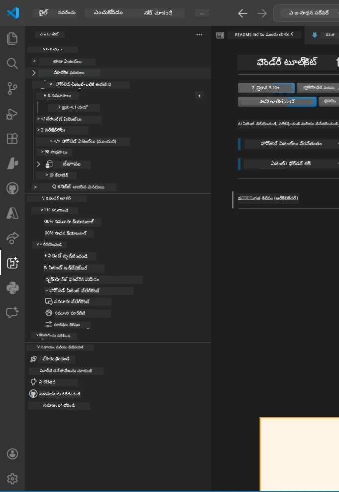
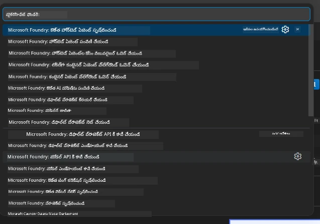

# Module 1 - ఫౌండ్రీ టూల్‌కిట్ & ఫౌండ్రీ ఎక్స్‌టెన్షన్ ఇన్‌స్టాల్ చేయండి

ఈ మాడ్యూల్ లో ఈ వర్క్‌షాప్ కోసం రెండు ముఖ్యమైన VS కోడ్ ఎక్స్‌టెన్షన్లను ఇన్‌స్టాల్ చేసి ధృవీకరించడాన్ని మీరు నేర్చుకుంటారు. మీరు ఇప్పటికే [Module 0](00-prerequisites.md)లో ఇన్స్టాల్ చేసి ఉంటే, అవి సరిగ్గా పనిచేస్తున్నాయో లేదో ఈ మాడ్యూల్ ద్వారా ధృవీకరించండి.

---

## Step 1: Microsoft Foundry ఎక్స్‌టెన్షన్ ఇన్‌స్టాల్ చేయండి

**Microsoft Foundry for VS Code** ఎక్స్‌టెన్షన్ మీ ఫౌండ్రీ ప్రాజెక్టులు సృష్టించడం, మోడల్స్ డిప్లాయ్ చేయడం, హోస్టెడ్ ఏజెంట్లను స్కాఫోల్డింగ్ చేయడం, మరియు VS కోడ్ నుండి నేరుగా డిప్లాయ్ చేయడం కోసం ప్రధాన సాధనం.

1. VS కోడ్ ఓపెన్ చేయండి.
2. `Ctrl+Shift+X` నొక్కి **Extensions** ప్యానెల్ ని తెరవండి.
3. టాప్ లో ఉన్న సెర్చ్ బాక్స్ లో టైప్ చేయండి: **Microsoft Foundry**
4. ఫలితాల్లో **Microsoft Foundry for Visual Studio Code** అనే టైటిల్ చూడండి.
   - ప్రచురకుడు: **Microsoft**
   - ఎక్స్‌టెన్షన్ ID: `TeamsDevApp.vscode-ai-foundry`
5. **Install** బటన్ ను క్లిక్ చేయండి.
6. ఇన్‌స్టాలేషన్ పూర్తి అయ్యేవరకు (చిన్నగా ప్రోగ్రెస్ సూచిక కనిపిస్తుంది) క‌లవండి.
7. ఇన్‌స్టాలేషన్ తరువాత, **Activity Bar** (VS కోడ్ ఎడమ వైపు నిలువబడిన ఐకాన్ బార్) లో కొత్త **Microsoft Foundry** ఐకాన్ కనిపించాలి (విభిన్నమైన డైమండ్/AI ఐకాన్ గలదే).
8. **Microsoft Foundry** ఐకాన్ పై క్లిక్ చేయండి మరియు దాని సైడ్బార్ వీকును తెరవండి. అందులో ఈ విభాగాలు కనిపించాలి:
   - **Resources** (లేదా Projects)
   - **Agents**
   - **Models**

> **ఐకాన్ కనిపించకపోతే:** VS కోడ్ ను రీ లోడ్ చేయండి (`Ctrl+Shift+P` → `Developer: Reload Window`).

---

## Step 2: Foundry Toolkit ఎక్స్‌టెన్షన్ ఇన్‌స్టాల్ చేయండి

**Foundry Toolkit** ఎక్స్‌టెన్షన్ లో మీరు పొందుతారు [**Agent Inspector**](https://learn.microsoft.com/azure/foundry/agents/how-to/vs-code-agents-workflow-pro-code) - స్థానికంగా ఏజెంట్లను పరీక్షించడానికి మరియు డీబగ్ చేయడానికి విజువల్ ఇంటర్‌ఫేస్ - ప్లేగ్రౌండ్, మోడల్ నిర్వహణ మరియు మూల్యాంకన సాధనాలు కూడా.

1. Extensions ప్యానెల్ (`Ctrl+Shift+X`) లో సెర్చ్ బాక్స్ క్లియర్ చేసి టైప్ చేయండి: **Foundry Toolkit**
2. ఫలితాలలో **Foundry Toolkit** కనుగొనండి.
   - ప్రచురకుడు: **Microsoft**
   - ఎక్స్‌టెన్షన్ ID: `ms-windows-ai-studio.windows-ai-studio`
3. **Install** క్లిక్ చేయండి.
4. ఇన్‌స్టాలేషన్ తర్వాత, **Foundry Toolkit** ఐకాన్ Activity Bar లో కనిపిస్తుంది (రోబోట్/అరగంట ఐకాన్ లా కనిపిస్తుంది).
5. **Foundry Toolkit** ఐకాన్ ను క్లిక్ చేసి దాని సైడ్బార్ వీయును తెరవండి. మీరు Foundry Toolkit స్వాగతం స్క్రీన్ ను ఈ ఎంపికలతో చూడగలరు:
   - **Models**
   - **Playground**
   - **Agents**

---

## Step 3: ఇద్దరు ఎక్స్‌టెన్షన్లూ సరిగా పనిచేస్తున్నాయో తెలుసుకోండి

### 3.1 Microsoft Foundry ఎక్స్‌టెన్షన్ ధృవీకరణ

1. Activity Bar లో ఉన్న **Microsoft Foundry** ఐకాన్ పై క్లిక్ చేయండి.
2. మీరు Azure లో సైన్ ఇన్ అయి ఉంటే (Module 0 నుంచి), మీ ప్రాజెక్టులు **Resources** క్రింద చూపబడతాయి.
3. సైన్ ఇన్ చేయమని అడిగితే, **Sign in** క్లిక్ చేసి ధృవీకరణ ప్రక్రియను అనుసరించండి.
4. ఎర్రర్లില്ലే సైడ్బార్ చూపబడుతోందని నిర్ధారించండి.

### 3.2 Foundry Toolkit ఎక్స్‌టెన్షన్ ధృవీకరణ

1. Activity Bar లోని **Foundry Toolkit** ఐకాన్ పై క్లిక్ చేయండి.
2. స్వాగత వీయూ లేదా ప్రధాన ప్యానెల్ ఎర్రర్ల లేకుండా లోడ్ కావడం నిర్ధారించండి.
3. ఇప్పటికీ మీరు ఏదీ కాన్ఫిగర్ చేయవక్కపోతే సరిపోతుంది - Agent Inspector ని మనం [Module 5](05-test-locally.md) లో ఉపయోగిస్తాం.

### 3.3 కమాండ్ ప్యాలెట్ ద్వారా ధృవీకరణ

1. `Ctrl+Shift+P` నొక్కి Command Palette తెరవండి.
2. టైప్ చేయండి **"Microsoft Foundry"** - ఈ విధమైన కమాండ్లు కనిపిస్తాయి:
   - `Microsoft Foundry: Create a New Hosted Agent`
   - `Microsoft Foundry: Deploy Hosted Agent`
   - `Microsoft Foundry: Open Model Catalog`
3. Command Palette మూసివేయడానికి `Escape` నొక్కండి.
4. మళ్లీ Command Palette తెరి, టైప్ చేయండి **"Foundry Toolkit"** - ఈ విధమైన కమాండ్లు కనపడతాయి:
   - `Foundry Toolkit: Open Agent Inspector`

> ఈ కమాండ్లు కనిపించకపోతే, ఎక్స్‌టెన్షన్స్ సరిగా ఇన్‌స్టాల్ కాకపోయి ఉండవచ్చు. వాటిని అనఇన్స్టాల్ చేసి మళ్లీ ఇన్‌స్టాల్ చేయండి.

---

## ఈ ఎక్స్‌టెన్షన్లు ఈ వర్క్‌షాప్‌లో ఏం చేస్తాయి

| ఎక్స్‌టెన్షన్ | ఇది ఎం చేస్తుంది | మీరు ఎప్పుడు ఉపయోగిస్తారు |
|---------------|------------------|---------------------------|
| **Microsoft Foundry for VS Code** | Foundry ప్రాజెక్టులు సృష్టించడం, మోడల్స్ డిప్లాయ్ చేయడం, **[హోస్టెడ్ ఏజెంట్లను స్కాఫోల్డ్ చేయడం](https://learn.microsoft.com/azure/foundry/agents/concepts/hosted-agents)** (`agent.yaml`, `main.py`, `Dockerfile`, `requirements.txt` స్వయంచాలక తయారీ), [Foundry Agent Service](https://learn.microsoft.com/azure/foundry/agents/overview) కు డిప్లాయ్ చేయడం | Modules 2, 3, 6, 7 |
| **Foundry Toolkit** | స్థానిక పరీక్ష/డీబగ్ కోసం Agent Inspector, ప్లేగ్రౌండ్ UI, మోడల్ నిర్వహణ | Modules 5, 7 |

> **Foundry ఎక్స్‌టెన్షన్ ఈ వర్క్‌షాప్ లో అత్యంత ముఖ్యమైన టూల్.** ఇది మొత్తం లైఫ్ సైకిల్‌ను నిర్వహిస్తుంది: స్కాఫోల్డ్ → కాన్ఫిగర్ → డిప్లాయ్ → ధృవీకరించు. Foundry Toolkit దానికి తోడు స్థానిక పరీక్షలకు విజువల్ Agent Inspector అందిస్తుంది.

---

### చెక్‌పాయింట్

- [ ] Microsoft Foundry ఐకాన్ Activity Bar లో కనిపిస్తుందా
- [ ] దాన్ని క్లిక్ చేస్తే సైడ్బార్ ఎర్రర్ల లేని గ మారుస్తుందా
- [ ] Foundry Toolkit ఐకాన్ Activity Bar లో కనిపిస్తుందా
- [ ] దాన్ని క్లిక్ చేస్తే సైడ్బార్ ఎర్రర్ల లేని గ మారుస్తుందా
- [ ] `Ctrl+Shift+P` → "Microsoft Foundry" టైప్ చేసినపుడు అందుబాటులో ఉన్న కమాండ్లు చూపిస్తాయా
- [ ] `Ctrl+Shift+P` → "Foundry Toolkit" టైప్ చేసినపుడు అందుబాటులో ఉన్న కమాండ్లు చూపిస్తాయా

---

**ముందటి:** [00 - Prerequisites](00-prerequisites.md) · **తరువాత:** [02 - Create Foundry Project →](02-create-foundry-project.md)

---

<!-- CO-OP TRANSLATOR DISCLAIMER START -->
**అస్పష్టం**:  
ఈ దస్త్రాన్ని AI అనువాద సేవ [Co-op Translator](https://github.com/Azure/co-op-translator) ఉపయోగించి అనువదించడం జరిగింది. మేము ఖచ్చితత్వానికి ప్రయత్నిస్తున్నా, స్వయంచాలిత అనువాదాలలో తప్పులు లేదా అనిశ్చితులు ఉండవచ్చు. అసలు దస్త్రాన్ని దాని స్థానిక భాషలో అధికారిక మూలంగా పరిగణించాలి. ముఖ్యమైన సమాచారానికి, నిపుణుల మానవ అనువాదం సిఫార్సు చేయబడుతుంది. ఈ అనువాదం వలన కలిగిన ఏ ఇతర స్పందనలు లేదా ఎర్రటిపయలపై మేము బాధ్యత వహించము.
<!-- CO-OP TRANSLATOR DISCLAIMER END -->