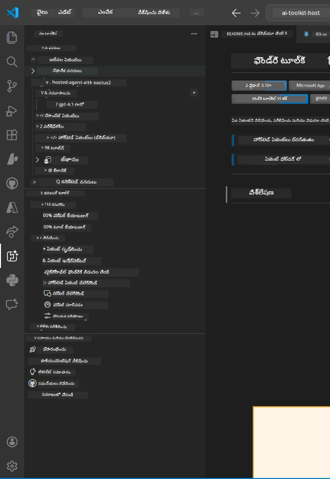
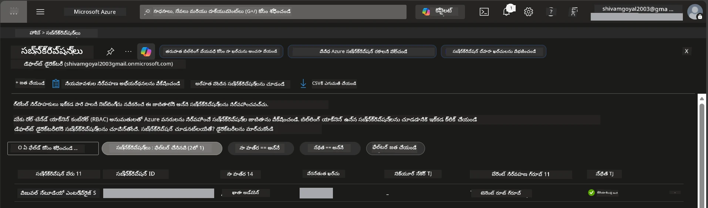
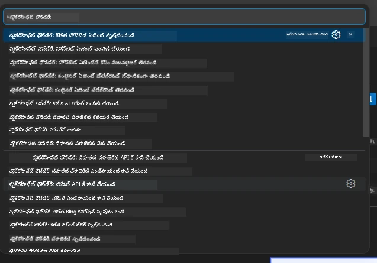
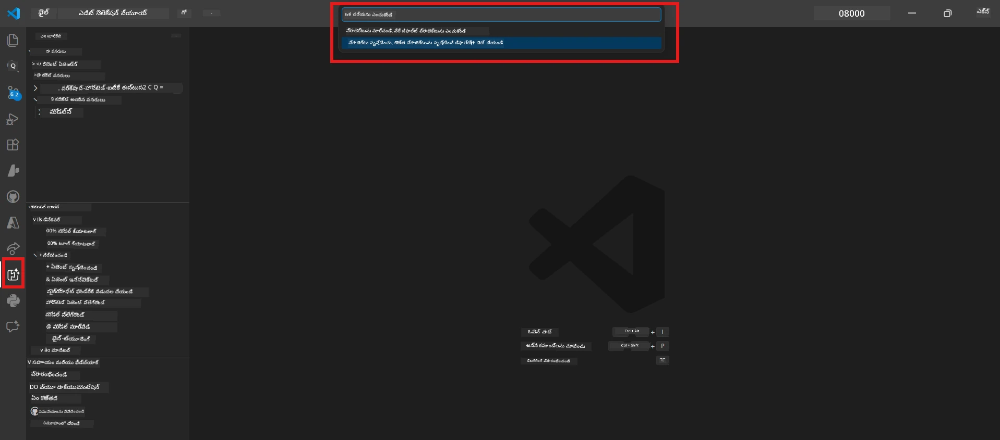
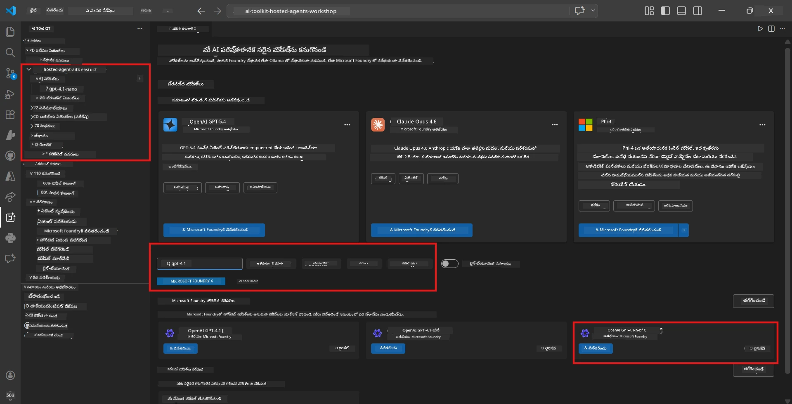
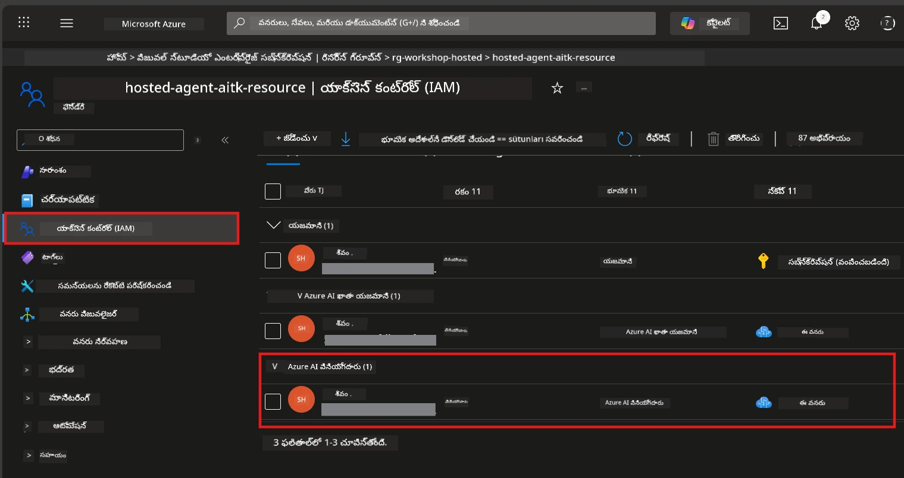

# సెటప్: విస్తరణ, ప్రాజెక్ట్ & మోడల్

⏱️ సుమారు 15 నిమిషాలు

ఈ మాడ్యూల్‌లో, మీరు Foundry Toolkit విస్తరణని ఇన్‌స్టాల్ చేసి నిర్ధారిస్తారు, Foundry ప్రాజెక్ట్‌ని సృష్టిస్తారు (లేదా కనెక్ట్ అవుతారు), మరియు మీ ఏజెంట్ ఉపయోగించే ఒక మోడల్‌ను పంపిణీ చేస్తారు.

## దశ 1: Foundry Toolkit ఇన్‌స్టాల్ చేయండి

**VS Code కోసం Foundry Toolkit** ఈ వర్క్‌షాప్ కోసం ప్రధాన విస్తరణ. ఇది ప్రాజెక్ట్ సృష్టి, మోడల్ పంపిణీ, ఏజెంట్ స్కాఫ్‌హోల్డింగ్, స్థానిక టెస్టింగ్ (ఏజెంట్ ఇన్‌స్పెక్టర్), మరియు క్లౌడ్ పంపిణీని అందిస్తుంది - అన్నీ VS Code నుండి.

1. VS Code తెరువండి, తరువాత `Ctrl+Shift+X` నొక్కి **విస్తరణలు** ప్యానెల్‌ను తెరవండి.
2. **Foundry Toolkit** కోసం శోధించండి.
3. **VS Code కోసం Foundry Toolkit** ని ఇన్‌స్టాల్ చేయండి (ప్రచురణదారు: Microsoft, ID: `ms-windows-ai-studio.windows-ai-studio`).
4. ఇన్‌స్టాలేషన్ అయిన తర్వాత, **Foundry Toolkit** ఐకాన్ కార్యకలాప బార్ (ఎడమ సైడ్ నేపథ్య పట్టీ) లో కనిపిస్తుంది.

> *గమనిక: పాత విస్తరణ వెర్షన్లలో కార్యకలాప బార్ "AI TOOLKIT" చూపవచ్చు. ఫంక్షనాలిటీ అదే.*



## దశ 2: మీ యాక్సెస్ ఆధారంగా సెటప్ చేయండి

> **మీ మార్గాన్ని ఎంచుకోండి:** మీ సెటప్‌కు సరిపోయే కిందివి విస్తరించండి. మీరు **ఒకటి మాత్రమే** పూర్తి చేయాలి.

<details>
<summary><strong>🅰️ మార్గం A - Azure క్లౌడ్ (Azure సబ్స్క్రిప్షన్ అవసరం)</strong></summary>

### Azure CLI

1. [learn.microsoft.com/cli/azure/install-azure-cli](https://learn.microsoft.com/cli/azure/install-azure-cli) నుండి ఇన్‌స్టాల్ చేయండి.
2. నిర్ధారించండి: `az --version` (2.80.0+ ఉండాలి).
3. సైన్ ఇన్ అవ్వండి: `az login`

### ధృవీకరణ ఎంపికలు

[Microsoft Agent Framework](https://learn.microsoft.com/agent-framework/overview/) [`DefaultAzureCredential`](https://learn.microsoft.com/azure/developer/python/sdk/authentication/credential-chains#defaultazurecredential-overview) ని ఉపయోగిస్తుంది, ఇది అనేక ధృవీకరణ పద్ధతులను క్రమంగా ప్రయత్నిస్తుంది. మీ వాతావరణానికి సరిపోయే దాన్ని ఎంచుకోండి:

#### ఎంపిక 1: VS Code అకౌంట్స్ (వర్క్‌షాప్‌లకు సూచించబడింది)
1. VS Code దిగువ ఎడమ మూలలో ఉన్న **Accounts** ఐకాన్ (పర్సన్ శిలువ) క్లిక్ చేయండి.
2. **Microsoft Foundry ఉపయోగించేందుకు సైన్ ఇన్ అవ్వండి** (లేదా **Azure తో సైన్ ఇన్ అవ్వండి**) ఎంచుకోండి.
3. ఒక బ్రౌజర్ తెరుస్తుంది – మీ సబ్‌స్క్రిప్షన్‌కు యాక్సెస్ ఉన్న Azure అకౌంట్‌తో సైన్ ఇన్ అవ్వండి.
4. తిరిగి VS Code కు వలెండి. దిగువ ఎడమ మూలలో మీ అకౌంట్ పేరు కనిపిస్తుంది.

#### ఎంపిక 2: Azure CLI
```bash
az login
az account set --subscription "<your-subscription-id>"
```

#### ఎంపిక 3: సర్వీస్ ప్రిన్సిపల్ (ఎంటర్‌ప్రైజ్/CI)
లాక్ డౌన్ చేసిన వాతావరణాలు లేదా CI/CD పైప్‌లైన్ల కోసం, మీ `.env` ఫైల్‌లో ఈ వాతావరణ చరాలను సెట్ చేయండి:
```env
AZURE_TENANT_ID=<your-tenant-id>
AZURE_CLIENT_ID=<your-client-id>
AZURE_CLIENT_SECRET=<your-client-secret>
```

> **`DefaultAzureCredential` ఎలా పనిచేస్తుంది:** ఇది ముందుగా వాతావరణ చరాలు, తరువాత నిర్వహించబడ్డ ఐడెంటిటీ, తదుపరి VS Code సైన్-ఇన్, తరువాత Azure CLI ను ప్రయత్నించి, మొదటి విజయవంతమైనదానిని ఉపయోగిస్తుంది. [ధృవీकरण చైన్ డాక్స్](https://learn.microsoft.com/azure/developer/python/sdk/authentication/credential-chains#defaultazurecredential-overview) చూడండి.

### Azure డెవలపర్ CLI (azd)

1. ఇన్‌స్టాల్ చేయండి: `winget install microsoft.azd` (విండోస్) లేదా [ఇన్‌స్టాల్ డాక్స్](https://learn.microsoft.com/azure/developer/azure-developer-cli/install-azd) చూడండి.
2. నిర్ధారించండి: `azd version`
3. సైన్ ఇన్ అవ్వండి: `azd auth login`

### Docker డెస్క్‌టాప్ (ఐచ్చికం)

డాకర్ స్థానికంగా కంటెయినర్లు రూపొందించడానికి మాత్రమే కావాలి. Foundry విస్తరణ పంపిణీ సమయంలో ఆహ్వానాలను ఆటోమేటిక్ గా నిర్వహిస్తుంది.

1. [docs.docker.com/get-docker](https://docs.docker.com/get-docker/) నుండి ఇన్‌స్టాల్ చేయండి.
2. నిర్ధారించండి: `docker info`

### Azure సబ్‌స్క్రిప్షన్ & RBAC

1. [portal.azure.com](https://portal.azure.com) లో సైన్ ఇన్ అవ్వండి.
2. **Subscriptions** కు వెళ్లి కనీసం ఒకటి **Active** ఉందని ఖాయం చేసుకోండి.
3. మీ **Subscription ID** గమనించండి – ఇది మాడ్యూల్ 01 లో అవసరం.



#### RBAC సన్నివేశ పట్టిక

[Hosted Agent](https://learn.microsoft.com/azure/foundry/agents/concepts/hosted-agents) పంపిణీకి **డేటా చర్య** అనుమతులు అవసరం అవి సాధారణ Azure `Owner` మరియు `Contributor` పాత్రలలో ఉండవు. క్రింద పట్టిక ఉపయోగించి మీరు ఏ పాత్రలు అవసరం తెలుసుకోండి:

| సన్నివేశం | అవసరమైన పాత్రలు | ఎక్కడ ఇవ్వాలి |
|----------|---------------|---------------------|
| కొత్త Foundry ప్రాజెక్ట్ సృష్టించండి | Foundry వనరుపై **Azure AI Owner** | Azure పోర్టల్‌లో Foundry వనరు |
| ఇప్పటికే ఉన్న ప్రాజెక్టెలో పంపిణీ (కొత్త వనరులు) | సబ్‌స్క్రిప్షన్ పై **Azure AI Owner** + **Contributor** | సబ్‌స్క్రిప్షన్ + Foundry వనరు |
| పూర్తిగా సెటప్ చేసిన ప్రాజెక్టుకు పంపిణీ | ఖాతాపై **Reader** + ప్రాజెక్టుపై **Azure AI User** | Azure పోర్టల్‌లో ఖాతా + ప్రాజెక్ట్ |
| స్థానిక పరీక్ష మాత్రమే (పంపిణీ లేదు) | ప్రాజెక్టుపై **Azure AI User** | Azure పోర్టల్‌లో ప్రాజెక్ట్ |

> **ముఖ్య విషయం:** Azure `Owner` మరియు `Contributor` పాత్రలు కేవలం *నిర్వహణ* అనుమతులు మాత్రమే ఇచ్చాయి (ARM ఆపరేషన్లు). *డేటా చర్యల* కోసం మీరు [**Azure AI User**](https://learn.microsoft.com/azure/foundry/concepts/rbac-foundry#built-in-roles) (లేదా మెరుగైన) కావాలి, ఉదాహరణకు `agents/write` ఇది ఏజెంట్ల్ని సృష్టించడం, పంపిణీ చేయడంలో అవసరం.

## Foundry ప్రాజెక్టుతో కనెక్ట్ అవ్వండి లేదా సృష్టించండి



1. `Ctrl+Shift+P` నొక్కి → **Foundry Toolkit: Create Project** టైప్ చేసి ఎంచుకోండి.
2. డ్రాప్డౌన్ నుండి మీ **Azure సబ్‌స్క్రిప్షన్** ఎంచుకోండి.
3. **Resource group** ఎంచుకోండి లేదా సృష్టించండి (ఉదా., `rg-hosted-agents-workshop`).
4. హోస్టెడ్ ఏజెంట్లను మద్దతు ఇచ్చే **రిజియన్** ఎంచుకోండి: `East US`, `West US 2`, లేదా `Sweden Central`. [రిజియన్ అందుబాటు](https://learn.microsoft.com/azure/foundry/agents/concepts/hosted-agents#region-availability) చూడండి.
5. ప్రాజెక్ట్ పేరు ఇవ్వండి (ఉదా., `workshop-agents`).
6. ప్రావిజనింగ్ కోసం 2-5 నిమిషాలు వేచి ఉండండి. ప్రగతి నోటిఫికేషన్ VS Code లో కనిపిస్తుంది.
7. పూర్తయిన తర్వాత, మీ ప్రాజెక్ట్ **Foundry Toolkit** సైడ్‌బార్‌లో **MY RESOURCES** క్రింద కనిపిస్తుంది.



## మోడల్‌ను పంపిణీ చేసి RBAC కేటాయించండి

మీ హోస్టెడ్ ఏజెంట్ సమాధానాలు రూపొందించడానికి AI మోడల్ అవసరం.

#### మోడల్ ఎంపిక మ్యాట్రిక్స్
మీ అవసరాలను బట్టి, వివిధ మోడల్ టియర్ల నుండి ఎంచుకోవచ్చు:

| మోడల్ | ఉత్తమం | ఖర్చు | గమనికలు |
|-------|----------|------|---------|
| `gpt-4.1` | ఉన్నత-నాణ్యత, సున్నితమైన సమాధానాలు | ఎక్కువ | ఉత్తమ ఫలితాలు, ఫైనల్ పరీక్షల కోసం సిఫార్సు చేయబడింది |
| `gpt-4.1-mini/gpt-5-mini` | వేగవంతమైన పునర్విమర్శ, తక్కువ ఖర్చు | తక్కువ | వర్క్‌షాప్ అభివృద్ధి మరియు త్వరిత పరీక్షలకు మంచి |
| `gpt-4.1-nano` | తేలికపాటి పనులు | తక్కువ | అత్యంత సడలింపు ఖర్చు, కానీ సరళమైన సమాధానాలు |

1. `Ctrl+Shift+P` నొక్కి → **Foundry Toolkit: Open Model Catalog** (లేదా సైడ్‌బార్ లో DEVELOPER TOOLS క్రింద **Model Catalog** క్లిక్ చేయండి).
2. క్యాటలాగ్ లో **gpt-4.1** శోధించండి.
3. **OpenAI GPT-4.1-mini** (లేదా మెరుగైన నాణ్యత కోసం `gpt-5-mini`) కనుగొని **Deploy** క్లిక్ చేయండి.



4. పంపిణీ కాన్ఫిగరేషన్‌లో:
   - **Deployment name:** డిఫాల్ట్ గా ఉంచండి లేదా కస్టమ్ పేరు ఇవ్వండి. **ఈ పేరును గుర్తుంచుకోండి.**
   - **Target:** **Deploy to Foundry Toolkit** ఎంచుకుని మీ ప్రాజెక్ట్ ని ఎంచుకోండి.
5. **Deploy** క్లిక్ చేసి 1–3 నిమిషాలు వేచి ఉండండి.

> **సిఫార్సు:** వర్క్‌షాప్ కోసం `gpt-4.1-mini/gpt-5-mini` ఉపయోగించండి - వేగవంతమైనది, తక్కువ ఖర్చుతో మంచి ఫలితాలు ఇస్తుంది.

### మీ విలువలను గమనించుకోండి

పంపిణీ తర్వాత, ఈ రెండు విలువలను గమనించుకోండి (మాడ్యూల్ 03 లో అవసరం):

| విలువు | ఎక్కడి నుండి కనుగొనాలి |
|-------|--------------------|
| **Project endpoint** | సైడ్‌బార్‌లో మీ ప్రాజెక్ట్ పై క్లిక్ చేయండి → వివరణా వీక్షణలో URL చూపిస్తుంది (ఉదా., `https://<account>.services.ai.azure.com/api/projects/<project>`) |
| **Model deployment name** | ప్రాజెక్ట్ ని విస్తరించండి → **Models** → మీ పంపిణీ చేసిన మోడల్ పక్కన ఉన్న పేరు (ఉదా., `gpt-4.1-mini/gpt-5-mini`) |

### RBAC పాత్ర కేటాయించండి

> ⚠️ **ఇది సాధారణంగా మర్చిపోతారు.** సరైన పాత్ర లేకుండా, మాడ్యూల్ 05 లో పంపిణీ విఫలమవుతుంది.

#### నాకు ఏ పాత్ర కావాలి?
మీ సన్నివేశం ఆధారంగా, ఈ పాత్ర కాంబినేషన్లు అవసరం:

| సన్నివేశం | అవసరమైన పాత్రలు | ఎక్కడ ఇవ్వాలి |
|----------|---------------|---------------------|
| కొత్త Foundry ప్రాజెక్ట్ సృష్టించండి | Foundry వనరుపై **Azure AI Owner** | Azure పోర్టల్‌లో Foundry వనరు |
| ఇప్పటికే ఉన్న ప్రాజెక్టు పంపిణీ (కొత్త వనరులు) | సబ్స్క్రిప్షన్ పై **Azure AI Owner** + **Contributor** | సబ్‌స్క్రిప్షన్ + Foundry వనరు |
| పూర్తిగా సెటప్ చేసిన ప్రాజెక్టుకు పంపిణీ | ఖాతాపై **Reader** + ప్రాజెక్టుపై **Azure AI User** | Azure పోర్టల్‌లో ఖాతా + ప్రాజెక్ట్ |

**ముఖ్య విషయం:** Azure `Owner` మరియు `Contributor` పాత్రలు కేవలం *నిర్వహణ* అనుమతులు ఇస్తాయి. మీరు ఆజెంట్లను సృష్టించడానికి మరియు పంపిణీ చేయడానికి కావలసిన `agents/write` వంటి *డేటా చర్యల* కోసం **Azure AI User** (లేదా ఎక్కువ) కావాలి.

1. [portal.azure.com](https://portal.azure.com) తెరవండి.
2. మీ **Foundry ప్రాజెక్ట్** పేరును శోధించండి → టైపు **"Foundry Toolkit project"** ఫలితాన్ని క్లిక్ చేయండి (పేరెంటు అకౌంటును కాదు).
3. ఎడమ నావిగేషన్‌లో **Access control (IAM)** క్లిక్ చేయండి.
4. **+ Add** → **Add role assignment** క్లిక్ చేయండి.
5. **Role tab:** **Azure AI User** కోసం శోధించండి, ఎంచుకుని **Next** క్లిక్ చేయండి.
6. **Members tab:** **User, group, or service principal** ఎంచుకోండి → **+ Select members** క్లిక్ చేసి, మీని కనుగొని ఎంచుకోండి → **Select** క్లిక్ చేయండి.
7. **Review + assign** క్లిక్ చేయండి → మళ్లీ **Review + assign** క్లిక్ చేయండి.
8. ప్రాపగేషన్ కోసం **1–2 నిమిషాలు** వేచి ఉండండి.

> **ఈ పాత్ర ఎందుకు?** Azure `Owner`/`Contributor` నిర్వాహణ అనుమతులు మాత్రమే ఇస్తారు. **Azure AI User** పాత్ర `agents/write` డేటా చర్యలను ఇస్తుంది, ఆజెంట్లను సృష్టించి పంపిణీ చేయడానికి అవసరం. [Foundry RBAC డాక్స్](https://learn.microsoft.com/azure/foundry/concepts/rbac-foundry#built-in-roles) చూడండి.



</details>

<details>
<summary><strong>🅱️ మార్గం B - స్థానిక / ఉచిత-స్థాయి (Azure సబ్‌స్క్రిప్షన్ అవసరం లేదు)</strong></summary>

### Foundry Local

Foundry Local మీ స్వంత యంత్రంపై AI మోడల్స్ నడిపేందుకు అనుమతిస్తుంది - క్లౌడ్ అకౌంట్ అవసరం లేదు. Foundry Toolkit ఉపయోగించి మోడల్ క్యాటలాగ్ ద్వారా Foundry Local మోడల్స్ యాక్సెస్ చేయండి ఈ విధంగా:

1. Foundry Toolkit విస్తరణకు వెళ్లండి.
2. Foundry Toolkit నావిగేషన్‌లో **Developer Tools** > **Model Catalog** ఎంచుకోండి.
3. కొత్త విండోలో, నావిగేషన్ బార్‌లో నుండి **local** ఎంచుకోండి.
4. క్రిందికి స్క్రోల్ చేసి **Phi 4 Mini,** పై **add బటన్** క్లిక్ చేయండి, ఒక పాప్ అప్ మోడల్ డౌన్‌లోడ్ అవుతోంది అని సూచిస్తుంది.
5. మోడల్ డౌన్‌లోడ్ అయ్యాక, తదుపరి దశకు కొనసాగండి.

</details>

### ✅ పరీక్షా స్థలం


- [ ] `Ctrl+Shift+P` → "Foundry Toolkit" అందుబాటులో ఉన్న ఆదేశాలు చూపిస్తుంది
- [ ] Foundry Toolkit విస్తరణ ఇన్‌స్టాల్ అయింది మరియు సైడ్‌బార్ లో తప్పులుండదు
- [ ] VS Code సరిగా తెరిచి పనిచేస్తోంది
- [ ] `python --version` 3.10+ చూపిస్తుంది
- [ ] Foundry Toolkit ఐకాన్ VS Code కార్యకలాప బార్ లో దృశ్యమానమై ఉంది
- [ ] **మార్గం A:** `az login` విజయవంతం, సబ్‌స్క్రిప్షన్ సక్రియం
- [ ] **మార్గం B:** Foundry Local నడుస్తోంది (`foundry local status`)
- [ ] **మార్గం A:** Foundry ప్రాజెక్టు సైడ్‌బార్ లో కనిపిస్తోంది, మోడల్ పంపిణీ అయింది, Azure AI User పాత్ర కేటాయిస్తోంది
- [ ] **మార్గం B:** Foundry Local మోడల్ తో నడుస్తోంది
- [ ] మీరు మీ **ఎండ్పాయింట్** మరియు **మోడల్ పంపిణీ పేరు** గమనించుకున్నారు


**ముందటి:** [00 - అవసరాలు](00-prerequisites.md) · **తర్వాత:** [02 - Hosted Agent సృష్టించండి →](02-create-hosted-agent.md)

---

<!-- CO-OP TRANSLATOR DISCLAIMER START -->
**అస్వీకరణ**:
ఈ పత్రం AI అనువాద సేవ [Co-op Translator](https://github.com/Azure/co-op-translator) ఉపయోగించి అనువదించబడింది. మేము ఖచ్చితత్వానికి ప్రయత్నిస్తున్నప్పటికీ, ఆటోమేటెడ్ అనువాదాలు తప్పులు లేదా అసమగ్రతలను కలిగి ఉండవచ్చు. దాని స్వదేశ భాషలో ఉన్న అసలు పత్రాన్ని అధికారం కలిగిన మూలంగా పరిగణించాలి. కీలకమైన సమాచారం కోసం, ప్రొఫెషనల్ మానవ అనువాదాన్ని సిఫారసు చేస్తాము. ఈ అనువాదం ఉపయోగం వల్ల కలిగే ఏవైనా అపార్థాలు లేదా తప్పుదారులు కోసం మేము బాధ్యత వహించము.
<!-- CO-OP TRANSLATOR DISCLAIMER END -->