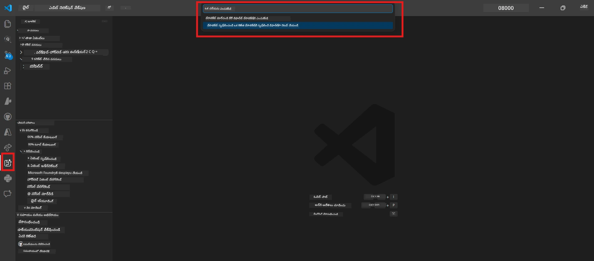
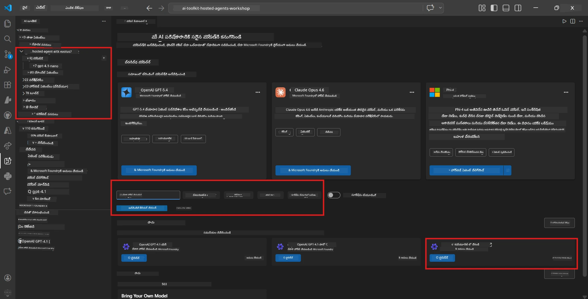
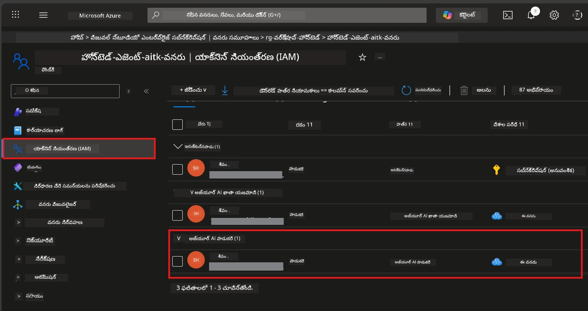

# Module 2 - Foundry ప్రాజెక్ట్ సృష్టించండి & ఒక మోడల్ ను ప్లలోయ్ చేయండి

ఈ మాడ్యూల్ లో, మీరు Microsoft Foundry ప్రాజెక్ట్ ను సృష్టించి (లేదా ఎంచుకొని) మీరు ఉపయోగించే ఏజెంట్ కోసం ఒక మోడల్ ను ప్లలోయ్ చేస్తారు. ప్రతి దశ స్పష్టంగా వ్రాయబడింది - వాటిని క్రమంగా అనుసరించండి.

> మీరు ఇప్పటికే ఒక Foundry ప్రాజెక్ట్ మరియు ప్లలోయ్ చేసిన మోడల్ ఉన్నట్లయితే, [Module 3](03-create-hosted-agent.md) కి వెళ్లండి.

---

## Step 1: VS Code నుండి Foundry ప్రాజెక్ట్ సృష్టి

మీరు Microsoft Foundry\Extension ను ఉపయోగించి VS Code విడిచి వెళ్లకుండా ప్రాజెక్ట్ ను సృష్టించవచ్చు.

1. `Ctrl+Shift+P` నొక్కి **Command Palette** ని తెరవండి.
2. టైపు చేయండి: **Microsoft Foundry: Create Project** మరియు దానిని ఎంచుకోండి.
3. ఒక డ్రాప్‌డౌన్ కనిపిస్తుంది - అందులో నుండి మీ **Azure subscription** ఎంచుకోండి.
4. మీరు **resource group** ని ఎంచుకోవాలని లేదా సృష్టించాలనుకుంటారు:
   - కొత్త ఒకటి సృష్టించాలంటే: పేరు టైపు చేయండి (ఉదా., `rg-hosted-agents-workshop`) మరియు Enter నొక్కండి.
   - ఉన్నవన్నిటిలోంచి ఉపయోగించాలంటే: డ్రాప్‌డౌన్ నుండి ఎంచుకోండి.
5. ఒక **రిజియన్** ఎంచుకోండి. **महत्वपूर्ण:** హోస్టెడ్ ఏజెంట్లకు మద్దతు ఇచ్చే రీజియన్ ఎంచుకోండి. [region availability](https://learn.microsoft.com/azure/foundry/agents/concepts/hosted-agents#region-availability) ను తనిఖీ చేయండి - సాధారణ ఎంపికలు `East US`, `West US 2` లేదా `Sweden Central`.
6. Foundry ప్రాజెక్ట్ కి ఒక **పేరు** ఇచ్చండి (ఉదా. `workshop-agents`).
7. Enter నొక్కండి మరియు ప్రోవిజనింగ్ పూర్తికావడానికి వేచివుండండి.

> **Provisioning కు 2-5 నిమిషాలు పడుతుంది.** మీరు ప్రోగ్రెస్ నోటిఫికేషన్ VS Code కింద-కుడి మూలలో చూడవచ్చు. ప్రొవిజనింగ్ సమయంలో VS Code ను మూసుకోవద్దు.

8. పూర్తయ్యాక, **Microsoft Foundry** సైడ్బార్ లో మీ కొత్త ప్రాజెక్ట్ **Resources** కింద కనిపిస్తుంది.
9. ప్రాజెక్ట్ పేరును క్లిక్ చేసి విస్తరించి, **Models + endpoints** మరియు **Agents** వంటి విభాగాలు ఉన్నాయని ధృవీకరించండి.



### ప్రత్యామ్నాయం: Foundry పోర్టల్ ద్వారా సృష్టించండి

మీరు బ్రౌజర్ ఉపయోగించాలనుకుంటే:

1. [https://ai.azure.com](https://ai.azure.com) ను తెరవండి మరియు సైన్ ఇన్ కావండి.
2. హోమ్ పేజీలో **Create project** పై క్లిక్ చేయండి.
3. ప్రాజెక్ట్ పేరు, మీ సబ్‌స్క్రిప్షన్, రిసోర్స్ గ్రూప్ మరియు రీజియన్ను ఎంటర్ చేయండి.
4. **Create** పై క్లిక్ చేసి ప్రోవిజనింగ్ కోసం వేచివుండండి.
5. సృష్టించిన తర్వాత, VS Code కి తిరిగి వచ్చి ఫౌండ్‌రీ సైడ్బార్ లో ప్రాజెక్ట్ కనిపిస్తుంది (refresh ఐకాన్ క్లిక్ చేయండి).

---

## Step 2: ఒక మోడల్‌ను ప్లలోయ్ చేయండి

మీ [hosted agent](https://learn.microsoft.com/azure/foundry/agents/concepts/hosted-agents) కి Azure OpenAI మోడల్ అవసరం, అది ప్రతిస్పందనలు జనరేట్ చేస్తుంది. మీరు [ఇప్పుడే ఒకటి ప్లలోయ్ చేయండి](https://learn.microsoft.com/azure/ai-foundry/openai/how-to/create-resource#deploy-a-model).

1. `Ctrl+Shift+P` నొక్కి **Command Palette** తెరవండి.
2. టైపు చేయండి: **Microsoft Foundry: Open [Model Catalog](https://learn.microsoft.com/azure/ai-foundry/openai/concepts/models)** మరియు ఎంచుకోండి.
3. VS Code లో మోడల్ క్యాటలాగ్ వర్ణన తెరుచుతుంది. బ్రౌజ్ చేయండి లేదా సెర్చ్ బార్ లో **gpt-4.1** ను కనుగొనండి.
4. **gpt-4.1** మోడల్ కార్డ్ (లేదా తక్కువ ధరకు కావాలంటే `gpt-4.1-mini`) పై క్లిక్ చేయండి.
5. **Deploy** పై క్లిక్ చేయండి.


6. డిప్లాయ్‌మెంట్ కాన్ఫిగరేషన్ లో:
   - **Deployment name**: డిఫాల్ట్ (ఉదా. `gpt-4.1`) వదిలేయండి లేదా మీకు కావలసిన పేరును ఇవ్వండి. **ఈ పేరును గుర్తుపట్టుకోండి** - మీరు Module 4 లో దీనిని ఉపయోగించాల్సి ఉంటుంది.
   - **Target**: **Deploy to Microsoft Foundry** ఎంచుకోండి మరియు మీరు సృష్టించిన ప్రాజెక్ట్ ఎంచుకోండి.
7. **Deploy** పై క్లిక్ చేసి డిప్లాయ్‌మెంట్ పూర్తికావడానికి (1-3 నిమిషాలు) వేచివుండండి.

### మోడల్ ఎంపిక

| మోడల్ | ఉత్తమ ఉపయోగం | ఖర్చు | గమనికలు |
|-------|--------------|---------|----------|
| `gpt-4.1` | ఉన్నత నాణ్యమైన, సున్నితమైన ప్రతిస్పందనలు | ఎక్కువ | ఉత్తమ ఫలితాలు, తుది పరీక్ష కోసం సూచించబడింది |
| `gpt-4.1-mini` | వేగవంతమైన పునర్విమర్శ, తక్కువ ఖర్చు | తక్కువ | వర్క్‌షాప్ అభివృద్ధి మరియు వేగవంతమైన టెస్టింగ్ కు మంచిది |
| `gpt-4.1-nano` | తక్కువ పనులకి | చాలా తక్కువ | అత్యంత కిఫాయం, కానీ సాధారణ ప్రతిస్పందనలు |

> **ఈ వర్క్‌షాప్ కోసం సిఫార్సు:** అభివృద్ధి మరియు టెస్టింగ్ కోసం `gpt-4.1-mini` ని ఉపయోగించండి. ఇది వేగంగా, చౌకగా మరియు మంచి ఫలితాలు ఇస్తుంది.

### మోడల్ డిప్లాయ్‌మెంట్ నిర్ధారించండి

1. **Microsoft Foundry** సైడ్బార్ లో, మీ ప్రాజెక్ట్ విస్తరించండి.
2. **Models + endpoints** (లేదా సమాన విభాగం) కింద చూడండి.
3. మీరు డిప్లాయ్ చేసిన మోడల్ (ఉదా. `gpt-4.1-mini`) **Succeeded** లేదా **Active** స్థితిలో కనిపిస్తుంది.
4. మోడల్ డిప్లాయ్‌మెంట్ పై క్లిక్ చేసి వివరాలు చూడండి.
5. ఈ రెండు విలువలను గమనించండి - Module 4 లో అవి అవసరం:

   | సెట్టింగ్ | ఎక్కడ దొరుకుతుంది | ఉదాహరణ విలువ |
   |---------|-----------------|---------------|
   | **ప్రాజెక్ట్ ఎండ్‌పాయింట్** | Foundry సైడ్బార్ లో ప్రాజెక్ట్ పేరును క్లిక్ చేయండి. వివరాల వీక్షణలో ఎండ్‌పాయింట్ URL కనిపిస్తుంది. | `https://<account>.services.ai.azure.com/api/projects/<project>` |
   | **మోడల్ డిప్లాయ్‌మెంట్ పేరు** | డిప్లాయ్ అయిన మోడల్ పక్కన చూపబడిన పేరు. | `gpt-4.1-mini` |

---

## Step 3: అవసరమైన RBAC పాత్రలను కేటాయించండి

ఇది **అత్యంత సాధారణంగా మిస్ అయ్యే దశ**. సరైన పాత్రలు లేకుంటే, Module 6 లో డిప్లాయ్‌మెంట్ అనుమతులు విషయంలో తలదూరుతుంది.

### 3.1 Azure AI User పాత్రను నీకు కేటాయించండి

1. బ్రౌజర్ లో [https://portal.azure.com](https://portal.azure.com) కు వెళ్లండి.
2. పై సెర్చ్ బార్ లో మీ **Foundry ప్రాజెక్ట్** పేరు టైపు చేసి ఫలితాల్లో దాన్ని క్లిక్ చేయండి.
   - **महत्वपूर्ण:** ప్రాజెక్ట్ రిసోర్స్ (type: "Microsoft Foundry project") ను ఎంచుకోండి, ప్రాథమిక ఖాతా/హబ్ రిసోర్స్ కాదు.
3. ప్రాజెక్ట్ యొక్క ఎడమ నావిగేషన్‌లో **Access control (IAM)** పై క్లిక్ చేయండి.
4. పైభాగంలో **+ Add** బటన్ → **Add role assignment** ఎంచుకోండి.
5. **Role** ట్యాబ్ లో, [**Azure AI User**](https://learn.microsoft.com/azure/foundry/concepts/rbac-foundry#built-in-roles) కోసం శోధించి దాన్ని ఎంచుకోండి. **Next** క్లిక్ చేయండి.
6. **Members** ట్యాబ్ లో:
   - **User, group, or service principal** ఎంచుకోండి.
   - **+ Select members** క్లిక్ చేయండి.
   - మీ పేరు లేదా ఇమెయిల్ కోసం శోధించి, మీను ఎంచుకుని **Select** క్లిక్ చేయండి.
7. **Review + assign** పై క్లిక్ చేసి మరలా **Review + assign**తో ధృవీకరించండి.



### 3.2 (ఐచ్ఛికం) Azure AI Developer పాత్రను కేటాయించండి

మీకు ప్రాజెక్ట్ లో అదనపు వనరులు సృష్టించాలి లేదా ప్రోగ్రామాటిక్ గా డిప్లాయ్‌మెంట్ లను నిర్వహించడం అవసరం ఉంటే:

1. పై దశలను మళ్ళీ చేయండి, కానీ దశ 5 లో Azure AI Developer ని ఎంచుకోండి.
2. దీనిని **Foundry resource (account)** స్థాయిలో కేటాయించండి, కేవలం ప్రాజెక్ట్ స్థాయిలో కాదు.

### 3.3 మీ పాత్ర నిబంధనలు నిర్ధారించండి

1. ప్రాజెక్ట్ యొక్క **Access control (IAM)** పేజీలో **Role assignments** ట్యాబ్ ను క్లిక్ చేయండి.
2. మీ పేరును శోధించండి.
3. ప్రాజెక్ట్ స్కోప్ కోసం కనీసం **Azure AI User** కనిపించాలి.

> **ఇది ఎందుకు ముఖ్యం:** [`Azure AI User`](https://learn.microsoft.com/azure/foundry/concepts/rbac-foundry#built-in-roles) పాత్ర `Microsoft.CognitiveServices/accounts/AIServices/agents/write` డేటా చర్యను ఇస్తుంది. లేకపోతే, డిప్లాయ్‌మెంట్ సమయంలో క్రింది తప్పిదం వస్తుంది:
>
> ```
> Error: lacks the required data action 
> Microsoft.CognitiveServices/accounts/AIServices/agents/write 
> to perform POST /api/projects/{projectName}/assistants operation.
> ```
>
> మరిన్ని వివరాలకు [Module 8 - Troubleshooting](08-troubleshooting.md) చూడండి.

---

### చెక్‌పాయింట్

- [ ] Foundry ప్రాజెక్ట్ ఉంది మరియు VS Code లో Microsoft Foundry సైడ్బార్ లో కనిపిస్తోంది
- [ ] కనీసం ఒక మోడల్ (ఉదా. `gpt-4.1-mini`) ప్లలోయ్ అయింది మరియు స్థితి **Succeeded**
- [ ] మీరు **ప్రాజెక్ట్ ఎండ్‌పాయింట్** URL మరియు **మోడల్ డిప్లాయ్‌మెంట్ పేరు** గమనించారు
- [ ] మీకు **Azure AI User** పాత్ర ప్రాజెక్ట్ స్థాయిలో కేటాయింపబడింది (Azure Portal → IAM → Role assignments లో నిర్ధారించండి)
- [ ] ప్రాజెక్ట్ [హోస్టెడ్ ఏజెంట్లకు మద్దతు ఉన్న రీజియన్](https://learn.microsoft.com/azure/foundry/agents/concepts/hosted-agents#region-availability) లో ఉంది

---

**పూర్వবর্তী:** [01 - Install Foundry Toolkit](01-install-foundry-toolkit.md) · **తర్వాత:** [03 - Create a Hosted Agent →](03-create-hosted-agent.md)

---

<!-- CO-OP TRANSLATOR DISCLAIMER START -->
**అస్పష్టత**:  
ఈ డాక్యుమెంట్ [Co-op Translator](https://github.com/Azure/co-op-translator) అనే AI అనువాద సేవను ఉపయోగించి అనువదించబడింది. మేము ఖచ్చితత్వానికి ప్రయత్నిస్తున్నప్పటికీ, ఆటోమేటెడ్ అనువాదాలలో తప్పులు లేదా అసత్యతలు ఉండే అవకాశముంది. అర్వాచీ మాధ్యమంలో ఉన్న అసలు డాక్యుమెంటే నమ్మకానికి లభించదగిన మూలం. క్రిటికల్ సమాచారానికి, ప్రొఫెషనల్ మానవ అనువాదం సిఫార్సు చేయబడుతుంది. ఈ అనువాదం వాడకం వలన కలిగే ఎటువంటి అపార్థాలు లేదా తప్పుబాట్లకు మేము బాధ్యులు కాదు.
<!-- CO-OP TRANSLATOR DISCLAIMER END -->