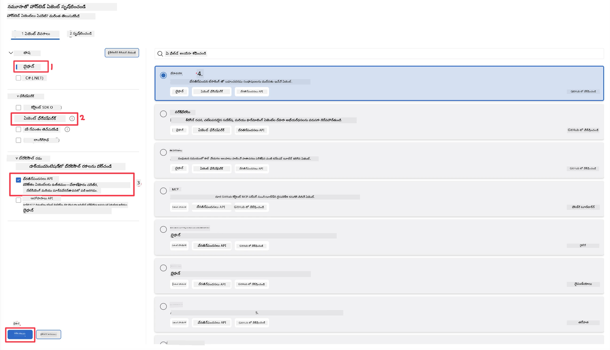
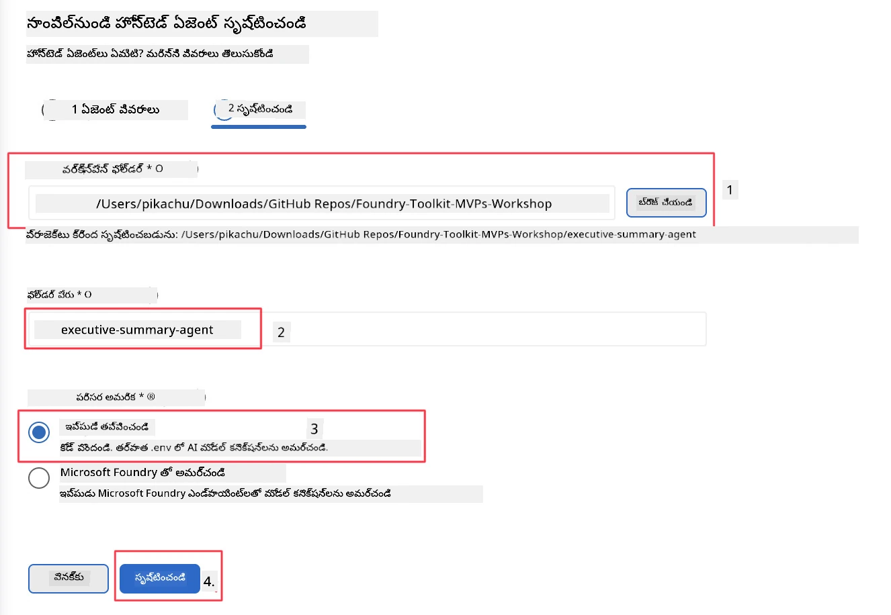

# మాడ్యూల్ 2 - కొత్త హోస్టెడ్ ఏజెంట్ సృష్టించండి

⏱️ సుమారు 5 నిమిషాలు

ఈ మాడ్యూల్‌లో, మీరు Foundry Toolkit ఉపయోగించి **హోస్టెడ్ ఏజెంట్ ప్రాజెక్టును స్కాఫోల్డ్ చేస్తారు**. స్కాఫోల్డ్ పూర్తయిన ప్రాజెక్టు నిర్మాణాన్ని సృష్టిస్తుంది - `agent.yaml`, `main.py`, `Dockerfile`, `requirements.txt`, మరియు VS కోడ్ డీబగ్గింగ్ కాన్ఫిగరేషన్ - కాబట్టి మీరు ఏజెంట్ యొక్క ప్రవర్తనను అనుకూలీకరించడానికి దృష్టి పెడతారు.

> **ప్రధాన సూత్రం:** ఈ ల్యాబ్‌లోని `agent/` ఫోల్డర్ Foundry Toolkit తయారుచేసే దానికి ఒక ఉదాహరణ. మీరు ఈ ఫైళ్లను తొలుత ముడి నుండి రాయాల్సిన అవసరం లేదు.

### స్కాఫోల్డ్ విజార్డ్ ప్రాసెస్

```mermaid
flowchart LR
    A["Command Palette:
    Create new Hosted Agent"] --> B["Language:
    Python"]
    B --> C["API type:
    Response API"]
    C --> D["Template:
    Basic - Agent Framework"]
    D --> E["మోడల్ ఎంపిక చేయండి"]
    E --> F["Workspace folder
    & agent name"]
    F --> G["సృష్టించిన ప్రాజెక్టు"]

    style A fill:#4A90D9,color:#fff
    style B fill:#7B68EE,color:#fff
    style C fill:#7B68EE,color:#fff
    style D fill:#7B68EE,color:#fff
    style E fill:#7B68EE,color:#fff
    style F fill:#7B68EE,color:#fff
    style G fill:#27AE60,color:#fff
```



---

## దశ 1: Create Hosted Agent విజార్డ్ తెరువు

1. `Ctrl+Shift+P` నొక్కి **కమాండ్ ప్యాలెట్** ను తెరువు.
2. టైప్ చేయండి: **Foundry Toolkit: Create new Hosted Agent** మరియు దాన్ని ఎంచుకోండి.

> **ప్రత్యామ్నాయం: Foundry పోర్టల్ ద్వారా సృష్టించండి**
> బ్రౌజర్‌ని ఇష్టం ఐతే, మీరు మీ ప్రాజెక్టును [https://ai.azure.com](https://ai.azure.com) వద్ద సృష్టించవచ్చు. ఒకసారి ప్రాజెక్టు ప్రొవిజన్ అయిన తర్వాత, VS కోడ్‌కి తిరిగి వచ్చి **Foundry Toolkit** సైడ్‌బార్ ద్వారా దానికి కనెక్ట్ అవ్వండి.

> **ప్రత్యామ్నాయం:** Foundry Toolkit సైడ్‌బార్‌లో **Hosted Agents (Preview)** పక్కన ఉన్న **+** చిహ్నం పై క్లిక్ చేయండి.

## దశ 2: సెట్టింగులు ఎంచుకోండి



1. ఎడమ నావిగేషన్/ఎంపికల విభాగంలో ఈ వారిని ఎంచుకోండి:

| మెనూ | ఎంపిక | గమనికలు |
|--------|-----------|-------|
| **భాష** | Python | C# కూడా మద్దతు ఉంది |
| **ఫ్రేమ్‌వర్క్** | Agent Framework | Agent Framework SDK ఉపయోగించి సింపుల్ స్టార్టింగ్ పాయింట్ |
| **API రకం** | Response API | `POST /responses` - సంభాషణాత్మక, ప్లాట్‌ఫారం-నిర్వహణ చరిత్రతో |
| **టెంప్లేట్** | Basic | Agent Framework SDK ఉపయోగించి సింపుల్ స్టార్టింగ్ పాయింట్ |

2. ఎంచుకున్న తర్వాత, **Next** ను క్లిక్ చేయండి



3. తదుపరి విండోలో, ఈ ఎంపికలను ఎంచుకోండి:

| మెనూ | ఎంపిక | గమనికలు |
|--------|-----------|-------|
| **వర్క్‌స్పేస్ ఫోల్డర్** | లక్ష్య ఫోల్డర్ ఎంచుకోండి | ఉదా: `/workspace/Foundry_Toolkit_for_VSCode_Lab/` లేదా ఈ రెపొలో ఒక ఉపఫోల్డర్ |
| **ఏజెంట్ పేరు** | ఒక పేరు నమోదు చేయండి | ఉదా: `executive-summary-agent` |
| **ఎన్విరాన్మెంట్ సెటప్** | ఇప్పుడే సెటప్ చేయకుండా వదిలేయండి |  |

మా ఏజెంట్ సృష్టించేందుకు **create** క్లిక్ చేయండి. కొత్త ఫోల్డర్ హోస్టెడ్ ఏజెంట్ పేరుతో సృష్టించబడుతుంది.

## దశ 3: జనరేట్ చేసిన ప్రాజెక్టును పరిశీలించండి

స్కాఫోల్డింగ్ పూర్తయిన తర్వాత, ఈ ఫైళ్లు Explorer (`Ctrl+Shift+E`)లో కనిపిస్తాయో లేదో నిర్ధారించండి:

```
📂 my-agent/
├── .env                ← Environment variables (placeholders)
├── .vscode/
│   ├── launch.json     ← Debug config (F5 → run + Agent Inspector)
│   └── tasks.json      ← VS Code task definitions
├── agent.yaml          ← Agent definition (kind: hosted)
├── Dockerfile          ← Container config for deployment
├── main.py             ← Agent entry point (your main code)
└── requirements.txt    ← Python dependencies
```

### ప్రధాన ఫైళ్లు వివరించబడినవి

| ఫైల్ | ప్రయోజనం |
|------|---------|
| `agent.yaml` | ఏజెంట్‌ను `kind: hosted` గా ప్రకటిస్తుంది, పరిసర వేరియబుల్స్ మ్యాప్ చేస్తుంది, `/responses` ప్రోటోకాల్ నిర్వచిస్తుంది |
| `main.py` | `FoundryChatClient` సృష్టిస్తుంది → దీన్ని సూచనలతో `Agent` లో కప్పుతుంది → `ResponsesHostServer` ఉపయోగించి పోర్ట్ 8088 లో సేవలు అందిస్తుంది |
| `Dockerfile` | `python:3.12-slim` ఉపయోగిస్తుంది, డిపెండెన్సీలు ఇన్స్టాల్ చేస్తుంది, పోర్ట్ 8088 తెరుస్తుంది, `main.py` నడిపిస్తుంది |
| `requirements.txt` | `agent-framework-foundry`, `agent-framework-foundry-hosting`, `mcp`, `debugpy` |

> **మahatvapoorNam:** స్కాఫోల్డ్ అయిన ఏజెంట్ ఫోల్డర్‌ను నేరుగా VS కోడ్‌లో తెరువు (సొంతంగా `agent/` ఫోల్డర్) తద్వారా `.vscode/launch.json` మరియు `tasks.json` F5 డీబగ్గింగ్ కోసం సరిగ్గా పని చేస్తాయి.

---

### ✅ చెక్‌పాయింట్

- [ ] స్కాఫోల్డ్ ప్రాజెక్టు అన్ని ఆశించిన ఫైళ్లతో సృష్టించబడింది
- [ ] `agent.yaml` లో `kind: hosted` మరియు `protocol: responses` ఉంది
- [ ] `main.py` లో `Agent`, `FoundryChatClient`, `ResponsesHostServer` దిగుమతి చేసుకున్నవి
- [ ] ఏజెంట్ ఫోల్డర్ VS కోడ్‌లో వర్క్‌స్పేస్ రూట్‌గా తెరువబడింది

---

**మునుపటి:** [01 - సెటప్](01-setup.md) · **తదventure**: [03 - కాన్ఫిగర్ & కోడ్ →](03-configure-and-code.md)

---

<!-- CO-OP TRANSLATOR DISCLAIMER START -->
**అస్వీకరణ**:
ఈ పత్రం AI అనువాద సేవ [Co-op Translator](https://github.com/Azure/co-op-translator) ఉపయోగించి అనువదించబడింది. మేము ఖచ్చితత్వానికి ప్రయత్నిస్తున్నప్పటికీ, ఆటోమేటెడ్ అనువాదాలు తప్పులు లేదా అసమగ్రతలను కలిగి ఉండవచ్చు. దాని స్వదేశ భాషలో ఉన్న అసలు పత్రాన్ని అధికారం కలిగిన మూలంగా పరిగణించాలి. కీలకమైన సమాచారం కోసం, ప్రొఫెషనల్ మానవ అనువాదాన్ని సిఫారసు చేస్తాము. ఈ అనువాదం ఉపయోగం వల్ల కలిగే ఏవైనా అపార్థాలు లేదా తప్పుదారులు కోసం మేము బాధ్యత వహించము.
<!-- CO-OP TRANSLATOR DISCLAIMER END -->