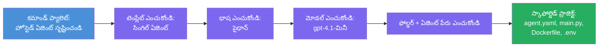

# మాడ్యూల్ 3 - కొత్త హోస్టెడ్ ఏజెంట్‌ను సృష్టించడం (Foundry విస్తరణ ద్వారా ఆటో-స్కాఫోల్డింగ్)

ఈ మాడ్యూల్‌లో, మీరు Microsoft Foundry విస్తరణను ఉపయోగించి **కొత్త [హోస్టెడ్ ఏజెంట్](https://learn.microsoft.com/azure/foundry/agents/concepts/hosted-agents) ప్రాజెక్ట్‌ను స్కాఫోల్డ్ చేస్తారు**. ఈ విస్తరణ మీ కోసం పూర్తి ప్రాజెక్ట్ నిర్మాణాన్ని సృష్టిస్తుంది - ఇందులో `agent.yaml`, `main.py`, `Dockerfile`, `requirements.txt`, `.env` ఫైల్, మరియు VS Code డిబగ్ కాన్ఫిగరేషన్ ఉంటుంది. స్కాఫోల్డింగ్ తర్వాత, మీరు మీ ఏజెంట్ సూచనలు, పరికరాలు, మరియు కాన్ఫిగరేషన్‌తో ఈ ఫైళ్లను కస్టమైజ్ చేస్తారు.

> **ప్రధాన భావన:** ఈ ప్రయోగశాలలో ఉన్న `agent/` ఫోల్డర్ Foundry విస్తరణ స్కాఫోల్డ్ కమాండ్ నడపబడినప్పుడు సృష్టించే ఉదాహరణ. మీరు ఈ ఫైლები సున్నా నుండి రాయరు - విస్తరణ వాటిని సృష్టిస్తుంది, మరియు మీరు వాటిని సవరించడం ఉంటారు.

### స్కాఫోల్డ్ విజార్డ్ ప్రక్రియ


---

## దశ 1: Create Hosted Agent విజార్డ్ తెరుచుకోండి

1. `Ctrl+Shift+P` నొక్కి **కమాండ్ పలెట్** తెరుచుకోండి.
2. టైప్ చేయండి: **Microsoft Foundry: Create a New Hosted Agent** మరియు అది ఎంచుకోండి.
3. హోస్టెడ్ ఏజెంట్ సృష్టి విజార్డ్ తెరుచుకుంటుంది.

> **వైకల్పిక మార్గం:** మీరు Microsoft Foundry సైడ్బార్ నుండి → **Agents** పక్కన ఉన్న **+** ఐకాన్ క్లిక్ చేసి లేదా రైట్-క్లిక్ చేసి **Create New Hosted Agent** ఎంపిక కూడా ఈ విజార్డ్‌కు చేరుకోవచ్చు.

---

## దశ 2: టెంప్లేట్ ఎంచుకోండి

విజార్డ్ మీకు ఒక టెంప్లేట్ ఎంచుకోవాలని అడుగుతుంది. మీరు చూడవచ్చు ఎంపికలు:

| టెంప్లేట్ | వివరణ | ఎప్పుడు ఉపయోగించాలి |
|------------|---------|----------------------|
| **Single Agent** | ఒక ఏజెంట్ దాని స్వంత మోడల్, సూచనలు మరియు ఐచ్ఛిక పరికరాలతో | ఈ వర్క్‌షాప్ (లాబ్ 01) |
| **Multi-Agent Workflow** | అనేక ఏజెంట్లు వరుసగా కలసి పనిచేస్తారు | లాబ్ 02 |

1. **Single Agent** ఎంచుకోండి.
2. **Next** క్లిక్ చేయండి (లేదా ఎంపిక ఆటోమేటిక్‌గా కొనసాగుతుంది).

---

## దశ 3: ప్రోగ్రామింగ్ భాష ఎంచుకోండి

1. **Python** ఎంచుకోండి (ఈ వర్క్‌షాప్‌కి సిఫార్సు చేయబడింది).
2. **Next** క్లిక్ చేయండి.

> **C# కూడా మద్దతు ఉన్నది** మీరు .NET ఇష్టపడితే. స్కాఫోల్డ్ నిర్మాణం సమానంగా ఉంటుంది (`main.py` స్థానంలో `Program.cs` వాడుతుంది).

---

## దశ 4: మీ మోడల్ ఎంచుకోండి

1. విజార్డ్ మీ Foundry ప్రాజెక్ట్‌లో డిప్లాయ్ చేసిన మోడల్స్ చూపిస్తుంది (మాడ్యూల్ 2 నుండి).
2. మీరు డిప్లాయ్ చేసిన మోడల్ ఎంచుకోండి - ఉదాహరణకి **gpt-4.1-mini**.
3. **Next** క్లిక్ చేయండి.

> మీరు ఏ మోడల్స్ కనబడకపోతే, తిరిగి [మాడ్యూల్ 2](02-create-foundry-project.md)కి వెళ్లి ఒకటి డిప్లాయ్ చేయండి.

---

## దశ 5: ఫోల్డర్ లొకేషన్ మరియు ఏజెంట్ పేరు ఎంపిక చేయండి

1. ఫైల్ డైలాగ్ తెరుచుకుంటుంది - ప్రాజెక్ట్ సృష్టించబడ్డ టార్గెట్ ఫోల్డర్ ఎంచుకోండి. ఈ వర్క్‌షాప్ కోసం:
   - కొత్తగా మొదలుపెడితే: ఏదైనా ఫోల్డర్ ఎంచుకోండి (ఉదా: `C:\Projects\my-agent`)
   - వర్క్‌షాప్ రిపోలో ఉంటే: `workshop/lab01-single-agent/agent/` లో కొత్త సబ్‌ఫోల్డర్ సృష్టించండి
2. హోస్టెడ్ ఏజెంట్ కోసం ఒక **పేరు** నమోదు చేయండి (ఉదా: `executive-summary-agent` లేదా `my-first-agent`).
3. **Create** క్లిక్ చేయండి (లేదా Enter నొక్కండి).

---

## దశ 6: స్కాఫోల్డింగ్ పూర్తి కావడానికి వేచి ఉండండి

1. VS Code ఒక **కొత్త విండో**లో స్కాఫోల్డ్ ప్రాజెక్ట్ తెరుస్తుంది.
2. ప్రాజెక్ట్ పూర్తి లోడ్ అయ్యే వరకు కొన్ని సెకన్లు వేచి ఉండండి.
3. ఎక్స్‌ప్లోరర్ ప్యానెల్ (`Ctrl+Shift+E`)లో ఈ క్రింది ఫైళ్లను చూడగలరు:

```
📂 my-first-agent/
├── .env                ← Environment variables (auto-generated with placeholders)
├── .vscode/
│   └── launch.json     ← Debug configuration (F5 to run + Agent Inspector)
├── agent.yaml          ← Agent definition (kind: hosted)
├── Dockerfile          ← Container configuration for deployment
├── main.py             ← Agent entry point (your main code file)
└── requirements.txt    ← Python dependencies
```

> **ఇది ఈ ప్రయోగశాలలో ఉన్న `agent/` ఫోల్డర్ నిర్మాణమే**. Foundry విస్తరణ అటోమేటిక్‌గా ఇవి సృష్టిస్తుంది - మీరు వాటిని మాన్యువల్‌గా సృష్టించాల్సిన అవసరం లేదు.

> **వర్క్‌షాప్ గమనిక**: ఈ వర్క్‌షాప్ రిపోజిటరీలో `.vscode/` ఫోల్డర్ **వర్క్‌స్పేస్ రూట్**లో ఉంటుంది (ప్రతి ప్రాజెక్ట్ లో కాదు). ఇది షేర్పు `launch.json` మరియు `tasks.json` కలిగి ఉంటుంది, రెండు డిబగ్ కాన్ఫిగరేషన్లతో - **"Lab01 - Single Agent"** మరియు **"Lab02 - Multi-Agent"** - ప్రతి ఒక సరైన లాబ్ `cwd`కు దారితీస్తుంది. మీరు F5 నొక్కినప్పుడు, మీరు పని చేస్తున్న లాబ్‌కు సరిపడే కాన్ఫిగరేషన్ డ్రాప్‌డౌన్ నుండి ఎంచుకోండి.

---

## దశ 7: ప్రతి సృష్టించిన ఫైల్‌ను అర్థం చేసుకోండి

విజార్డ్ సృష్టించిన ప్రతి ఫైల్‌ను పరిశీలించడానికి కొంత సమయం ఇవ్వండి. అవి అర్థం చేసుకోవడం మోడ్యూల్ 4 (కస్టమైజేషన్) కోసం ముఖ్యమైనది.

### 7.1 `agent.yaml` - ఏజెంట్ నిర్వచనం

`agent.yaml` ని తెరుచుకోండి. ఇది ఇలా ఉంటుందని:

```yaml
# yaml-language-server: $schema=https://raw.githubusercontent.com/microsoft/AgentSchema/refs/heads/main/schemas/v1.0/ContainerAgent.yaml

kind: hosted
name: my-first-agent
description: >
  A hosted agent deployed to Microsoft Foundry Agent Service.
metadata:
  authors:
    - Microsoft
  tags:
    - Azure AI AgentServer
    - Microsoft Agent Framework
    - Hosted Agent
protocols:
  - protocol: responses
    version: v1
environment_variables:
  - name: AZURE_AI_PROJECT_ENDPOINT
    value: ${PROJECT_ENDPOINT}
  - name: AZURE_AI_MODEL_DEPLOYMENT_NAME
    value: ${MODEL_DEPLOYMENT_NAME}
dockerfile_path: Dockerfile
resources:
  cpu: '0.25'
  memory: 0.5Gi
```

**ప్రధాన ఫీల్డ్స్:**

| ఫీల్డ్ | ఉద్దేశ్యం |
|---------|-------------|
| `kind: hosted` | ఇది హోస్టెడ్ ఏజెంట్ (కంటెయినర్ ఆధారిత, [Foundry Agent Service](https://learn.microsoft.com/azure/foundry/agents/overview)కి డిప్లాయ్ అయినది) అని ప్రకటిస్తుంది |
| `protocols: responses v1` | ఏజెంట్ OpenAI-తో అనుకూలమైన `/responses` HTTP ఎండ్‌పాయింట్‌ని ఎక్స్‌పోజ్ చేస్తుంది |
| `environment_variables` | `.env` విలువలను డిప్లాయ్‌మెంట్ సమయంలో కంటెయినర్ env వేరియబుల్స్‌గా మ్యాప్ చేస్తుంది |
| `dockerfile_path` | కంటెయినర్ ఇమేజ్ తయారుచేసేందుకు ఉపయోగించే Dockerfile ని సూచిస్తుంది |
| `resources` | కంటెయినర్ కోసం CPU మరియు మెమరీ కేటాయింపు (0.25 CPU, 0.5Gi మెమరీ) |

### 7.2 `main.py` - ఏజెంట్ ఎంట్రీ పాయింట్

`main.py` తెరుచుకోండి. ఇది మీ ఏజెంట్ లాజిక్ ఉన్న ప్రధాన Python ఫైలు. స్కాఫోల్డ్ లో ఉంది:

```python
from agent_framework.azure import AzureAIAgentClient
from azure.ai.agentserver.agentframework import from_agent_framework
from azure.identity.aio import DefaultAzureCredential
```

**ప్రధాన ఇంపోర్ట్లు:**

| ఇంపోర్ట్ | ఉద్దేశ్యం |
|----------|-------------|
| `AzureAIAgentClient` | మీ Foundry ప్రాజెక్ట్‌కి కనెక్ట్ అవుతుంది మరియు `.as_agent()` ద్వారా ఏజెంట్లను సృష్టిస్తుంది |
| [`DefaultAzureCredential`](https://learn.microsoft.com/azure/developer/python/sdk/authentication/credential-chains#defaultazurecredential-overview) | Authentication ను నిర్వహిస్తుంది (Azure CLI, VS Code సైన్-ఇన్, మేనేజ్డ్ ఐడెంటిటీ లేదా సర్వీస్ ప్రిన్సిపల్) |
| `from_agent_framework` | ఏజెంట్ను HTTP సర్వర్‌గా ర్యాప్ చేస్తుంది, ఇది `/responses` ఎండ్‌పాయింట్ ఎక్స్‌పోజ్ చేస్తుంది |

ప్రధాన ప్రవాహం:
1. క్రెడెన్షియల్ సృష్టించు → క్లయింట్ సృష్టించు → `.as_agent()` కాల్ చేసి ఏజెంట్ పొందు (అసింక్ కాన్‌టెక్స్ట్ మేనేజర్) → సర్వర్‌గా ర్యాప్ చేయి → రన్ చేయి

### 7.3 `Dockerfile` - కంటెయినర్ ఇమేజ్

```dockerfile
FROM python:3.14-slim

WORKDIR /app

COPY ./ .

RUN pip install --upgrade pip && \
    if [ -f requirements.txt ]; then \
        pip install -r requirements.txt; \
    else \
        echo "No requirements.txt found" >&2; exit 1; \
    fi

EXPOSE 8088

CMD ["python", "main.py"]
```

**ప్రధాన వివరాలు:**
- `python:3.14-slim`ను బేస్ ఇమేజ్‌గా ఉపయోగిస్తుంది.
- అన్ని ప్రాజెక్ట్ ఫైళ్లను `/app`లోకి కాపీ చేస్తుంది.
- `pip`ని అప్‌గ్రేడ్ చేస్తుంది, `requirements.txt` నుండి డిపెండెన్సీలను ఇన్స్టాల్ చేస్తుంది, ఆ ఫైల్ లేకపోతే వెంటనే విఫలమవుతుంది.
- **పోర్టు 8088ను ఎక్స్‌పోజ్ చేస్తుంది** - ఇది హోస్టెడ్ ఏజెంట్లు అవసరమైన పోర్టు. దీన్ని మార్చవద్దు.
- ఏజెంట్‌ను `python main.py` తో స్టార్ట్ చేస్తుంది.

### 7.4 `requirements.txt` - డిపెండెన్సీస్

```
agent-framework-azure-ai==1.0.0rc3
agent-framework-core==1.0.0rc3
azure-ai-agentserver-agentframework==1.0.0b16
azure-ai-agentserver-core==1.0.0b16
debugpy
agent-dev-cli
```

| ప్యాకేజ్ | ఉద్దేశ్యం |
|----------|------------|
| `agent-framework-azure-ai` | Microsoft Agent Framework కోసం Azure AI ఇంటిగ్రేషన్ |
| `agent-framework-core` | ఏజెంట్లు నిర్మించడానికి కోర్ రన్‌టైమ్ (ఫైల్‌లో `python-dotenv` కూడా ఉంటుంది) |
| `azure-ai-agentserver-agentframework` | Foundry Agent Service కోసం హోస్టెడ్ ఏజెంట్ సర్వర్ రన్‌టైమ్ |
| `azure-ai-agentserver-core` | కోర్ ఏజెంట్ సర్వర్ అబ్స్ట్రాక్షన్లు |
| `debugpy` | Python డిబగ్గింగ్ మద్దతు (VS Code లో F5 డిబగ్గింగ్‌కు అనుమతిస్తుంది) |
| `agent-dev-cli` | ఏజెంట్లు పరీక్షించడానికి లోకల్ డెవలప్‌మెంట్ CLI (డిబగ్/రన్ కాన్ఫిగరేషన్‌లో ఉపయోగిస్తుంది) |

---

## ఏజెంట్ ప్రోటోకాల్‌ను అర్థం చేసుకోవడం

హోస్టెడ్ ఏజెంట్లు **OpenAI Responses API** ప్రోటోకాల్ ద్వారా కమ్యూనికేట్ చేస్తాయి. నడుస్తున్నప్పుడు (లోకల్ లేదా క్లౌడ్‌లో), ఏజెంట్ ఒకే ఒక్క HTTP ఎండ్‌పాయింట్ ఎక్స్‌పోజ్ చేస్తుంది:

```
POST http://localhost:8088/responses
Content-Type: application/json

{
  "input": "Your prompt here",
  "stream": false
}
```

Foundry Agent Service ఈ ఎండ్‌పాయింట్‌కు యూజర్ ప్రాంప్ట్‌లు పంపుతుంది మరియు ఏజెంట్ ప్రతిస్పందనలను అందుకుంటుంది. ఇది OpenAI API ఉపయోగించే ప్రోటోకాల్‌తో సమానంగా ఉండటంతో, మీ ఏజెంట్ OpenAI Responses ఫార్మాట్ మాట్లాడే ఏ క్లయింట్‌కి అనుకూలంగా ఉంటుంది.

---

### చెక్‌పాయింట్

- [ ] స్కాఫోల్డ్ విజార్డ్ విజయవంతంగా పూర్తి అయ్యింది మరియు **కొత్త VS Code విండో** తెరుచుకుంది
- [ ] మీరు ఈ 5 ఫైళ్లన్నీ చూడగలగాలి: `agent.yaml`, `main.py`, `Dockerfile`, `requirements.txt`, `.env`
- [ ] `.vscode/launch.json` ఫైల్ ఉంది (F5 డిబగ్గింగ్‌కు అనుమతిస్తుంది - ఈ వర్క్‌షాప్‌లో ఇది వర్క్‌స్పేస్ రూట్‌లో వుంది, లాబ్ ప్రత్యేక కాన్ఫిగరేషన్లతో)
- [ ] మీరు ప్రతి ఫైల్ చదివి దాని ఉద్దేశ్యం అర్థం చేసుకున్నారు
- [ ] పోర్టు `8088` అవసరం అని, మరియు `/responses` ఎండ్‌పాయింట్ ప్రోటోకాల్ అని మీరు అర్థం చేసుకున్నారు

---

**మునుపటి:** [02 - Create Foundry Project](02-create-foundry-project.md) · **తర్వాత:** [04 - Configure & Code →](04-configure-and-code.md)

---

<!-- CO-OP TRANSLATOR DISCLAIMER START -->
**అస్పష్టత చొప్పుదల**:  
ఈ డాక్యుమెంట్ AI అనువాద సేవ [Co-op Translator](https://github.com/Azure/co-op-translator) ని ఉపయోగించి అనువదించబడింది. మనము ఖచ్చితత్వానికి ప్రయత్నించినప్పటికీ, ఆటోమేటెడ్ అనువాదాల్లో పొరపాట్లు లేదా అపరిశుద్ధతలు ఉండే అవకాశం ఉంది. అసలు డాక్యుమెంట్ స్వంత భాషలో ఉన్నది అధికారిక మూలంగా పరిగణించాలి. ముఖ్యమైన సమాచారం కోసం, ప్రొఫెషనల్ మానవ అనువాదం చేయించుకోవడం మంచిది. ఈ అనువాదం వలన ఏర్పడే ఏవైనా అపదర్శనలు లేదా తప్పు అర్ధం చేసుకోవడంపై మేము బాధ్యత వహించము.
<!-- CO-OP TRANSLATOR DISCLAIMER END -->