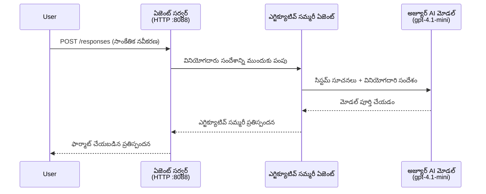
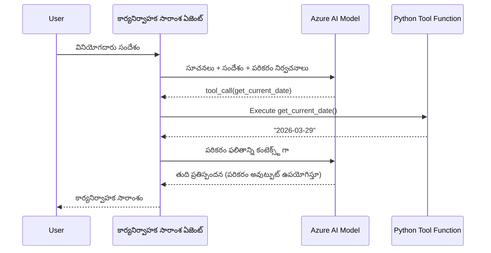

# మాడ్యూల్ 4 - సూచనలను, వాతావరణాన్ని మరియు ఆధారాలను అమర్చడం

ఈ మాడ్యూల్‌లో, మీరు మాడ్యూల్ 3 నుండి ఆటో-స్కాఫోల్డ్ చేసిన ఏజెంట్ ఫైళ్ళను అనుకూలీకరిస్తారు. ఇక్కడే మీరు సాధారణ స్కాఫోల్డ్‌ను **మీ** ఏజెంట్‌గా మార్చుతారు - సూచనలు వ్రాస్తూ, వాతావరణ వేరియబుల్స్ సెట్ చేసుకుంటూ, ఐచ్ఛికంగా టూల్స్ జత చేస్తూ, ఆధారాలను ఇన్స్టాల్ చేస్తూ.

> **గమనిక:** Foundry విస్తరణ మీ ప్రాజెక్ట్ ఫైళ్ళను ఆటోమేటిక్ గా సృష్టించింది. ఇప్పుడు మీరు వాటిని మార్చబోతున్నారు. పూర్తి అనుకూలీకరించిన ఏజెంట్ ఉదాహరణ కోసం [`agent/`](../../../../../workshop/lab01-single-agent/agent) ఫోల్డర్‌ను చూడండి.

---

## భాగాలు ఎలా కలసి పనిచేస్తాయి

### అభ్యర్థన జీవచక్రం (ఒకే ఏజెంట్)


> **టూల్స్ ఉన్నప్పుడు:** ఏజెంట్ టూల్స్ ని నమోదు చేస్తున్నట్లయితే, మోడల్ నేరుగా పూర్తి చేయకుండుండా టూల్-కాల్‌ను ఇచ్చే అవకాశం ఉంది. ఫ్రేమ్‌వర్క్ టూల్‌ను లోకల్‌గా అమలు చేసి, ఫలితాన్ని మోడల్‌కు తిరిగి ఇస్తుంది, తద్వారా మోడల్ తుది ప్రతిస్పందనను తయారుచేస్తుంది.


---

## దశ 1: వాతావరణ వేరియబుల్స్‌ను కాన్ఫిగర్ చేయడం

స్కాఫోల్డ్ ఒక `.env` ఫైల్‌ను ప్లేస్‌హోల్డర్ విలువలతో సృష్టించింది. మీరు మాడ్యూల్ 2 నుండి వాస్తవ విలువలను పూరించాలి.

1. మీ స్కాఫోల్డ్ చేసిన ప్రాజెక్ట్‌లో, **`.env`** ఫైల్ (ప్రాజెక్ట్ రూట్‌లో ఉంటుంది)ని తెరవండి.
2. ప్లేస్‌హోల్డర్ విలువలను మీ నిజమైన Foundry ప్రాజెక్ట్ వివరాల‌తో మార్చండి:

   ```env
   PROJECT_ENDPOINT=https://<your-account>.services.ai.azure.com/api/projects/<your-project>
   MODEL_DEPLOYMENT_NAME=gpt-4.1-mini
   ```

3. ఫైల్‌ని సేవ్ చేయండి.

### ఈ విలువలు ఎక్కడ కనుగొనాలి

| విలువ | ఎలా కనుగొనాలి |
|-------|---------------|
| **ప్రాజెక్ట్ ఎండ్‌పాయింట్** | VS Code లో **Microsoft Foundry** సైడ్బార్ తెరిచి → మీ ప్రాజెక్ట్‌పై క్లిక్ చేయండి → డీటెయిల్ వ్యూ లో ఎండ్‌పాయింట్ URL చూపబడుతుంది. ఇది ఇలా కనిపిస్తుంది: `https://<account-name>.services.ai.azure.com/api/projects/<project-name>` |
| **మోడల్ డిప్లాయ్‌మెంట్ పేరు** | Foundry సైడ్బార్‌లో, మీ ప్రాజెక్ట్‌ని విస్తరిస్తే → **Models + endpoints** క్రింద → మోడల్ పేరు, ఉదా: `gpt-4.1-mini` అందులో ఉంటుంది |

> **సెక్యూరిటీ:** `.env` ఫైల్‌ను వెర్షన్ కంట్రోల్ కు ప్రత్యక్షంగా కమిట్ చేయకండి. అది డిఫాల్ట్ గా `.gitignore` లో చేర్చబడింది. మీరు మర్చిపోయినట్లయితే, చేర్చండి:
> ```
> .env
> ```

### వాతావరణ వేరియబుల్స్ ఎలా ప్రవహిస్తాయి

మాప్ చైన్ ఈ విధంగా ఉంటుంది: `.env` → `main.py` (os.getenv ద్వారా చదవబడుతుంది) → `agent.yaml` (డిప్లాయ్ సమయంలో కంటైనర్ వాతావరణ వేరియబుల్స్‌కి మ్యాప్ చేస్తుంది).

`main.py`లో స్కాఫోల్డ్ ఈ విలువలను ఇలా చదవుతుంది:

```python
PROJECT_ENDPOINT = os.getenv("AZURE_AI_PROJECT_ENDPOINT") or os.getenv("PROJECT_ENDPOINT")
MODEL_DEPLOYMENT_NAME = os.getenv("AZURE_AI_MODEL_DEPLOYMENT_NAME", os.getenv("MODEL_DEPLOYMENT_NAME", "gpt-4.1-mini"))
```

`AZURE_AI_PROJECT_ENDPOINT` మరియు `PROJECT_ENDPOINT` రెండింటినీ అంగీకరిస్తుంది (`agent.yaml`లో `AZURE_AI_*` ప్రిఫిక్స్ ని ఉపయోగిస్తారు).

---

## దశ 2: ఏజెంట్ సూచనలను రాయడం

ఇది అత్యంత ముఖ్యమైన అనుకూలీకరణ దశ. సూచన‌లు మీ ఏజెంట్ వ్యక్తిత్వం, ప్రవర్తన, అవుట్‌పుట్ ఫార్మాట్, మరియు భద్రత నియమాలను నిర్వచిస్తాయి.

1. మీ ప్రాజెక్ట్‌లో `main.py` ని తెరవండి.
2. సూచనల స్ట్రింగ్‌ను కనుగొనండి (స్కాఫోల్డ్ లో డిఫాల్ట్/సాధారణ సూచన ఉంటుంది).
3. దాన్ని వివరమైన, నిర్మిత సూచనలతో మార్చండి.

### మంచి సూచనల్లో ఉండవలసిన అంశాలు

| భాగం | లక్ష్యం | ఉదాహరణ |
|-------|---------|---------|
| **పాత్ర** | ఏజెంట్ ఎవరిండి మరియు ఏం చేస్తుంది | "మీరు ఒక ఎగ్జిక్యూటివ్ సమ్మరీ ఏజెంట్" |
| **ఆడియన్స్** | సమాధానాలు ఎవరికోసం | "సాంకేతిక నేపథ్యం తక్కువ ఉన్న సీనియర్ లీడర్లు" |
| **ఇన్‌పుట్ నిర్వచనం** | ఏ రకమైన ప్రాంప్ట్‌లు నిర్వహిస్తుంది | "సాంకేతిక ప్రమాద నివేదికలు, ఆపరేషనల్ నవీకరణలు" |
| **అవుట్‌పుట్ ఫార్మాట్** | సమాధానాల ఖచ్చితమైన నిర్మాణం | "ఎగ్జిక్యూటివ్ సమ్మరీ: - ఏమైంది: ... - వ్యాపార ప్రభావం: ... - తదుపరి దశ: ..." |
| **నియమాలు** | పరిమితులు మరియు తిరస్కరణ పరిస్థితులు | "ఇచ్చిన సమాచారానికి మించి ఏమైనా జోడించవద్దు" |
| **భద్రత** | దుర్వినియోగం మరియు హలుసినేషన్ నివారణ | "ఇన్‌పుట్ అస్పష్టంగా ఉంటే, స్పష్టత కోసం అడగండి" |
| **ఉదాహరణలు** | ప్రవర్తనను మార్గదర్శకం చేసే ఇన్‌పుట్/ఆవుట్‌పుట్ జోడింపులు | వేరే ఇన్‌పుట్‌లతో 2-3 ఉదాహరణలు ఇవ్వండి |

### ఉదాహరణ: ఎగ్జిక్యూటివ్ సమ్మరీ ఏజెంట్ సూచనలు

వర్క్షాప్ లోని [`agent/main.py`](../../../../../workshop/lab01-single-agent/agent/main.py) లో ఉపయోగించిన సూచనలు ఇక్కడ ఉన్నాయి:

```python
AGENT_INSTRUCTIONS = """You are an "Explain Like I'm an Executive" agent.

Purpose:
Your job is to translate complex technical or operational information into
clear, concise, and outcome-focused summaries that can be easily understood
by non-technical executives.

Audience:
Senior leaders with limited technical background who care about impact,
risk, and what happens next.

What you must do:
- Rephrase the input so it is understandable to a non-technical audience
- Prioritize clarity, brevity, and outcomes over technical accuracy
- Remove technical jargon, logs, metrics, stack traces, and deep root-cause details
- Translate technical causes into simple cause-and-effect statements
- Explicitly call out business impact
- Always include a clear next step or action
- Maintain a neutral, factual, and calm executive tone
- Do NOT add new facts or speculate beyond the input

Standard Output Structure (always use this wording):

Executive Summary:
- What happened: <plain-language description>
- Business impact: <clear, non-technical impact>
- Next step: <clear action or mitigation>

Rules:
- Keep responses under 100 words
- Do NOT add facts beyond the input
- If input is unclear, ask for clarification
"""
```

4. `main.py` లో ఉన్న సూచనల స్ట్రింగ్‌ను మీ అనుకూల సూచనలతో మార్చండి.
5. ఫైల్‌ని సేవ్ చేయండి.

---

## దశ 3: (ఐచ్ఛికం) అనుకూల టూల్స్ జోడించడం

హోస్టెడ్ ఏజెంట్లు **లోకల్ పైథాన్ ఫంక్షన్స్** ని [టూల్స్](https://learn.microsoft.com/azure/foundry/agents/concepts/tool-catalog)గా అమలు చేయొచ్చు. ఇది కోడ్-ఆధారిత హోస్టెడ్ ఏజెంట్లకు ప్రాంప్ట్-ఒన్లీ ఏజెంట్లపై ప్రధాన లాభం - మీరు సర్వర్-వైపు లోజిక్‌ను అమలు చేయొచ్చు.

### 3.1 టూల్ ఫంక్షన్ నిర్వచించండి

`main.py` లో టూల్ ఫంక్షన్ చేర్చండి:

```python
from agent_framework import tool

@tool
def get_current_date() -> str:
    """Returns the current date in YYYY-MM-DD format."""
    from datetime import date
    return str(date.today())
```

`@tool` డెకొరేటర్ ఒక సాధారణ పైథాన్ ఫంక్షన్‌ను ఏజెంట్ టూల్‌గా మార్చుతుంది. డాక్స్ట్రింగ్ మోడల్ చూస్తుంది టూల్ వివరణగా మారుతుంది.

### 3.2 ఏజెంట్‌తో టూల్‌ను నమోదు చేయండి

`.as_agent()` కాంటెక్స్‌ట్ మేనేజర్ ద్వారా ఏజెంట్ సృష్టించినప్పుడు, `tools` పారామీటర్‌లో టూల్‌ను ఇవ్వండి:

```python
async with AzureAIAgentClient(
    project_endpoint=PROJECT_ENDPOINT,
    model_deployment_name=MODEL_DEPLOYMENT_NAME,
    credential=credential,
).as_agent(
    name="my-agent",
    instructions=AGENT_INSTRUCTIONS,
    tools=[get_current_date],
) as agent:
    server = from_agent_framework(agent)
    await server.run_async()
```

### 3.3 టూల్ కాల్స్ ఎలా పనిచేస్తాయి

1. యూజర్ ఒక ప్రాంప్ట్ పంపుతాడు.
2. మోడల్ టూల్ అవసరమో కాదో నిర్ణయిస్తుంది (ప్రాంప్ట్, సూచనలు, టూల్ వివరణల ఆధారంగా).
3. ఆ అవసరం ఉన్నట్లయితే, ఫ్రేమ్‌వర్క్ లోకల్‌గా మీ పైథాన్ ఫంక్షన్‌ను (కంటైనర్ లో) కాల్ చేస్తుంది.
4. టూల్ తిరిగి పంపిన విలువ మోడల్‌కు కాంటెక్స్ట్‌గా పంపబడుతుంది.
5. మోడల్ తుది ప్రతిస్పందనను తయారుచేస్తుంది.

> **టూల్స్ సర్వర్-వైపు అమలవుతాయి** - అవి మీ కంటైనర్‌లో నడుస్తాయి, యూజర్ బ్రౌజర్ లేదా మోడల్ లో కాదు. అంటే మీరు డేటాబేసులు, APIs, ఫైల్ సిస్టమ్స్, లేదా ఏ పైథాన్ లైబ్రరీ అయినా యాక్సెస్ చేయొచ్చు.

---

## దశ 4: వర్చువల్ వాతావరణం సృష్టించండి మరియు యాక్టివేట్ చేయండి

ఆధారాలను ఇన్స్టాల్ చేయక ముందుగా, వేరు Python వాతావరణాన్ని సృష్టించండి.

### 4.1 వర్చువల్ వాతావరణం సృష్టించడం

VS Code terminal (`` Ctrl+` ``) లో ఈ కమాండ్ అద్దండి:

```powershell
python -m venv .venv
```

ఇది మీ ప్రాజెక్ట్ డైరెక్టరీలో `.venv` ఫోల్డర్‌ను సృష్టిస్తుంది.

### 4.2 వర్చువల్ వాతావరణాన్ని యాక్టివేట్ చేయండి

**PowerShell (Windows):**

```powershell
.\.venv\Scripts\Activate.ps1
```

**కమాండ్ ప్రాంప్ట్ (Windows):**

```cmd
.venv\Scripts\activate.bat
```

**macOS/Linux (బాష్):**

```bash
source .venv/bin/activate
```

టెర్మినల్ ప్రాంప్ట్ ప్రారంభంలో `(.venv)` కనిపించాలి, అంటే వర్చువల్ వాతావరణం యాక్టివ్ అయింది.

### 4.3 ఆధారాలను ఇన్స్టాల్ చేయండి

వర్చువల్ వాతావరణం యాక్టివ్ ఉన్నప్పుడు, అవసరమైన ప్యాకేజీలు ఇన్స్టాల్ చేయండి:

```powershell
pip install -r requirements.txt
```

ఇవి ఇన్స్టాల్ అవుతాయి:

| ప్యాకేజ్ | ఉపయోగం |
|---------|---------|
| `agent-framework-azure-ai==1.0.0rc3` | [Microsoft Agent Framework](https://learn.microsoft.com/agent-framework/overview/) కోసం Azure AI ఇంటిగ్రేషన్ |
| `agent-framework-core==1.0.0rc3` | ఏజెంట్లు సృష్టించే కోర్ రన్‌టైమ్ (`python-dotenv` సహా) |
| `azure-ai-agentserver-agentframework==1.0.0b16` | [Foundry Agent Service](https://learn.microsoft.com/azure/foundry/agents/overview) కోసం హోస్టెడ్ ఏజెంట్ సర్వర్ రన్‌టైమ్ |
| `azure-ai-agentserver-core==1.0.0b16` | కోర్ ఏజెంట్ సర్వర్ ఎబ్స్ట్రాక్షన్స్ |
| `debugpy` | Python డీబగ్గింగ్ (VS Code లో F5 డీబగ్గింగ్ సాధ్యం) |
| `agent-dev-cli` | ఏజెంట్లను టెస్టింగ్ కోసం లోకల్ డెవలప్‌మెంట్ CLI |

### 4.4 ఇన్స్టాలేషన్‌ను పరిశీలించండి

```powershell
pip list | Select-String "agent-framework|agentserver"
```

అంచనా ఫలితం:
```
agent-framework-azure-ai   1.0.0rc3
agent-framework-core       1.0.0rc3
azure-ai-agentserver-agentframework 1.0.0b16
azure-ai-agentserver-core  1.0.0b16
```

---

## దశ 5: ఆథెంటికేషన్‌ను నిర్ధారించుకోండి

ఏజెంట్ [`DefaultAzureCredential`](https://learn.microsoft.com/azure/developer/python/sdk/authentication/credential-chains#defaultazurecredential-overview) ఉపయోగిస్తుంది, ఇది ఈ వరుసలో ఆథెంటికేషన్ పద్ధతులను ప్రయత్నిస్తుంది:

1. **వాతావరణ వేరియబుల్స్** - `AZURE_CLIENT_ID`, `AZURE_TENANT_ID`, `AZURE_CLIENT_SECRET` (సర్విస్ ప్రిన్సిపల్)
2. **Azure CLI** - మీ `az login` సెషన్‌ను పికప్ చేస్తుంది
3. **VS Code** - మీరు VS Code లో సైన్-ఇన్ అయిన అకౌంటును ఉపయోగిస్తుంది
4. **Managed Identity** - Azure లో (డిప్లాయ్ సమయంలో) నడిచేటప్పుడు ఉపయోగించడం

### 5.1 లోకల్ డెవలప్‌మెంట్ కోసం నిర్ధారించుకోండి

కనీసం ఒకటి పనిచేయాలి:

**ఎంపిక A: Azure CLI (సిఫార్సు చేయబడింది)**

```powershell
az account show --query "{name:name, id:id}" --output table
```

అంచనా: మీ సబ్‌స్క్రిప్షన్ పేరు మరియు ID చూపబడుతుంది.

**ఎంపిక B: VS Code సైన్-ఇన్**

1. VS Code దిగువ ఎడమ మూలలో **Accounts** ఐకాన్ చూడండి.
2. మీ అకౌంట్ పేరు కనిపిస్తే, మీరు ఆథెంటికేటెడ్ ఉన్నారు.
3. లేదంటే, ఐకాన్‌పై క్లిక్ చేసి → **Sign in to use Microsoft Foundry** ఎంచుకోండి.

**ఎంపిక C: సర్విస్ ప్రిన్సిపల్ (CI/CD కోసం)**

```powershell
$env:AZURE_TENANT_ID = "<your-tenant-id>"
$env:AZURE_CLIENT_ID = "<your-client-id>"
$env:AZURE_CLIENT_SECRET = "<your-client-secret>"
```

### 5.2 సాధారణ ఆథ్ సమస్య

మీరు బహుళ Azure అకౌంట్ల లో సైన్-ఇన్ అయితే, సరైన సబ్‌స్క్రిప్షన్ ఎంచుకున్నట్లు నిర్ధారించుకోండి:

```powershell
az account set --subscription "<your-subscription-id>"
```

---

### చెక్‌పాయింట్

- [ ] `.env` ఫైల్ లో సరైన `PROJECT_ENDPOINT` మరియు `MODEL_DEPLOYMENT_NAME` సెట్ చేసుకున్నారు (ప్లేస్‌హోల్డర్లు కాదు)
- [ ] ఏజెంట్ సూచనలు `main.py` లో అనుకూలీకరించినవి - పాత్ర, ఆడియన్స్, అవుట్‌పుట్ ఫార్మట్, నియమాలు, భద్రత నియమాలు నిర్వచించబడ్డాయి
- [ ] (ఐచ్ఛికం) అనుకూల టూల్స్ నిర్వచించి, నమోదు చేసుకున్నారు
- [ ] వర్చువల్ వాతావరణం సృష్టించి, యాక్టివేట్ చేసుకున్నారు (`(.venv)` టెర్మినల్‌లో కనపడుతోంది)
- [ ] `pip install -r requirements.txt` తప్పులేమీ లేకుండా పూర్తి అయింది
- [ ] `pip list | Select-String "azure-ai-agentserver"` ప్యాకేజీ ఇన్స్టాల్ అయిందని చూపిస్తుంది
- [ ] ఆథెంటికేషన్ సరైనది - `az account show` మీ సబ్‌స్క్రిప్షన్ చూపిస్తుంది లేదా మీరు VS Code లో సైన్-ఇన్ అయినారు

---

**మునుపటి:** [03 - హోస్టెడ్ ఏజెంట్ సృష్టించండి](03-create-hosted-agent.md) · **తరువాత:** [05 - లోకల్‌లో పరీక్షించండి →](05-test-locally.md)

---

<!-- CO-OP TRANSLATOR DISCLAIMER START -->
**ప్రతిపాదన**:  
ఈ డాక్యుమెంట్ [Co-op Translator](https://github.com/Azure/co-op-translator) అనే AI అనువాద సేవ ఉపయోగించి అనువదించబడింది. మనం ఖచ్చితత్వానికి ప్రయత్నిస్తున్నప్పటికీ, ఆటోమేటిక్ అనువాదాలలో పొరపాట్లు లేదా తప్పులు ఉండవచ్చు అని దయచేసి గమనించండి. ఒరిజినల్ డాక్యుమెంట్ స్థానిక భాషలో ఉన్నది అధికారిక మూలంగా పరిగణించాలి. కీలక సమాచారానికి, ప్రొఫెషనల్ మానవ అనువాదాన్ని సిఫార్సు చేస్తాము. ఈ అనువాదం వాడుక ద్వారా వచ్చిన ఏదైనా తప్పుదోయలు లేదా అభిప్రాయ భేదాల కోసం మేము బాధ్యత వహించము.
<!-- CO-OP TRANSLATOR DISCLAIMER END -->