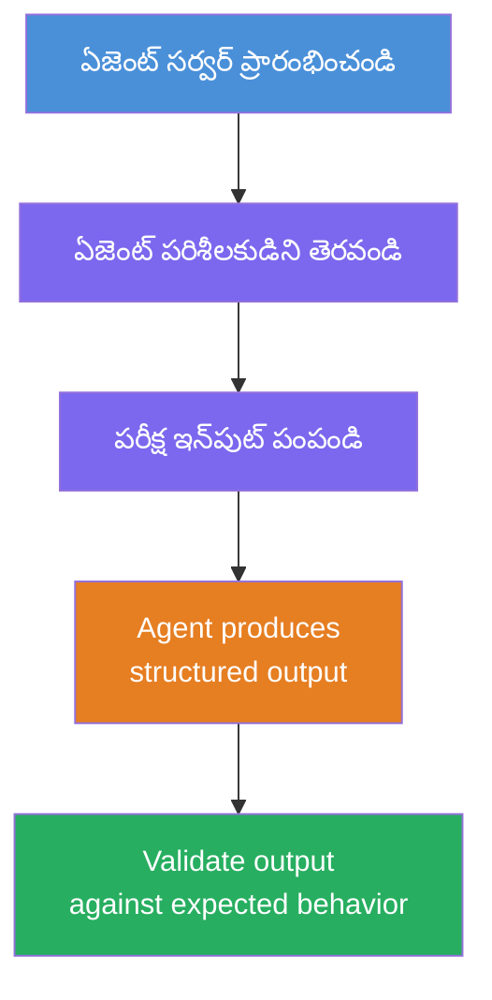
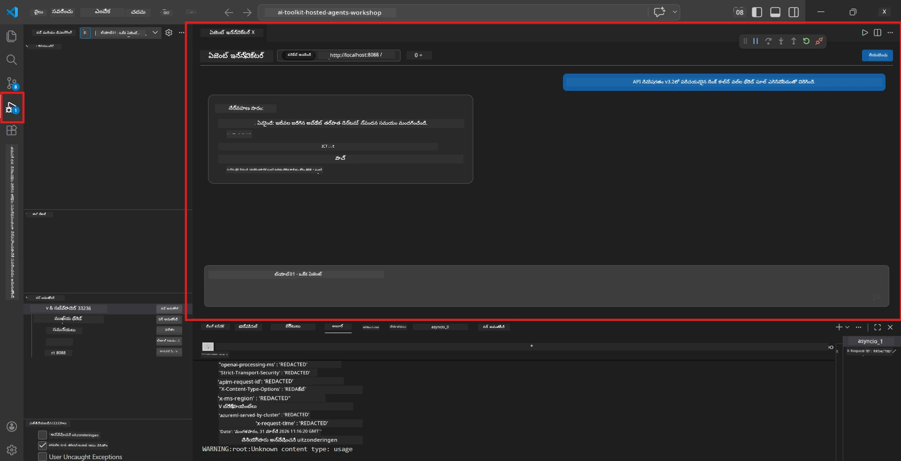
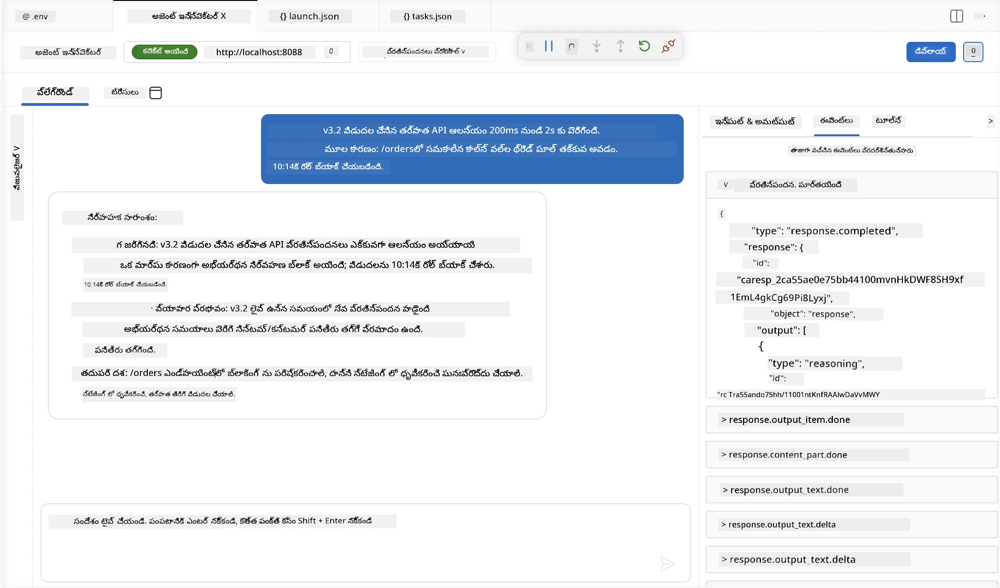

# మాడ్యూల్ 4 - లోకల్‌గా పరీక్షించండి

⏱️ ~10 నిమిషాలు

ఈ మాడ్యూల్‌లో, మీరు మీ ఏజెంట్‌ను లోకల్‌గా నడిపించి, అది సరిగ్గా పనిచేస్తుందో లేదో **హ్యాపీ-పాత్ ఫంక్షనల్ టెస్టులు** ఉపయోగించి ధృవీకరించండి. ఏజెంట్ ఇన్స్పెక్టర్ (విజువల్ UI) లేదా డైరెక్ట్ HTTP కాల్స్ ఉపయోగించి ఏజెంట్ స్థాపిత, సరిగ్గా ఉన్న ప్రతిస్పందనలు ఉత్పత్తి చేస్తున్నదో లేదో నిర్ధారించుకుంటారు.

### లోకల్ పరీక్షా ప్రవాహం



---

## ఎంపిక 1: F5 నొక్కండి - ఏజెంట్ ఇన్స్పెక్టర్ తో డీబగ్ చేయండి (సిఫార్సు చేయబడింది)

### డీబగ్గర్ ప్రారంభించండి

1. **executive-summary-agent/** ఫోల్డర్‌ను నేరుగా VS కోడ్‌లో తెరవండి (`File → Open Folder`).
2. **Run and Debug** ప్యానెల్‌ను తెరవండి (`Ctrl+Shift+D`).
3. డ్రాప్‌డౌన్ నుండి **Debug Local Agent Server**ను ఎంచుకోండి.
4. **F5** నొక్కండి (లేదా ▶ Start Debugging లో క్లిక్ చేయండి).

> ⚠️ **గురుత్వంకరం: మీ Python ఇంటర్ప్రెటర్ ఎంచుకోండి**
> మీరు "ModuleNotFoundError" పొందితే లేదా డీబగ్గర్ ప్రారంభించలేకపోతే, VS కోడ్‌ను మీ వర్చువల్ ఎన్విరాన్మెంట్ ఉపయోగించమని చెప్పాలి:
  > 1. `Ctrl+Shift+P` నొక్కి **Python: Select Interpreter** టైప్ చేయండి.
  > 2. మీ ప్రాజెక్ట్ యొక్క `.venv` ఫోల్డర్‌లో ఉన్న ఇంటర్ప్రెటర్‌ను ఎంచుకోండి (ఉదాహరణకి, Windowsలో `.\.venv\Scripts\python.exe`).
  > 3. డీబగ్ సెషన్‌ను పునఃప్రారంభించండి.
> ఇంకా తప్పిదాలు వస్తున్నால், మీ `tasks.json` ఫైలును క్రింది విధంగా మానవీయంగా అప్డేట్ చేయండి:
  > 1. `.vscode/tasks.json` ఫైలుకు వెళ్లండి
  > 2. `Run Agent/Workflow HTTP Server` అని లేబుల్ చేసిన క‌మాండ్‌ వద్దికి వెళ్లండి
  > 3. క‌మాండ్ విలువ‌ను ఈ విధంగా మార్చండి: `"value": "${workspaceFolder}/.venv/bin/python",`

### ఏమి జరుగుతుంది

1. HTTP సర్వర్ `http://localhost:8088/responses` పై ప్రారంభమవుతుంది.
2. **ఏజెంట్ ఇన్స్పెక్టర్** ప్యానెల్ ఆటోమేటిక్‌గా తెరుస్తుంది - టెస్టింగ్ కోసం ఒక విజువల్ చాట్ ఇంటర్‌ఫేస్.
3. `main.py` లో బ్రేక్‌పాయింట్లు ఎనేబుల్ చేయబడ్డాయి.

టెర్మినల్‌ను పరిశీలించండి:
```
Starting executive summary hosted agent
Executive agent server running on http://localhost:8088
```

> **ఏజెంట్ ఇన్స్పెక్టర్ తెరుచుకోకపోతే:** `Ctrl+Shift+P` నొక్కి → **Foundry Toolkit: Open Agent Inspector** ఎంచుకోండి.



> *స్క్రీన్‌షాట్ ఒక పాత ఎక్స్‌టెన్షన్ వెర్షన్ నుండి 'AI TOOLKIT' బ్రాండింగ్ చూపించవచ్చు.*

---

## ఎంపిక 2: టెర్మినల్ ద్వారా పరీక్షించండి (వికల్పం)

ఒక టెర్మినల్లో ఏజెంట్‌ను ప్రారంభించి, మరొకటి నుండి అభ్యర్థనలు పంపండి:

```bash
# టెర్మినల్ 1: ఏజెంట్ ప్రారంభించండి
cd executive-summary-agent/
source .venv/bin/activate
python main.py
```

```bash
# టెర్మినల్ 2: పరీక్ష పంపండి (కర్ల్)
curl -sS -X POST http://localhost:8088/responses \
  -H "Content-Type: application/json" \
  -d '{"input": "The API latency increased due to thread pool exhaustion caused by sync calls in v3.2.", "stream": false}'
```

---

## దృఢీకరణ పరీక్షలు: హ్యాపీ-పాత్ ఫంక్షనల్ ధృవీకరణ

క్రింది **మూడు** సన్నివేశాలను నిర్వహించండి. ఇవి మీ ఏజెంట్ వాస్తవిక ఇన్‌పుట్స్‌కు సరైన, నిర్మిత అవుట్‌పుట్ ఉత్పత్తి చేస్తున్నదని ధృవీకరిస్తాయి.



### సన్నివేశం 1: IT ఇన్సిడెంట్ - API ప్రామాణికత చెంప

**ఇన్‌풚ట్:**
```
The API latency increased from 200ms to 2s after deploying v3.2.
Root cause: thread pool starvation from synchronous calls in /orders.
Rolled back at 10:14.
```

**ఎక్స్‌పెక్టెడ్ ప్రవర్తన:**
- ✅ "Executive Summary" నిర్మాణం (ఎప్పుడు / వ్యాపార ప్రభావం / తదుపరి చర్య) పాటిస్తుంది
- ✅ సాంకేతిక భాష ఉపయోగించదు ("thread pool", "/orders", "v3.2" లేవు)
- ✅ స్పష్టంగా వ్యాపార ప్రభావాన్ని వివరించాలి (ఉదాహరణకి, వినియోగదారులు ఆలస్యం అనుభవించారు)
- ✅ తదుపరి చర్య సూచిస్తుంది (ఉదా: సరిదిద్దబడింది, పర్యవేక్షణ ఉంది)

---

### సన్నివేశం 2: డేటా పైప్లైన్ - ETL వైఫల్యం

**ఇన్‌పుట్:**
```
The nightly ETL job failed because the upstream schema changed. APAC dashboards show missing data.
```

**ఎక్స్‌పెక్టెడ్ ప్రవర్తన:**
- ✅ డేటా రిఫ్రెష్ విఫలం సాదా భాషలో వివరించడం
- ✅ APAC డాష్‌బోర్డ్ ప్రభావాన్ని పొందికగా సూచించడం
- ✅ పరిష్కార చర్యను కూడా చేర్చడం
- ✅ "ETL", "schema" లేదా ఇతర సాంకేతిక పదాలను చేర్చకూడదు

---

### సన్నివేశం 3: భద్రత - ప్రతిభావంతుడైన సర్టిఫికెట్

**ఇన్‌పుట్:**
```
Static analysis flagged a hardcoded secret in the repository.
The secret may have been exposed in commit history.
```

**ఎక్స్‌పెక్టెడ్ ప్రవర్తన:**
- ✅ సర్టిఫికెట్/భద్రత సమస్యను నాయకత్వానికి అనుకూలమైన భాషలో వివరించడం
- ✅ సమభావ్య ప్రమాదాన్ని పిలుస్తుంది (అనధికార ప్రాప్తి)
- ✅ పరిష్కార చర్యను పేర్కొంటుంది (సర్టిఫికెట్ రోటేషన్, ఆడిట్)
- ✅ "static analysis", "commit history", "hardcoded" వంటి పదాలను చేర్చకూడదు

---

## ధృవీకరణ ప్రమాణాలు

ప్రతి సన్నివేశం కోసం, వీటిని పరిశీలించండి:

| # | ప్రమాణం | పాస్తిరకం పరిస్థితి |
|---|----------|---------------|
| 1 | **నిర్మాణం** | ప్రతిస్పందన "Executive Summary" ఫార్మాట్‌తో అన్ని మూడు బుల్లెట్లు ఉంటాయి |
| 2 | **సాదా భాష** | నాయకులు అర్ధం చేసుకోలేని సాంకేతిక పదజాలం లేదు |
| 3 | **సమీకరణం** | సారాంశం ఇన్‌పుట్‌కి అనుగుణంగా ఉంటుంది - కల్పిత వివరాలు లేవు |
| 4 | **సంక్షిప్తం** | ప్రతిస్పందన 100 పదాల కంటే తక్కువగా ఉంటుంది |
| 5 | **తదుపరి చర్య** | స్పష్టమైన చర్య లేదా పరిష్కారం పేర్కొనబడింది |

---

## డీబగ్గింగ్ సూచనలు

| సమస్య | పరిష్కారం |
|-------|-----|
| ఏజెంట్ ప్రారంభం కాదు | `.env` విలువలు చెక్ చేయండి, వీవిఎన్ ప్రారంభించబడిందో చూడండి, `pip install -r requirements.txt` నడపండి |
| ఖాళీ లేదా సాధారణ ప్రతిస్పందన | `main.py` లో సూచనలను పరిశీలించండి - అవుట్‌పుట్ ఫార్మాట్ నిర్దిష్టంగా చెప్పబడినదేనా చూడండి |
| ప్రతిస్పందనలో జార్గన్ ఉంది | సూచనలలో "సాంకేతిక పదజాలం తొలగించు" నియమాలను బలోపేతం చేయండి |
| ఏజెంట్ ఇన్స్పెక్టర్ తెరుచుకోరాదు | `Ctrl+Shift+P` → **Foundry Toolkit: Open Agent Inspector** |
| టెర్మినల్‌లో మోడల్ లోపాలు | `AZURE_AI_MODEL_DEPLOYMENT_NAME` ఖచ్చితంగా సరిపోలుతుందో చూడండి (కేస్-సెన్సిటీవ్) |

---

### ✅ చెక్పాయింట్

- [ ] ఏజెంట్ లోకల్‌గా తప్పుల్లు లేకుండా ప్రారంభమవుతుంది
- [ ] ఏజెంట్ ఇన్స్పెక్టర్ తెరుచుకొని చాట్ ఇంటర్‌ఫేస్ చూపిస్తుంది (F5 ఉపయోగిస్తే)
- [ ] **సన్నివేశం 1** (IT ఇన్సిడెంట్) - నిర్మిత Executive Summary, జార్గన్ లేదు
- [ ] **సన్నివేశం 2** (డేటా పైప్లైన్) - సంబంధిత సారాంశం మరియు వ్యాపార ప్రభావం
- [ ] **సన్నివేశం 3** (భద్రత అలర్ట్) - సరైన ప్రమాద కమ్యూనికేషన్
- [ ] అన్ని ప్రతిస్పందనలు నిర్వచించిన అవుట్‌పుట్ నిర్మాణాన్ని అనుసరిస్తాయి

> **మీ ప్రతిస్పందనలను సేవ్ చేసుకోండి** (కాపీ లేదా స్క్రీన్‌షాట్ తీసుకోండి) - మీరు వాటిని మాడ్యూల్ 06లో క్లౌడ్ ఫలితాలతో పోల్చుతారు.

---

**మునుపటి:** [03 - Configure & Code](03-configure-and-code.md) · **తదుపరి:** [05 - Deploy to Foundry →](05-deploy-to-foundry.md)

---

<!-- CO-OP TRANSLATOR DISCLAIMER START -->
**అస్వీకరణ**:
ఈ పత్రం AI అనువాద సేవ [Co-op Translator](https://github.com/Azure/co-op-translator) ఉపయోగించి అనువదించబడింది. మేము ఖచ్చితత్వానికి ప్రయత్నిస్తున్నప్పటికీ, ఆటోమేటెడ్ అనువాదాలు తప్పులు లేదా అసమగ్రతలను కలిగి ఉండవచ్చు. దాని స్వదేశ భాషలో ఉన్న అసలు పత్రాన్ని అధికారం కలిగిన మూలంగా పరిగణించాలి. కీలకమైన సమాచారం కోసం, ప్రొఫెషనల్ మానవ అనువాదాన్ని సిఫారసు చేస్తాము. ఈ అనువాదం ఉపయోగం వల్ల కలిగే ఏవైనా అపార్థాలు లేదా తప్పుదారులు కోసం మేము బాధ్యత వహించము.
<!-- CO-OP TRANSLATOR DISCLAIMER END -->