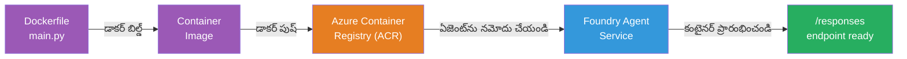
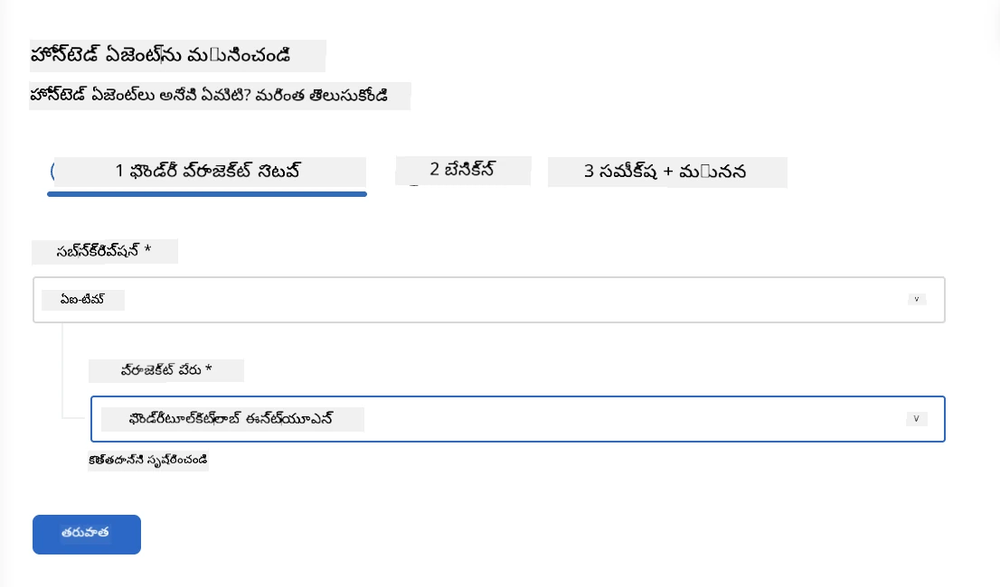
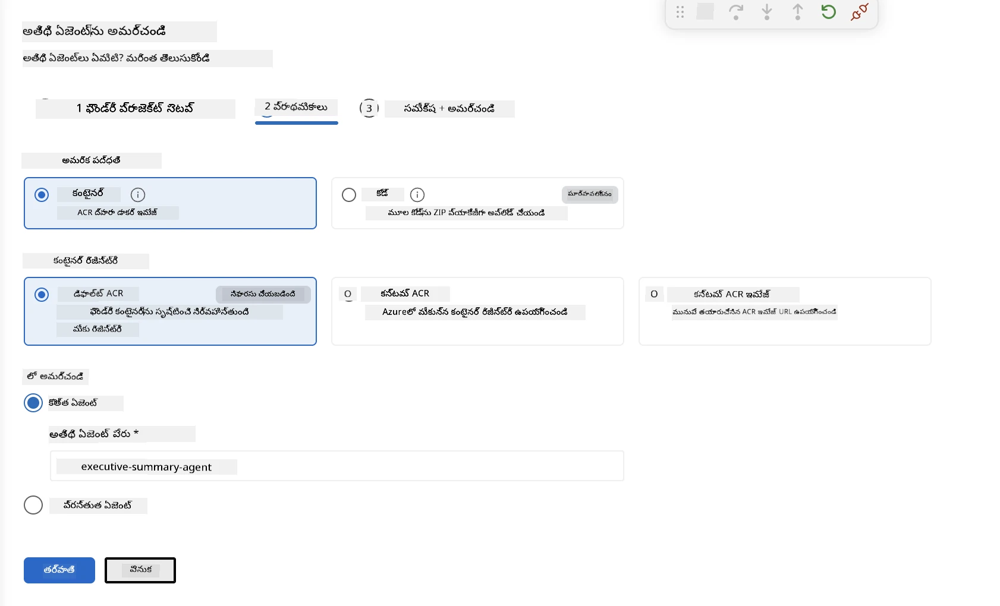
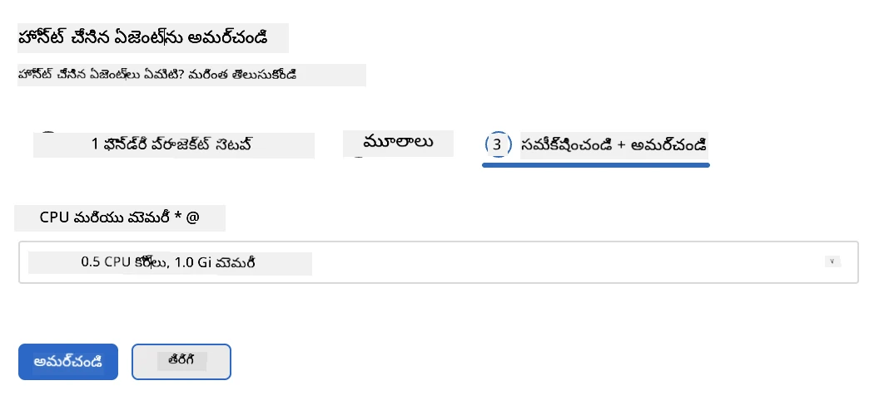
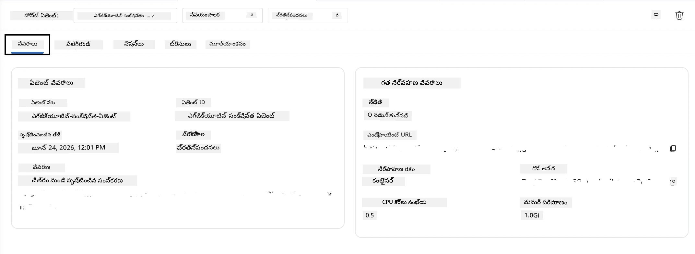

# మాడ్యూల్ 5 - Foundry ఏజెంట్ సేవకు పంపిణీ చేయండి

⏱️ ~10 నిమిషాలు

> ⚠️ **Path B వినియోగదారులు:** ఈ మాడ్యూల్ కి Foundry సభ్యత్వం అవసరం. మీరు Foundry Local ఉపయోగిస్తుంటే, [మాడ్యూల్ 07 - సారాంశం](07-summary.md)కి దాటవేయండి. మీరు స్థానిక అభివృద్ధి వర్క్‌ఫ్లో విజయవంతంగా పూర్తిచేశారు!

ఈ మాడ్యూల్ లో, మీరు మీ స్థానికంగా పరీక్షించిన ఏజెంట్ను Microsoft Foundryలో **హోస్టెడ్ ఏజెంట్**గా పంపిణీ చేస్తారు. ఈ పంపిణీ ఒక కంటైనర్ ఇమేజ్ తయారు చేసి, దాన్ని Azure Container Registryకి పంపించి, Foundry యొక్క నిర్వహించిన ఇన్‌ఫ్రాస్ట్రక్చర్‌లో ఏజెంట్‌ను ప్రారంభిస్తుంది.

### పంపిణీ పైప్‌లైన్

---

## ముందస్తు అవసరాలు పరిశీలన

పంపిణీ ప్రారంభించే ముందు, నిర్ధారించుకోండి:

- [ ] ఏజెంట్ [Module 04](04-test-locally.md) నుండి మూడు స్థానిక సన్నివేశాలను 모두 పాస్ అయ్యింది
- [ ] మీకు ప్రాజెక్టు స్థాయిలో **Azure AI User** రోల్ ఉంది ([Module 01, RBAC కేటాయింపు](01-setup.md#deploy-a-model--assign-rbac))
- [ ] మీరు VS Code లో Azureలో సైన్-ఇన్ అయ్యారు (ఖాతా ఐకాన్ లో మీ పేరు కనిపిస్తుంది)

---

## దశ 1: పంపిణీప్రారంభించండి

### ఎంపిక A: ఏజెంట్ ఇన్స్పెక్టర్ నుండి పంపిణీ (సిఫార్సు చేయబడింది)

ఏజెంట్ ఇన్స్పెక్టర్ తెరవబడుతుంటే (పరిశీలన నుండి):
1. ఎడమ-పైన ఉన్న **Deploy** బటన్ (మేఘం ఐకాన్ ↑) క్లిక్ చేయండి.

### ఎంపిక B: కమాండ్ పాలెట్ నుండి పంపిణీ

1. `Ctrl+Shift+P` నొక్కి → **Foundry Toolkit: Deploy Hosted Agent** ఎంచుకోండి.

---

## దశ 2: పంపిణీని కాన్ఫిగర్ చేయండి

విజార్డు ఈ ప్రశ్నలు అడుగుతుంది:

| ప్రశ్న | ఎంపిక |
|--------|-----------|
| **సబ్‌స్క్రిప్షన్** | మీAzure సబ్‌స్క్రిప్షన్ |
| **లక్ష్య ప్రాజెక్ట్** | మీ Foundry ప్రాజెక్ట్ (ఉదాహరణకు, `workshop-agents`) |

**next** ను క్లిక్ చేసి ఏజెంట్‌ను కాన్ఫిగర్ చేయండి.

| ప్రశ్న | ఎంపిక |
|--------|-----------|
| **పంపిణీ విధానం** | కంటైనర్ |
| **కంటైనర్ రిజిస్ట్రీ** | **డిఫాల్ట్ ACR** (Microsoft Foundry మీకోసం ఒకటిని సృష్టించి నిర్వహిస్తుంది) |
| **Deploy to** | కొత్త ఏజెంట్ (పేరు, `executive-summary-agent`) |

**next** క్లిక్ చేసి ఏజెంట్ సమీక్షించి పంపిణీ చేయండి.

| ప్రశ్న | ఎంపిక |
|--------|-----------|
| **CPU మరియు మెమరీ** | **0.25 CPU కోర్స్, 0.5 Gi మెమరీ** (వర్క్‌షాప్‌కు సరిపోతుంది) |

---

## దశ 3: పంపిణీ చేసి పర్యవేక్షించండి

1. **Deploy** క్లిక్ చేయండి.
2. **Output** ప్యానెల్‌ను గమనించండి (డ్రాప్‌డౌన్ నుండి **Microsoft Foundry** ఎంచుకోండి).
3. పంపిణీ ఈ దశల్లో జరుగుతుంది:
   - **డోకర్ బిల్డ్** - మీ Dockerfile నుంచి కంటైనర్ నిర్మాణం
   - **డోకర్ పుష్** - చిత్రాన్ని ACRకి పంపడం (మొదటి సారి 1-3 నిమిషాలు)
   - **ఏజెంట్ రిజిస్ట్రేషన్** - Foundryలో హోస్టెడ్ ఏజెంట్ సృష్టించడం
   - **కంటైనర్ ప్రారంభం** - సిస్టమ్ నిర్వహించిన ఐడెంటిటీతో ప్రారంభం

4. పూర్తయ్యాక, ఒక సమాచారం కనిపిస్తుంది:
   > **my-agent విజయవంతంగా పంపిణీ అయింది.** `View logs` `Run agent`

5. ఏజెంట్ ప్లేగ్రౌండ్ తెరవడానికి **Run agent** క్లిక్ చేయండి.

### పంపిణీ స్థితి విలువలు

| స్థితి | అర్థం |
|--------|---------|
| **Running** | కంటైనర్ సిద్ధంగా ఉంది, ఏజెంట్ ప్రతిస్పందిస్తోంది |
| **Pending** | కంటైనర్ ప్రారంభమవుతోంది - 30–60 సెకన్ల వేచివుండండి |
| **Failed** | లాగ్స్‌ను పరిశీలించండి (కింద Troubleshooting చూడండి) |

---

## సాధారణ పంపిణీ లోపాలు

| లోపం | కారణం | పరిష్కారం |
|-------|-----------|-----|
| `agents/write` అనుమతి నిరాకరించబడింది | ప్రాజెక్టు స్థాయిలో **Azure AI User** రోల్ లేదు | [Module 01, RBAC కేటాయింపు](01-setup.md#deploy-a-model--assign-rbac) |
| డోకర్ నడుస్తుంది లేదు | Docker Desktop ప్రారంభం కాలేదు | Docker Desktop ప్రారంభించండి → `docker info` వేరిఫై చేయండి |
| ACR అథారైజేషన్ | నిర్వహించిన ఐడెంటిటీ చిత్రం పుల్ల్ చేయలేకపోతోంది | [Module 08 - Troubleshooting](08-troubleshooting.md) చూడండి |

---

### ✅ చెక్పాయింట్

- [ ] లోపం లేని పంపిణీ పూర్తయింది
- [ ] ఏజెంట్ Foundry సైడ్‌బార్‌లో **Hosted Agents (Preview)** కింద కనిపిస్తోంది
- [ ] కంటైనర్ స్థితి **Running** చూపిస్తోంది
- [ ] ఏజెంట్ ప్లేగ్రౌండ్ టాబ్ తెరుచుకొని ఏజెంట్ వివరాలు మరియు ఎండ్పాయింట్ URL చూపిస్తోంది

---

**గత:** [04 - స్థానికంగా పరీక్షించండి](04-test-locally.md) · **తర్వాత:** [06 - ప్లేగ్రౌండ్‌లో ధృవీకరించండి →](06-verify-in-playground.md)

---

<!-- CO-OP TRANSLATOR DISCLAIMER START -->
**అస్వీకరణ**:
ఈ పత్రం AI అనువాద సేవ [Co-op Translator](https://github.com/Azure/co-op-translator) ఉపయోగించి అనువదించబడింది. మేము ఖచ్చితత్వానికి ప్రయత్నిస్తున్నప్పటికీ, ఆటోమేటెడ్ అనువాదాలు తప్పులు లేదా అసమగ్రతలను కలిగి ఉండవచ్చు. దాని స్వదేశ భాషలో ఉన్న అసలు పత్రాన్ని అధికారం కలిగిన మూలంగా పరిగణించాలి. కీలకమైన సమాచారం కోసం, ప్రొఫెషనల్ మానవ అనువాదాన్ని సిఫారసు చేస్తాము. ఈ అనువాదం ఉపయోగం వల్ల కలిగే ఏవైనా అపార్థాలు లేదా తప్పుదారులు కోసం మేము బాధ్యత వహించము.
<!-- CO-OP TRANSLATOR DISCLAIMER END -->