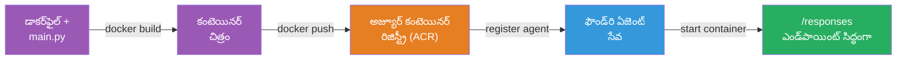
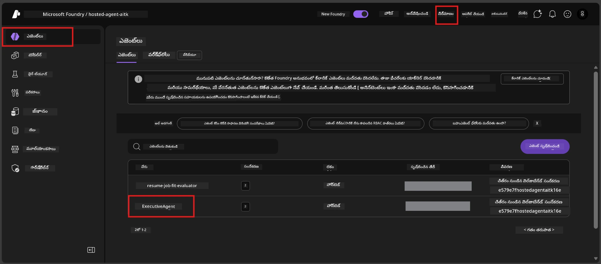

# మాడ్యూల్ 6 - Foundry ఏజెంట్ సర్వీస్ కు డిప్లాయ్ చేయడం

ఈ మాడ్యూల్‌లో, మీరు మీ స్థానికంగా పరీక్షించిన ఏజెంట్‌ను Microsoft Foundryలో [**Hosted Agent**](https://learn.microsoft.com/azure/foundry/agents/concepts/hosted-agents) గా డిప్లాయ్ చేస్తారు. డిప్లాయ్ ప్రక్రియలో మీ ప్రాజెక్ట్ నుండి Docker కంటైనర్ ఇమేజ్‌ను నిర్మించి, దానిని [Azure Container Registry (ACR)](https://learn.microsoft.com/azure/container-registry/container-registry-intro) కి పుష్ చేస్తారు మరియు [Foundry Agent Service](https://learn.microsoft.com/azure/foundry/agents/overview) లో ఒక హోస్టెడ్ ఏజెంట్ వెర్షన్ సృష్టిస్తారు.

### డిప్లాయ్‌మెంట్ పైప్‌లైన్


---

## ముందు చేయాల్సిన పనులు తనిఖీ

డిప్లాయ్ చేయడానికి ముందు, దిగువ ఉన్న ప్రతి అంశాన్ని తనిఖీ చేయండి. ఇవి పాస్ చేయకుండా వదిలివేత డిప్లాయ్ విఫలమయ్యేందుకు ప్రధాన కారణం.

1. **ఏజెంట్ స్థానిక స్మోక్ టెస్ట్లు పాస్ అయ్యాయా:**
   - మీరు [మాడ్యూల్ 5](05-test-locally.md) లోని అన్ని 4 టెస్ట్లను పూర్తి చేసి, ఏజెంట్ సరైన స్పందన ఇచ్చింది.

2. **మీకు [Azure AI User](https://learn.microsoft.com/azure/foundry/concepts/rbac-foundry#built-in-roles) రోల్ ఉందా:**
   - ఇది [మాడ్యూల్ 2, స్టెప్ 3](02-create-foundry-project.md) లో కేటాయించబడింది. స్పష్టంగా తెలియకపోవడం అయినా, ఇప్పుడు తనిఖీ చేయండి:
   - Azure పోర్టల్ → మీ Foundry **ప్రాజెక్ట్** వనరు → **Access control (IAM)** → **Role assignments** ట్యాబ్ → మీ పేరు కోసం శోధించండి → **Azure AI User** ఉండటాన్ని ధృవీకరించండి.

3. **మీరు VS Code లో Azureకి సైన్ ఇన్ అయ్యారా:**
   - VS Code దిగువ ఎడమ మూలలో ఉన్న ఖాతాల చిహ్నాన్ని తనిఖీ చేయండి. మీ ఖాతా పేరు కనిపించాలి.

4. **(ఐచ్ఛికం) Docker Desktop రన్ అవుతోంది కదా:**
   - Docker అవసరం ఉండేది Foundry ఎక్స్‌టెన్షన్ స్థానిక బిల్డ్ అడగినప్పుడు మాత్రమే. ఎక్కువగా, ఎక్స్‌టెన్షన్ డిప్లాయ్ సమయంలో ఆटोమేటిక్‌గా కంటైనర్ బిల్డులను నిర్వహిస్తుంది.
   - Docker ఇన్‌స్టాల్ చేసినట్లయితే, అది రన్ అవుతోందా చూడండి: `docker info`

---

## స్టెప్ 1: డిప్లాయ్‌మెంట్ ప్రారంభం

మీకు డిప్లాయ్ చేయడానికి రెండు మార్గాలు ఉన్నాయి - ఇది రెండు వేలు ఒకే ఫలితానికి తీసుకుపోతాయి.

### ఆప్షన్ A: ఏజెంట్ ఇన్‌స్పెక్టర్ నుండి డిప్లాయ్ చేయడం (సిఫార్సు చేయబడింది)

మీరు ఏజెంట్‌ను డీబగ్గర్ (F5) తో నడుపుతూ ఏజెంట్ ఇన్‌స్పెక్టర్ తెరిచి ఉంటే:

1. ఏజెంట్ ఇన్‌స్పెక్టర్ ప్యానెల్ యొక్క **ఎడమపై కోణం** ను పరిశీలించండి.
2. **Deploy** బటన్ (అప్పరిందిక సంజ్ఞతో ఉన్న మేఘ చిహ్నం ↑) పై క్లిక్ చేయండి.
3. డిప్లాయ్‌మెంట్ వizard తెరిచిపోతుంది.

### ఆప్షన్ B: కమాండ్ పలెట్ నుండి డిప్లాయ్ చేయడం

1. `Ctrl+Shift+P` ని నొక్కి **Command Palette** తెరవండి.
2. టైప్ చేయండి: **Microsoft Foundry: Deploy Hosted Agent** మరియు ఎంచుకోండి.
3. డిప్లాయ్‌మెంట్ వizard తెరిచిపోతుంది.

---

## స్టెప్ 2: డిప్లాయ్‌మెంట్ కాన్ఫిగర్ చేయండి

డిప్లాయ్‌మెంట్ వizard మీరు దశల వారీగా గైడ్ చేస్తుంది. ప్రతి ప్రాంప్ట్ నింపండి:

### 2.1 లక్ష్య ప్రాజెక్ట్ ఎంచుకోండి

1. డ్రాప్‌డౌన్‌లో మీ Foundry ప్రాజెక్టులు కనపడతాయి.
2. మాడ్యూల్ 2లో సృష్టించిన ప్రాజెక్ట్ ఎంచుకోండి (ఉదా: `workshop-agents`).

### 2.2 కంటైనర్ ఏజెంట్ ఫైల్ ఎంచుకోండి

1. ఏజెంట్ ఎంట్రీ పాయింట్ ఎంచుకోవడం అడుగుతారు.
2. **`main.py`** (Python) ను ఎంచుకోండి - ఇది వizard ఏజెంట్ ప్రాజెక్టును గుర్తించడానికి ఉపయోగించే ఫైల్.

### 2.3 వనరులు కాన్ఫిగర్ చేయండి

| సెటింగ్ | సిఫార్సు చేయబడిన విలువ | గమనికలు |
|---------|--------------------------|----------|
| **CPU** | `0.25` | డిఫాల్ట్, వర్క్షాప్‌కు సరిపోతుంది. ఉత్పత్తి వర్క్లోడ్‌ల కోసం పెంచండి |
| **Memory** | `0.5Gi` | డిఫాల్ట్, వర్క్షాప్‌కు సరిపోతుంది |

ఈ విలువలు `agent.yaml` లో ఉన్నవాటితో సరిపోతాయి. డిఫాల్ట్‌లను అంగీకరించవచ్చు.

---

## స్టెప్ 3: నిర్ధారించుకుని డిప్లాయ్ చేయండి

1. వizard డిప్లాయ్‌మెంట్ సారాంశాన్ని చూపిస్తుంది, అందులో:
   - లక్ష్య ప్రాజెక్ట్ పేరు
   - ఏజెంట్ పేరు (`agent.yaml` నుండి)
   - కంటైనర్ ఫైల్ మరియు వనరులు
2. సారాంశాన్ని సమీక్షించి **Confirm and Deploy** (లేదా **Deploy**) పై క్లిక్ చేయండి.
3. VS Codeలో ప్రోగ్రెస్ ని గమనించండి.

### డిప్లాయ్ సమయంలో ఏమి జరుగుతుంది (దశల వారీగా)

డిప్లాయ్‌మెంట్ అనేది బహుళ దశల ప్రక్రియ. VS Code **Output** ప్యానెల్ ని పరిశీలించండి ("Microsoft Foundry" డ్రాప్‌డౌన్ నుంచి ఎంచుకోండి):

1. **Docker build** - VS Code మీ `Dockerfile` నుండి Docker కంటైనర్ ఇమేజ్‌ను నిర్మిస్తుంది. మీరు Docker లేయర్ సందేశాలు చూస్తారు:
   ```
   Step 1/6 : FROM python:<version>-slim
   Step 2/6 : WORKDIR /app
   ...
   Successfully built abc123def456
   ```

2. **Docker push** - ఇమేజ్‌ను **Azure Container Registry (ACR)** కి పుష్ చేస్తుంది, ఇది మీ Foundry ప్రాజెక్టుకు సంబంధించినది. మొదటి డిప్లాయ్ కు ఇది 1-3 నిమిషాలు పడవచ్చు (బేస్ ఇమేజ్ >100MB).

3. **Agent registration** - Foundry Agent Service కొత్త హోస్టెడ్ ఏజెంట్ ను (లేదా ఏజెంట్ ఇప్పటికే ఉన్నట్లయితే కొత్త వెర్షన్ ను) సృష్టిస్తుంది. `agent.yaml` నుండి ఏజెంట్ మెటాడేటాను ఉపయోగిస్తుంది.

4. **Container start** - కంటైనర్ Foundry నిర్వహించే ఇన్‌ఫ్రాస్ట్రక్చర్‌లో ప్రారంభమవుతుంది. ప్లాట్‌ఫాం [సిస్టమ్-నియంత్రిత గుర్తింపు](https://learn.microsoft.com/azure/foundry/agents/concepts/agent-identity) ని కేటాయించి `/responses` ఎండ్‌పాయింట్ ని ఎక్స్‌పోస్ చేస్తుంది.

> **మొదటి డిప్లాయ్ మెల్లగా జరుగుతుంది** (Docker అన్ని లేయర్లను పుష్ చేయాల్సి ఉంటుంది). తర్వాతి డిప్లాయ్‌లు వేగంగా జరుగుతాయి ఎందుకంటే Docker మార్చని లేయర్లను క్యాష్ చేస్తుంది.

---

## స్టెప్ 4: డిప్లాయ్ స్థితిని ధృవీకరించండి

డిప్లాయ్‌మెంట్ కమాండ్ పూర్తయిన తర్వాత:

1. Activity Barలో ఉన్న Foundry చిహ్నం పై క్లిక్ చేసి **Microsoft Foundry** సైడ్‌బార్ తెరవండి.
2. మీ ప్రాజెక్ట్ క్రింద **Hosted Agents (Preview)** విభాగాన్ని విస్తరించండి.
3. మీరు మీ ఏజెంట్ పేరును చూడగలుగుతారు (ఉదా: `ExecutiveAgent` లేదా `agent.yaml` నుండి పేరు).
4. **ఏజెంట్ పేరుపై క్లిక్ చేయండి** దాన్ని విస్తరించడానికి.
5. ఒకటి లేదా అంతకు మించి **వెర్షన్‌లు** (ఉదా: `v1`) కనిపిస్తాయి.
6. వెర్షన్‌పై క్లిక్ చేసి **Container Details** చూడండి.
7. **Status** ఫీల్డ్ ని తనిఖీ చేయండి:

   | స్థితి | అర్థం |
   |--------|--------|
   | **Started** లేదా **Running** | కంటైనర్ నడుస్తోంది, ఏజెంట్ సిద్ధంగా ఉంది |
   | **Pending** | కంటైనర్ ప్రారంభ అవుతోంది (30-60 సెకన్లు వేచివుండండి) |
   | **Failed** | కంటైనర్ ప్రారంభంలో విఫలమైందీ (లాగ్‌లు తనిఖీ చేయండి - క్రింది సమస్య పరిష్కారాలు చూడండి) |



> **"Pending" 2 నిమిషాలు దాటితే:** కంటైనర్ బేస్ ఇమేజ్‌ను పుల్గ్ చేస్తున్నవచ్చు. ఇంకొంచెం వేచివుండండి. ఇంకా పండింగ్ అయితే కంటైనర్ లాగ్‌లు తనిఖీ చేయండి.

---

## సాధారణ డిప్లాయ్ తప్పిదాలు మరియు పరిష్కారాలు

### తప్పిదం 1: అనుమతి నిరాకరణ - `agents/write`

```
Error: lacks the required data action 
Microsoft.CognitiveServices/accounts/AIServices/agents/write 
to perform POST /api/projects/{projectName}/assistants operation.
```

**మూల కారణం:** మీరు **ప్రాజెక్ట్** స్థాయిలో `Azure AI User` రోల్ కలిగి లేరు.

**దశల వారీగా పరిష్కారం:**

1. [https://portal.azure.com](https://portal.azure.com) ఓపెన్ చేయండి.
2. శోధనా బార్ లో మీ Foundry **ప్రాజెక్ట్** పేరు టైప్ చేసి దానిపై క్లిక్ చేయండి.
   - **గమనిక:** మీరు **ప్రాజెక్ట్** వనరుకు (టైప్: "Microsoft Foundry project"), తల్లి ఖాతా/హబ్ వనరికాదు నిర్ధారించండి.
3. ఎడమ నావిగేషన్ లో **Access control (IAM)** పై క్లిక్ చేయండి.
4. **+ Add** → **Add role assignment** పై క్లిక్ చేయండి.
5. **Role** ట్యాబ్ లో [**Azure AI User**](https://learn.microsoft.com/azure/foundry/concepts/rbac-foundry#built-in-roles) సర్చ్ చేసి ఎంచుకోండి. **Next** పై క్లిక్ చేయండి.
6. **Members** ట్యాబ్ లో **User, group, or service principal** ఎంచుకోండి.
7. **+ Select members** పై క్లిక్ చేసి మీ పేరు/ఇమెయిల్ కోసం శోధించి, ఎంచుకుని **Select** క్లిక్ చేయండి.
8. **Review + assign** → మళ్లీ **Review + assign** క్లిక్ చేయండి.
9. రోల్ కేటాయింపు వ్యాపించడానికి 1-2 నిమిషాలు వేచివుండండి.
10. **స్టెప్ 1 నుండి డిప్లాయ్ పునఃప్రయత్నం.**

> రోల్ తప్పనిసరిగా **ప్రాజెక్ట్** స్థాయిలో ఉండాలి, ఖాతా స్థాయికి పరిమితం చేయకూడదు. ఇది డిప్లాయ్ విఫలమయ్యే ప్రధాన కారణం.

### తప్పిదం 2: Docker నడవడం లేదు

```
Error: Docker build failed / Cannot connect to Docker daemon
```

**పరిష్కారం:**
1. Docker Desktop ప్రారంభించండి (స్టార్ట్ మెనూ లేదా సిస్టమ్ ట్రే నుండి సేకరించండి).
2. "Docker Desktop is running" అని చూపినప్పుడు వేచి ఉండండి (30-60 సెకన్లు).
3. ఒక టెర్మినల్ లో `docker info` ను నిర్ధారించండి.
4. **Windows ప్రత్యేకం:** Docker Desktop సెట్టింగ్స్ → **General** → **Use the WSL 2 based engine** ఎంపికను ఎనేబుల్ చేయండి.
5. డిప్లాయ్ పునఃప్రయత్నం చేయండి.

### తప్పిదం 3: ACR అనుమతి సమస్య - `AcrPullUnauthorized`

```
Error: AcrPullUnauthorized
```

**మూల కారణం:** Foundry ప్రాజెక్ట్ మేనేజ్‌డ్ ఐడెంటిటీకి కంటైనర్ రిజిస్ట్రీ పుల్ అనుమతి లేదు.

**పరిష్కారం:**
1. Azure పోర్టల్‌లో మీ **[Container Registry](https://learn.microsoft.com/azure/container-registry/container-registry-intro)** కు వెళ్ళండి (Foundry ప్రాజెక్ట్ ఉన్న ర esouce గ్రూప్‌లో ఉంటుంది).
2. **Access control (IAM)** → **Add** → **Add role assignment** కు వెళ్ళండి.
3. **[AcrPull](https://learn.microsoft.com/azure/container-registry/container-registry-roles)** రోల్ ఎంచుకోండి.
4. **Members** క్రింద **Managed identity** ని ఎంచుకుని Foundry ప్రాజెక్ట్ మేనేజ్‌డ్ ఐడెంటిటిని కనుగొనండి.
5. **Review + assign** చేయండి.

> సాధారణంగా, ఇది Foundry ఎక్స్‌టెన్షన్ ద్వారా ఆటోమేటిగ్గా సెట్ అవుతుంది. ఈ ఎర్రర్ వస్తే ఆటోమేటిక్ సెట్ అప్ విఫలమయ్యిందని అర్థం.

### తప్పిదం 4: కంటైనర్ ప్లాట్ఫారమ్ మ్యాచ్ కాకపోవడం (Apple Silicon)

Apple Silicon Mac (M1/M2/M3) నుండి డిప్లాయ్ చేస్తున్నపుడు, కంటైనర్ `linux/amd64` కోసం బిల్డ్ చేయబడాలి:

```bash
docker build --platform linux/amd64 -t myagent:v1 .
```

> Foundry ఎక్స్‌టెన్షన్ చాలా మంది యూజర్ల కొరకు ఇది ఆటోమేటిగ్గా నిర్వహిస్తారు.

---

### చెక్పాయింట్

- [ ] డిప్లాయ్ కమాండ్ VS Code లో ఎర్రర్స్ లేకుండా పూర్తయింది
- [ ] ఏజెంట్ Foundry సైడ్‌బార్ లో **Hosted Agents (Preview)** లో కనిపిస్తోంది
- [ ] మీరు ఏజెంట్ పై క్లిక్ చేసి → వెర్షన్ ఎంచుకుని → **Container Details** చూడగలిగారు
- [ ] కంటైనర్ స్థితి **Started** లేదా **Running** చూపిస్తుంది
- [ ] (తప్పిదాలు వచ్చినట్లయితే) మీరు తప్పిదాన్ని గుర్తించి, పరిష్కారం వర్తించి, విజయవంతంగా పునఃడిప్లాయ్ చేసారు

---

**ముందటి:** [05 - Test Locally](05-test-locally.md) · **తరువాత:** [07 - Verify in Playground →](07-verify-in-playground.md)

---

<!-- CO-OP TRANSLATOR DISCLAIMER START -->
**డిస్క్లేమర్**:  
ఈ డాక్యుమెంట్ AI అనువాద సేవ [Co-op Translator](https://github.com/Azure/co-op-translator) ఉపయోగించి అనువదించబడింది. మేము ఖచ్చితత్వం కోసం ప్రయత్నిస్తున్నప్పటికీ, స్వయంచాలక అనువాదాలలో పొరపాట్లు లేదా లోపాలు ఉండవచ్చు అని జ్ఞాపకం ఉంచండి. స్థానిక భాషలో ఉన్న అసలు డాక్యుమెంట్ అధికారిక మూలంగా పరిగణించాలి. కీలక సమాచారానికి, ప్రొఫెషనల్ మానవ అనువాదం మంచిది. ఈ అనువాదాన్ని ఉపయోగించడం వల్ల కలిగే ఏవైనా అపవాచనలు లేదా తప్పుదొర్లికలకి మేము బాధ్యత వహించము.
<!-- CO-OP TRANSLATOR DISCLAIMER END -->