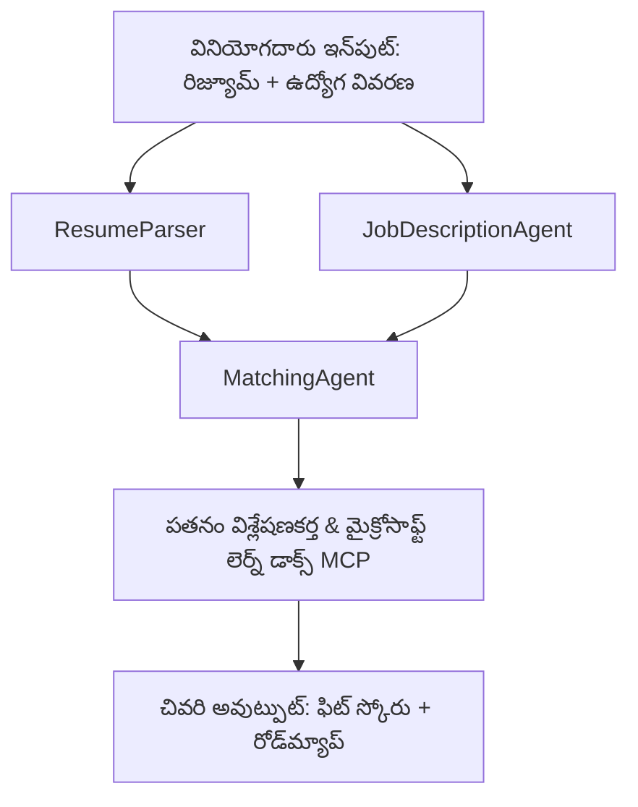

# PersonalCareerCopilot - రిజ్యూమ్ → ఉద్యోగం సరిపోవడం మూల్యాంకకుడు

ఒక బహుళ-ఏజెంట్ పనివాహకం ఇది రిజ్యూమే ఉద్యోగ వివరణకు ఎంత బాగా సరిపోయిందో అంచనా వేస్తుంది, తరువాత అంతరాలను మూసివేయడానికి వ్యక్తిగతీకరించబడిన నేర్చుకునే రోడ్‌మ్యాప్‌ని తయారుచేస్తుంది.

---

## ఏజెంట్లు

| ఏజెంట్ | పాత్ర | పరికరాలు |
|-------|------|-------|
| **ResumeParser** | రిజ్యూమే టెక్ట్స్ నుండి నిర్మిత నైపుణ్యాలు, అనుభవం, సర్టిఫికేషన్లు తీసుకొని వస్తుంది | - |
| **JobDescriptionAgent** | ఒక JD నుండి అవసరమైన/ప్రాధాన్యత ఉన్న నైపుణ్యాలు, అనుభవం, సర్టిఫికేషన్లు తీసుకొని వస్తుంది | - |
| **MatchingAgent** | ప్రొఫైల్ vs అవసరాలు తులన చేసి → సరిపోవడం స్కోరు (0-100) + సరిపొన్న/లేని నైపుణ్యాలు | - |
| **GapAnalyzer** | Microsoft Learn వనరులతో వ్యక్తిగత నేర్చుకునే రోడ్‌మ్యాప్ నిర్మిస్తుంది | `search_microsoft_learn_for_plan` (MCP) |

## పనివాహకం


---

## వేగవంతమైన ప్రారంభం

### 1. పరిసరాన్ని ఏర్పరిచుట

```powershell
cd workshop\lab02-multi-agent\PersonalCareerCopilot
python -m venv .venv
.\.venv\Scripts\Activate.ps1          # విండోస్ పవర్‌షెల్
# source .venv/bin/activate            # macOS / లినక్స్
pip install -r requirements.txt
```

### 2. సాక్ష్యాలను ఆకర్షించండి

ఉదాహరణ env ఫైల్‌ని కాపీ చేసి మీ Foundry ప్రాజెక్ట్ వివరాలను నింపండి:

```powershell
cp .env.example .env
```

`.env` సవరించండి:

```env
PROJECT_ENDPOINT=https://<your-account>.services.ai.azure.com/api/projects/<your-project>
MODEL_DEPLOYMENT_NAME=gpt-4.1-mini
```

| విలువ | దాన్ని ఎక్కడ కనుగొనాలి |
|-------|-----------------|
| `PROJECT_ENDPOINT` | VS కోడ్‌లో Microsoft Foundry సైడ్బార్ → మీ ప్రాజెక్ట్ మీద రైట్ క్లిక్ → **ప్రాజెక్ట్ ఎండ్‌పాయింట్ కాపీచెయ్యండి** |
| `MODEL_DEPLOYMENT_NAME` | Foundry సైడ్బార్ → ప్రాజెక్ట్ విస్తరించండి → **మోడల్స్ + ఎండ్‌పాయింట్లు** → డిప్లాయ్‌మెంట్ పేరు |

### 3. స్థానికంగా నిర్వహించండి

```powershell
python -m debugpy --listen 127.0.0.1:5679 -m agentdev run main.py --verbose --port 8088
```

లేదా VS కోడ్ టాస్క్ ఉపయోగించండి: `Ctrl+Shift+P` → **Tasks: Run Task** → **Run Lab02 HTTP Server**.

### 4. ఏజెంట్ ఇన్‌స్పెక్టర్‌తో పరీక్షించండి

ఏజెంట్ ఇన్‌స్పెక్టర్ తెరవండి: `Ctrl+Shift+P` → **Foundry Toolkit: Open Agent Inspector**.

ఈ పరీక్ష ప్రాంప్ట్ పేస్ట్ చేయండి:

```
Resume:
Jane Doe
Senior Software Engineer with 5 years of experience in Python, Django, and AWS.
Built microservices handling 10K+ requests/second. Led a team of 4 developers.
Certifications: AWS Solutions Architect Associate.
Education: B.S. Computer Science, State University.

Job Description:
Senior Cloud Engineer at Contoso Ltd.
Required: Python, Azure, Kubernetes, Terraform, CI/CD pipelines.
Preferred: Go, monitoring (Prometheus/Grafana), cost optimization.
Experience: 5+ years in cloud infrastructure.
Certifications: Azure Solutions Architect Expert preferred.
```

**అంచనా:** సరిపోవడం స్కోరు (0-100), సరిపొన్న/లేని నైపుణ్యాలు, Microsoft Learn URLలతో వ్యక్తిగత నేర్చుకునే రోడ్‌మ్యాప్.

### 5. Foundry కి మోపండి

`Ctrl+Shift+P` → **Microsoft Foundry: Deploy Hosted Agent** → మీ ప్రాజెక్ట్ ఎంచుకోండి → ధృవీకరించండి.

---

## ప్రాజెక్ట్ నిర్మాణం

```
PersonalCareerCopilot/
├── .env.example        ← Template for environment variables
├── .env                ← Your credentials (git-ignored)
├── agent.yaml          ← Hosted agent definition (name, resources, env vars)
├── Dockerfile          ← Container image for Foundry deployment
├── main.py             ← 4-agent workflow (instructions, MCP tool, WorkflowBuilder)
└── requirements.txt    ← Python dependencies
```

## కీలక ఫైళ్ళు

### `agent.yaml`

Foundry Agent Service కోసం హోస్టెడ్ ఏజెంట్ నిర్వచిస్తుంది:
- `kind: hosted` - నిర్వహించబడే కంటైనర్‌గా నడుస్తుంది
- `protocols: [responses v1]` - `/responses` HTTP ఎండ్‌పాయింట్‌ను ఎక్స్‌పోజ్ చేస్తుంది
- `environment_variables` - `PROJECT_ENDPOINT` మరియు `MODEL_DEPLOYMENT_NAME` డిప్లాయ్ సమయంలో ఇంజెక్ట్ చేయబడతాయి

### `main.py`

తదుపరి కలిగిఉన్నవి:
- **ఏజెంట్ సూచనలు** - నాలుగు `*_INSTRUCTIONS` కాంస్టెంట్స్, ఒక్కొక్క ఏజెంట్ కోసం
- **MCP పరికరం** - `search_microsoft_learn_for_plan()` `https://learn.microsoft.com/api/mcp`కి Streamable HTTP ద్వారా కాల్ చేస్తుంది
- **ఏజెంట్ సృష్టి** - `create_agents()` కాంటెక్స్ట్ మేనేజర్ `AzureAIAgentClient.as_agent()` ఉపయోగించి
- **పనివాహకం గ్రాఫ్** - `create_workflow()` `WorkflowBuilder` ఉపయోగించి ఏజెంట్లను ఫ్యాన్-ఔట్/ఫ్యాన్-ఇన్/క్రమం పరంగా వైర్ చేస్తుంది
- **సర్వర్ స్టార్ట్-అప్** - `from_agent_framework(agent).run_async()` పోర్ట్ 8088 పై

### `requirements.txt`

| ప్యాకేజ్ | వర్షన్ | ఉపయోగం |
|---------|---------|---------|
| `agent-framework-azure-ai` | `1.0.0rc3` | Microsoft Agent Framework కోసం Azure AI ఇంటిగ్రేషన్ |
| `agent-framework-core` | `1.0.0rc3` | కోర్ రంటైమ్ (WorkflowBuilder కలిపి) |
| `azure-ai-agentserver-agentframework` | `1.0.0b16` | హోస్టెడ్ ఏజెంట్ సర్వర్ రంటైమ్ |
| `azure-ai-agentserver-core` | `1.0.0b16` | కోర్ ఏజెంట్ సర్వర్ అబ్స్ట్రాక్షన్స్ |
| `debugpy` | తాజా | Python డీబగ్గింగ్ (VS కోడ్లో F5) |
| `agent-dev-cli` | `--pre` | స్థానిక డెవ్ CLI + ఏజెంట్ ఇన్‌స్పెక్టర్ బ్యాకెండ్ |

---

## సమస్యలు పరిష్కారం

| సమస్య | పరిష్కారం |
|-------|-----|
| `RuntimeError: Missing required environment variable(s)` | `PROJECT_ENDPOINT` మరియు `MODEL_DEPLOYMENT_NAME`తో `.env` సృష్టించండి |
| `ModuleNotFoundError: No module named 'agent_framework'` | వర్చువల్ ఎన్విరాన్‌మెంట్ యాక్టివేట్ చేసి `pip install -r requirements.txt` నడపండి |
| అవుట్‌పుట్‌లో Microsoft Learn URLలు లేవు | `https://learn.microsoft.com/api/mcp`కు ఇంటర్నెట్ కనెక్టివిటీ తనిఖీ చేయండి |
| ఒకే ఒక్క గ్యాప్ కార్డ్ (తగ్గించబడినది) | `GAP_ANALYZER_INSTRUCTIONS`లో ఉన్న `CRITICAL:` బ్లాక్ సరిచూసుకోండి |
| 8088 పోర్ట్ ఉపయోగంలో ఉంది | ఇతర సర్వర్లు ఆపండి: `netstat -ano | findstr :8088` |

విస్తృత సమస్య పరిష్కారం కోసం, చూడండి [Module 8 - Troubleshooting](../docs/08-troubleshooting.md).

---

**పూర్తి వాక్‌థ్రూ:** [Lab 02 Docs](../docs/README.md) · **వెనక్కి:** [Lab 02 README](../README.md) · [వర్క్‌షాప్ హోమ్](../../../README.md)

---

<!-- CO-OP TRANSLATOR DISCLAIMER START -->
**మోయినచేసిన మాటలు**:  
ఈ పత్రం AI అనువాద సేవ [Co-op Translator](https://github.com/Azure/co-op-translator) ఉపయోగించి అనువదించబడింది. మేము ఖచ్చితత్వం కోసం ప్రయత్నించినప్పటికీ, ఆటోమేటెడ్ అనువాదాల్లో లోపాలు లేదా అపరిశుధ్ధతలు ఉండవచ్చు. అసలు పత్రం స్థానిక భాషలో వాతావరణం మొదలైనది అధికారిక మూలంగా పరిగణించాలి. కీలక సమాచారంకోసం, ప్రొఫెషనల్ మానవ అనువాదం సిఫార్సు చేయబడింది. ఈ అనువాదం ఉపయోగంతో ఎదురైన ఏవైనా అపవాదాలు లేదా తప్పు భావాలు కోసం మేము బాధ్యులు కాదు.
<!-- CO-OP TRANSLATOR DISCLAIMER END -->