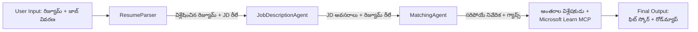

# PersonalCareerCopilot - రిజ్యూమ్ → జాబ్ ఫిట్ മൂల్యాంకన యంత్రం

రిజ్యూమ్ జాబ్ వివరణకు ఎంత వరకు సరిపోతుందో అంచనా వేయడం మరియు అంతరాలను భర్తీ చేసుకోవడానికి వ్యక్తిగతీకరించిన నేర్చుకునే మార్గదర్శకం రూపొందించు వర్క్‌ఫ్లో-ప్రథమ బహుజన యజమాని యాప్.

---

## ఏజెంట్లు

| ఏజెంట్ | పాత్ర | సాధనాలు |
|-------|------|-------|
| **ResumeParser** | రిజ్యూమ్ టెక్స్ట్ నుండి నిర్మిత నైపుణ్యాలు, అనుభవం, సర్టిఫికేషన్లు తీయటం | - |
| **JobDescriptionAgent** | JD నుండి అవసరమైన/ఇష్టమైన నైపుణ్యాలు, అనుభవం, సర్టిఫికేషన్లు తీయటం | - |
| **MatchingAgent** | ప్రొఫైల్ vs అవసరాలు → ఫిట్ స్కోరు (0-100) + సరిపోలిన/లేని నైపుణ్యాలు పోలిక | - |
| **GapAnalyzer** | Microsoft Learn రిసోర్సులతో వ్యక్తిగత నేర్చుకునే మార్గదర్శకం రూపొందించడం | `search_microsoft_learn_for_plan` (MCP) |

## వర్క్‌ఫ్లో


```mermaid
flowchart LR
    UserInput["User Input: రిజ్యూమ్ + జాబ్ వివరణ"] --> ResumeParser
    ResumeParser -- "విశ్లేషించిన రిజ్యూమ్ + JD రీలే" --> JobDescriptionAgent
    JobDescriptionAgent -- "JD అవసరాలు + రిజ్యూమ్ రీలే" --> MatchingAgent
    MatchingAgent -- "సరిపోయే నివేదిక + గ్యాప్స్" --> GapAnalyzerMCP["ఆంతరాల విశ్లేషకుడు +\nMicrosoft Learn MCP"]
    GapAnalyzerMCP --> FinalOutput["Final Output:\nఫిట్ స్కోర్ + రోడ్‌మ్యాప్"]
```

---

## వేగవంతమైన ప్రారంభం

### 1. పరిసరాన్ని సెట్ చేయండి

ఈ ఫోల్డర్ వర్క్‌ఫ్లో ఆధారిత ల్యాబ్ 02 స్కాఫోల్డ్ యొక్క రిఫరెన్స్ అమలు. దీని `main.py` ఉన్న ప్రాంప్ట్ బ్లాక్‌లను మరియు `WorkflowBuilder` ని ఉపయోగించి నాలుగు ఏజెంట్లను కలిపి నిర్వహిస్తుంది.

```powershell
cd workshop\lab02-multi-agent\PersonalCareerCopilot
python -m venv .venv
.\.venv\Scripts\Activate.ps1          # Windows PowerShell
# source .venv/bin/activate            # మాక్‌ఓఎస్ / లినక్స్
pip install -r requirements.txt
```

### 2. క్రెడెన్షియల్స్ ని కాన్ఫిగర్ చేయండి

ఈ ఫోల్డర్‌లో `.env` ఫైల్‌ని సృష్టించండి:

```powershell
copy .env .env.bak 2>$null; echo $null > .env
```

`.env` ను సవరించండి:

```env
FOUNDRY_PROJECT_ENDPOINT=https://<your-account>.services.ai.azure.com/api/projects/<your-project>
AZURE_AI_MODEL_DEPLOYMENT_NAME=gpt-4.1-mini
```

| విలువ | ఎక్కడ కనుగొనాలి |
|-------|------------------|
| `FOUNDRY_PROJECT_ENDPOINT` | Foundry టూల్‌కిట్ సైడ్‌బార్ → మీ ప్రాజెక్టుపై రైట్-క్లిక్ → **ప్రాజెక్టు ఎండ్‌పాయింట్ కాపీ చేయండి** |
| `AZURE_AI_MODEL_DEPLOYMENT_NAME` | Foundry సైడ్‌బార్ → ప్రాజెక్టును విస్తరించండి → **మోడల్స్ + ఎండ్‌పాయింట్లు** → డిప్లాయ్‌మెంట్ పేరు |

### 3. లోకల్‌గా నడపండి

```powershell
python -m debugpy --listen 127.0.0.1:5679 main.py --port 8088
```

లేదా VS కోడ్ టాస్క్ వాడండి: `Ctrl+Shift+P` → **టాస్కులు: టాస్క్ నడపండి** → **ఏజెంట్ HTTP సర్వర్ నడపండి**.

F5 డీబగ్గింగ్ కోసం, **డీబగ్ లోకల్ ఏజెంట్ HTTP సర్వర్** వాడండి.

### 4. ఏజెంట్ ఇన్‌స్పెక్టర్‌తో పరీక్షించండి

ఏజెంట్ ఇన్‌స్పెక్టర్ తెరవండి: `Ctrl+Shift+P` → **Foundry Toolkit: ఏజెంట్ ఇన్‌స్పెక్టర్ తెరవండి**.

ఈ టెస్ట్ ప్రాంప్ట్‌ని పేస్టు చేయండి:

```
Resume:
Jane Doe
Senior Software Engineer with 5 years of experience in Python, Django, and AWS.
Built microservices handling 10K+ requests/second. Led a team of 4 developers.
Certifications: AWS Solutions Architect Associate.
Education: B.S. Computer Science, State University.

Job Description:
Senior Cloud Engineer at Contoso Ltd.
Required: Python, Azure, Kubernetes, Terraform, CI/CD pipelines.
Preferred: Go, monitoring (Prometheus/Grafana), cost optimization.
Experience: 5+ years in cloud infrastructure.
Certifications: Azure Solutions Architect Expert preferred.
```

**నిరೀಕ್ಷితమైనది:** ఒక ఫిట్ స్కోరు (0-100), సరిపోలిన/లేని నైపుణ్యాలు, మరియు Microsoft Learn URLలతో వ్యక్తిగతీకరించిన నేర్చుకునే మార్గదర్శకం.

### 5. Foundryకి డిప్లయ్ చేయండి

`Ctrl+Shift+P` → **Foundry Toolkit: హోస్టెడ్ ఏజెంట్ డిప్లయ్ చేయండి** → మీ ప్రాజెక్ట్‌ను ఎంచుకోండి → నిర్ధారించండి.

---

## ప్రాజెక్టు నిర్మాణం

```
PersonalCareerCopilot/
├── .env                ← Your credentials (git-ignored)
├── agent.yaml          ← Hosted agent definition (name, resources, env vars)
├── Dockerfile          ← Container image for Foundry deployment
├── main.py             ← 4-agent workflow (instructions, MCP tool, WorkflowBuilder)
└── requirements.txt    ← Python dependencies
```

## కీలక ఫైళ్ళు

### `agent.yaml`

Foundry ఏజెంట్ సర్వీస్ కోసం హోస్టెడ్ ఏజెంట్ నిర్వచిస్తుంది:
- `kind: hosted` - నిర్వహిత కంటైనర్‌గా నడుస్తుంది
- `protocols` - `responses` ప్రోటోకాల్ `version: 1.0.0`తో, `/responses` HTTP ఎండ్‌పాయింట్ ని అందిస్తుంది
- `environment_variables` - ఇక్కడ `AZURE_AI_MODEL_DEPLOYMENT_NAME` ప్రకటించబడుతుంది; `FOUNDRY_PROJECT_ENDPOINT` డిప్లాయ్ సమయంలో ఆటోమాటిక్‌గా ఇంజెక్ట్ అవుతుంది

### `main.py`

ఇందులో ఉంటుంది:
- **ఏజెంట్ సూచనలు** - ప్రతి ఏజెంట్‌కి నాలుగు `*_INSTRUCTIONS` స్థిరాంకాలు
- **MCP సాధనం** - `search_microsoft_learn_for_plan()` `https://learn.microsoft.com/api/mcp` ను Streamable HTTP ద్వారా పిలుస్తుంది
- **ఏజెంట్ల సృష్టి** - నాలుగు `Agent()` + `AgentExecutor()` ఉదాహరణలు ఒకే `FoundryChatClient` ను పంచుకుంటూ
- **వర్క్‌ఫ్లో గ్రాఫ్** - `WorkflowBuilder` ఏజెంట్లను సీక్వెన్షియల్ పైప్‌లైన్‌లాగా కదిలిస్తుంది: ResumeParser → JD Agent → MatchingAgent → GapAnalyzer
- **సర్వర్ ప్రారంభం** - `ResponsesHostServer` పోర్ట్ 8088పై నడుస్తుంది

### `requirements.txt`

| ప్యాకేజ్ | ప్రయోజనం |
|---------|----------|
| `agent-framework-foundry` | కోర్ రన్‌టైం: `Agent`, `AgentExecutor`, `WorkflowBuilder`, `@tool`, `FoundryChatClient` |
| `agent-framework-foundry-hosting` | `ResponsesHostServer` + Foundry హోస్టింగ్ ఇంటిగ్రేషన్ |
| `mcp<2,>=1.24.0` | GapAnalyzer కోసం MCP క్లయింట్ (`streamable_http_client`) |
| `debugpy` | పైథాన్ డీబగ్గింగ్ (VS కోడ్ లో F5) |

---

## సమస్యలు పరిష్కారం

| సమస్య | పరిష్కారం |
|-------|-----|
| `KeyError: 'FOUNDRY_PROJECT_ENDPOINT'` లేదా `KeyError: 'AZURE_AI_MODEL_DEPLOYMENT_NAME'` | `FOUNDRY_PROJECT_ENDPOINT` మరియు `AZURE_AI_MODEL_DEPLOYMENT_NAME` రెండింటి సెట్‌తో `.env` సృష్టించండి |
| `ModuleNotFoundError: No module named 'agent_framework'` | వర్చువల్ ఎన్విరాన్‌మెంట్ యాక్టివేట్ చేసి `pip install -r requirements.txt` నడపండి |
| అవుట్‌పుట్‌లో Microsoft Learn URLలు లేవు | `https://learn.microsoft.com/api/mcp` కి ఇంటర్నెట్ కనెక్టివిటీని తనిఖీ చేయండి |
| కేవలం 1 గ్యాప్ కార్డ్ మాత్రమే ఉంది (తిరిగిపోయింది) | `GAP_ANALYZER_INSTRUCTIONS`లో `CRITICAL:` బ్లాక్ ఉన్నదో చూసుకోండి |
| పోర్ట్ 8088 ఉపయోగంలో ఉంది | ఇతర సర్వర్లను ఆపండి: `netstat -ano \| findstr :8088` |

వివరమైన సమస్య పరిష్కారానికి, [Module 8 - Troubleshooting](../docs/08-troubleshooting.md) చూడండి.

---

**పూర్తి వాక్ష్‌త్రూ:** [Lab 02 Docs](../docs/README.md) · **వెనక్కి:** [Lab 02 README](../README.md) · [వర్క్‌షాప్ హోం](../../../README.md)

---

<!-- CO-OP TRANSLATOR DISCLAIMER START -->
**అస్వీకరణ**:
ఈ పత్రం AI అనువాద సేవ [Co-op Translator](https://github.com/Azure/co-op-translator) ఉపయోగించి అనువదించబడింది. మేము ఖచ్చితత్వానికి ప్రయత్నిస్తున్నప్పటికీ, ఆటోమేటెడ్ అనువాదాలు తప్పులు లేదా అసమగ్రతలను కలిగి ఉండవచ్చు. దాని స్వదేశ భాషలో ఉన్న అసలు పత్రాన్ని అధికారం కలిగిన మూలంగా పరిగణించాలి. కీలకమైన సమాచారం కోసం, ప్రొఫెషనల్ మానవ అనువాదాన్ని సిఫారసు చేస్తాము. ఈ అనువాదం ఉపయోగం వల్ల కలిగే ఏవైనా అపార్థాలు లేదా తప్పుదారులు కోసం మేము బాధ్యత వహించము.
<!-- CO-OP TRANSLATOR DISCLAIMER END -->