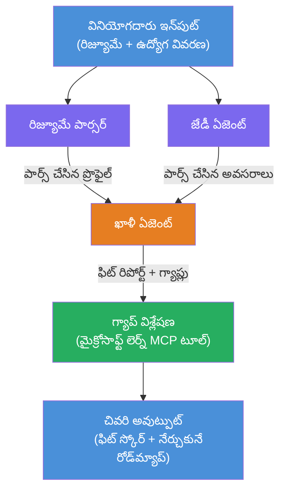

# ల్యాబ్ 02 - బహు-ఏజెంట్ పని ప్రవాహం: సివిలీ → ఉద్యోగ తగిన అంచనా

---

## మీరేమి నిర్మించబోతున్నారు

ఒక **సివిలీ → ఉద్యోగ తగిన అంచనా** - నాలుగు ప్రత్యేక ఏజెంట్లు కలిసి అభ్యర్థి సివిలి వ్యాసతే ఉద్యోగ వివరణకు ఎంతవరకు సరిపోతుందో అంచనా వేస్తారు, తరువాత తగిలిన ఖాళీలను మూసే వ్యక్తిగత అభ్యసన ప్రణాళికను రూపొందిస్తారు.

### ఏజెంట్లు

| ఏజెంట్ | పాత్ర |
|-------|------|
| **సివిలీ పార్సర్** | సివిలీ టెక్స్ట్ నుంచి నిర్మిత నైపుణ్యాలు, అనుభవం, సర్టిఫికెట్లను తీయడం |
| **ఉద్యోగ వివరణ ఏజెంట్** | JD నుండి అవసరమైన/ప్రాధాన్యమైన నైపుణ్యాలు, అనుభవం, సర్టిఫికెట్లను తీయడం |
| **మ్యాచింగ్ ఏజెంట్** | ప్రొఫైల్ మరియు అవసరాలను కనుగొనడం → తగిన స్కోరు (0-100) + సరిపోతున్న/కేదిలేవి నైపుణ్యాలు |
| **ఖాళీ విశ్లేషకుడు** | వనరులు, కాలపాలికలు, సులభ విజయం ప్రాజెక్టులతో వ్యక్తిగత అభ్యసన ప్రణాళికను రూపొందించటం |

### డెమో ప్రవాహం

**సివిలీ + ఉద్యోగ వివరణ**ను అప్‌లోడ్ చేయండి → **ఫిట్ స్కోరు + ఎక్కడెక్కడ నైపుణ్యాలు లేవో** పొందండి → **వ్యక్తిగత అభ్యసన ప్రణాళిక**ను అందుకోండి.

### పని ప్రవాహ నిర్మాణం

> పర్పుల్ = సరిహద్దులు ఏజెంట్లు | ఒరేంజ్ = సమాహరణ బిందువు | గ్రీన్ = సాధనాలతో తుది ఏజెంట్. వివరణాత్మక диаг్రామ్లు మరియు అంశ ప్రవాహాలకు [Module 1 - Understand the Architecture](docs/01-understand-multi-agent.md) మరియు [Module 4 - Orchestration Patterns](docs/04-orchestration-patterns.md) చూడండి.

### వ్యవహారించిన విషయం

- **WorkflowBuilder** ఉపయోగించి బహుఏజెంట్ పని ప్రవాహం సృష్టించడం
- ఏజెంట్ పాత్రలు మరియు పని ప్రవాహ నిర్వచనం (సరిహద్దులు + క్రమం)
- ఏజెంట్ల మధ్య కమ్యూనికేషన్ నమూనాలు
- Agent Inspector తో లోకల్ పరీక్ష
- Foundry Agent Service కు బహుఏజెంట్ పని ప్రవాహాలను పంపడం

---

## ముందస్తు అవసరాలు

ల్యాబ్ 01 పూర్తి చేసుకోండి తప్పక:

- [ల్యాబ్ 01 - సింగిల్ ఏజెంట్](../lab01-single-agent/README.md)

---

## ప్రారంభించండి

పూర్తి సెటప్ సూచనలు, కోడ్ వాక్‌థ్రూ, టెస్ట్ ఆదేశాలను చూడండి:

- [ల్యాబ్ 2 డాక్స్ - ముందస్తు అవసరాలు](docs/00-prerequisites.md)
- [ల్యాబ్ 2 డాక్స్ - పూర్తి అభ్యసన మార్గం](docs/README.md)
- [PersonalCareerCopilot నడపగల గైడ్](PersonalCareerCopilot/README.md)

## బ్యాటరీ అమలు విధానాలు (ఏజెంట్ ప్రత్యామ్నాయాలు)

ల్యాబ్ 2 లో డిఫాల్ట్ **సరిహద్దులు → సమాహరణ → ప్లానర్** ప్రవాహం ఉంది, అలాగే docs మరింత బలమైన ఏజెంటిక్ ప్రవర్తన వివరించేందుకు ప్రత్యామ్నాయ నమూనాలను వివరిస్తాయి:

- **ఫ్యాన్-అవుట్ / ఫ్యాన్-ఇన్ వేటెడ్ కన్సెన్సస్ తో**
- **తుది ప్రణాళిక ముందు సమీక్షకుడి/వ్యాఖ్యాతా పాస్**
- **షరతు రౌటర్** (ఫిట్ స్కోరు మరియు లేమి నైపుణ్యాలపై మార్గం ఎంపిక)

చూడు [docs/04-orchestration-patterns.md](docs/04-orchestration-patterns.md).

---

**మునుపటి:** [ల్యాబ్ 01 - సింగిల్ ఏజెంట్](../lab01-single-agent/README.md) · **తిరిగి:** [వర్క్‌షాప్ హోమ్](../../README.md)

---

<!-- CO-OP TRANSLATOR DISCLAIMER START -->
**అవగాహన**:  
ఈ పత్రం AI అనువాద సేవ [Co-op Translator](https://github.com/Azure/co-op-translator) ఉపయోగించి అనువదించబడింది. సరైనత కోసం మేము ప్రయత్నిస్తూనే ఉన్నా, ఆటోమేటెడ్ అనువాదాలలో పొరపాట్లు లేదా అసంపూర్ణతలు ఉండవచ్చు. సహజ భాషలో ఉన్న అసలు పత్రమే అధికారిక మూలం కాబట్టి దాన్ని ప్రామాణికంగా పరిగణించాలి. ముఖ్యమైన సమాచారం కోసం, ప్రొఫెషనల్ మానవ అనువాదం చేయించుకోవడం సూచించబడింది. ఈ అనువాదం వలన కలిగే పొరపాట్లు లేదా అర్థమవ్వకపోతే మేము బాధ్యులు కాకపోవడం कृపయా గమనించండి.
<!-- CO-OP TRANSLATOR DISCLAIMER END -->