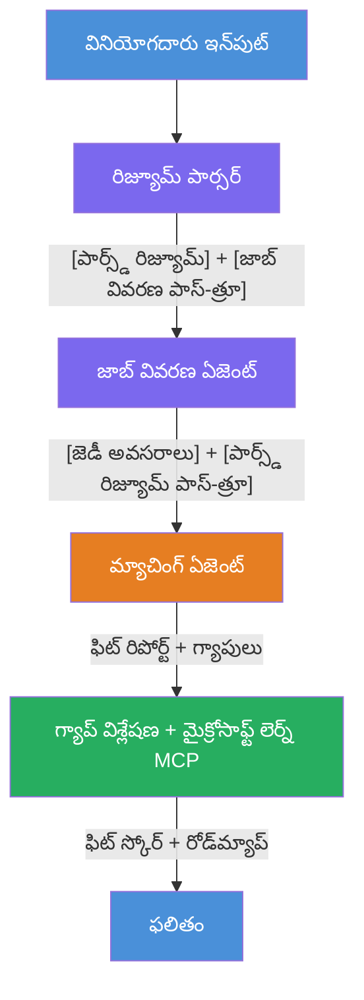

# ల్యాబ్ 02 - బహుళ-ఏజెంట్ వర్క్‌ఫ్లో: రిజ్యూమ్ → ఉద్యోగ సరిపోయే నిర్ధారకుడు

## అవలోకనం

ఈ హ్యాండ్స్-ఆన్ ల్యాబ్‌లో, మీరు VS కోడ్‌లో ఫౌండ్రీ టూల్కిట్ ఉపయోగించి **వర్క్‌ఫ్లో-ఫస్ట్ బహుళ-ఏజెంట్ యాప్**‌ని నిర్మించి, దాన్ని మైక్రోసాఫ్ట్ ఫౌండ్రీ ఏజెంట్ సర్వీస్‌కు పంపిణీ చేస్తారు.

**మీరు నిర్మించేది:** ఒక రిజ్యూమ్ → ఉద్యోగ సరిపోయే నిర్థారకుడు, ఇది రిజ్యూమ్ మరియు ఉద్యోగ వివరణని విశ్లేషించి, సరిపోకును స్కోర్ చేసి, మైక్రోసాఫ్ట్ లెర్న్ వనరులతో వ్యక్తిగతీకరించిన అభ్యాస మార్గదర్శకం తయారు చేస్తుంది.

---

## వాస్తవికరచన

```mermaid
flowchart TD
    A["వినియోగదారు ఇన్‌పుట్"] --> B["రిజ్యూమ్ పార్సర్"]
    B -->|"[పార్స్డ్ రిజ్యూమ్] + [జాబ్ వివరణ పాస్-త్రూ]"| C["జాబ్ వివరణ ఏజెంట్"]
    C -->|"[జెడీ అవసరాలు] + [పార్స్డ్ రిజ్యూమ్ పాస్-త్రూ]"| D["మ్యాచింగ్ ఏజెంట్"]
    D -->|ఫిట్ రిపోర్ట్ + గ్యాపులు| E["గ్యాప్ విశ్లేషణ + మైక్రోసాఫ్ట్ లెర్న్ MCP"]
    E -->|ఫిట్ స్కోర్ + రోడ్‌మ్యాప్| F["ఫలితం"]

    style A fill:#4A90D9,color:#fff
    style B fill:#7B68EE,color:#fff
    style C fill:#7B68EE,color:#fff
    style D fill:#E67E22,color:#fff
    style E fill:#27AE60,color:#fff
    style F fill:#4A90D9,color:#fff
```

**ఇది ఎలా పనిచేస్తుంది:**
1. వినియోగదారు రిజ్యూమ్ మరియు ఉద్యోగ వివరణను పేస్ట్ చేస్తాడు.
2. **ResumeParser** రిజ్యూమ్‌ను విశ్లేషించి ఉద్యోగ వివరణను మార్పు లేని రూపంలో `[JOB DESCRIPTION PASS-THROUGH]` విభాగంలో కాపీ చేస్తుంది.
3. **JD Agent** పాస్-త్రమ్ నుంచి నిర్మిత డేటా అవసరాలను తీసుకుని, `[PARSED RESUME]`ని `[PARSED RESUME PASS-THROUGH]`గా ముందుకు పంపుతుంది.
4. **MatchingAgent** `[PARSED RESUME PASS-THROUGH]` మరియు `[JD REQUIREMENTS]`తో సరిపోల్చి ఫిట్ స్కోర్ తయారు చేస్తుంది.
5. **GapAnalyzer** లోపాలను ప్రాక్టికల్ మార్గదర్శకంగా మార్చి MCP ద్వారా ఒరిజినల్ మైక్రోసాఫ్ట్ లెర్న్ లింకులను తీసుకుని వస్తుంది.

---

## ముందు అవసరాలు

ముందుగా ల్యాబ్ 01 పూర్తి చేయండి:

- [Lab 01 - Single Agent](../lab01-single-agent/README.md)

---

## భాగం 1: మాడ్యూల్స్ ని క్రమంగా చదవండి

పూర్తి అభ్యాస మార్గాన్ని చూడండి:

- [Lab 2 Docs - Prerequisites](docs/00-prerequisites.md)
- [Lab 2 Docs - Full Learning Path](docs/README.md)
- [PersonalCareerCopilot run guide](PersonalCareerCopilot/README.md)

---

## భాగం 2: వర్క్‌ఫ్లోని నిర్మించి పరీక్షించండి

1. ఫౌండ్రీ టూల్కిట్ విజార్డ్ను ఉపయోగించి వర్క్‌ఫ్లో ఆధారిత ప్రాజెక్టును స్కాఫోల్డ్ చేయండి.
2. `PersonalCareerCopilot/main.py` నుండి ప్రాంప్ట్ బ్లాక్స్ మరియు వర్క్‌ఫ్లో గ్రాఫ్‌ను మీ వర్క్‌స్పేస్‌లో కాపీ చేయండి.
3. ఏజెంట్ ఇన్‌స్పెక్టర్‌తో స్థానికంగా రన్ చేసి నాలుగు ఏజెంట్లు మరియు MCP టూల్‌ను ధృవీకరించండి.
4. స్థానిక పరీక్షల విజయవంతమైనప్పుడు హోస్టెడ్ ఏజెంటును ఫౌండ్రీకు పంపండి.

---

## సమన్వయ నమూనాలు

ల్యాబ్ 02 డీఫాల్ట్ **ఫ్యాన్-అవుట్ → ఫ్యాన్-ఇన్ → వరుస** ప్రవాహాన్ని కలిగి ఉంది, మరియు డాక్యుమెంట్స్ ప్రయోగాత్మకత కోసం ప్రత్యామ్నాయ సమన్వయ నమూనాలను కూడా వివరిస్తాయి.

- **బరువు కలిగిన సమ్మతితో ఫ్యాన్-అవుట్/ఫ్యాన్-ఇన్**
- **సమీక్షకుడు/వ్యాఖ్యాత సూచన చివరి మార్గదర్శకానికి ముందు**
- **ఫిట్ స్కోర్ మరియు లేని నైపుణ్యాల ఆధారంగా షరతులు ఉన్న రౌటర్**

[docs/04-orchestration-patterns.md](docs/04-orchestration-patterns.md) చూడండి.

---

**మునుపటి:** [Lab 01 - Single Agent](../lab01-single-agent/README.md) · **వెనుకకి:** [Workshop Home](../../README.md)

---

<!-- CO-OP TRANSLATOR DISCLAIMER START -->
**అస్వీకరణ**:
ఈ పత్రం AI అనువాద సేవ [Co-op Translator](https://github.com/Azure/co-op-translator) ఉపయోగించి అనువదించబడింది. మేము ఖచ్చితత్వానికి ప్రయత్నిస్తున్నప్పటికీ, ఆటోమేటెడ్ అనువాదాలు తప్పులు లేదా అసమగ్రతలను కలిగి ఉండవచ్చు. దాని స్వదేశ భాషలో ఉన్న అసలు పత్రాన్ని అధికారం కలిగిన మూలంగా పరిగణించాలి. కీలకమైన సమాచారం కోసం, ప్రొఫెషనల్ మానవ అనువాదాన్ని సిఫారసు చేస్తాము. ఈ అనువాదం ఉపయోగం వల్ల కలిగే ఏవైనా అపార్థాలు లేదా తప్పుదారులు కోసం మేము బాధ్యత వహించము.
<!-- CO-OP TRANSLATOR DISCLAIMER END -->