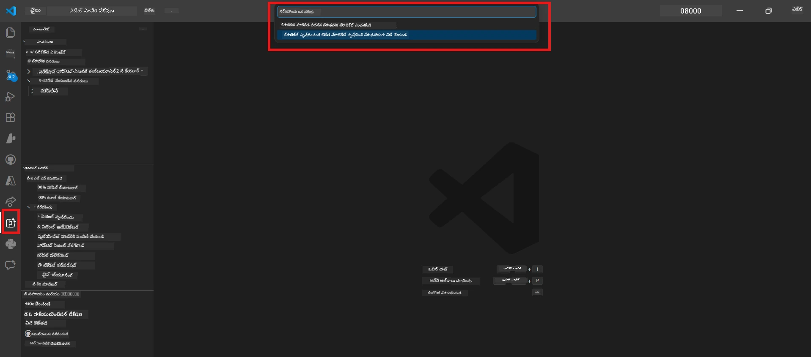

# మాడ్యుల్ 0 - ప్రాథమికాలు

ల్యాబ్ 02 ప్రారంభించడానికి ముందుగా, మీరు క్రింది విషయాలను పూర్తిచేసుకున్నారో లేదో నిర్ధారించుకోండి. ఈ ల్యాబ్ బాగా ల్యాబ్ 01 పై ఆధారపడి ఉంటుంది - దానిని మిస్ కాకుండా పూర్తిచేయండి.

---

## 1. ల్యాబ్ 01 పూర్తి చేయండి

ల్యాబ్ 02 అనుకుంటుంది మీరు ఇప్పటికే:

- [x] [ల్యాబ్ 01 - సింగిల్ ఏజెంట్](../../lab01-single-agent/README.md) యొక్క అన్ని 8 మాడ్యూల్స్ పూర్తి చేసుకున్నారు
- [x] సింగిల్ ఏజెంట్ని Foundry Agent సర్వీస్కి విజయవంతంగా డిప్లాయ్ చేసుకున్నారు
- [x] ఏజెంట్ స్థానిక ఏజెంట్ ఇన్‌స్పెక్టర్ మరియు Foundry ప్లేగ్రౌండ్ రెండింటిలోనూ పనిచేస్తుంది అని ధృవీకరించారు

మీరు ల్యాబ్ 01 పూర్తి చేయకపోతే, ఎక్కడైనా తిరిగి వెళ్లి ఇప్పుడే పూర్తి చేసుకోండి: [ల్యాబ్ 01 డాక్స్](../../lab01-single-agent/docs/00-prerequisites.md)

---

## 2. ఉన్న సెటప్‌ను ధృవీకరించండి

ల్యాబ్ 01 నుండి అన్ని టూల్స్ ఇంకా ఇన్‌స్టాల్ అయి వాడుకలో ఉండాలి. ఈ త్వరిత విమర్శనలను అమలు పెట్టండి:

### 2.1 ఆజూర్ CLI

```powershell
az account show --query "{name:name, id:id}" --output table
```

అంచనా: మీ సబ్‌స్క్రిప్షన్ పేరు మరియు ID చూపిస్తుంది. ఇది విఫలమైతే, [`az login`](https://learn.microsoft.com/cli/azure/authenticate-azure-cli-interactively) ను అమలు చేయండి.

### 2.2 VS కోడ్ ఎక్స్‌టెన్షన్స్

1. `Ctrl+Shift+P` → టైపు చేయండి **"Microsoft Foundry"** → మీరు కమాండ్లు (ఉదా., `Microsoft Foundry: Create a New Hosted Agent`) చూస్తున్నారా అని ధృవీకరించండి.
2. `Ctrl+Shift+P` → టైపు చేయండి **"Foundry Toolkit"** → మీరు కమాండ్లు (ఉదా., `Foundry Toolkit: Open Agent Inspector`) చూస్తున్నారా అని ధృవీకరించండి.

### 2.3 Foundry ప్రాజెక్ట్ & మోడల్

1. VS కోడ్ యాక్టివిటీ బార్‌లోని **Microsoft Foundry** ఐకాన్ క్లిక్ చేయండి.
2. మీ ప్రాజెక్ట్ జాబితాలో ఉందా అని ధృవీకరించండి (ఉదా., `workshop-agents`).
3. ప్రాజెక్ట్ విస్తరించండి → ఒక మోడల్ డిప్లాయ్ అయి ఉందా (ఉదా., `gpt-4.1-mini`) మరియు స్థితి **Succeeded** ఉందా అని నిర్ధారించండి.

> **మీ మోడల్ డిప్లాయ్మెంట్ గడువు ముగిసిందా:** కొన్ని ఉచిత-திரాయ్ డిప్లాయ్‌మెంట్‌లు ఆటోమేటిక్‌గా గడువు ముగిస్తున్నాయి. [మోడల్ కాటలాగ్](https://learn.microsoft.com/azure/foundry/foundry-models/concepts/models-sold-directly-by-azure) నుండి మళ్లీ డిప్లాయ్ చేయండి (`Ctrl+Shift+P` → **Microsoft Foundry: Open Model Catalog**).



### 2.4 RBAC పాత్రలు

మీ Foundry ప్రాజెక్ట్‌లో మీకు **Azure AI User** పాత్ర ఉందా అని నిర్ధారించండి:

1. [Azure Portal](https://portal.azure.com) → మీ Foundry **ప్రాజెక్ట్** వనరు → **Access control (IAM)** → **[Role assignments](https://learn.microsoft.com/azure/foundry/concepts/rbac-foundry)** ట్యాబ్.
2. మీ పేరును వెతకండి → **[Azure AI User](https://aka.ms/foundry-ext-project-role)** జాబితాలో ఉందా అని ధృవీకరించండి.

---

## 3. బహుఏజెంట్ కాన్సెప్ట్‌లను అర్థం చేసుకోండి (ల్యాబ్ 02 కోసం కొత్తది)

ల్యాబ్ 02 లో ల్యాబ్ 01 లో కవర్ చేయని కొత్త కాన్సెప్ట్‌లను పరిచయం చేస్తుంది. ముందుగా వీటిని చదవండి:

### 3.1 బహుఏజెంట్ వర్క్‌ఫ్లో అంటే ఏమిటి?

ఒక ఏజెంట్ అన్ని పనులు చేయడం కాకుండా, **బహుఏజెంట్ వర్క్‌ఫ్లో** కొన్ని ప్రత్యేక ఏజెంట్ల మధ్య పని విభజిస్తుంది. ప్రతి ఏజెంట్‌కి:

- ఇది తీసుకునే తన స్వంత **निर्दేశాలు** (సిస్టమ్ ప్రాంప్ట్)
- ఇది బాధ్యత వహించే తన స్వంత **పాత్ర** (ఏ పని చేయాలో)
- ఐచ్ఛిక **సామాన్యాలు** (ఫంక్షన్లు ఇది కాల్ చేయవచ్చు)

ఏజెంట్లు ఒక **ఆర్కెస్ట్రేషన్ గ్రాఫ్** ద్వారా కమ్యూనికేట్ చేస్తాయి, ఇది డేటా వారు ఒకరినొకరు ఎలా పంపిస్తారో నిర్వచిస్తుంది.

### 3.2 WorkflowBuilder

`agent_framework` నుండి [`WorkflowBuilder`](https://learn.microsoft.com/agent-framework/workflows/agents-in-workflows) క్లాస్ ఏజెంట్లను కలిపి వర్క్‌ఫ్లోని రూపొందించే SDK భాగం:

```python
from agent_framework import WorkflowBuilder

workflow = (
    WorkflowBuilder(
        name="MyWorkflow",
        start_executor=agent_a,
        output_executors=[agent_d],
    )
    .add_edge(agent_a, agent_b)
    .add_edge(agent_a, agent_c)
    .add_edge(agent_b, agent_d)
    .add_edge(agent_c, agent_d)
    .build()
)
```

- **`start_executor`** - మొదటి ఏజెంట్, ఇది యూజర్ ఇన్‌పుట్ అందుకుంటుంది
- **`output_executors`** - అవి ఏజెంట్లు, వీటి అవుట్పుట్ చివరి సమాధానం అవుతుంది
- **`add_edge(source, target)`** - `target` కి `source` యొక్క అవుట్పుట్ అందే విధంగా నిర్వచిస్తుంది

### 3.3 MCP (మోడల్ కాంటెక్స్ట్ ప్రోటోకాల్) టూల్స్

ల్యాబ్ 02 లో Microsoft Learn APIని పిలిచి లెర్నింగ్ వనరులను తీసుకునే **MCP టూల్** ఉపయోగిస్తుంది. [MCP (మోడల్ కాంటెక్స్ట్ ప్రోటోకాల్)](https://modelcontextprotocol.io/introduction) అనేది AI మోడల్స్‌ను బాహ్య డేటా స్రోతాలు మరియు టూల్స్‌కు కనెక్ట్ చేసే ఒక ప్రమాణీకృత ప్రోటోకాల్.

| పదం | నిర్వచనం |
|------|----------|
| **MCP సర్వర్** | [MCP ప్రోటోకాల్](https://learn.microsoft.com/azure/foundry/agents/how-to/tools/model-context-protocol) ద్వారా టూల్స్/వనరులను అందించే సేవ |
| **MCP క్లయింట్** | MCP సర్వర్ కు కనెక్ట్ అయి దాని టూల్స్‌ని పిలిచే ఏజెంట్ కోడ్ |
| **[స్ట్రీమబుల్ HTTP](https://learn.microsoft.com/agent-framework/agents/tools/hosted-mcp-tools)** | MCP సర్వర్‌తో కమ్యూనికేట్ చేయడానికి వాడే ట్రాన్స్‌పోర్ట్ పద్ధతి |

### 3.4 ల్యాబ్ 02 ఎలా ల్యాబ్ 01 నుండి భిన్నం

| అంశం | ల్యాబ్ 01 (సింగిల్ ఏజెంట్) | ల్యాబ్ 02 (బహుఏజెంట్) |
|--------|-----------------------|--------------------|
| ఏజెంట్స్ | 1 | 4 (పరిశోధిత పాత్రలు) |
| ఆర్కెస్ట్రేషన్ | లేదు | WorkflowBuilder (సమాంతర + క్రమబద్ధమైన) |
| టూల్స్ | ఐచ్ఛిక `@tool` ఫంక్షన్ | MCP టూల్ (బాహ్య API కాల్) |
| క్లిష్టత | సింపుల్ ప్రాంప్ట్ → సమాధానం | రిజ్యూమ్ + JD → ఫిట్ స్కోరు → రోడ్‌మ్యాప్ |
| కాంటెక్స్ట్ ప్రవాహం | ప్రత్యక్షం | ఏజెంట్-కు-ఏజెంట్ హ్యాండ్‌ఆఫ్ |

---

## 4. ల్యాబ్ 02 కోసం వర్క్‌షాప్ రిపాజిటరీ నిర్మాణం

ల్యాబ్ 02 ఫైళ్లున్న చోటు మీకు తెలుసు కాబట్టి నిర్ధారించుకోండి:

```
workshop/
└── lab02-multi-agent/
    ├── README.md                       ← Lab overview
    ├── docs/                           ← You are here
    │   ├── README.md                   ← Learning path index
    │   ├── 00-prerequisites.md         ← This file
    │   ├── 01-understand-multi-agent.md
    │   ├── ...
    │   └── 08-troubleshooting.md
    └── PersonalCareerCopilot/          ← The agent project
        ├── agent.yaml                  ← Agent definition
        ├── main.py                     ← 4-agent workflow code
        ├── Dockerfile                  ← Container configuration
        └── requirements.txt            ← Python dependencies
```

---

### చెక్పాయింట్

- [ ] ల్యాబ్ 01 పూర్తిగా పూర్తి అయింది (అన్ని 8 మాడ్యూల్స్, ఏజెంట్ డిప్లాయ్ చేసి ధృవీకరించింది)
- [ ] `az account show` మీ సబ్‌స్క్రిప్షన్ చూపిస్తుంది
- [ ] Microsoft Foundry మరియు Foundry Toolkit ఎక్స్‌టెన్షన్స్ ఇన్‌స్టాల్ అయి స్పందిస్తున్నారు
- [ ] Foundry ప్రాజెక్ట్‌లో ఒక మోడల్ డిప్లాయ్ ఉంది (ఉదా: `gpt-4.1-mini`)
- [ ] మీకు ప్రాజెక్ట్ పై **Azure AI User** పాత్ర ఉంది
- [ ] మీరు పై బహుఏజెంట్ కాన్సెప్ట్‌ల విభాగం చదివి WorkflowBuilder, MCP, ఏజెంట్ ఆర్కెస్ట్రేషన్ ను అర్థం చేసుకున్నారు

---

**తదుపరి:** [01 - బహుఏజెంట్ ఆర్కిటెక్చర్ అర్థం చేసుకోండి →](01-understand-multi-agent.md)

---

<!-- CO-OP TRANSLATOR DISCLAIMER START -->
**నిరసనం**:  
ఈ పత్రం AI అనువాద సేవ [Co-op Translator](https://github.com/Azure/co-op-translator) ఉపయోగించి అనువదించబడింది. మేము ఖచ్చితత్వానికి ప్రయత్నిస్తున్నప్పటికీ, స్వయంచాలక అనువాదాలలో పొరపాట్లు లేదా అసంపూర్ణతలు ఉండవచ్చని దయచేసి గమనించండి. స్వదేశీ భాషలో అసలు పత్రాన్ని అధికారిక మూలంగా పరిగణించాలి. కీలక సమాచారం కోసం, నిపుణుల చేతి అనువాదం సిఫార్సు చేయబడుతుంది. ఈ అనువాదం ఉపయోగం వల్ల ఉద్భవించే ఏవైనా అపార్థాలు లేదా తప్పుదిద్దుకులు కోసం మేము బాధ్యత వహించము.
<!-- CO-OP TRANSLATOR DISCLAIMER END -->