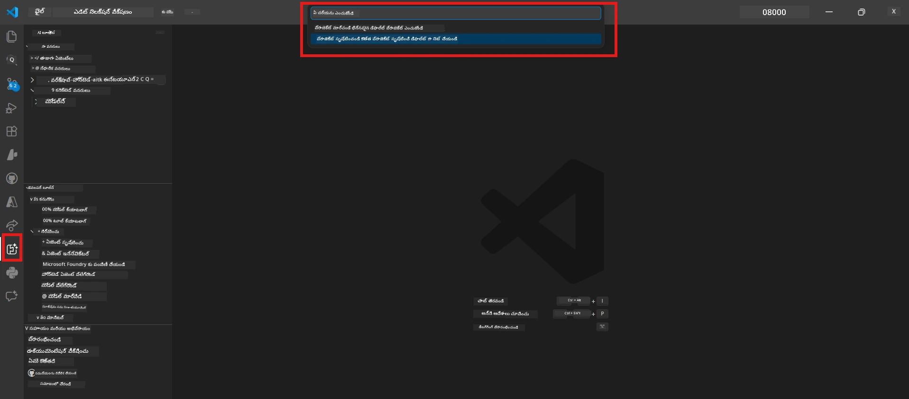

# మాడ్యూల్ 0 - పరిచయం

⏱️ ~10 నిమిషాలు

> [!WARNING]
> **ప్రివ్యూ & పరిమితులు:** [Hosted Agents](https://learn.microsoft.com/azure/foundry/agents/concepts/hosted-agents) ప్రస్తుతం **పబ్లిక్ ప్రివ్యూ** లో ఉన్నాయి - ప్రొడక్షన్ పనికి సిఫార్సు చేయబడడం లేదు. ఈ వర్క్‌షాప్‌లో చూపబడిన కొన్ని ఫీచర్లు సర్వీస్ GA వైపు కదలికతో మారవచ్చు.

## మీరు నిర్మించదలచుకున్నది

ఈ లాబ్‌లో, మీరు Lab 01 నుండి ఏకైక ఏజెంటు నైపుణ్యాలను విస్తరించి **బహుస్థాయి ఏజెంట్స్ వర్క్‌ఫ్లో**ను - Resume → Job Fit Evaluatorను నిర్మిస్తారు.

మీరు ఒక **రెజ్యూమె** మరియు ఒక **ఉద్యోగ వివరణ**ని పేస్ట్ చేస్తారు. నాలుగు ప్రత్యేక ఏజెంట్లు ఇన్పుట్ ను క్రమంగా ప్రాసెస్ చేసి, తర్వాత ఇవ్వబడతాయి:
- ఒక ఫిట్ స్కోర్ (0–100 స్కోరింగ్ విభజనతో)
- స్కిల్స్ మరియు సర్టిఫికేషన్ గ్యాప్ లిస్ట్
- ప్రతి గ్యాప్‌కు సంబంధించిన Microsoft Learn లింకులతో వ్యక్తిగత అభ్యాస రోడ్‌మ్యాప్

**వర్క్‌ఫ్లో ఈ క్రింది వాటిని ఉపయోగిస్తుంది:**
- **Microsoft Agent Framework** - క్రమప్రవాహం pipeలైన్ ఆర్కెస్ట్రేషన్ కోసం `WorkflowBuilder`
- **Foundry Toolkit for VS Code** - స్కాఫోల్డ్, స్థానికంగా పరీక్షించు, డిప్లాయ్ చేయు
- **ఒక AI మోడల్** (ఉదా. `gpt-4.1-mini`) - నాలుగు ఏజెంట్లందరికీ ఉపయోగిస్తారు
- **Microsoft Learn MCP సర్వర్** - ప్రతి స్కిల్ గ్యాప్ కి వాస్తవ అభ్యాస వనరు లింకులను అందించడం

---

## మీ మార్గాన్ని ఎంచుకోండి

> ⚠️ **Lab 01 లో మీరు ఉపయోగించిన అదే మార్గంతో కొనసాగించండి.**

<details open>
<summary><strong>🅰️ మార్గం A - Azure క్లౌడ్ (Azure సబ్‌స్క్రిప్షన్ అవసరం)</strong></summary>

| | వివరాలు |
|---|---|
| **ఇది ఎవరికైనా?** | మీరు Lab 01 ను Azure సబ్‌స్క్రిప్షన్ ఉపయోగించి పూర్తి చేసారు |
| **మోడల్** | Foundry ద్వారా Azure OpenAI (ఉదా. `gpt-4.1-mini`) |
| **మాడ్యూల్స్ కవర్ చేసినవి** | అన్ని మాడ్యూల్స్ (00–09) |
| **క్లౌడ్‌కు డిప్లాయ్ చేస్తారా?** | ✅ అవును - పూర్తి ఎండ్-టు-ఎండ్ డిప్లాయ్‌మెంట్ |

</details>

<details open>
<summary><strong>🅱️ మార్గం B - Foundry లోకల్ (Azure సబ్‌స్క్రిప్షన్ అవసరం లేదు)</strong></summary>

| | వివరాలు |
|---|---|
| **ఇది ఎవరికైనా?** | మీరు Lab 01 Foundry లోకల్ ఉపయోగించి పూర్తి చేసారు |
| **మోడల్** | Foundry లోకల్ (ఉచితం, మీ మెషీన్‌పై నడుస్తుంది) |
| **మాడ్యూల్స్ కవర్ చేసినవి** | మాడ్యూల్స్ 00–05 (06–07 డిప్లాయ్ & క్లౌడ్ వెరిఫై మిస్సింగ్) |
| **క్లౌడ్‌కు డిప్లాయ్ చేస్తారా?** | ❌ లేదు - ఏజెంట్ ఇన్స్పెక్టర్ ద్వారా స్థానిక పరీక్షలనే నిర్వహిస్తుంది |

</details>

---

## Lab 01 తనిఖీ

Lab 02 నేరుగా Lab 01 పైన నిర్మించబడింది. ఇక్కడ మొదలు పెట్టేముందు Lab 01 ను పూర్తి చేయండి.

Lab 01 ఇంకా చేయలేదా? ఇక్కడ ప్రారంభించండి: [Lab 01 - పరిచయం](../../lab01-single-agent/docs/00-prerequisites.md)

<details open>
<summary><strong>🅰️ మార్గం A - Azure క్లౌడ్</strong></summary>

```powershell
az account show --query "{name:name, id:id}" --output table
```

ఇది విఫలమైతే, `az login` రన్ చేయండి. తర్వాత VS Code లో ధృవీకరించండి:

1. `Ctrl+Shift+P` → టైప్ చేయండి **Foundry Toolkit** → ఆదేశాలు కనిపిస్తాయో చూడండి.
2. **Foundry Toolkit** ఐకాన్‌పై క్లిక్ చేసి → మీ ప్రాజెక్ట్ మరియు డిప్లోయ్ చేసిన మోడల్ **Succeeded** చూపిస్తుందో చూడండి.



> **RBAC:** మీరు Lab 01 లో **Foundry User** నియమించారు. మళ్లీ నియమించుకోవలసినది ఉంటే, [Lab 01, Module 1](../../lab01-single-agent/docs/01-setup.md#deploy-a-model--assign-rbac) చూడండి. గతంలో ఈ పాత్రకు **Azure AI User** అని పిలవబడింది - అదే అనుమతులు.

</details>

<details open>
<summary><strong>🅱️ మార్గం B - Foundry లోకల్</strong></summary>

```powershell
Invoke-WebRequest -Uri "http://localhost:5273/v1/health" -UseBasicParsing | Select-Object StatusCode
```

అంచనా: `StatusCode: 200`. కాదు అయితే, Foundry Toolkit సైడ్బార్ నుండి Foundry లోకల్ ను రీస్టార్ట్ చేయండి.

> అందులో అన్నీ ఇన్ఫరెన్స్ మీ మెషీన్‌పై జరుగుతుంది. ఒకటేన outbound కాల్ MCP టూల్ ద్వారా `https://learn.microsoft.com/api/mcp` కి.

</details>

---

## Lab 02 లో కొత్తది ఏమిటి

| | Lab 01 | Lab 02 |
|--|--------|--------|
| ఏజెంట్లు | 1 | 4 (WorkflowBuilder తో చైన్డ్) |
| స్కాఫోల్డ్ టెంప్లేట్ | బేసిక్ - Agent Framework | వర్క్‌ఫ్లో - Agent Framework |
| కొత్త ప్యాకేజీ | - | `mcp` |
| ఆర్కెస్ట్రేషన్ | ఒక్కడి సంభాషణ ఏజెంట్ | క్రమంగా pipeline (WorkflowBuilder) |
| కొత్త సాధనం | - | `search_microsoft_learn_for_plan` (MCP) |

---

**తదుపరి:** [01 - ఆర్కిటెక్చర్‌ను అర్ధం చేసుకోండి →](01-understand-multi-agent.md)

---

<!-- CO-OP TRANSLATOR DISCLAIMER START -->
**అస్వీకరణ**:
ఈ పత్రం AI అనువాద సేవ [Co-op Translator](https://github.com/Azure/co-op-translator) ఉపయోగించి అనువదించబడింది. మేము ఖచ్చితత్వానికి ప్రయత్నిస్తున్నప్పటికీ, ఆటోమేటెడ్ అనువాదాలు తప్పులు లేదా అసమగ్రతలను కలిగి ఉండవచ్చు. దాని స్వదేశ భాషలో ఉన్న అసలు పత్రాన్ని అధికారం కలిగిన మూలంగా పరిగణించాలి. కీలకమైన సమాచారం కోసం, ప్రొఫెషనల్ మానవ అనువాదాన్ని సిఫారసు చేస్తాము. ఈ అనువాదం ఉపయోగం వల్ల కలిగే ఏవైనా అపార్థాలు లేదా తప్పుదారులు కోసం మేము బాధ్యత వహించము.
<!-- CO-OP TRANSLATOR DISCLAIMER END -->