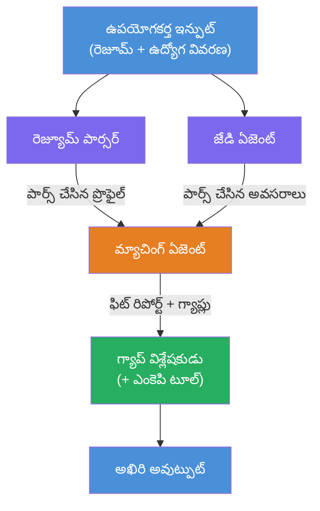
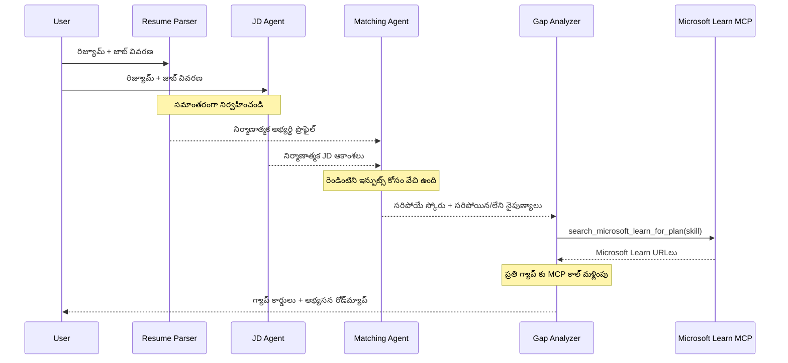
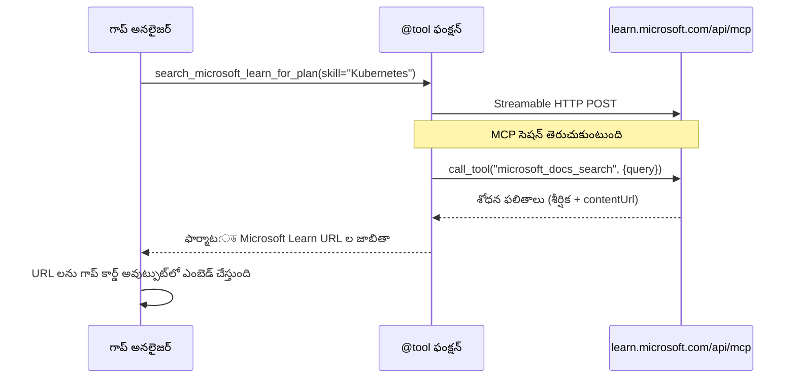

# మాడ్యుల్ 1 - మల్టీ-ఏజెంట్ ఆర్కిటెక్చర్‌ను అర్థం చేసుకోండి

ఈ మాడ్యూల్‌లో, మీరు Resume → Job Fit Evaluator ఆర్కిటెక్చర్‌ను ఏ కోడ్ రాయకముందు నేర్చుకుంటారు. ఆర్కెస్ట్రేషన్ గ్రాఫ్, ఏజెంట్ పాత్రలు, మరియు డేటా ఫ్లో అర్థం చేసుకోవడం [మల్టీ-ఏజెంట్ వర్క్‌ఫ్లోలను](https://learn.microsoft.com/azure/architecture/ai-ml/idea/multiple-agent-workflow-automation) డీబగ్ చేయడానికి మరియు పొడిగించడానికి చాలా ముఖ్యము.

---

## ఇది పరిష్కరించే సమస్య

రెజ్యుమేను ఓ జాబ్ వివరణకు సరిపోల్చడం అనేది అనేక వేర్వేరు నైపుణ్యాలను అవసరం చేస్తుంది:

1. **పార్సింగ్** - అసంస్థిత టెక్స్ట్ (రెజ్యుమే) నుండి నిర్మిత డేటాను ఎగుమతి చేయడం
2. **విశ్లేషణ** - జాబ్ వివరణ నుండి అవసరాలు ఎగుమతి చేయడం
3. **తూచి చూడటం** - రెండింటి సరిపోలిక స్కోరు చేయడం
4. **ప్రణాళిక** - లోటు నెరవేర్చడానికి నేర్పే రోడ్‌మ్యాప్ తయారు చేయడం

ఒకే ఏజెంట్ ఒక్కప్పుడు ఈ నాలుగు పనులను చేసే ప్రయత్నం చేస్తే:
- పూర్తి కాకపోయిన ఎగుమతి (స్కోరు చేయడానికి పార్సింగ్‌కు తొందరపడతుంది)
- లోతైన స్కోరింగ్ లేకపోవడం (సాక్ష్యాధారపు విభజన లేదు)
- సాధారణ రోడ్‌మ్యాప్‌లు (నిర్దిష్ట లోటులకు అనుగుణంగా లేవు)

పదిలా **నలుగురు ప్రత్యేక ఏజెంట్లుగా** విభజించి, ఒక్కొక్కరు వారి పనిపై నిర్దిష్ట సూచనలతో దృష్టి పెట్టి ప్రతి దశలో ఉన్నత-నాణ్యత ఉత్పత్తిని అందిస్తారు.

---

## నలుగురు ఏజెంట్లు

ప్రతి ఏజెంట్ `AzureAIAgentClient.as_agent()` ద్వారా సృష్టించబడిన పూర్తయిన [Microsoft Foundry](https://learn.microsoft.com/azure/foundry/agents/concepts/hosted-agents) ఏజెంట్. అవి ఒకే మోడల్ డిప్లాయ్‌మెంట్ పంచుకుంటాయి కానీ వేరు సూచనలు మరియు (ఐచ్ఛికంగా) వేరు టూల్స్ కలిగి ఉంటాయి.

| # | ఏజెంట్ పేరు | పాత్ర | ఇన్పుట్ | అవుట్పుట్ |
|---|--------------|-------|---------|----------|
| 1 | **ResumeParser** | రెజ్యూమే టెక్స్ట్ నుండి నిర్మిత ప్రొఫైల్‌ను ఎగుమతి చేస్తుంది | రా రెజ్యూమే టెక్స్ట్ (వినియోగదారుడి నుండి) | అభ్యర్థి ప్రొఫైల్, సాంకేతిక నైపుణ్యాలు, సాఫ్ట్ నైపుణ్యాలు, సర్టిఫికెషన్లు, డొమైన్ అనుభవం, ప్రాప్తులు |
| 2 | **JobDescriptionAgent** | జాబ్ డిస్క్రిప్షన్ నుండి నిర్మిత అవసరాలు ఎగుమతి చేస్తుంది | రా జేడి టెక్స్ట్ (వినియోగదారుడి నుండి, ResumeParser ద్వారా ఫార్వార్డ్ చేయబడింది) | పాత్ర అవలోకనం, అవసరమైన నైపుణ్యాలు, ప్రాధాన్యతనిచ్చిన నైపుణ్యాలు, అనుభవం, సర్టిఫికెషన్లు, విద్య, బాధ్యతలు |
| 3 | **MatchingAgent** | ఆధారాలతో కూడిన ఫిట్ స్కోరు లెక్కింపు చేస్తుంది | ResumeParser + JobDescriptionAgent నుండి అవుట్పుట్‌లు | ఫిట్ స్కోరు (0-100 విభజనతో), సరిపోలిన నైపుణ్యాలు, లేకపోయిన నైపుణ్యాలు, లోటు ప్రాంతాలు |
| 4 | **GapAnalyzer** | వ్యక్తిగతీకరించిన నేర్పే రోడ్‌మాప్ తయారు చేస్తుంది | MatchingAgent నుండి అవుట్పుట్ | లోటు కార్డులు (ప్రతి నైపుణ్యానికి), నేర్పే క్రమం, సమయరేఖ, Microsoft Learn నుండి వనరులు |

---

## ఆర్కెస్ట్రేషన్ గ్రాఫ్

వర్క్‌ఫ్లో **ప్యరలల్ ఫ్యాన్-అవుట్** తర్వాత **అనుక్రమిక సమాహరణ** ఉపయోగిస్తుంది:


> **లెజెండ్:** పర్పుల్ = సమాంతర ఏజెంట్లు, ఆరెంజ్ = సమాహరణ బిందువు, గ్రీన్ = టూల్స్‌తో తుది ఏజెంట్

### డేటా ఎలా ప్రవహిస్తుంది


1. **వినియోగదారుడు పంపేది:** రెజ్యూమే మరియు జాబ్ వివరణతో కూడిన సందేశం.
2. **ResumeParser** పూర్తి వినియోగదారుడి ఇన్పుట్‌ను అందుకొని నిర్మిత అభ్యర్థి ప్రొఫైల్‌ను ఎగుమతి చేస్తుంది.
3. **JobDescriptionAgent** వినియోగదారుడి ఇన్పుట్‌ను సమాంతరంగా అందుకొని నిర్మిత అవసరాలను ఎగుమతి చేస్తుంది.
4. **MatchingAgent** **రెండు** ResumeParser మరియు JobDescriptionAgent నుండి అవుట్పుట్‌లను అందుకొని (రెన్నింటినీ పూర్తి అయ్యేవరకు వేచి ఉంటుంది).
5. **GapAnalyzer** MatchingAgent అవుట్పుట్‌ని స్వీకరించి **Microsoft Learn MCP టూల్** ని పిలుచుకొని ప్రతి లోటుకు నిజమైన నేర్పే వనరులను పొందుతుంది.
6. **తుది అవుట్పుట్** GapAnalyzer ప్రతిస్పందన, ఇది ఫిట్ స్కోరు, లోటు కార్డులు, మరియు పూర్తి నేర్పే రోడ్‌మ్యాప్‌ను కలిగి ఉంటుంది.

### సమాంతర ఫ్యాన్-అవుట్ ఎందుకు ముఖ్యం

ResumeParser మరియు JobDescriptionAgent ఒకరిపైన ఒకరు ఆధారపడకపోవడం వలన **సమాంతరంగా** నడుస్తాయి. ఇది:
- మొత్తం వెంపు తగ్గిస్తుంది (రెండూ ఒకేసమయంలో నడుస్తాయి, ఒకదాని తర్వాత ఒకటి కాదు)
- సహజమైన విభజన (రెజ్యూమే పార్సింగ్ మరియు జేడి పార్సింగ్ స్వతంత్ర పనులు)
- సాధారణ మల్టీఏజెంట్ నమూనాను చూపిస్తుంది: **ఫ్యాన్-అవుట్ → సమాహరణ → చర్య**

---

## WorkflowBuilder కోడ్‌లో

పై గ్రాఫ్ `main.py`లో [`WorkflowBuilder`](https://learn.microsoft.com/agent-framework/workflows/agents-in-workflows) API కాల్స్‌కు ఈ విధంగా మ్యాప్ అవుతుంది:

```python
from agent_framework import WorkflowBuilder

workflow = (
    WorkflowBuilder(
        name="ResumeJobFitEvaluator",
        start_executor=resume_parser,       # వాడుకరి ఇన్‌పుట్‌ను స్వీకరించే మొదటి ఏజెంట్
        output_executors=[gap_analyzer],     # అవుట్‌పుట్ తిరిగి ఇచ్చే చివరి ఏజెంట్
    )
    .add_edge(resume_parser, jd_agent)      # రిజ్యూమ్ పార్సర్ → ఉద్యోగ వివరణ ఏజెంట్
    .add_edge(resume_parser, matching_agent) # రిజ్యూమ్ పార్సర్ → మ్యాచింగ్ ఏజెంట్
    .add_edge(jd_agent, matching_agent)      # ఉద్యోగ వివరణ ఏజెంట్ → మ్యాచింగ్ ఏజెంట్
    .add_edge(matching_agent, gap_analyzer)  # మ్యాచింగ్ ఏజెంట్ → గ్యాప్ అనాలైజర్
    .build()
)
```

**ఎడ్జ్‌ల అర్థం:**

| ఎడ్జ్ | అర్ధం |
|---------|-------------|
| `resume_parser → jd_agent` | జేడి ఏజెంట్ ResumeParser అవుట్పుట్‌ను అందుకోదు |
| `resume_parser → matching_agent` | మాచింగ్ ఏజెంట్ ResumeParser అవుట్పుట్‌ను అందుకోదు |
| `jd_agent → matching_agent` | మాచింగ్ ఏజెంట్ జేడి ఏజెంట్ అవుట్పుట్‌ను కూడా అందుకోదు (రెండింటినీ వేచి కనిపెట్టుతుంది) |
| `matching_agent → gap_analyzer` | GapAnalyzer MatchingAgent అవుట్పుట్‌ను అందుకోదు |

`matching_agent`కి **రెండు ఇన్‌కమింగ్ ఎడ్జ్‌లు** (`resume_parser` మరియు `jd_agent`) ఉన్నందున, ఫ్రేమ్‌వర్క్ రెండింటి పూర్తయ్యేవరకు ఆటోమేటిక్‌గా వేచి ఉంటది.

---

## MCP టూల్

GapAnalyzer ఏజెంట్ కి ఒకటే టూల్ ఉంది: `search_microsoft_learn_for_plan`. ఇది Microsoft Learn APIని పిలిచి కురేటెడ్ నేర్పే వనరులను తీసుకొనే ఒక **[MCP టూల్](https://learn.microsoft.com/agent-framework/agents/tools/hosted-mcp-tools)**.

### ఇది ఎలా పని చేస్తుంది

```python
@tool
async def search_microsoft_learn_for_plan(
    skill: str, role: str = "", max_results: int = 5
) -> str:
    """Search Microsoft Learn MCP and return curated official links."""
    # Streamable HTTP ద్వారా https://learn.microsoft.com/api/mcp కు కనెక్ట్ అవుతుంది
    # MCP సర్వర్‌పై 'microsoft_docs_search' టూల్‌ను పిలుస్తుంది
    # Microsoft Learn URLs యొక్క ఫార్మాటెడ్ జాబితాను తిరిగి ఇస్తుంది
```

### MCP కాల్ ఫ్లో


1. GapAnalyzer ఒక నైపుణ్యానికి నేర్పే వనరులు కావాల్సిందని నిర్ణయిస్తుంది (ఉదా: "Kubernetes")
2. ఫ్రేమ్‌వర్క్ `search_microsoft_learn_for_plan(skill="Kubernetes")`ని పిలుస్తుంది
3. ఫంక్షన్ [Streamable HTTP](https://learn.microsoft.com/agent-framework/agents/tools/hosted-mcp-tools) కనెక్షన్ ని `https://learn.microsoft.com/api/mcp` కి తెరుస్తుంది
4. అది MCP సర్వర్‌పై ఉన్న `microsoft_docs_search` టూల్‌ను పిలుచుకుంటుంది ([MCP సర్వర్](https://learn.microsoft.com/azure/foundry/agents/how-to/tools/model-context-protocol))
5. MCP సర్వర్ శోధన ఫలితాలు (శీర్షిక + URL) తిరిగి ఇస్తుంది
6. ఫంక్షన్ ఫలితాలను ఫార్మాట్ చేసి స్ట్రింగ్‌గా పంపిస్తుంది
7. GapAnalyzer తిరిగివచ్చిన URLలను తన లోటు కార్డు అవుట్పుట్‌లో ఉపయోగిస్తుంది

### అంచనా MCP లాగ్స్

టూల్ నడిచేటప్పుడు, మీరు ఈ విధమైన లాగ్ ఎంట్రీలను చూసే అవకాశం ఉంది:

```
GET https://learn.microsoft.com/api/mcp → 405 (Method Not Allowed)
POST https://learn.microsoft.com/api/mcp → 200
DELETE https://learn.microsoft.com/api/mcp → 405 (Method Not Allowed)
```

**ఇవి సాధారణం.** MCP క్లయింట్ నుండి ప్రారంభ దశలో GET మరియు DELETE కాల్స్ కి 405 రిటర్న్ కావడం.expect చేసుకోవచ్చు. అసలు టూల్ కాల్ POST ఉపయోగించి 200 రిటర్న్ చేస్తుంది. POST కాల్స్ విఫలమైతే మాత్రమే ఫిక్కిరించండి.

---

## ఏజెంట్ సృష్టి నమూనా

ప్రతి ఏజెంట్ రూపొందించబడుతుంది **[`AzureAIAgentClient.as_agent()`](https://learn.microsoft.com/python/api/overview/azure/ai-agents-readme) అసింక్ కాంటెక్స్ట్ మేనేజర్** ఉపయోగించి. ఇది Foundry SDKలో ఏజెంట్లను తయారు చేసి ఆ తర్వాత ఆటోమేటిక్‌గా శుభ్రపరచడానికి ఉద్దేశించబడింది:

```python
async with (
    get_credential() as credential,
    AzureAIAgentClient(
        project_endpoint=PROJECT_ENDPOINT,
        model_deployment_name=MODEL_DEPLOYMENT_NAME,
        credential=credential,
    ).as_agent(
        name="ResumeParser",
        instructions=RESUME_PARSER_INSTRUCTIONS,
    ) as resume_parser,
    # ... ప్రతి ఏజెంట్ కోసం పునరావృతం చేయండి ...
):
    # అన్ని 4 ఏజెంట్లు ఇక్కడ ఉన్నాయి
    workflow = create_workflow(resume_parser, jd_agent, matching_agent, gap_analyzer)
```

**ముఖ్య అంశాలు:**
- ప్రతి ఏజెంట్ కు తనకంటూ ఒక `AzureAIAgentClient` instance ఉంటుంది (SDK కోసం ఏజెంట్ పేరు క్లయింట్ కు స్పెసిఫిక్ కావాలి)
- అన్ని ఏజెంట్లు ఒకే `credential`, `PROJECT_ENDPOINT`, మరియు `MODEL_DEPLOYMENT_NAME` పంచుకుంటాయి
- `async with` బ్లాక్ సర్వర్ అర్ధం అయ్యాక అన్ని ఏజెంట్లు శుభ్రపడతాయి
- GapAnalyzer కు అదనంగా `tools=[search_microsoft_learn_for_plan]` అందిస్తుంది

---

## సర్వర్ ప్రారంభం

ఏజెంట్లను సృష్టించి వర్క్‌ఫ్లో నిర్మించిన తర్వాత, సర్వర్ ప్రారంభమవుతుంది:

```python
from azure.ai.agentserver.agentframework import from_agent_framework

agent = create_workflow(resume_parser, jd_agent, matching_agent, gap_analyzer)
await from_agent_framework(agent).run_async()
```

`from_agent_framework()` వర్క్‌ఫ్లోను HTTP సర్వర్ గా రూపొంది `/responses` ఎండ్‌పాయింట్‌ను 8088 పోర్ట్ పై అందిస్తుంది. ఇది Lab 01 మాదిరి, కానీ ఇక్కడ "ఏజెంట్" మొత్తం [వర్క్‌ఫ్లో గ్రాఫ్](https://learn.microsoft.com/agent-framework/workflows/as-agents).

---

### చెక్పాయింట్

- [ ] మీరు 4-ఏజెంట్ ఆర్కిటెక్చర్, మరియు ఒక్కొక్క ఏజెంట్ పాత్రను అర్థం చేసుకున్నారా
- [ ] మీరు డేటా ప్రవాహాన్ని ట్రేస్ చేయగలరా: వినియోగదారుడు → ResumeParser → (సమాంతర) JD ఏజెంట్ + MatchingAgent → GapAnalyzer → అవుట్పుట్
- [ ] MatchingAgent ఎందుకు ResumeParser మరియు JD ఏజెంట్ రెండింటినీ వేచి ఉండే సూచనను అర్థం చేసుకున్నారా (రెండు ఇన్‌కమింగ్ ఎడ్జ్‌లు)
- [ ] MCP టూల్ గురించి మీరు అర్థం చేసుకున్నారా: దాని పని, ఎలా పిలుస్తారు, GET 405 లాగ్స్ సాధారణం
- [ ] `AzureAIAgentClient.as_agent()` నమూనాను అర్థం చేసుకున్నారా మరియు ఒక ఏజెంట్‌కి తన యూనిక్ క్లయింట్ instance ఎందుకు అవసరం
- [ ] మీరు `WorkflowBuilder` కోడ్‌ను చదవగలరు మరియు దాన్ని విజువల్ గ్రాఫ్‌కు మ్యాప్ చేయగలరా

---

**మునుపటి:** [00 - Prerequisites](00-prerequisites.md) · **తర్వాత:** [02 - Scaffold the Multi-Agent Project →](02-scaffold-multi-agent.md)

---

<!-- CO-OP TRANSLATOR DISCLAIMER START -->
**డిస్క్లైమర్**:  
ఈ డాక్యుమెంట్‌ను AI అనువాద సేవ [Co-op Translator](https://github.com/Azure/co-op-translator) ఉపయోగించి అనువదించబడింది. మేము ఖచ్చితత్వానికి శ్రమిస్తుండగా, స్వయంచాలక అనువాదాల్లో తప్పిదాలు లేదా అసత్యాలు ఉండవచ్చు అని దయచేసి గమనించండి. మాతృభాషలో ఉన్న అసలైన డాక్యుమెంట్‌ను అధికారిక మూలంగా తీసుకోవాలి. కీలక సమాచారం కోసం, వృత్తిపరమైన మానవ అనువాదాన్ని సూచించబడుతుంది. ఈ అనువాదం వలన ఏర్పడిన ఏదైనా అపార్థాలు లేదా తప్పుదోవలకు మేము బాధ్యులు కాదు.
<!-- CO-OP TRANSLATOR DISCLAIMER END -->