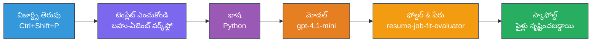
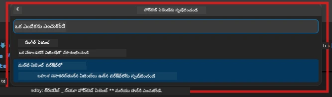

# Module 2 - బహుళ-ఏజెంట్ ప్రాజెక్ట్ స్కాఫోలోడ్ చేయండి

ఈ మాడ్యూల్‌లో, మీరు [Microsoft Foundry ఎక్స్‌టెన్షన్](https://marketplace.visualstudio.com/items?itemName=TeamsDevApp.vscode-ai-foundry) ఉపయోగించి **బహుళ-ఏజెంట్ వర్క్‌ఫ్లో ప్రాజెక్ట్‌ను స్కాఫోలోడ్ చేస్తారు**. ఈ ఎక్స్‌టెన్షన్ మొత్తం ప్రాజెక్ట్ నిర్మాణాన్ని సృష్టిస్తుంది - `agent.yaml`, `main.py`, `Dockerfile`, `requirements.txt`, `.env`, మరియు డీబగ్ కాంఫిగరేషన్. మీరు Modules 3 మరియు 4లో ఈ ఫైళ్లను అనుకూలీకరిస్తారు.

> **గమనిక:** ఈ ల్యాబ్‌లోని `PersonalCareerCopilot/` ఫోల్డర్ అనేది ఒక సంపూర్ణ, పని చేసే అనుకూలీకరించిన బహుళ-ఏజెంట్ ప్రాజెక్ట్ ఉదాహరణ. మీరు కొత్త ప్రాజెక్ట్‌ను స్కాఫోలోడ్ చేయవచ్చు (శిక్షణ కోసం సిఫార్సు చేయబడింది) లేకపోతే నేరుగా ఉన్న కోడ్‌ను అధ్యయనం చేయవచ్చు.

---

## దశ 1: Create Hosted Agent విజార్డ్ తెరవండి


1. `Ctrl+Shift+P` నొక్కి **కమాండ్ ప్యాలెట్** తెరవండి.
2. టైప్ చేయండి: **Microsoft Foundry: Create a New Hosted Agent** మరియు దీన్ని ఎంచుకోండి.
3. హోస్టెడ్ ఏజెంట్ సృష్టి విజార్డ్ తెరుస్తుంది.

> **వికారాలternative:** Activity Barలో **Microsoft Foundry** ఐకాన్‌పై క్లిక్ చేయండి → **Agents** కు పక్కన ఉన్న **+** ఐకాన్‌పై క్లిక్ చేయండి → **Create New Hosted Agent**.

---

## దశ 2: బహుళ-ఏజెంట్ వర్క్‌ఫ్లో టెంప్లేట్ ఎంచుకోండి

విజార్డ్ మీరు టెంప్లేట్ ఎంచుకోవాలని అడుగుతుంది:

| టెంప్లేట్ | వివరణ | ఎప్పుడు ఉపయోగించాలి |
|------------|---------|--------------------|
| Single Agent | ఒక ఏజెంట్ సూచనలు మరియు ఐచ్ఛిక సాధనాలతో | ల్యాబ్ 01 |
| **Multi-Agent Workflow** | WorkflowBuilder ద్వారా కలిసి పనిచేసే బహుళ ఏజెంట్లు | **ఈ ల్యాబ్ (ల్యాబ్ 02)** |

1. **Multi-Agent Workflow** ఎంచుకోండి.
2. **Next** క్లిక్ చేయండి.



---

## దశ 3: ప్రోగ్రామింగ్ భాష ఎంచుకోండి

1. **Python** ఎంచుకోండి.
2. **Next** క్లిక్ చేయండి.

---

## దశ 4: మీ మోడల్ ఎంచుకోండి

1. విజార్డ్ మీ Foundry ప్రాజెక్టులో అమర్చిన మోడల్స్ చూపుతుంది.
2. మీరు ల్యాబ్ 01లో ఉపయోగించిన అదే మోడల్ ఎంచుకోండి (ఉదాహరణకి, **gpt-4.1-mini**).
3. **Next** క్లిక్ చేయండి.

> **సూచన:** [`gpt-4.1-mini`](https://learn.microsoft.com/azure/foundry/foundry-models/concepts/models-sold-directly-by-azure#gpt-41-series) అభివృద్ధికి సిఫార్సు చేయబడినది - ఇది వేగవంతంగా, చౌకగా ఉంటుంది మరియు బహుళ-ఏజెంట్ వర్క్‌ఫ్లోలను బాగా నిర్వహిస్తుంది. మీరు అధిక నాణ్యత ఉత్పత్తి కావాలనుకుంటే `gpt-4.1` కి మార్చండి.

---

## దశ 5: ఫోల్డర్ స్థానం మరియు ఏజెంట్ పేరు ఎంచుకోండి

1. ఒక ఫైల్ డైలాగ్ తెరుచుకుంటుంది. ఒక లక్ష్య ఫోల్డర్ ఎంచుకోండి:
   - వర్క్‌షాప్ రేపోపై పాటు ఉంటే: `workshop/lab02-multi-agent/`కి వెళ్లి కొత్త సబ్‌‌ఫోల్డర్ సృష్టించండి
   - తాజాగా ప్రారంభిస్తుంటే: ఏ ఫోల్డర్ అయినా ఎంచుకోండి
2. హోస్టెడ్ ఏజెంట్ కోసం **పేరు** నమోదు చేయండి (ఉదాహరణకి, `resume-job-fit-evaluator`).
3. **Create** క్లిక్ చేయండి.

---

## దశ 6: స్కాఫోల్డింగ్ పూర్తయ్యేందుకు వేచి ఉండండి

1. VS Code కొత్త విండోను (లేదా ప్రస్తుత విండో అప్‌డేట్ అవుతుంది) స్కాఫోల్డెడ్ ప్రాజెక్టుతో తెరుస్తుంది.
2. మీరు ఈ ఫైల్ నిర్మాణాన్ని చూడగలరు:

```
resume-job-fit-evaluator/
├── .env                ← Environment variables (placeholders)
├── .vscode/
│   └── launch.json     ← Debug configuration
├── agent.yaml          ← Agent definition (kind: hosted)
├── Dockerfile          ← Container configuration
├── main.py             ← Multi-agent workflow code (scaffold)
└── requirements.txt    ← Python dependencies
```

> **వర్క్‌షాప్ గమనిక:** వర్క్‌షాప్ రిపోజిటరీలో `.vscode/` ఫోల్డర్ **వర్క్‌స్పేస్ రూట్** వద్ద ఉంటుంది, ఇందులో పంచుకున్న `launch.json` మరియు `tasks.json` ఉంటాయి. ల్యాబ్ 01 మరియు ల్యాబ్ 02కి డీబగ్ కాంఫిగరేషన్లు రెండూ ఉన్నాయి. మీరు F5 నొక్కితే, డ్రాప్డౌన్ నుండి **"Lab02 - Multi-Agent"** ఎంచుకోండి.

---

## దశ 7: స్కాఫోల్డెడ్ ఫైళ్లను అర్థం చేసుకోండి (బహుళ-ఏజెంట్ ప్రత్యేకతలు)

బహుళ-ఏజెంట్ స్కాఫోల్డ్ ఫైల్ ఒక ఏజెంట్ స్కాఫోల్డ్ నుండి అనేక ముఖ్యమైన దృక్కోణాలలో వేరుపడుతుంది:

### 7.1 `agent.yaml` - ఏజెంట్ నిర్వచనం

```yaml
kind: hosted
name: resume-job-fit-evaluator
description: >
  A multi-agent workflow that evaluates resume-to-job fit.
metadata:
  authors:
    - Microsoft
  tags:
    - Multi-Agent Workflow
    - Resume Evaluator
protocols:
  - protocol: responses
    version: v1
environment_variables:
  - name: PROJECT_ENDPOINT
    value: ${PROJECT_ENDPOINT}
  - name: MODEL_DEPLOYMENT_NAME
    value: ${MODEL_DEPLOYMENT_NAME}
```

**ల్యాబ్ 01 నుండి ప్రధాన తేడా:** `environment_variables` సెక్షన్ MCP ఎండ్పాయింట్ల కోసం లేదా ఇతర సాధన కాన్ఫిగరేషన్ కోసం అదనపు వేరియబుల్స్ కలిగి ఉండవచ్చు. `name` మరియు `description` బహుళ-ఏజెంట్ ఉపయోగానికి అనుగుణంగా ఉంటాయి.

### 7.2 `main.py` - బహుళ-ఏజెంట్ వర్క్‌ఫ్లో కోడ్

స్కాఫోల్డ్‌లో ఉంటాయి:
- **చాలా ఏజెంట్ సూచన స్ట్రింగ్‌లు** (ఒక్కో ఏజెంట్‌కి ఒకకో కాన్స్ట్)
- **చాలా [`AzureAIAgentClient.as_agent()`](https://learn.microsoft.com/python/api/overview/azure/ai-agents-readme) కాన్టెక్స్ట్ మేనేజర్లు** (ఒక్క ఏజెంట్ కోసం ఒక్కటి)
- **[`WorkflowBuilder`](https://learn.microsoft.com/agent-framework/workflows/agents-in-workflows)** ఏజెంట్లను కలుపుతుంది
- **`from_agent_framework()`** వర్క్‌ఫ్లో HTTP ఎండ్పాయింట్‌గా సేవ్ చేస్తుంది

```python
from agent_framework import WorkflowBuilder, tool
from agent_framework.azure import AzureAIAgentClient
from azure.ai.agentserver.agentframework import from_agent_framework
```

అదనపు, కొత్తగా దిగుమతి అయిన [`WorkflowBuilder`](https://learn.microsoft.com/agent-framework/workflows/agents-in-workflows) ల్యాబ్ 01తో పోలిస్తే కొత్తది.

### 7.3 `requirements.txt` - అదనపు డిపెండెన్సీలు

బహుళ-ఏజెంట్ ప్రాజెక్ట్ ల్యాబ్ 01తో సమానమైన ప్రాథమిక ప్యాకేజీలు ఉపయోగిస్తుంది, అలాగే MCP సంబంధిత ప్యాకేజీలు:

```
agent-framework-azure-ai==1.0.0rc3
agent-framework-core==1.0.0rc3
azure-ai-agentserver-agentframework==1.0.0b16
azure-ai-agentserver-core==1.0.0b16
debugpy
agent-dev-cli --pre
```

> **ప్రధాన వెర్షన్ గమనిక:** `agent-dev-cli` ప్యాకేజీకి తాజా ప్రివ్యూ వెర్షన్ ఇన్‌స్టాల్ చేసుకునేందుకు `requirements.txt` లో `--pre` ఫ్లాగ్ అవసరం. ఇది `agent-framework-core==1.0.0rc3`తో Agent Inspector అనుకూలత కోసం అవసరమే. వెర్షన్ వివరాలకు [Module 8 - Troubleshooting](08-troubleshooting.md) చూడండి.

| ప్యాకేజీ | వెర్షన్ | ఉద్దేశ్యం |
|----------|----------|-----------|
| [`agent-framework-azure-ai`](https://learn.microsoft.com/agent-framework/overview/) | `1.0.0rc3` | [Microsoft Agent Framework](https://github.com/microsoft/agent-framework) కోసం Azure AI ఇంటిగ్రేషన్ |
| [`agent-framework-core`](https://learn.microsoft.com/agent-framework/overview/) | `1.0.0rc3` | కోర్ రన్‌టైమ్ (WorkflowBuilderతో సహా) |
| `azure-ai-agentserver-agentframework` | `1.0.0b16` | హోస్టెడ్ ఏజెంట్ సర్వర్ రన్‌టైమ్ |
| `azure-ai-agentserver-core` | `1.0.0b16` | కోర్ ఏజెంట్ సర్వర్ అబ్స్ట్రాక్షన్స్ |
| `debugpy` | తాజా | Python డీబగింగ్ (VS Codeలో F5) |
| `agent-dev-cli` | `--pre` | స్థానిక డెవ్ CLI + Agent Inspector బ్యాక్‌ఎండ్ |

### 7.4 `Dockerfile` - ల్యాబ్ 01తో సమానంగా

Dockerfile ల్యాబ్ 01తో సమానంగా ఉంటుంది - ఇది ఫైళ్లను కాపీ చేస్తుంది, `requirements.txt` నుండి డిపెండెన్సీలు ఇన్‌స్టాల్ చేస్తుంది, 8088 పోర్ట్‌ని ఎక్స్‌పోజ్ చేస్తుంది, మరియు `python main.py` నడుపుతుంది.

```dockerfile
FROM python:3.14-slim
WORKDIR /app
COPY ./ .
RUN pip install --upgrade pip && \
    if [ -f requirements.txt ]; then \
        pip install -r requirements.txt; \
    else \
      echo "No requirements.txt found" >&2; exit 1; \
    fi
EXPOSE 8088
CMD ["python", "main.py"]
```

---

### చెక్పాయింట్

- [ ] స్కాఫోల్డ్ విజార్డ్ పూర్తయ్యింది → కొత్త ప్రాజెక్ట్ నిర్మాణం కనిపిస్తుంది
- [ ] మీరు అన్ని ఫైళ్లను చూడగలరు: `agent.yaml`, `main.py`, `Dockerfile`, `requirements.txt`, `.env`
- [ ] `main.py` లో `WorkflowBuilder` దిగుమతి ఉంది (బహుళ-ఏజెంట్ టెంప్లేట్ ఎంచుకున్నట్లు నిర్ధారిస్తుంది)
- [ ] `requirements.txt` లో `agent-framework-core` మరియు `agent-framework-azure-ai` రెండూ ఉన్నాయి
- [ ] బహుళ-ఏజెంట్ స్కాఫోల్డ్ ఎలా వేరవో మీకు అర్థమైంది (చాలా ఏజెంట్లు, WorkflowBuilder, MCP సాధనాలు)

---

**గత:** [01 - బహుళ-ఏజెంట్ వాస్తవకల్పన అర్థం చేసుకోండి](01-understand-multi-agent.md) · **తర్వాత:** [03 - ఏజెంట్లు & పరిసరాలను కాన్ఫిగర్ చేయండి →](03-configure-agents.md)

---

<!-- CO-OP TRANSLATOR DISCLAIMER START -->
**ముఖ్యమైన సూచన**:
ఈ పత్రాన్ని AI అనువాద సేవ [Co-op Translator](https://github.com/Azure/co-op-translator) ఉపయోగించి అనువదించారు. మేము ఖచ్చితత్వానికి ప్రయత్నించినప్పటికీ, ఆటోమేటెడ్ అనువాదాల్లో తప్పుడు సమాచారాలు లేదా అపరిశుధ్ధతలు ఉండవచ్చు. స్వదేశీ భాషలోని అసలు పత్రమే అధికారిక మూలంగా పరిగణించబడాలి. ముఖ్యమైన సమాచారానికి, ప్రొఫెషనల్ మానవ అనువాదం నిర్వహించుకోవడం మంచిది. ఈ అనువాదం వాడకంలో జరిగే ఏవైనా అపార్థాలు లేదా తప్పుదోవ పట్టుకోవడాలకు మేము బాధ్యత వహించము.
<!-- CO-OP TRANSLATOR DISCLAIMER END -->