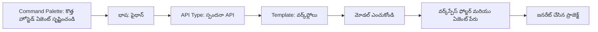
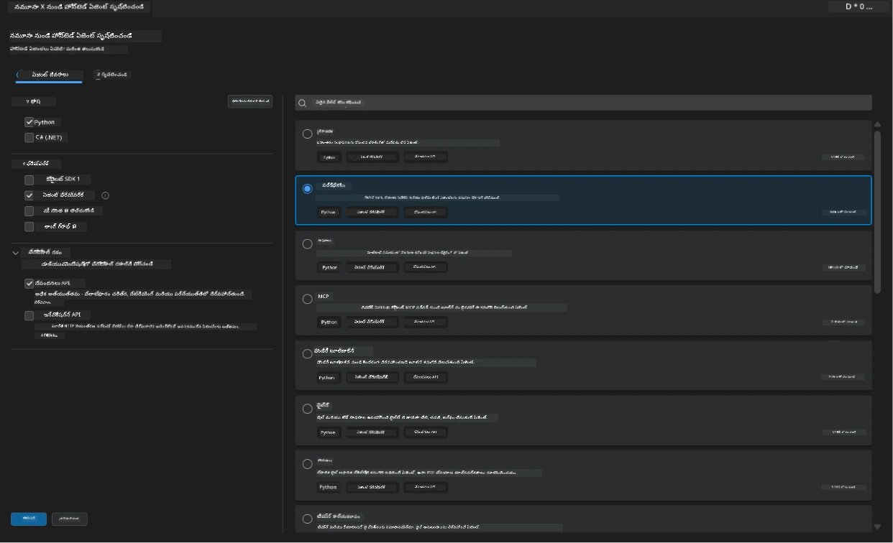
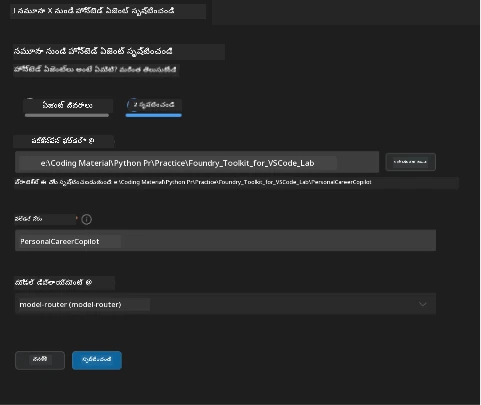

# మాడ్యూల్ 2 - బహు-ఏజెంట్ ప్రాజెక్ట్ స్కాఫోల్డ్ చేయండి

⏱️ ~5 నిమిషాలు

ఈ మాడ్యూల్‌లో, మీరు [Foundry Toolkit for VS Code](https://aka.ms/foundrytk) ఉపయోగించి **బహు-ఏజెంట్ ప్రాజెక్ట్‌ను స్కాఫోల్డ్ చేస్తారు**. విజార్ `agent.yaml`, `main.py`, `Dockerfile`, `requirements.txt`, `.env`, మరియు VS Code డీబగ్గింగ్ కాన్ఫిగరేషన్ రూపొందిస్తుంది - మీరు మాడ్యూల్ 3 లో 4-ఏజెంట్ వర్క్‌ఫ్లోను కేంద్రీకృతం చేయవచ్చు.

> **కీ కాన్సెప్ట్:** స్కాఫోల్డ్ ఒక పని చేసే స్టబ్ ఒక ఏజెంట్ తో ఉంటుంది. ప్లేస్‌హోల్డర్ లాజిక్ ను మాడ్యూల్ 3 లోని `WorkflowBuilder` గ్రాఫ్ తో మార్చుతారు. మీరు బాయిలర్‌ప్లేట్ ను మొదలుకొనకుండా రాయవద్దు.

> **రికమండేషన్ అమలు:** [`PersonalCareerCopilot/`](../../../../../workshop/lab02-multi-agent/PersonalCareerCopilot) పూర్తిగా పని చేసే ఉదాహరణ. మీరు మీ పని తో పోల్చడానికి దీన్ని ఉపయోగించండి.

### స్కాఫోల్డ్ విజార్ ఫ్లో


```mermaid
flowchart LR
    A[Command Palette: కొత్త హోస్టెడ్ ఏజెంట్ సృష్టించండి] --> B[భాష: పైథాన్]
    B --> C[API Type: స్పందనా API]
    C --> D[Template: వర్క్‌ఫ్లోలు]
    D --> E[మోడల్ ఎంచుకోండి]
    E --> F[వర్క్‌స్పేస్ ఫోల్డర్ మరియు ఏజెంట్ పేరు]
    F --> G[జనరేట్ చేసిన ప్రాజెక్ట్]
```

---

## దశ 1: క్రియేట్ హోస్టెడ్ ఏజెంట్ విజార్ తెరవండి

1. **కమాండ్ ప్యాలెట్** తెరవడానికి `Ctrl+Shift+P` నొక్కండి.
2. టైప్ చేయండి: **Foundry Toolkit: Create a New Hosted Agent** మరియు ఎంచుకోండి.
3. విజార్ **Agent Details** ట్యాబ్ తో తెరుచుకుంటుంది.

> **మరియొక ప్రత్యామ్నాయం:** Activity Bar లోని **Foundry Toolkit** గుర్తుపై క్లిక్ చేయండి → **Hosted Agents** పక్కన ఉన్న **+** గుర్తుపై క్లిక్ చేయండి → **Create New Hosted Agent**.

---

## దశ 2: సెట్టింగ్స్ ఎంచుకోండి



1. ఎడమ నావిగేషన్/ఆప్షన్ల విభాగంలో క్రింది ఎంపికలు చేయండి:

| మెనూ | ఎంపిక | గమనికలు |
|--------|-----------|-------|
| **భాష** | Python | C# (.NET) కూడా మద్దతు కలిగి ఉంది |
| **ఫ్రేమ్‌వర్క్** | Agent Framework | `Agent`, `AgentExecutor`, `WorkflowBuilder` అందిస్తుంది |
| **API రకం** | Response API | `POST /responses` - ప్లాట్‌ఫారమ్ నిర్వహించబడే చరిత్ర, స్ట్రీమింగ్ మద్దతు |
| **టెంప్లేట్** | **Workflows** | అనుసరిగా పలు ఏజెంట్ల ద్వారా రిక్వెస్ట్‌లను ప్రాసెస్ చేస్తుంది |

2. ఒకసారి ఎంపిక చేసిన తర్వాత, **Next** క్లిక్ చేయండి



3. తదుపరి విండోలో క్రింది ఎంపికలు చేయండి:

| మెనూ | ఎంపిక | గమనికలు |
|--------|-----------|-------|
| **వర్క్‌స్పేస్ ఫోల్డర్** | లక్ష్య ఫోల్డర్ ను బ్రౌజ్ చేయండి | ఉదాహరణకు, ఈ రిపోజిటరీలో `workshop/lab02-multi-agent/` |
| **ఏజెంట్ పేరు** | `PersonalCareerCopilot` | ఇది ప్రాజెక్ట్ డైరెక్టరీ పేరు అవుతుంది |
| **మోడల్ డిప్లాయ్‌మెంట్** | మీ డిప్లాయ్ చేసిన మోడల్ ఎంచుకోండి | ఉదా: ల్యాబ్ 01 నుండి `gpt-4.1-mini` |

4. ప్రాజెక్ట్ స్కాఫోల్డ్ చేయడానికి **Create** క్లిక్ చేయండి. VS Code ఫైళ్లను సృష్టించి ఫోల్డర్ తెరుస్తుంది.

> **సూక్తి:** [`gpt-4.1-mini`](https://learn.microsoft.com/azure/foundry/foundry-models/concepts/models-sold-directly-by-azure#gpt-41-series) బహుఏజెంట్ అభివృద్ధికి వేగం మరియు నాణ్యతను బాగా సమతౌల్యం చేస్తుంది.

---

## దశ 3: రూపొందించిన ప్రాజెక్టును పరిశీలించండి

స్కాఫోల్డ్ అవుతుంది తర్వాత, మీరు Explorer (`Ctrl+Shift+E`) లో ఈ ఫైళ్లు కనిపిస్తాయా అని తనిఖీ చేయండి:

```
📂 <your-agent-name>/
├── .azdignore          ← Files excluded from Azure Developer CLI deployments
├── .dockerignore       ← Files excluded from Docker builds
├── .env                ← Environment variables (placeholders - fill in Module 3)
├── .vscode/
│   ├── launch.json     ← Debug config (F5 → run + Agent Inspector)
│   └── tasks.json      ← VS Code task definitions
├── agent.yaml          ← Agent definition (kind: hosted, protocol: responses)
├── Dockerfile          ← Container config for deployment
├── main.py             ← Stub agent entry point (replace with WorkflowBuilder in Module 3)
└── requirements.txt    ← Python dependencies
```

> **ముఖ్యమైనది:** ఈ స్కాఫోల్డ్ చేసిన ఫోల్డర్‌ను నేరుగా VS Code లో తెరవండి, తద్వారా `.vscode/launch.json` మరియు `tasks.json` సరిగ్గా F5 డీబగ్గింగ్‌కు వర్తిస్తాయి.

### ముఖ్యమైన ఫైళ్లు వివరణ

| ఫైల్ | ఉద్దేశం |
|------|---------|
| `agent.yaml` | `kind: hosted` ను ప్రకటిస్తుంది, env vars మ్యాప్ చేస్తుంది, `/responses` ప్రోటోకాల్ నిర్వచిస్తుంది |
| `main.py` | స్టబ్: ఒక `FoundryChatClient` → `Agent` → `ResponsesHostServer`. మాడ్యూల్ 3 లో దీనిని మీరు 4 ఏజెంట్లు + `WorkflowBuilder` తో మారుస్తారు |
| `Dockerfile` | `python:3.12-slim`, `requirements.txt` ఇనిస్టాల్ చేస్తుంది, పోర్ట్ 8088 ఎక్స్‌పోస్ చేస్తుంది, `python main.py` నడుపుతుంది |
| `requirements.txt` | `agent-framework-foundry`, `agent-framework-foundry-hosting`, `mcp<2,>=1.24.0`, `debugpy` |

> **సూచన:** పూర్తి రూపొందించిన విషయం కోసం [`PersonalCareerCopilot/agent.yaml`](../../../../../workshop/lab02-multi-agent/PersonalCareerCopilot/agent.yaml) మరియు [`PersonalCareerCopilot/requirements.txt`](../../../../../workshop/lab02-multi-agent/PersonalCareerCopilot/requirements.txt) చూడండి.

---

### ✅ చెక్‌పాయింట్

- [ ] స్కాఫోల్డ్ విజార్ పూర్తి అయింది - కొత్త ప్రాజెక్ట్ ఫోల్డర్ Explorer లో కనిపిస్తుంది
- [ ] అంచనా వేసిన అన్ని ఫైళ్లు ఉన్నాయి: `agent.yaml`, `main.py`, `Dockerfile`, `requirements.txt`, `.env`
- [ ] `agent.yaml` లో `kind: hosted` మరియు `protocol: responses` చూపబడింది
- [ ] `main.py` లో `Agent`, `FoundryChatClient`, `ResponsesHostServer` దిగుమతి చేయబడ్డాయి
- [ ] స్కాఫోల్డ్ చేసిన ఫోల్డర్ VS Code వర్క్‌స్పేస్ రూట్ గా తెరిచి ఉంది
- [ ] మీరు అవగాహన చేసుకున్నారంటే `main.py` ఒక స్టబ్ మాత్రమే - `WorkflowBuilder` మాడ్యూల్ 3 లో జోడించబడుతుంది

---

**మునుపటి:** [01 - బహుఏజెంట్ ఆర్కిటెక్చర్‌ను అర్థం చేసుకోండి](01-understand-multi-agent.md) · **తదుపరి:** [03 - ఏజెంట్లను & పరిసరాలను కాన్ఫిగర్ చేయండి →](03-configure-agents.md)

---

<!-- CO-OP TRANSLATOR DISCLAIMER START -->
**అస్వీకరణ**:
ఈ పత్రం AI అనువాద సేవ [Co-op Translator](https://github.com/Azure/co-op-translator) ఉపయోగించి అనువదించబడింది. మేము ఖచ్చితత్వానికి ప్రయత్నిస్తున్నప్పటికీ, ఆటోమేటెడ్ అనువాదాలు తప్పులు లేదా అసమగ్రతలను కలిగి ఉండవచ్చు. దాని స్వదేశ భాషలో ఉన్న అసలు పత్రాన్ని అధికారం కలిగిన మూలంగా పరిగణించాలి. కీలకమైన సమాచారం కోసం, ప్రొఫెషనల్ మానవ అనువాదాన్ని సిఫారసు చేస్తాము. ఈ అనువాదం ఉపయోగం వల్ల కలిగే ఏవైనా అపార్థాలు లేదా తప్పుదారులు కోసం మేము బాధ్యత వహించము.
<!-- CO-OP TRANSLATOR DISCLAIMER END -->