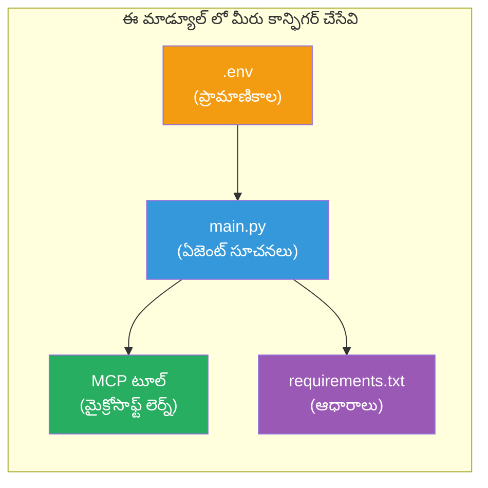

# మాడ్యూల్ 3 - ఏజెన్ట్లను, MCP పరికరాన్ని & పరిసరాన్ని కాన్ఫిగర్ చేయండి

ఈ మాడ్యూల్‌లో, మీరు స్కాఫోల్డెడ్ మల్టీ-ఏజెంట్ ప్రాజెక్టును అనుకూలీకరించండి. మీరు నాలుగు ఏజెంట్లకూ సూచనలను రాసి, Microsoft Learn కోసం MCP పరికరాన్ని సెట్ చేసి, పరిసర చరులను కాన్ఫిగర్ చేసి, ఆధారాలు ఇన్‌స్టాల్ చేస్తారు.


> **సూచన:** పూర్తి పని కోడ్ [`PersonalCareerCopilot/main.py`](../../../../../workshop/lab02-multi-agent/PersonalCareerCopilot/main.py)లో ఉంది. మీ స్వంతం నిర్మించుకోవడానికి దానిని సూచనగా ఉపయోగించండి.

---

## దశ 1: పరిసర చరాలను కాన్ఫిగర్ చేయండి

1. మీ ప్రాజెక్టు రూట్‌లో ఉన్న **`.env`** ఫైల్‌ను తెరవండి.
2. మీ Foundry ప్రాజెక్టు వివరాలను పూరించండి:

   ```env
   PROJECT_ENDPOINT=https://<your-account>.services.ai.azure.com/api/projects/<your-project>
   MODEL_DEPLOYMENT_NAME=gpt-4.1-mini
   ```

3. ఫైల్‌ను సేవ్ చేయండి.

### ఈ విలువలను ఎక్కడ పొందాలి

| విలువు | దాన్ని ఎలా పొందాలి |
|-------|--------------------|
| **ప్రాజెక్ట్ ఎండ్‌పాయింట్** | Microsoft Foundry సైడ్బార్ → మీ ప్రాజెక్టుని క్లిక్ చేయండి → వివర వీక్షణలో ఎండ్‌పాయింట్ URL |
| **మోడల్ డిప్లాయ్‌మెంట్ పేరు** | Foundry సైడ్బార్ → ప్రాజెక్ట్‌ను ఎక్స్‌పాండ్ చేయండి → **Models + endpoints** → డిప్లాయ్ చేసిన మోడల్ పక్కన పేరు |

> **భద్రత:** `.env` ను వెర్షన్ కంట్రోల్‌లో ఎప్పుడూ కమిట్ చేయకండి. ఇది ఇప్పటికే లేకపోతే `.gitignore` లో చేర్చండి.

### పరిసర చరాల మ్యాపింగ్

మల్టీ-ఏజెంట్ `main.py` పూర్తి మరియు వర్క్‌షాప్-ప్రత్యేక env వేరియబుల్ పేర్లను చదవును:

```python
PROJECT_ENDPOINT = os.getenv("AZURE_AI_PROJECT_ENDPOINT") or os.getenv("PROJECT_ENDPOINT")
MODEL_DEPLOYMENT_NAME = os.getenv(
    "AZURE_AI_MODEL_DEPLOYMENT_NAME",
    os.getenv("MODEL_DEPLOYMENT_NAME", "gpt-4.1-mini"),
)
MICROSOFT_LEARN_MCP_ENDPOINT = os.getenv(
    "MICROSOFT_LEARN_MCP_ENDPOINT", "https://learn.microsoft.com/api/mcp"
)
```

MCP ఎండ్‌పాయింట్‌కు సెన్సిబుల్ డిఫాల్ట్ ఉంది - మీరు దాన్ని `.env`లో సెట్టు చేయాల్సిన అవసరం లేదు, మీరు దాన్ని ఓవర్‌రైడ్ చేయాలనుకుంటే తప్ప.

---

## దశ 2: ఏజెంట్ సూచనలను వ్రాయండి

ఇది అత్యంత కీలకమైన దశ. ప్రతి ఏజెంట్ తన పాత్ర, అవుట్పుట్ ఫార్మాట్, మరియు నియమనిబంధనలను నిర్వచించే జాగ్రత్తగా తయారుచేసిన సూచనలను అవసరం పడుతుంది. `main.py` తెరవండి మరియు సూచన కాన్స్టెంట్స్ సృష్టించండి (లేదా సవరించండి).

### 2.1 రిజ్యూమ్ పార్సర్ ఏజెంట్

```python
RESUME_PARSER_INSTRUCTIONS = """\
You are the Resume Parser.
Extract resume text into a compact, structured profile for downstream matching.

Output exactly these sections:
1) Candidate Profile
2) Technical Skills (grouped categories)
3) Soft Skills
4) Certifications & Awards
5) Domain Experience
6) Notable Achievements

Rules:
- Use only explicit or strongly implied evidence.
- Do not invent skills, titles, or experience.
- Keep concise bullets; no long paragraphs.
- If input is not a resume, return a short warning and request resume text.
"""
```

**ఈ విభాగాలు ఎందుకు?** MatchingAgent స్కోర్ చేయడానికి నిర్మిత డేటాను అవసరం చేస్తుంది. సహజమైన విభాగాలు క్రాస్-ఏజెంట్ హ్యాండాఫ్ నమ్మకమైనది చేస్తాయి.

### 2.2 ఉద్యోగ వివరణ ఏజెంట్

```python
JOB_DESCRIPTION_INSTRUCTIONS = """\
You are the Job Description Analyst.
Extract a structured requirement profile from a JD.

Output exactly these sections:
1) Role Overview
2) Required Skills
3) Preferred Skills
4) Experience Required
5) Certifications Required
6) Education
7) Domain / Industry
8) Key Responsibilities

Rules:
- Keep required vs preferred clearly separated.
- Only use what the JD states; do not invent hidden requirements.
- Flag vague requirements briefly.
- If input is not a JD, return a short warning and request JD text.
"""
```

**అవసరమైన మరియు ప్రాధాన్యం ఉన్నవన్నిటిని వేరుచేయడం ఎందుకు?** MatchingAgent వాటికి వేర్వేరు బరువులు ఉపయోగిస్తుంది (అవసర సంపత్తులు = 40 పాయింట్లు, ప్రాధాన్య సంపత్తులు = 10 పాయింట్లు).

### 2.3 మ్యాచ్ మేమీ ఏజెంట్

```python
MATCHING_AGENT_INSTRUCTIONS = """\
You are the Matching Agent.
Compare parsed resume output vs JD output and produce an evidence-based fit report.

Scoring (100 total):
- Required Skills 40
- Experience 25
- Certifications 15
- Preferred Skills 10
- Domain Alignment 10

Output exactly these sections:
1) Fit Score (with breakdown math)
2) Matched Skills
3) Missing Skills
4) Partially Matched
5) Experience Alignment
6) Certification Gaps
7) Overall Assessment

Rules:
- Be objective and evidence-only.
- Keep partial vs missing separate.
- Keep Missing Skills precise; it feeds roadmap planning.
"""
```

**స్పష్టమైన స్కోరింగ్ అవసరమా?** పునరుత్పాదక స్కోరింగ్ రన్స్‌ను పోల్చడం మరియు లోపాలను పరిష్కరించడం సులభం చేస్తుంది. 100-పాయింట్ల స్కేలు చివరి యూజర్లకు అర్థం చేసుకోవడానికి సులభం.

### 2.4 గ్యాప్ అనలైజర్ ఏజెంట్

```python
GAP_ANALYZER_INSTRUCTIONS = """\
You are the Gap Analyzer and Roadmap Planner.
Create a practical upskilling plan from the matching report.

Microsoft Learn MCP usage (required):
- For EVERY High and Medium priority gap, call tool `search_microsoft_learn_for_plan`.
- Use returned Learn links in Suggested Resources.
- Prefer Microsoft Learn for free resources.

CRITICAL: You MUST produce a SEPARATE detailed gap card for EVERY skill listed in
the Missing Skills and Certification Gaps sections of the matching report. Do NOT
skip or combine gaps. Do NOT summarize multiple gaps into one card.

Output format:
1) Personalized Learning Roadmap for [Role Title]
2) One DETAILED card per gap (produce ALL cards, not just the first):
   - Skill
   - Priority (High/Medium/Low)
   - Current Level
   - Target Level
   - Suggested Resources (include Learn URL from tool results)
   - Estimated Time
   - Quick Win Project
3) Recommended Learning Order (numbered list)
4) Timeline Summary (week-by-week)
5) Motivational Note

Rules:
- Produce every gap card before writing the summary sections.
- Keep it specific, realistic, and actionable.
- Tailor to candidate's existing stack.
- If fit >= 80, focus on polish/interview readiness.
- If fit < 40, be honest and provide a staged path.
"""
```

**"CRITICAL" ఎమ్ఫసిస్ ఎందుకు?** అన్ని గ్యాప్ కార్డులను ఉత్పత్తి చేయాలని స్పష్టమైన సూచనలు లేకుండా, మోడల్ సాధారణంగా 1-2 కార్డులు మాత్రమే తయారుచేస్తుంది మరియు మిగతావి సమ్మరీ చేస్తుంది. ఈ "CRITICAL" బ్లాక్ ఈ కట్-ఆఫ్‌ను నిరోధిస్తుంది.

---

## దశ 3: MCP పరికరాన్ని నిర్వచించండి

GapAnalyzer ఒక పరికరాన్ని ఉపయోగిస్తుంది, ఇది [Microsoft Learn MCP సర్వర్](https://learn.microsoft.com/azure/foundry/agents/how-to/tools/model-context-protocol)ను కాల్ చేస్తుంది. దీన్ని `main.py`లో చేర్చండి:

```python
import json
from agent_framework import tool
from mcp.client.session import ClientSession
from mcp.client.streamable_http import streamable_http_client

@tool
async def search_microsoft_learn_for_plan(
    skill: str, role: str = "", max_results: int = 5
) -> str:
    """Search Microsoft Learn MCP and return curated official links for roadmap planning."""
    query = " ".join(part for part in [skill, role, "learning path module"] if part).strip()
    query = query or "job skills learning path"

    try:
        async with streamable_http_client(MICROSOFT_LEARN_MCP_ENDPOINT) as (
            read_stream, write_stream, _,
        ):
            async with ClientSession(read_stream, write_stream) as session:
                await session.initialize()
                result = await session.call_tool(
                    "microsoft_docs_search", {"query": query}
                )

        if not result.content:
            return (
                "No results returned from Microsoft Learn MCP. "
                "Fallback: https://learn.microsoft.com/training/support/catalog-api"
            )

        payload_text = getattr(result.content[0], "text", "")
        data = json.loads(payload_text) if payload_text else {}
        items = data.get("results", [])[:max(1, min(max_results, 10))]

        if not items:
            return f"No direct Microsoft Learn results found for '{skill}'."

        lines = [f"Microsoft Learn resources for '{skill}':"]
        for i, item in enumerate(items, start=1):
            title = item.get("title") or item.get("url") or "Microsoft Learn Resource"
            url = item.get("url") or item.get("link") or ""
            lines.append(f"{i}. {title} - {url}".rstrip(" -"))
        return "\n".join(lines)
    except Exception as ex:
        return (
            f"Microsoft Learn MCP lookup unavailable. Reason: {ex}. "
            "Fallbacks: https://learn.microsoft.com/api/mcp"
        )
```

### పరికరం ఎలా పనిచేస్తుంది

| దశ | ఏమి జరుగుతుంది |
|------|-------------|
| 1 | GapAnalyzer ఒక నైపుణ్యానికి (ఉదా: "Kubernetes") వనరులు అవసరం అని నిర్ణయిస్తుంది |
| 2 | ఫ్రేమ్‌వర్క్ `search_microsoft_learn_for_plan(skill="Kubernetes")`ను కాల్ చేస్తుంది |
| 3 | ఫంక్షన్ [Streamable HTTP](https://learn.microsoft.com/agent-framework/agents/tools/hosted-mcp-tools) కనెక్షన్ `https://learn.microsoft.com/api/mcp` కు తెరవుతుంది |
| 4 | [MCP సర్వర్](https://learn.microsoft.com/azure/foundry/agents/how-to/tools/model-context-protocol)పై `microsoft_docs_search` ను కాల్ చేస్తుంది |
| 5 | MCP సర్వర్ శోధన ఫలితాలను (శీర్షిక + URL) ఇస్తుంది |
| 6 | ఫంక్షన్ ఫలితాలను సంఖ్యల జాబితాగా ఫార్మాట్ చేస్తుంది |
| 7 | GapAnalyzer URLలను గ్యాప్ కార్డులో పొందుపరుస్తుంది |

### MCP ఆధారాలు

MCP క్లయింట్ లైబ్రరీలు [`agent-framework-core`](https://learn.microsoft.com/agent-framework/overview/) ద్వారా మార్గదర్శకంగా చేర్చబడ్డాయి. మీరు వాటిని `requirements.txt`లో వేరు చేయాల్సిన అవసరం లేదు. ఇంపోర్ట్ లోపాలు ఉంటే, నిర్ధారించండి:

```powershell
pip list | Select-String "mcp"
```

అంచనా: `mcp` ప్యాకేజ్ ఇన్‌స్టాల్ అయి ఉండాలి (ఆవృత్తి 1.x లేదా మరింత).

---

## దశ 4: ఏజెంట్లు మరియు వర్క్‌ఫ్లోను వైర్ చేయండి

### 4.1 కాంటెక్ట్ మేనేజర్లతో ఏజెంట్లను సృష్టించండి

```python
from contextlib import asynccontextmanager

@asynccontextmanager
async def create_agents():
    async with (
        get_credential() as credential,
        AzureAIAgentClient(
            project_endpoint=PROJECT_ENDPOINT,
            model_deployment_name=MODEL_DEPLOYMENT_NAME,
            credential=credential,
        ).as_agent(
            name="ResumeParser",
            instructions=RESUME_PARSER_INSTRUCTIONS,
        ) as resume_parser,
        AzureAIAgentClient(
            project_endpoint=PROJECT_ENDPOINT,
            model_deployment_name=MODEL_DEPLOYMENT_NAME,
            credential=credential,
        ).as_agent(
            name="JobDescriptionAgent",
            instructions=JOB_DESCRIPTION_INSTRUCTIONS,
        ) as jd_agent,
        AzureAIAgentClient(
            project_endpoint=PROJECT_ENDPOINT,
            model_deployment_name=MODEL_DEPLOYMENT_NAME,
            credential=credential,
        ).as_agent(
            name="MatchingAgent",
            instructions=MATCHING_AGENT_INSTRUCTIONS,
        ) as matching_agent,
        AzureAIAgentClient(
            project_endpoint=PROJECT_ENDPOINT,
            model_deployment_name=MODEL_DEPLOYMENT_NAME,
            credential=credential,
        ).as_agent(
            name="GapAnalyzer",
            instructions=GAP_ANALYZER_INSTRUCTIONS,
            tools=[search_microsoft_learn_for_plan],
        ) as gap_analyzer,
    ):
        yield resume_parser, jd_agent, matching_agent, gap_analyzer
```

**ప్రధాన అంశాలు:**
- ప్రతి ఏజెంట్‌కు తమ **తన** `AzureAIAgentClient` ఇన్స్టాన్స్ ఉంటుంది
- కేవలం GapAnalyzer కి మాత్రమే `tools=[search_microsoft_learn_for_plan]` ఉంటుంది
- `get_credential()` Azureలో [`ManagedIdentityCredential`](https://learn.microsoft.com/python/api/overview/azure/identity-readme#managed-identity-support), లోకల్లో [`DefaultAzureCredential`](https://learn.microsoft.com/azure/developer/python/sdk/authentication/credential-chains#defaultazurecredential-overview) ను రిటర్న్ చేస్తుంది

### 4.2 వర్క్‌ఫ్లో గ్రాఫ్‌ను నిర్మించండి

```python
def create_workflow(resume_parser, jd_agent, matching_agent, gap_analyzer):
    workflow = (
        WorkflowBuilder(
            name="ResumeJobFitEvaluator",
            start_executor=resume_parser,
            output_executors=[gap_analyzer],
        )
        .add_edge(resume_parser, jd_agent)
        .add_edge(resume_parser, matching_agent)
        .add_edge(jd_agent, matching_agent)
        .add_edge(matching_agent, gap_analyzer)
        .build()
    )
    return workflow.as_agent()
```

> .as_agent() నమూనాను అర్థం చేసుకోవడానికి [Workflows as Agents](https://learn.microsoft.com/agent-framework/workflows/as-agents) చూడండి.

### 4.3 సర్వర్ ప్రారంభించండి

```python
async def main() -> None:
    validate_configuration()
    async with create_agents() as (resume_parser, jd_agent, matching_agent, gap_analyzer):
        agent = create_workflow(resume_parser, jd_agent, matching_agent, gap_analyzer)
        from azure.ai.agentserver.agentframework import from_agent_framework
        await from_agent_framework(agent).run_async()

if __name__ == "__main__":
    asyncio.run(main())
```

---

## దశ 5: వర్చువల్ ఎన్విరాన్‌మెంట్ సృష్టించి యాక్టివేట్ చేయండి

### 5.1 పరిసరాన్ని సృష్టించండి

```powershell
cd workshop\lab02-multi-agent\PersonalCareerCopilot
python -m venv .venv
```

### 5.2 యాక్టివేట్ చేయండి

**PowerShell (విండోస్):**
```powershell
.\.venv\Scripts\Activate.ps1
```

**macOS/Linux:**
```bash
source .venv/bin/activate
```

### 5.3 ఆధారాలను ఇన్‌స్టాల్ చేయండి

```powershell
pip install -r requirements.txt
```

> **గమనిక:** `requirements.txt`లోని `agent-dev-cli --pre` లైన్ తాజా ప్రీవ్యూ వెర్షన్ ఉన్నట్లుగా నిర్ధారిస్తుంది. ఇది `agent-framework-core==1.0.0rc3`తో అనుకూలత కోసం అవసరం.

### 5.4 ఇన్‌స్టాలేషన్‌ను ధృవీకరించండి

```powershell
pip list | Select-String "agent-framework|agentserver|agent-dev"
```

అంచనా అవుట్పుట్:
```
agent-dev-cli                  0.0.1b260316
agent-framework-azure-ai       1.0.0rc3
agent-framework-core            1.0.0rc3
azure-ai-agentserver-agentframework 1.0.0b16
azure-ai-agentserver-core      1.0.0b16
```

> **`agent-dev-cli` పాత వెర్షన్ చూపిస్తే** (ఉదా. `0.0.1b260119`), Agent Inspector 403/404 లోపాలతో విఫలమవుతుంది. నవీకరణ: `pip install agent-dev-cli --pre --upgrade`

---

## దశ 6: ధృవీకరణను పరీక్షించండి

ల్యాబ్ 01 నుండి అదే ధృవీకరణ తనిఖీని నడపండి:

```powershell
az account show --query "{name:name, id:id}" --output table
```

ఇది విఫలమైతే, [`az login`](https://learn.microsoft.com/cli/azure/authenticate-azure-cli-interactively) ను నడపండి.

మల్టీ-ఏజెంట్ వర్క్‌ఫ్లోల కోసం నాలుగు ఏజెంట్లు అందరూ ఒకే క్రెడెన్షియల్‌ను పంచుకుంటారు. ఒకవారికి ధృవీకరణ పని చేస్తే అందరికి పనిగా ఉంటుంది.

---

### చెక్పాయింట్

- [ ] `.env`లో సరైన `PROJECT_ENDPOINT` మరియు `MODEL_DEPLOYMENT_NAME` విలువలు ఉన్నాయి
- [ ] నాలుగు ఏజెంట్ సూచన కాన్స్టెంట్లు `main.py`లో నిర్వచించబడ్డాయి (ResumeParser, JD Agent, MatchingAgent, GapAnalyzer)
- [ ] `search_microsoft_learn_for_plan` MCP పరికరం GapAnalyzer తో నిర్వచించబడింది మరియు నమోదు చేయబడింది
- [ ] `create_agents()` ప్రతి ఏజెంట్‌కు వ్యక్తిగత `AzureAIAgentClient` ఇన్స్టాన్స్‌లతో నాలుగు ఏజెంట్లను సృష్టిస్తుంది
- [ ] `create_workflow()` సరిగ్గా `WorkflowBuilder`తో గ్రాఫ్‌ను నిర్మిస్తుంది
- [ ] వర్చువల్ ఎన్విరాన్‌మెంట్ సృష్టించబడింది మరియు యాక్టివేట్ అయింది (`(.venv)` కనిపిస్తోంది)
- [ ] `pip install -r requirements.txt` లో ఎలాంటి లోపాలు లేవు
- [ ] `pip list` అన్ని భావితరాలను సరైన వెర్షన్లతో (rc3 / b16) చూపిస్తోంది
- [ ] `az account show` మీ సబ్‌స్క్రిప్షన్‌ను చూపిస్తోంది

---

**మునుపటి:** [02 - స్కాఫోల్డ్ మల్టీ-ఏజెంట్ ప్రాజెక్ట్](02-scaffold-multi-agent.md) · **తర్వాత:** [04 - ఒర్చెస్ట్రేషన్ ప్యాటర్న్లు →](04-orchestration-patterns.md)

---

<!-- CO-OP TRANSLATOR DISCLAIMER START -->
**వెలుగు**:  
ఈ పత్రాన్ని AI అనువాద సేవ [Co-op Translator](https://github.com/Azure/co-op-translator) ఉపయోగించి అనువదించబడింది. మనం ఖచ్చితత్వానికి యత్నించినప్పటికీ, ఆన్‌లైన్ అనువాదాల్లో తప్పులు లేదా అసూయలు ఉండవచ్చు. స్థానిక భాషలో ఉన్న అసలు పత్రాన్ని అధికారికమైన మూలంగా పరిగణించాలి. కీలకమైన సమాచారం కోసం, వృత్తిపరమైన మానవ అనువాదం సిఫార్సు చేయబడుతుంది. ఈ అనువాదం వలన వచ్చిన ఏదైనా అపార్థాలు లేదా తప్పుదారులు గూర్చి మేము బాధ్యత వహించము.
<!-- CO-OP TRANSLATOR DISCLAIMER END -->