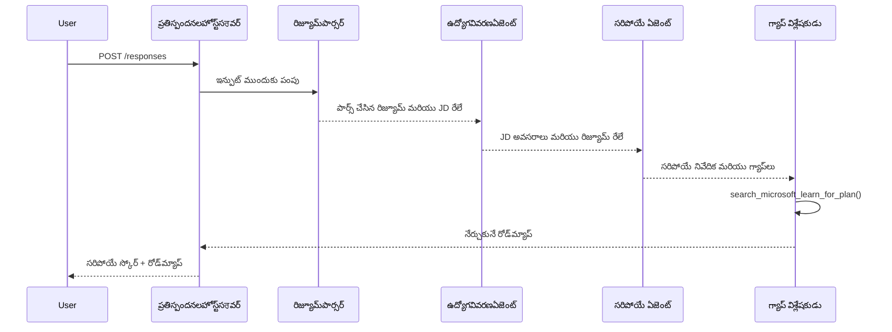

# మాడ్యూల్ 3 - సూచనలు, పరిసరాలను అమర్చడం మరియు ఆధారాలను ఇన్‌స్టాల్ చేయడం

⏱️ ~15 నిమిషాలు

ఈ మాడ్యూల్‌లో, మీరు స్కాఫోల్డెడ్ స్టబ్‌ను **మీ** మల్టీ-ఏజెంట్ వర్క్‌ఫ్లోగా మార్చుకుంటారు - పరిసర వేరియబుల్స్ సెట్ చేయడం, ఏజెంట్ సూచనలు వ్రాయడం, MCP టూల్‌ను జోడించడం, వర్క్‌ఫ్లో గ్రాఫ్‌ను వైర్ చేయడం, మరియు ఆధారాలను ఇన్‌స్టాల్ చేయడం ద్వారా.

> **రెఫరెన్స్:** పూర్తి పనిచేసే కోడ్ [`PersonalCareerCopilot/main.py`](../../../../../workshop/lab02-multi-agent/PersonalCareerCopilot/main.py) లో ఉన్నది. మీ స్వంత వర్క్‌ఫ్లో గ్రాఫ్ మరియు ప్రాంప్ట్ బ్లాక్స్ నిర్మించేటప్పుడు దీన్ని రిఫరెన్స్‌గా ఉపయోగించండి.

---

## నాలుగు ఏజెంట్లు ఎలా ఒకటిగా పనిచేస్తాయో


```mermaid
sequenceDiagram
    participant User
    participant Server as ప్రతిస్పందనలహోస్ట్‌సਰవర్
    participant RP as రిజ్యూమ్‌పార్సర్
    participant JD as ఉద్యోగవివరణఏజెంట్
    participant MA as సరిపోయే ఏజెంట్
    participant GA as గ్యాప్ విశ్లేషకుడు

    User->>Server: POST /responses
    Server->>RP: ఇన్పుట్ ముందుకు పంపు
    RP-->>JD: పార్స్ చేసిన రిజ్యూమ్ మరియు JD రేలే
    JD-->>MA: JD అవసరాలు మరియు రిజ్యూమ్ రేలే
    MA-->>GA: సరిపోయే నివేదిక మరియు గ్యాప్‌లు
    GA->>GA: search_microsoft_learn_for_plan()
    GA-->>Server: నేర్చుకునే రోడ్‌మ్యాప్
    Server-->>User: సరిపోయే స్కోర్ + రోడ్‌మ్యాప్
```

---

## దశ 1: పరిసర వేరియబుల్స్ కాపా

1. మీ ప్రాజెక్ట్ రూట్‌లోని **`.env`** ఫైల్‌ను తెరవండి (స్కాఫోల్డ్ విజార్డ్ ద్వారా సృష్టించబడింది).
2. ప్లేస్‌హోల్డర్స్‌ను మీ ల్యాబ్ 01 నుండి నిజమైన విలువలతో మార్చండి.

<details open>
<summary><strong>🅰️ పాథ్ A - Foundry సబ్‌స్క్రిప్షన్</strong></summary>

```env
FOUNDRY_PROJECT_ENDPOINT=https://<your-account>.services.ai.azure.com/api/projects/<your-project>
AZURE_AI_MODEL_DEPLOYMENT_NAME=gpt-4.1-mini
```

> **విలువలను ఎక్కడ కనుగొనాలి:** [Lab 01, మాడ్యూల్ 1](../../lab01-single-agent/docs/01-setup.md#deploy-a-model--assign-rbac) చూడండి.

</details>

<details open>
<summary><strong>🅱️ పాథ్ B - Foundry స్థానికం</strong></summary>

```env
FOUNDRY_PROJECT_ENDPOINT=http://localhost:5273/v1
AZURE_AI_MODEL_DEPLOYMENT_NAME=phi-4-mini
```

> అన్ని ఇన్‌ఫరెన్స్ మీ యంత్రంపై నడుస్తాయి - డేటా మీ పరికరం నుండి బయటకు పంపబడదు. ఖచ్చితమైన మోడల్ అలియాస్‌ను నిర్ధారించడానికి `foundry model list` ను 실행ించండి. మెపైన వెళ్ళే ఒక్కటి MCP టూల్ కాల్ `https://learn.microsoft.com/api/mcp`.

> **విలువలను ఎక్కడ కనుగొనాలి:** [Lab 01, మాడ్యూల్ 1 - స్థానిక పాథ్](../../lab01-single-agent/docs/01-setup.md#step-2-set-up-based-on-your-access) చూడండి.

</details>

> **భద్రత:** `.env` ను వర్షన్ కంట్రోల్‌లో ఎప్పుడూ కమిట్ చేయవద్దు. అది ఇప్పటికే `.gitignore` లో ఉండాలి.

---

## దశ 2: ఏజెంట్ సూచనలు వ్రాయండి

సూచనలు ప్రతి ఏజెంట్ యొక్క పాత్ర, అవుట్‌పుట్ ఫార్మాట్, మరియు నియమాలను నిర్వచిస్తాయి. `main.py` తెరవండి మరియు నాలుగు సూచన స్థిరాంకాలను నిర్వచించండి (లేదా మార్చండి) - పూర్తి స్ట్రింగ్స్ [`PersonalCareerCopilot/main.py`](../../../../../workshop/lab02-multi-agent/PersonalCareerCopilot/main.py) లో ఉన్నాయి.

### 2.1 `RESUME_PARSER_INSTRUCTIONS`
రిజ్యూమెను నిర్మాణాత్మక అభ్యర్థి ప్రొఫైల్‌గా పార్స్ చేయడమే కాకుండా, జాబ్ వివరణను అసలు మాట 그대로 `[JOB DESCRIPTION PASS-THROUGH]` లో కాపీ చేస్తుంది. రెండు లేబుల్డ్ విభాగాలు అవుట్‌పుట్‌లో కనిపించాలి.

> **ఈ పాస్-త్రూ ఎందుకు?** `context_mode="last_agent"` తో, ResumeParser అనేది ఒరిజినల్ యూజర్ సందేశాన్ని చూసే ఏకైక ఏజెంట్. JDను ముందుకు కాపీ చేయకపోతే, క్రింది ఏజెంట్లు దాన్ని చూడరు.

### 2.2 `JOB_DESCRIPTION_INSTRUCTIONS`
ResumeParser అవుట్‌పుట్ నుండి `[PARSED RESUME]` మరియు `[JOB DESCRIPTION PASS-THROUGH]` చదువుతుంది. `[JD REQUIREMENTS]` (క్రమబద్ధీకరించిన అవసరాలు) మరియు `[PARSED RESUME PASS-THROUGH]` (MatchingAgent కోసం అసలు రిజ్యూమె కాపీ) అవుట్‌పుట్ ఇస్తుంది.

### 2.3 `MATCHING_AGENT_INSTRUCTIONS`
`[JD REQUIREMENTS]` మరియు `[PARSED RESUME PASS-THROUGH]` ను చదువుతుంది. 0–100 స్కోర్ ఫిట్ రిపోర్ట్‌ను తయారుచేస్తుంది, విరామ గణితం, సరిపోలిన నైపుణ్యాలు, మిస్సింగ్ నైపుణ్యాలు మరియు అనుభవం సరిపోవడం వివరాలతో.

### 2.4 `GAP_ANALYZER_INSTRUCTIONS`
ఫిట్ రిపోర్ట్ చదువుతుంది. ప్రతి మిస్సింగ్ నైపుణ్యానికి `search_microsoft_learn_for_plan` ను పిలిచి Microsoft Learn వనరులను తెస్తుంది. ప్రతి నైపుణ్యానికి ఒక విపులమైన గ్యాప్ కార్డ్ మరియు వారానికి వారానికి నేర్చుకునే మార్గదర్శకం తయారుచేస్తుంది.

---

## దశ 3: MCP టూల్ జోడించండి

GapAnalyzer [Microsoft Learn MCP సర్వర్](https://learn.microsoft.com/azure/foundry/agents/how-to/tools/model-context-protocol)తో సంభాషించి ప్రతి నైపుణ్య గ్యాప్ కోసం నిజమైన నేర్చుకునే వనరులను తీసుకొస్తుంది. పూర్తి `search_microsoft_learn_for_plan` ఫంక్షన్ [`PersonalCareerCopilot/main.py`](../../../../../workshop/lab02-multi-agent/PersonalCareerCopilot/main.py) లో ఉంది.

ఏజెంట్ సృష్టిస్తున్నప్పుడు GapAnalyzer పైన టూల్‌ను రిజిస్టర్ చేయండి:

```python
gap_analyzer = Agent(
    client=client,
    instructions=GAP_ANALYZER_INSTRUCTIONS,
    name="GapAnalyzer",
    tools=[search_microsoft_learn_for_plan],
)
```

> పూర్తి `WorkflowBuilder` గ్రాఫ్ `FoundryChatClient`, `AgentExecutor`, మరియు అన్ని `add_edge()` కాల్స్ తో [`PersonalCareerCopilot/main.py`](../../../../../workshop/lab02-multi-agent/PersonalCareerCopilot/main.py) చూడండి.

---

## దశ 4: వర్చువల్ పరిసరాన్ని సృష్టించండి & ఆధారాలను ఇన్‌స్టాల్ చేయండి

> ⚠️ **ఈ దశను తప్పక చేయండి.** ఆధారాలు లేకుండా F5 డీబగ్గింగ్ విఫలమవుతుంది.

### 4.1 వర్చువల్ పరిసరాన్ని సృష్టించండి

```powershell
python -m venv .venv
```

### 4.2 వాడటం ప్రారంభించండి

| OS | కమాండ్ |
|----|---------|
| **విండోస్ (పవర్‌షెల్)** | `.\.venv\Scripts\Activate.ps1` |
| **విండోస్ (CMD)** | `.venv\Scripts\activate.bat` |
| **మాకోఎస్ / లినక్స్** | `source .venv/bin/activate` |

మీ టెర్మినల్ ప్రాంప్ట్‌లో `(.venv)` కనిపించాలి.

### 4.3 ఆధారాలను ఇన్‌స్టాల్ చేయండి

```powershell
pip install -r requirements.txt
```

### 4.4 సరిచూసుకోండి

```powershell
pip list | Select-String "agent-framework|mcp|debugpy"
```

ఆశించేది: `agent-framework-foundry`, `agent-framework-foundry-hosting`, `mcp`, మరియు `debugpy` లిస్ట్‌లో ఉండాలి.

---

## దశ 5: ఆథెంటికేషన్ పరిశీలించండి

<details open>
<summary><strong>🅰️ పాథ్ A - Azure క్రెడెన్షియల్</strong></summary>

```powershell
az account show --query "{name:name, id:id}" --output table
```

ఇది విఫలమైతే, [`az login`](https://learn.microsoft.com/cli/azure/authenticate-azure-cli-interactively) నడపండి.

అన్ని నాలుగు ఏజెంట్లు ఒకే `FoundryChatClient` మరియు ఒకే `DefaultAzureCredential` ను పంచుకుంటాయి. ఒకటి పనికొంటే, మిగతావి కూడా పనిచేస్తాయి.

</details>

<details open>
<summary><strong>🅱️ పాథ్ B - Foundry స్థానికం</strong></summary>

స్థానిక పరీక్షలకు ఆథెంటికేషన్ అవసరం లేదు.

</details>

---

### ✅ చెక్పాయింట్

> **మాడ్యూల్ 04 కి ముందుకు వెళ్ళకండి** కనీసం: **(1)** మీ ప్రాంప్ట్‌లో `(.venv)` కనిపించాలి మరియు **(2)** `pip install -r requirements.txt` విజయవంతంగా పూర్తి అయి ఉండాలి.

- [ ] `.env` లో సరైన ఎండ్పాయింట్ మరియు మోడల్ డిప్లాయ్‌మెంట్ పేరు (ప్లేస్‌హోల్డర్లు కాదు)
- [ ] నాలుగు ఏజెంట్ సూచన స్థిరాంకాలు `main.py` లో నిర్వచించబడ్డాయి (ResumeParser, JD Agent, MatchingAgent, GapAnalyzer)
- [ ] `search_microsoft_learn_for_plan` MCP టూల్ నిర్వచించబడింది మరియు GapAnalyzer పైన రిజిస్టర్ చేయబడింది
- [ ] `FoundryChatClient` + 4 `Agent` + 4 `AgentExecutor` ఆబ్జెక్ట్స్ `main()`లో సృష్టించబడ్డాయి
- [ ] `WorkflowBuilder` సరి అయిన వరుస గ్రాఫ్‌ను అన్ని 3 `add_edge()` కాల్స్‌తో బిల్డ్ చేస్తుంది
- [ ] వర్చువల్ పరిసరం సృష్టించి, సక్రియం చేయబడింది (`(.venv)` ప్రాంప్ట్‌లో కనిపించాలి)
- [ ] `pip install -r requirements.txt` లో ఎటువంటి లోపాలు లేకుండా పూర్తి అయింది
- [ ] **పాథ్ A:** `az account show` సక్సెస్ అయింది లేదా VS కోడ్ అకౌంట్స్ ఐకాన్ సైన్-ఇన్ అయిన అకౌంట్ చూపిస్తుంది

---

**మునుపటి:** [02 - Scaffold Multi-Agent Project](02-scaffold-multi-agent.md) · **తదుపరి:** [04 - Orchestration Patterns →](04-orchestration-patterns.md)

---

<!-- CO-OP TRANSLATOR DISCLAIMER START -->
**అస్వీకరణ**:
ఈ పత్రం AI అనువాద సేవ [Co-op Translator](https://github.com/Azure/co-op-translator) ఉపయోగించి అనువదించబడింది. మేము ఖచ్చితత్వానికి ప్రయత్నిస్తున్నప్పటికీ, ఆటోమేటెడ్ అనువాదాలు తప్పులు లేదా అసమగ్రతలను కలిగి ఉండవచ్చు. దాని స్వదేశ భాషలో ఉన్న అసలు పత్రాన్ని అధికారం కలిగిన మూలంగా పరిగణించాలి. కీలకమైన సమాచారం కోసం, ప్రొఫెషనల్ మానవ అనువాదాన్ని సిఫారసు చేస్తాము. ఈ అనువాదం ఉపయోగం వల్ల కలిగే ఏవైనా అపార్థాలు లేదా తప్పుదారులు కోసం మేము బాధ్యత వహించము.
<!-- CO-OP TRANSLATOR DISCLAIMER END -->