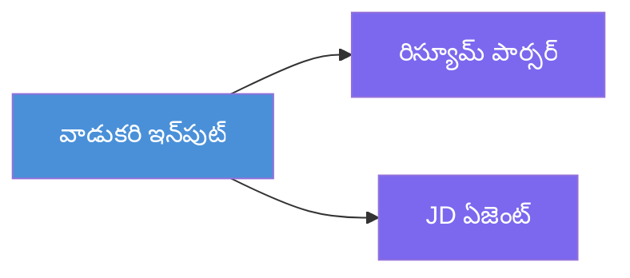
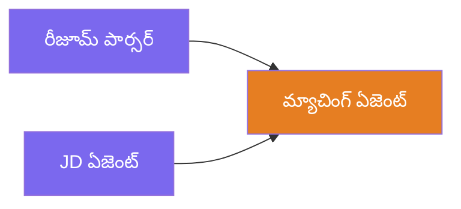
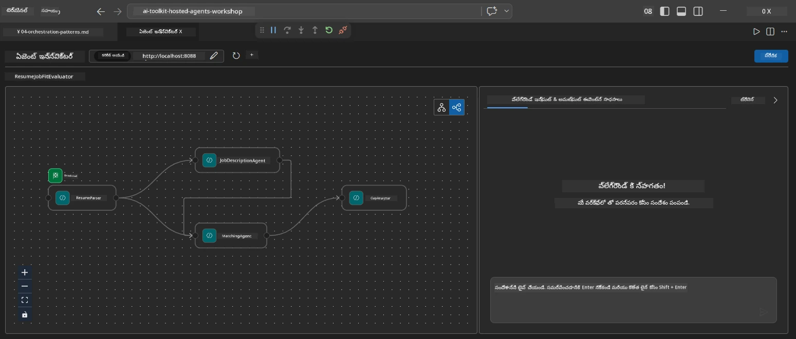
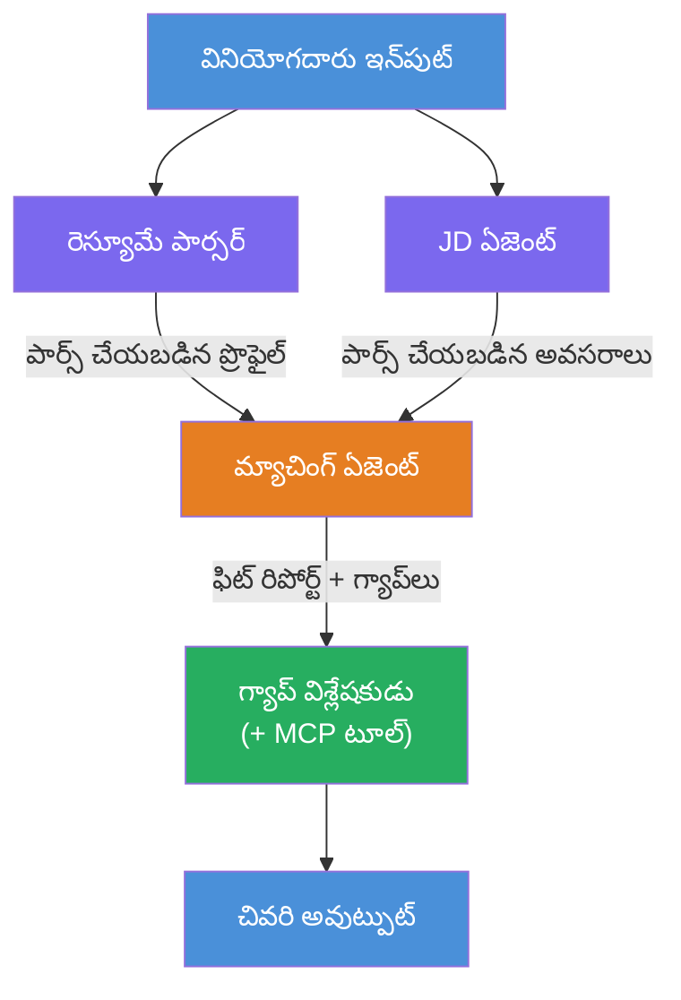
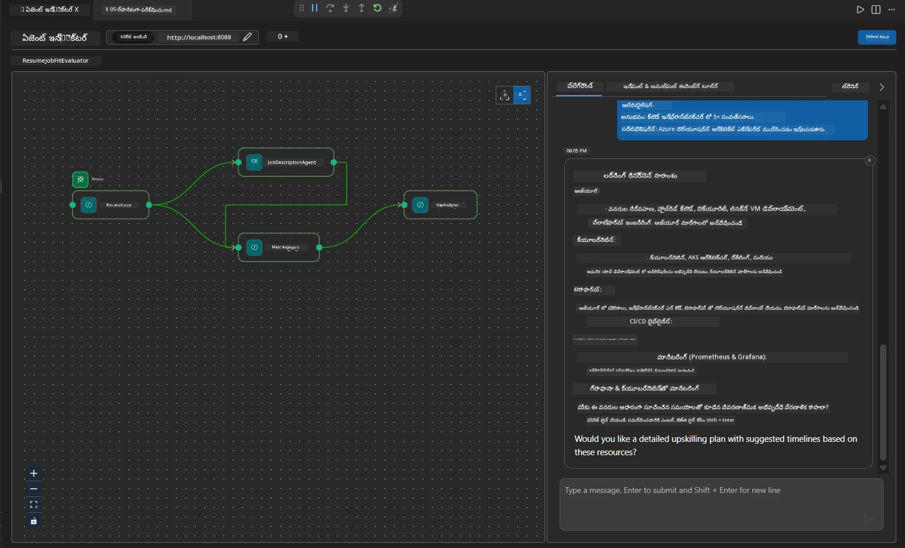

# మాడ్యూల్ 4 - ఒर्कెస్ట్రేషన్ నమూనాలు

ఈ మాడ్యూల్‌లో, మీరు Resume Job Fit Evaluator లో ఉపయోగించే ఒర్కెస్ట్రేషన్ నమూనాలను పరిశీలిస్తారు మరియు వర్క్‌ఫ్లో గ్రాఫ్‌ను ఎలా చదవాలో, మార్చాలో, మరియు పొడిగించాలో తెలుసుకుంటారు. ఈ నమూనాల అర్థం డేటా ఫ్లో సమస్యలను డీబగ్ చేయడానికి మరియు మీ సొంత [బహుళ-ఏజెంట్ వర్క్‌ఫ్లోలు](https://learn.microsoft.com/agent-framework/workflows/) నిర్మించడానికి అవసరం.

---

## నమూనా 1: ఫ్యాన్-అవుట్ (సమాంతర విభజన)

వర్క్‌ఫ్లోలో మొదటి నమూనా **ఫ్యాన్-అవుట్** - ఒకే ఇన్‌పుట్‌ను ఒకేసారి బహుళ ఏజెంట్లు అందుకుంటాయి.


కోడ్‌లో, ఇది అనుకుందాం `resume_parser` `start_executor` - ఇది యూజర్ సందేశాన్ని మొదట అందుకుంటుంది. ఆ తర్వాత, ఎందుకంటే `jd_agent` మరియు `matching_agent` రెండు `resume_parser` నుండి ఎడ్జిలను కలిగి ఉన్నారు, ఫ్రేమ్‌వర్క్ `resume_parser` యొక్క అవుట్‌పుట్‌ను రెండూ ఏజెంట్లకు రూట్ చేస్తుంది:

```python
.add_edge(resume_parser, jd_agent)         # రిజ్యూమ్ పార్సర్ అవుట్పుట్ → JD ఏజెంట్
.add_edge(resume_parser, matching_agent)   # రిజ్యూమ్ పార్సర్ అవుట్పుట్ → మాచింగ్ ఏజెంట్
```

**ఇది ఎందుకు పని చేస్తుంది:** ResumeParser మరియు JD Agent ఒకే ఇన్‌పుట్ యొక్క వేరు వేరు అంశాలను ప్రాసెస్ చేస్తారు. వాటిని సమాంతరంలో నడుపటం వల్ల సీక్వెన్షియల్‌గా నడిపితే కంటే మొత్తం ఆలస్యం తగ్గుతుంది.

### ఎప్పుడు ఫ్యాన్-అవుట్ ఉపయోగించాలి

| వినియోగం | ఉదాహరణ |
|----------|---------|
| స్వతంత్ర ఉపపనకార్యాలు | రెజ్యూమే పార్సింగ్ vs JD పార్సింగ్ |
| ద్వితీయత / ఓటు వేయడం | రెండు ఏజెంట్లు ఒకే డేటాను విశ్లేషిస్తాయి, మూడవది ఉత్తమ జవాబు ఎంచుకుంటుంది |
| బహు-ఫార్మాట్ అవుట్‌పుట్ | ఒక్క ఏజెంట్ టెక్స్ట్ తయారు చేస్తుంది, మరొకటి నిర్మిత JSON తయారు చేస్తుంది |

---

## నమూనా 2: ఫ్యాన్-ఇన్ (సేకరణ)

మరొక నమూనా **ఫ్యాన్-ఇన్** - బహుళ ఏజెంట్ అవుట్‌పుట్లను సేకరించి, ఒకటే డౌన్‌స్ట్రీం ఏజెంట్‌కు పంపుతారు.


కోడ్‌లో:

```python
.add_edge(resume_parser, matching_agent)   # ResumeParser అవుట్‌పుట్ → MatchingAgent
.add_edge(jd_agent, matching_agent)        # JD Agent అవుట్‌పుట్ → MatchingAgent
```

**ప్రధాన ప్రవర్తనం:** ఒక ఏజెంట్‌కి **రెండు లేదా అంతకంటే ఎక్కువ ఇన్‌కమింగ్ ఎడ్జిలు** ఉన్నప్పుడు, ఫ్రేమ్‌వర్క్ డౌన్‌స్ట్రీం ఏజెంట్ నడపడానికి ముందు **అన్ని** అప్‌స్ట్రీం ఏజెంట్లు పూర్తయ్యేవరకు ఆటపాడుతుంది. MatchingAgent ప్రారంభం కావడానికి ResumeParser మరియు JD Agent రెండూ ముగించాలి.

### MatchingAgent పొందేది

ఫ్రేమ్‌వర్క్ అన్ని అప్‌స్ట్రీం ఏజెంట్ అవుట్‌పుట్లను కలిపి పంపుతుంది. MatchingAgent యొక్క ఇన్‌పుట్ ఇలా ఉంటుంది:

```
[ResumeParser output]
---
Candidate Profile:
  Name: Jane Doe
  Technical Skills: Python, Azure, Kubernetes, ...
  ...

[JobDescriptionAgent output]
---
Role Overview: Senior Cloud Engineer
Required Skills: Python, Azure, Terraform, ...
...
```

> **గమనిక:** ఖచ్చితమైన కలిసే ఫార్మాట్ ఫ్రేమ్‌వర్క్ వెర్షన్‌పై ఆధారపడి ఉంటుంది. ఏజెంట్ సూచనలు నిర్మిత మరియు నిర్మితరహిత అప్‌స్ట్రీం అవుట్‌పుట్ రెండిని కూడా నిర్వహించేలా రాయాలి.



---

## నమూనా 3: సీక్వెన్షియల్ చైన్

మూవవిడి నమూనా **క్రమపద్ధతిలో సంక్రామణం** - ఒక ఏజెంట్ అవుట్‌పుట్ నేరుగా తదుపరి ఏజెంట్ కు అందుతుంది.


కోడ్‌లో:

```python
.add_edge(matching_agent, gap_analyzer)    # మాచింగ్ ఏజెంట్ అవుట్పుట్ → గ్యాప్ అనలైజర్
```

ఇది సరళమైన నమూనా. GapAnalyzer MatchingAgent యొక్క ఫిట్ స్కోర్, సరిపోని లేదా కోల్పోయిన నైపుణ్యాలు, గ్యాపులను అందుకుంటుంది. తర్వాత అది ప్రతి గ్యాప్ కోసం Microsoft Learn వనరులు పొందేందుకు [MCP సాధనం](https://learn.microsoft.com/azure/foundry/agents/how-to/tools/model-context-protocol) ను పిలుస్తుంది.

---

## పూర్తి గ్రాఫ్

మూడు నమూనాలను కలిపితే పూర్తి వర్క్‌ఫ్లో వస్తుంది:


### కార్యనిర్వహణ కాలరేఖ

```mermaid
gantt
    title ఏజెంట్ అమలు టైమ్‌లైన్
    dateFormat X
    axisFormat %s

    section సమాంతర
    Resume Parser       :rp, 0, 3
    JD Agent            :jd, 0, 2

    section వరుసగా
    Matching Agent      :ma, 3, 5
    Gap Analyzer        :ga, 5, 9
```


> మొత్తం గడియార సమయం సుమారు `max(ResumeParser, JD Agent) + MatchingAgent + GapAnalyzer`. GapAnalyzer సాధారణంగా చాలా MCP సాధన కాల్స్ (ప్రతి గ్యాప్‌కు ఒకటి) చేస్తుంది కాబట్టి నెమ్మదిగా ఉంటుంది.

---

## WorkflowBuilder కోడ్ చదవడం

`main.py` లోని పూర్తి `create_workflow()` ఫంక్షన్, వ్యాఖ్యలతో:

```python
def create_workflow(resume_parser, jd_agent, matching_agent, gap_analyzer):
    workflow = (
        WorkflowBuilder(
            name="ResumeJobFitEvaluator",

            # వినియోగదారు ఇన్‌పుట్‌ను అందుకునే మొదటి ఏజెంట్
            start_executor=resume_parser,

            # అవుట్‌పుట్ ఫైనల్ ప్రతిస్పందనగా మారే ఏజెంట్(లు)
            output_executors=[gap_analyzer],
        )
        # ఫ్యాన్-అవుట్: ResumeParser అవుట్‌పుట్ JD ఏజెంట్ మరియు MatchingAgent రెండింటికి వెళుతుంది
        .add_edge(resume_parser, jd_agent)
        .add_edge(resume_parser, matching_agent)

        # ఫ్యాన్-ఇన్: MatchingAgent రెండు ResumeParser మరియు JD Agent కోసం వేచి ఉంటుంది
        .add_edge(jd_agent, matching_agent)

        # వరుసగా: MatchingAgent అవుట్‌పుట్ GapAnalyzer కు పోషణ ఇస్తుంది
        .add_edge(matching_agent, gap_analyzer)

        .build()
    )
    return workflow.as_agent()
```

### ఎడ్జ్ సారాంశ పట్టিকা

| # | ఎడ్జ్ | నమూనా | ప్రభావం |
|---|--------|--------|--------|
| 1 | `resume_parser → jd_agent` | ఫ్యాన్-అవుట్ | JD Agent ResumeParser అవుట్‌పుట్ (మూల యూజర్ ఇన్‌పుట్ సహా) అందుకుంటుంది |
| 2 | `resume_parser → matching_agent` | ఫ్యాన్-అవుట్ | MatchingAgent ResumeParser అవుట్‌పుట్ అందుకుంటుంది |
| 3 | `jd_agent → matching_agent` | ఫ్యాన్-ఇన్ | MatchingAgent JD Agent అవుట్‌పుట్ కూడా పొందుతుంది (ఇరువురికీ కూడగట్టి వేచి ఉంటుంది) |
| 4 | `matching_agent → gap_analyzer` | క్రమబద్ధం | GapAnalyzer ఫిట్ నివేదిక + గ్యాప్ జాబితా అందుకుంటుంది |

---

## గ్రాఫ్ మార్చడం

### కొత్త ఏజెంట్ జోడించడం

ఐదో ఏజెంట్ (ఉదాహరణకు, గ్యాప్ విశ్లేషణ ఆధారంగా ఇంటర్వ్యూ ప్రశ్నలు తయారు చేసే **InterviewPrepAgent**) జోడించడానికి:

```python
# 1. సూచనలను నిర్వచించండి
INTERVIEW_PREP_INSTRUCTIONS = """\
You are the Interview Prep Agent.
Given a gap analysis and fit report, generate 10 targeted interview questions
the candidate should prepare for.
"""

# 2. ఏజెంట్ ను సృష్టించండి (async with బ్లాక్ లో)
AzureAIAgentClient(
    project_endpoint=PROJECT_ENDPOINT,
    model_deployment_name=MODEL_DEPLOYMENT_NAME,
    credential=credential,
).as_agent(
    name="InterviewPrepAgent",
    instructions=INTERVIEW_PREP_INSTRUCTIONS,
) as interview_prep,

# 3. create_workflow() లో ఎడ్జ్ లు జోడించండి
.add_edge(matching_agent, interview_prep)   # ఫిట్ రిపోర్ట్ అందుకుంటుంది
.add_edge(gap_analyzer, interview_prep)     # గ్యాప్ కార్డులు కూడా అందుకుంటుంది

# 4. output_executors ను నవీకరించండి
output_executors=[interview_prep],  # ఇప్పుడు తుది ఏజెంట్
```

### ఎగ్జిక్యూషన్ ఆర్డర్ మార్చడం

ResumeParser తర్వాత JD Agent నడపాలంటే (సమాంతర కాకుండా క్రమబద్ధంగా):

```python
# తీసివేయి: .add_edge(resume_parser, jd_agent)  ← ఇప్పటికే ఉంది, దాన్ని ఉంచు
# jd_agent నేరుగా యూజర్ ఇన్‌పుట్ పొందకుండా ఉండటం ద్వారా నిర్వచిత సమాంతరాన్ని తీసివేయండి
# start_executor మొదట resume_parser కు పంపుతుంది, మరియు jd_agent కేవలం
# resume_parser యొక్క అవుట్‌పుట్‌ను ఎడ్జ్ ద్వారా పొందుతుంది. ఇది వాటిని వరుసగా చేస్తుంది.
```

> **ముఖ్యము:** `start_executor` మాత్రమే మౌలిక యూజర్ ఇన్‌పుట్ అందుకునే ఏజెంట్. మిగతా ఏజెంట్లు తమ అప్‌స్ట్రీం ఎడ్జ్‌ల అవుట్‌పుట్ ను మాత్రమే పొందతాయి. మీరు ఏజెంట్‌కు మౌలిక యూజర్ ఇన్‌పుట్ కూడా కావాలనుకుంటే, అతని వద్ద `start_executor` నుండి ఎడ్జ్ ఉండాలి.

---

## సాధారణ గ్రాఫ్ లోపాలు

| లోపం | లక్షణం | పరిష్కారం |
|---------|---------|--------|
| `output_executors` కు ఎడ్జ్ లేమి | ఏజెంట్ నడుస్తుంది కానీ అవుట్‌పుట్ ఖాళీగా ఉంటుంది | `start_executor` నుండి `output_executors` లో ఉన్న ప్రతి ఏజెంట్‌కు మార్గం ఉన్నదని నిర్ధారించండి |
| సర్క్యులర్ డిపెండెన్సీ | అనంత లూప్ లేదా టైమ్‌అవుట్ | ఎటువంటి ఏజెంట్ అనడంతో తనైన అప్‌స్ట్రీం ఏజెంట్‌కు ఫీడ్ బ్యాక్ ఇవ్వట్లేదని చూడండి |
| `output_executors` లో ఏజెంట్ కు ఎడ్జ్‌లేమి | ఖాళీ అవుట్‌పుట్ | కనీసం ఒక `add_edge(source, that_agent)` జోడించండి |
| ఫ్యాన్-ఇన్ లేకుండా బహుళ `output_executors` | అవుట్‌పుట్ ఒక్క ఏజెంట్ స్పందన మాత్రమే ఉంటుంది | ఒక ఏజెంట్‌ను ఉపయోగించి అవుట్‌పుట్‌లను సమగ్రపరచండి, లేదా బహుళ అవుట్‌పుట్లను అంగీకరించండి |
| `start_executor` లేడు | బిల్డ్ సమయంలో `ValueError` | ఎప్పుడూ `WorkflowBuilder()` లో `start_executor` పేర్కొనండి |

---

## గ్రాఫ్ డీబగ్గింగ్

### Agent Inspector ఉపయోగించడం

1. ఏజెంట్‌ని స్థానికంగా ప్రారంభించండి (F5 లేదా టెర్మినల్ - [Module 5](05-test-locally.md) చూడండి).
2. Agent Inspector తెరిచండి (`Ctrl+Shift+P` → **Foundry Toolkit: Open Agent Inspector**).
3. ఒక టెస్ట్ సందేశం పంపండి.
4. ఇన్‌స్పెక్టర్ ప్రతిస్పందన ప్యానెల్‌లో **స్ట్రీమింగ్ అవుట్‌పుట్** కోసం చూడండి - ఇది ప్రతి ఏజెంట్ నిడివి క్రమంలో సహకారాన్ని చూపిస్తుంది.



### లాగింగ్ ఉపయోగించడం

`main.py` లో లాగింగ్ జోడించి డేటా ఫ్లోను ట్రేస్ చేయండి:

```python
import logging
logger = logging.getLogger("resume-job-fit")

# create_workflow() లో, నిర్మించిన తరువాత:
logger.info("Workflow graph built with edges: RP→JD, RP→MA, JD→MA, MA→GA")
```

సర్వర్ లాగ్లు ఏజెంట్ నడిపే క్రమం మరియు MCP సాధన కాల్స్ ప్రదర్శిస్తాయి:

```
INFO:resume-job-fit:Starting Resume -> Job Fit Evaluator HTTP server...
INFO:resume-job-fit:Server running on http://localhost:8088
INFO:agent_framework:Executing agent: ResumeParser
INFO:agent_framework:Executing agent: JobDescriptionAgent
INFO:agent_framework:Waiting for upstream agents: ResumeParser, JobDescriptionAgent
INFO:agent_framework:Executing agent: MatchingAgent
INFO:agent_framework:Executing agent: GapAnalyzer
INFO:agent_framework:Tool call: search_microsoft_learn_for_plan(skill="Kubernetes")
POST https://learn.microsoft.com/api/mcp → 200
INFO:agent_framework:Tool call: search_microsoft_learn_for_plan(skill="Terraform")
POST https://learn.microsoft.com/api/mcp → 200
```

---

### చెక్‌పాయింట్

- [ ] మీరు వర్క్‌ఫ్లోలో మూడు ఒర్కెస్ట్రేషన్ నమూనాలను గుర్తించగలరు: ఫ్యాన్-అవుట్, ఫ్యాన్-ఇన్, మరియు సీక్వెన్షియల్ చైన్
- [ ] యధావిధిగా అనేక ఇన్‌కమింగ్ ఎడ్జిలు ఉన్న ఏజెంట్లు అన్ని అప్‌స్ట్రీం ఏజెంట్లు పూర్తయ్యేవరకు వేచి ఉంటాయని మీకు అర్థమవుతుంది
- [ ] మీరు `WorkflowBuilder` కోడ్ చదవగలరు మరియు ప్రతి `add_edge()` కాల్‌ను విజువల్ గ్రాఫ్‌తో మ్యాప్ చేయగలరు
- [ ] కార్యనిర్వహణ కాలరేఖను మీరు అర్థం చేసుకుంటారు: సమాంతర ఏజెంట్లు మొదట నడుస్తాయి, ఆపై సమగ్రపరచడం, ఆపై క్రమపద్ధతిలో నడవడం
- [ ] కొత్త ఏజెంట్‌ను గ్రాఫ్‌లో ఎలా జోడించాలో (సూచనలు నిర్వచించడం, ఏజెంట్ సృష్టించడం, ఎడ్జిలు జోడించడం, అవుట్‌పుట్ అప్‌డేట్ చేయడం) మీరు తెలుసుకున్నారు
- [ ] సాధారణ గ్రాఫ్ పొరపాట్లు మరియు వాటి లక్షణాలను మీరు గుర్తించగలరు

---

**మునుపటి:** [03 - ఏజెంట్లు & వాతావరణాన్ని కాన్ఫిగర్ చేయడం](03-configure-agents.md) · **తదుపరి:** [05 - స్థానికంగా పరీక్షించండి →](05-test-locally.md)

---

<!-- CO-OP TRANSLATOR DISCLAIMER START -->
**విన్నపం**:
ఈ పత్రం AI అనువాద సేవ [Co-op Translator](https://github.com/Azure/co-op-translator) ఉపయోగించి అనువదించబడింది. మనం ఖచ్చితత్వం కోసం ప్రయత్నించినప్పటికీ, ఆటోమేటెడ్ అనువాదాలలో తప్పులు లేదా అపారదృష్టతలు ఉండొచ్చు అని దయచేసి గమనించండి. స్థానిక భాషలో ఉన్న మౌలిక పత్రం అధికారిక మూలంగా పరిగణించాలి. ముఖ్యమైన సమాచారానికి, నైపుణ్యంతో కూడిన మానవ అనువాదం చేయించుకోవడం సలహా ఇవ్వబడుతుంది. ఈ అనువాదం వాడకం వల్ల కలిగే ఎటువంటి అపార్థాలు లేదా తప్పుతర్ఫతలకు మేము బాధ్యులు కాకపోవడం గమనించండి.
<!-- CO-OP TRANSLATOR DISCLAIMER END -->