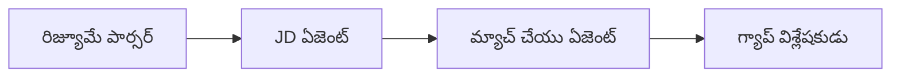
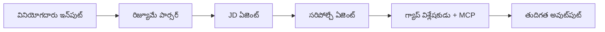

# మోడ్యూల్ 4 - ఆర్కెస్ట్రేషన్ ప్యాటర్న్స్

⏱️ సుమారు 10 నిమిషాలు

ఈ మోడ్యూల్‌లో, మీరు రిజ్యూమ్ జాబ్ ఫిట్ వెల్యుయేటర్‌లో ఉపయోగించే ఆర్కెస్ట్రేషన్ ప్యాటర్న్స్‌ను పరిశీలిస్తారు మరియు వర్క్‌ఫ్లో గ్రాఫ్‌ను ఎలా చదవడం, సవరించడం మరియు విస్తరించడం నేర్చుకుంటారు. ఈ ప్యాటర్న్స్‌ను అర్థం చేసుకోవడం డేటా ఫ్లో సమస్యలను డీబగ్గింగ్ చేయడానికి మరియు మీ స్వంత [మల్టీ-ఏజెంట్ వర్క్‌ఫ్లోస్](https://learn.microsoft.com/agent-framework/workflows/)ను నిర్మించడానికి కీలకం.

---

## ప్యాటర్న్ 1: వరుస గొలుసు

వర్క్‌ఫ్లోలో ప్రాథమిక ప్యాటర్న్ **వరుస గొలుసు** - ప్రతి ఏజెంట్ అవుట్‌పుట్ నేరుగా తదుపరి ఏజెంట్‌కు ఫీడ్ అవుతుంది.


```mermaid
flowchart LR
    RP[రిజ్యూమే పార్సర్] --> JD[JD ఏజెంట్]
    JD --> MA[మ్యాచ్ చేయు ఏజెంట్]
    MA --> GA[గ్యాప్ విశ్లేషకుడు]
```

కోడ్‌లో, ప్రతి `add_edge()` కాల్ గొలుసులో ఒక దశను సృష్టిస్తుంది:

```python
.add_edge(resume_executor, jd_executor)       # రిజ్యూమ్ పార్సర్ అవుట్‌పుట్ → JD ఏజెంట్
.add_edge(jd_executor, matching_executor)     # JD ఏజెంట్ అవుట్‌పుట్ → మాచింగ్ ఏజెంట్
.add_edge(matching_executor, gap_executor)    # మాచింగ్ ఏజెంట్ అవుట్‌పుట్ → గ్యాప్ అనాలైజర్
```

> **ఎందుకు వరుస, ఫ్యాన్-అవుట్/ఫ్యాన్-ఇన్ కాదు?** `WorkflowBuilder` ఇన్‌కమింగ్ ఎడ్జిలకు **OR-సెమాంటిక్స్** ఉపయోగిస్తుంది: ఒక దిగువ ఎగ్జిక్యూటర్ **ఏదైనా** ముందస్తు పూర్తయ్యే వెంటనే ప్రేరేపింపబడుతుంది. `matching_executor`కు రెండు ఇన్‌కమింగ్ ఎడ్జిలు ఉండేవి (ఇది `resume_executor` మరియు `jd_executor` నుండి వస్తే), అది రెండు సార్లు ట్రిగ్గర్ అవుతుంది - ఒకసారి ResumeParser ముగిసినప్పుడు మరియు మళ్లీ JD Agent ముగిసినప్పుడు - దీని వలన GapAnalyzer కూడా రెండు సార్లు నడుస్తుంది మరియు అవుట్‌పుట్ రెండు సార్లు కనపడుతుంది. వరుస పైప్‌లైన్ ఇది పూర్తిగా నివారిస్తుంది.

## ప్యాటర్న్ 2: కంటెంట్ రీలే

`context_mode="last_agent"` అంటే ప్రతి ఎగ్జిక్యూటర్ తన **నేరుగా ముందున్న ఏజెంట్ అవుట్‌పుట్** మాత్రమే చూస్తుంది, కాబట్టి వరుస గొలుసులోని ఏజెంట్లు దిగువ ఏజెంట్లు అవసరమైన ఏ డేటా అయితే దాన్ని స్పష్టంగా ముందుకు పంపాలి.

ఈ వర్క్‌ఫ్లోలో:
- **ResumeParser** JD ని అన్నింటిని కాపీచేస్తుంది `[JOB DESCRIPTION PASS-THROUGH]` లో (అందుకే JD Agent దాన్ని కనుగొంటుంది).
- **JD Agent** `[PARSED RESUME]` ను స్వచ్ఛంగా `[PARSED RESUME PASS-THROUGH]` లో కాపీ చేస్తుంది (అందుకే MatchingAgent రెండు ప్రొఫైల్‌లను పోల్చగలదు).

```
ResumeParser output
└─ [PARSED RESUME]               ← extracted by JD Agent
└─ [JOB DESCRIPTION PASS-THROUGH] ← extracted by JD Agent

JD Agent output
└─ [JD REQUIREMENTS]             ← extracted by MatchingAgent
└─ [PARSED RESUME PASS-THROUGH]  ← extracted by MatchingAgent
```

ప్రతి రీలే భాగం **స్వచ్ఛంగా** కాపీ చేయబడాలి - దాన్ని సారాంశం చేయడం లేదా పర్యాయప్రయోగం చేయడం దిగువ ఏజెంట్‌ను దెబ్బతీయవచ్చు.

---

## పూర్తి గ్రాఫ్

వరుస గొలుసు మరియు కంటెంట్ రీలే ప్యాటర్న్‌లను కలిపితే పూర్తి వర్క్‌ఫ్లో వస్తుంది:


```mermaid
flowchart LR
    U[వినియోగదారు ఇన్‌పుట్] --> RP[రిజ్యూమే పార్సర్]
    RP --> JD[JD ఏజెంట్]
    JD --> MA[సరిపోల్చే ఏజెంట్]
    MA --> GA[గ్యాప్ విశ్లేషకుడు + MCP]
    GA --> O[తుదిగత అవుట్‌పుట్]
```

ఏజెంట్ ఇన్‌స్పెక్టర్ ఏజెంట్ స్థానికంగా నడుస్తున్నప్పుడు ఇదే గ్రాఫ్ నిర్మాణాన్ని చూపిస్తుంది. స్క్రీన్‌షాట్ల కోసం [Module 5 - Test Locally](05-test-locally.md) ను చూసుకోండి.

---

## WorkflowBuilder కోడ్ చదవడం

పూర్తి `create_workflow()` ఫంక్షన్ [`PersonalCareerCopilot/main.py`](../../../../../workshop/lab02-multi-agent/PersonalCareerCopilot/main.py)లో ఉంది. మూడు `add_edge()` కాల్స్ వరుస పైప్‌లైన్‌ని నిర్మిస్తాయి:

| # | ఎడ్జ్ | ప్రభావం |
|---|------|--------|
| 1 | `resume_executor → jd_executor` | JD Agent కి `[PARSED RESUME]` + `[JOB DESCRIPTION PASS-THROUGH]` అందుతుంది |
| 2 | `jd_executor → matching_executor` | MatchingAgent కి `[JD REQUIREMENTS]` + `[PARSED RESUME PASS-THROUGH]` అందుతుంది |
| 3 | `matching_executor → gap_executor` | GapAnalyzer కి ఫిట్ రిపోర్ట్ + గ్యాప్ జాబితా అందుతుంది |

---

## గ్రాఫ్ సవరించడం

### కొత్త ఏజెంట్ జోడించడం

ఐదవ ఏజెంట్ (ఉదాహరణకి GapAnalyzer తరువాత **InterviewPrepAgent**) ను జోడించడానికి:

1. `INTERVIEW_PREP_INSTRUCTIONS` స్థిరాంకం నిర్వచించండి.
2. `Agent` + `AgentExecutor` ఆబ్జెక్ట్స్ సృష్టించండి (ఇప్పటి నాలుగు ఏజెంట్లతో సమాన నమూనా).
3. `WorkflowBuilder` లో `.add_edge(gap_executor, interview_exec)` జోడించండి.
4. `output_executors=[interview_exec]` ను నవీకరించండి.

> **గమనిక:** `start_executor` మాత్రమే రా యూజర్ ఇన్పుట్ అందుకునే ఏజెంట్. మిగతా ఏజెంట్లు తమ అప్‌స్ట్రీమ్ ఎడ్జి నుండి అవుట్‌పుట్ పొందుతాయి.

---

## సాధారణ గ్రాఫ్ పొరపాట్లు

| పొరపాటు | లక్షణం | పరిష్కారం |
|---------|---------|-----|
| `output_executors` కు ఎడ్జ్ ఉండకపోవడం | ఏజెంట్ నడుస్తుంది కానీ అవుట్‌పుట్ ఖాళీగా ఉంటుంది | `start_executor` నుండి ప్రతి `output_executors` ఏజెంట్‌కు మార్గం ఉన్నదే కాబట్టి నిర్ధారించండి |
| వృత్తాకార ఆధారపడకుము | అపరిమిత లూప్ లేదా టైమౌట్ | ఎటువంటి ఏజెంట్ అప్‌స్ట్రీమ్ ఏజెంట్‌కు తిరిగి ఫీడ్ అవ్వడం లేదు అని తనిఖీ చేయండి |
| ఇన్‌కమింగ్ ఎడ్జ్ లేకుండా `output_executors`లో ఏజెంట్ | ఖాళీ అవుట్‌పుట్ | కనీసం ఒక్క `add_edge(source, that_agent)` జోడించండి |
| ఫ్యాన్-ఇన్ లేకుండా బహుళ `output_executors` | అవుట్‌పుట్‌లో కేవలం ఒక ఏజెంట్ సమాధానం మాత్రమే ఉంటుంది | సంగ్రహించే ఏకైక అవుట్‌పుట్ ఏజెంట్ ఉపయోగించండి లేదా బహుళ అవుట్‌పుట్‌లను స్వీకరించండి |
| `start_executor` లేమి | బిల్డ్ సమయంలో `ValueError` | ఎప్పుడూ `WorkflowBuilder()`లో `start_executor` ను పేర్కొనండి |

---

## గ్రాఫ్ డీబగ్గింగ్

### ఏజెంట్ ఇన్‌స్పెక్టర్ ఉపయోగించడం

1. F5 తో ఏజెంట్‌ను స్థానికంగా ప్రారంభించండి.
2. ఏజెంట్ ఇన్‌స్పెక్టర్ తెరవండి (`Ctrl+Shift+P` → **Foundry Toolkit: Open Agent Inspector**).
3. ఒక పరీక్ష సందేశం పంపండి.
4. ఇన్‌స్పెక్టర్ యొక్క స్పందన ప్యానెల్లో **స్ట్రీమింగ్ అవుట్‌పుట్** కోసం చూసుకోండి - ఇది ప్రతి ఏజెంట్ క్రమంలో చేసిన భాగాన్ని చూపిస్తుంది.


### లాగింగ్ ఉపయోగించడం

డేటా ఫ్లో ట్రేస్ చేయడానికి `main.py`లో లాగింగ్ జోడించండి:

```python
import logging
logger = logging.getLogger("resume-job-fit")

# main() లో, workflow ను రూపొందించిన తరువాత:
logger.info("Workflow graph built with edges: RP→JD, JD→MA, MA→GA")
```

సర్వర్ లాగ్‌లు ఏజెంట్ ఎగ్జిక్యూషన్ ఆర్డర్ మరియు MCP టూల్ కాల్స్ చూపిస్తాయి:

```
INFO:agent_framework:Executing agent: ResumeParser
INFO:agent_framework:Executing agent: JobDescriptionAgent
INFO:agent_framework:Executing agent: MatchingAgent
INFO:agent_framework:Executing agent: GapAnalyzer
INFO:agent_framework:Tool call: search_microsoft_learn_for_plan(skill="Kubernetes")
POST https://learn.microsoft.com/api/mcp → 200
INFO:agent_framework:Tool call: search_microsoft_learn_for_plan(skill="Terraform")
POST https://learn.microsoft.com/api/mcp → 200
```

---

### చెక్పాయింట్

- [ ] మీరు వర్క్‌ఫ్లోలో రెండు ఆర్కెస్ట్రేషన్ ప్యాటర్న్స్‌ను గుర్తించగలుగుతారు: వరుస గొలుసు మరియు కంటెంట్ రీలే
- [ ] మీరు `context_mode="last_agent"` ఎందుకు ఏజెంట్ల మధ్య స్పష్టమైన డేటా రీలే అవసరమో అర్థం చేసుకుంటారు
- [ ] మీరు `WorkflowBuilder` కోడ్ చదవగలరు మరియు ప్రతి `add_edge()` కాల్‌ను విజువల్ గ్రాఫ్‌తో మ్యాప్ చేయగలరు
- [ ] మీరు పైప్‌లైన్ చివర కొత్త ఏజెంట్‌ని ఎలా జోడించాలో తెలుసుకొంటారు
- [ ] మీరు సాధారణ గ్రాఫ్ పొరపాట్లను మరియు వాటి లక్షణాలను గుర్తించగలరు

---

**మునుపటి:** [03 - ఏజెంట్లు & పర్యావరణం కాంఫిగర్ చేయడం](03-configure-agents.md) · **తరువాత:** [05 - స్థానికంగా పరీక్షించడం →](05-test-locally.md)

---

<!-- CO-OP TRANSLATOR DISCLAIMER START -->
**అస్వీకరణ**:
ఈ పత్రం AI అనువాద సేవ [Co-op Translator](https://github.com/Azure/co-op-translator) ఉపయోగించి అనువదించబడింది. మేము ఖచ్చితత్వానికి ప్రయత్నిస్తున్నప్పటికీ, ఆటోమేటెడ్ అనువాదాలు తప్పులు లేదా అసమగ్రతలను కలిగి ఉండవచ్చు. దాని స్వదేశ భాషలో ఉన్న అసలు పత్రాన్ని అధికారం కలిగిన మూలంగా పరిగణించాలి. కీలకమైన సమాచారం కోసం, ప్రొఫెషనల్ మానవ అనువాదాన్ని సిఫారసు చేస్తాము. ఈ అనువాదం ఉపయోగం వల్ల కలిగే ఏవైనా అపార్థాలు లేదా తప్పుదారులు కోసం మేము బాధ్యత వహించము.
<!-- CO-OP TRANSLATOR DISCLAIMER END -->