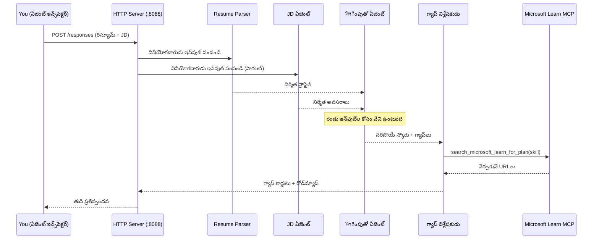
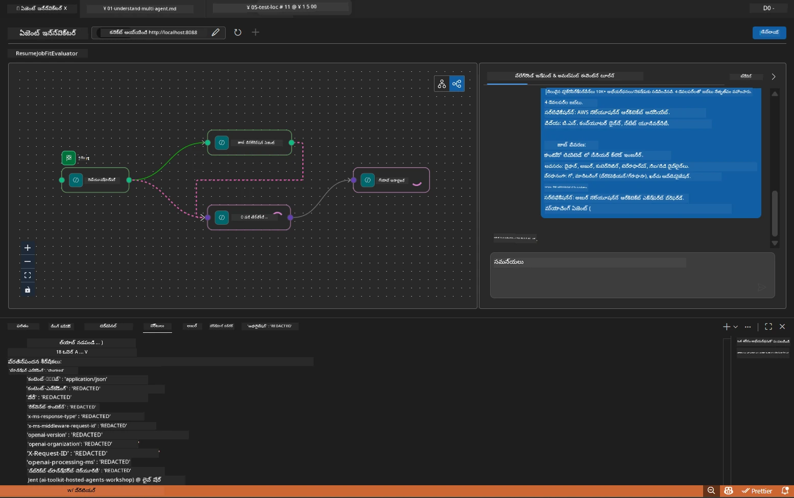

# మాడ్యూల్ 5 - స్థానికంగా టెస్ట్ చేయండి (బహుళ ఏజెంట్)

ఈ మాడ్యూల్‌లో, మీరు బహుళ ఏజెంట్ వర్క్‌ఫ్లోను స్థానికంగా అమలు చేస్తారు, Agent Inspector తో పరీక్షిస్తారు, మరియు Foundryకి ఏర్పాటు చేసుకోక ముందే నాలుగు ఏజెంట్లు మరియు MCP టూల్ సరిగా పని చేస్తున్నాయో లేదో తనిఖీ చేస్తారు.

### స్థానిక టెస్ట్ రన్ సమయంలో ఏం జరుగుతుంది


---

## దశ 1: ఏజెంట్ సర్వర్ ప్రారంభించండి

### ఎంపిక A: VS కోడ్ టాస్క్ ఉపయోగించడం (సిఫార్సు చేయబడింది)

1. `Ctrl+Shift+P` నొక్కి → **Tasks: Run Task** టైప్ చేయండి → **Run Lab02 HTTP Server** ఎంచుకోండి.
2. టాస్క్ డీబగ్గీతో debugpy ను `5679` పోర్ట్‌పై, మరియు ఏజెంట్‌ను `8088` పోర్ట్‌పై స్టార్ట్ చేస్తుంది.
3. అవుట్పుట్ ఇలా కనిపించే వరకు వేచి ఉండండి:

```
INFO:resume-job-fit:Starting Resume -> Job Fit Evaluator HTTP server...
INFO:resume-job-fit:Server running on http://localhost:8088
```

### ఎంపిక B: టెర్మినల్‌ను మానువెల్‌గా ఉపయోగించడం

```powershell
cd workshop\lab02-multi-agent\PersonalCareerCopilot
```

వర్చువల్ ఎన్విరాన్‌మెంట్‌ను చేర్చండి:

**పవర్‌షెల్ (విండోస్):**
```powershell
.\.venv\Scripts\Activate.ps1
```

**macOS/Linux:**
```bash
source .venv/bin/activate
```

సర్వర్‌ను ప్రారంభించండి:

```powershell
python -m debugpy --listen 127.0.0.1:5679 -m agentdev run main.py --verbose --port 8088
```

### ఎంపిక C: F5 ఉపయోగించడం (డీబగ్ మోడ్)

1. `F5` నొక్కండి లేదా **Run and Debug** (`Ctrl+Shift+D`)కు వెళ్లండి.
2. డ్రాప్‌డౌన్ నుండి **Lab02 - Multi-Agent** ప్రారంభ ఆకృతీకరణను ఎంచుకోండి.
3. సర్వర్ పూర్తి బ్రేక్ పాయింట్ మద్దతుతో ప్రారంభమవుతుంది.

> **సూచి:** డీబగ్ మోడ్‌లో మీరు `search_microsoft_learn_for_plan()` లో బ్రేక్‌పాయింట్లు సెట్ చేసి MCP ప్రతిస్పందనలను పరిశీలించవచ్చు, లేదా ఏ ఒక్క ఏజెంట్ ఎలాంటి సూచనలు పొందుతున్నదీ చూడవచ్చు.

---

## దశ 2: Agent Inspector తెరవండి

1. `Ctrl+Shift+P` నొక్కి → **Foundry Toolkit: Open Agent Inspector** టైప్ చేయండి.
2. Agent Inspector బ్రౌజర్ ట్యాబ్‌లో `http://localhost:5679` వద్ద తెరవబడుతుంది.
3. ఏజెంట్ ఇంటర్‌ఫేస్ సందేశాలను స్వీకరించడానికి సిద్ధంగా ఉండాలి.

> **Agent Inspector తెరవలేకపోతే:** సర్వర్ పూర్తిగా ప్రారంభమై ఉందని నిర్ధారించుకోండి ("Server running" లాగ్ కనిపిస్తోంది). 5679 పోర్ట్ బిజీగా ఉంటే, [Module 8 - Troubleshooting](08-troubleshooting.md) చూడండి.

---

## దశ 3: స్మోక్ పరీక్షలు నిర్వహించండి

ఈ మూడు పరీక్షలను వరుసగా నిర్వహించండి. ప్రతి పరీక్ష వర్క్‌ఫ్లోలో మరింత భాగాన్ని పరీక్షిస్తుంది.

### పరీక్ష 1: ప్రాథమిక రిజూమే + ఉద్యోగ వివరణ

Agent Inspectorలో క్రింది విషయం పేస్ట్ చేయండి:

```
Resume:
Jane Doe
Senior Software Engineer with 5 years of experience in Python, Django, and AWS.
Built microservices handling 10K+ requests/second. Led a team of 4 developers.
Certifications: AWS Solutions Architect Associate.
Education: B.S. Computer Science, State University.

Job Description:
Senior Cloud Engineer at Contoso Ltd.
Required: Python, Azure, Kubernetes, Terraform, CI/CD pipelines.
Preferred: Go, monitoring (Prometheus/Grafana), cost optimization.
Experience: 5+ years in cloud infrastructure.
Certifications: Azure Solutions Architect Expert preferred.
```

**అనుకున్న అవుట్పుట్ నిర్మాణం:**

ప్రతిస్పందనలో నాలుగు ఏజెంట్ల నుండి క్రమంలో అవుట్పుట్ ఉండాలి:

1. **రెస్ట్యూమే పార్సర్ అవుట్పుట్** - వర్గీకరించబడిన నైపుణ్యాలతో candidate ప్రొఫైల్
2. **JD ఏజెంట్ అవుట్పుట్** - అవసరమైన మరియు ఇష్టమైన నైపుణ్యాలు వేరుగా తీయబడిన నిర్మాణం
3. **మ్యాచింగ్ ఏజెంట్ అవుట్పుట్** - ఫిట్ స్కోరు (0-100) మరియు విభజన, సరిపోయిన నైపుణ్యాలు, లేని నైపుణ్యాలు, గ్యాప్‌లు
4. **గ్యాప్ అనలైజర్ అవుట్పుట్** - ప్రతి లేని నైపుణ్యానికి Microsoft Learn URLs తో గ్యాప్ కార్డులు



### పరీక్ష 1లో ఏమి నిర్ధారించాలి

| తనిఖీ చేయండి | ఆశించేది | పాస్? |
|--------------|------------|-------|
| ప్రతిస్పందనలో ఫిట్ స్కోరు ఉందా | 0-100 మధ్య సంఖ్యతో విభజన | |
| సరిపోయిన నైపుణ్యాలు లిస్ట్‌లో ఉన్నాయి | Python, CI/CD (ఆংশిక), మొదలైనవి | |
| లేని నైపుణ్యాలు లిస్ట్‌లో ఉన్నాయి | Azure, Kubernetes, Terraform, మొదలైనవి | |
| ప్రతి లేని నైపుణ్యానికి గ్యాప్ కార్డులు ఉన్నాయా | ఒక్కో నైపుణ్యానికి ఒక కార్డు | |
| Microsoft Learn URLs ఉన్నాయి | వాస్తవమైన `learn.microsoft.com` లింకులు | |
| ప్రతిస్పందనలో లోపాలు లేవు | శుభ్రమైన నిర్మిత అవుట్పుట్ | |

### పరీక్ష 2: MCP టూల్ నడుపుతున్నదని నిర్ధారించండి

పరీక్ష 1 నడుస్తుండగా **సర్వర్ టెర్మినల్** లో MCP లాగ్ ఎంట్రీలను చూడండి:

```
GET https://learn.microsoft.com/api/mcp → 405 (Method Not Allowed)
POST https://learn.microsoft.com/api/mcp → 200
DELETE https://learn.microsoft.com/api/mcp → 405 (Method Not Allowed)
```

| లాగ్ ఎంట్రీ | అర్ధం | ఆశించదగ్గదా? |
|-------------|-------|----------------|
| `GET ... → 405` | ప్రారంభ సమయంలో MCP క్లయింట్ GET తో పరీక్ష ఇస్తుంది | అవును - సాధారణం |
| `POST ... → 200` | Microsoft Learn MCP సర్వర్‌కు వాస్తవ కాల్ | అవును - ఇది వాస్తవ కాల్ |
| `DELETE ... → 405` | శుభ్రపరిచి DELETE తో MCP క్లయింట్ పరీక్ష | అవును - సాధారణం |
| `POST ... → 4xx/5xx` | టూల్ కాల్ విఫలమైంది | లేదు - [Troubleshooting](08-troubleshooting.md) చూడండి |

> **దృష్టి సారించవలసిన విషయం:** `GET 405` మరియు `DELETE 405` లైన్లు ఆశించదగ్గ ప్రవర్తన. `POST` కాల్స్ 200 అంకెలు ఇవ్వకపోతే ఆందోళన చెందండి.

### పరీక్ష 3: అత్యధిక ఫిట్ ఉన్న అభ్యర్థి అకస్మాత్తుగా

JDకి అనుకూలంగా ఉన్న రిజూమేను పేస్ట్ చేసి GapAnalyzer అధిక-ఫిట్ పరంగా పని చేస్తున్నదో చూసుకోండి:

```
Resume:
Alex Chen
Senior Cloud Engineer with 7 years of experience.
Skills: Python, Azure (AKS, Functions, DevOps), Kubernetes, Terraform, CI/CD (GitHub Actions, Azure Pipelines), Go, Prometheus, Grafana, cost optimization.
Certifications: Azure Solutions Architect Expert, Azure DevOps Engineer Expert.
Led infrastructure migration to Azure for 3 enterprise clients.
Education: M.S. Computer Science, Tech University.

Job Description:
Senior Cloud Engineer at Contoso Ltd.
Required: Python, Azure, Kubernetes, Terraform, CI/CD pipelines.
Preferred: Go, monitoring (Prometheus/Grafana), cost optimization.
Experience: 5+ years in cloud infrastructure.
Certifications: Azure Solutions Architect Expert preferred.
```

**అనుకున్న ప్రవర్తన:**
- ఫిట్ స్కోరు **80+** ఉండాలి (మార్కెట్ నైపుణ్యాల మెజారిటీ)
- గ్యాప్ కార్డులు ప్రాథమిక నేర్చుకునే మాటల స్థానంలో polished/ఇంటర్వ్యూ సిద్ధతపై దృష్టి పెట్టాలి
- GapAnalyzer సూచనలు ఇలా చెబుతాయి: "ఫిట్ ≥ 80 అయితే, polish/ఇంటర్వ్యూ సిద్ధతపై దృష్టిపెట్టండి"

---

## దశ 4: అవుట్పుట్ పూర్తి ఉందని నిర్ధారించండి

సంసిద్ధ పరీక్షల తర్వాత, అవుట్పుట్ ఈ ప్రమాణాలను అనుసరిస్తుందో చూడండి:

### అవుట్పుట్ నిర్మాణం చెక్లిస్ట్

| విభాగం | ఏజెంట్ | ఉందా? |
|---------|---------|-------|
| అభ్యర్థి ప్రొఫైల్ | రెస్యూమే పార్సర్ | |
| సాంకేతిక నైపుణ్యాలు (వర్గీకరించినవి) | రెస్యూమే పార్సర్ | |
| పాత్ర అవలోకనం | JD ఏజెంట్ | |
| అవసరమైన vs ఇష్టమైన నైపుణ్యాలు | JD ఏజెంట్ | |
| విభజనతో ఫిట్ స్కోరు | మ్యాచింగ్ ఏజెంట్ | |
| చేరిన / లేని / భాగంగా ఉండే నైపుణ్యాలు | మ్యాచింగ్ ఏజెంట్ | |
| ప్రతి లేని నైపుణ్యానికి గ్యాప్ కార్డు | గ్యాప్ అనలైజర్ | |
| Microsoft Learn URLs గ్యాప్ కార్డుల్లో | గ్యాప్ అనలైజర్ (MCP) | |
| నేర్పుతలువును క్రమం (సంఖ్యలతో) | గ్యాప్ అనలైజర్ | |
| టైమ్లైన్ సమీక్ష | గ్యాప్ అనలైజర్ | |

### ఈ దశలో సాధారణ సమస్యలు

| సమస్య | కారణం | పరిష్కారం |
|---------|----------|------------|
| ఒక్కో గ్యాప్ కార్డు మాత్రమే (మిగిలినవి కొరిగినవి) | GapAnalyzer సూచనల్లో CRITICAL బ్లాక్ లేదు | `GAP_ANALYZER_INSTRUCTIONS` లో `CRITICAL:` పేరా జోడించండి - [Module 3](03-configure-agents.md) చూడండి |
| Microsoft Learn URLs లేవు | MCP ఎండ్పాయింట్ అందదు | ఇంటర్నెట్ కనెక్షన్ తనిఖీ చేయండి. `.env` లో `MICROSOFT_LEARN_MCP_ENDPOINT` `https://learn.microsoft.com/api/mcp` గా ఉందని చూసుకోండి |
| ఖాళీ ప్రతిస్పందన | `PROJECT_ENDPOINT` లేదా `MODEL_DEPLOYMENT_NAME` సెట్ చేయలేదు | `.env` ఫైల్ విలువలు తనిఖీ చేయండి. టెర్మినల్లో `echo $env:PROJECT_ENDPOINT` నడపండి |
| ఫిట్ స్కోరు 0 లేదా లేదు | MatchingAgentకు ఎలాంటి డేటా రాలేదు | `create_workflow()` లో `add_edge(resume_parser, matching_agent)` మరియు `add_edge(jd_agent, matching_agent)` ఉన్నాయి అని తనిఖీ చేయండి |
| ఏజెంట్ ప్రారంభమై వెంటనే మూసుకోవడం | ఇంపోర్ట్ లోపం లేదా డిపెండెన్సీ అందలేదు | `pip install -r requirements.txt` మళ్ళీ నడిపండి. స్టాక్ ట్రేస్‌ల కోసం టెర్మినల్ చూడండి |
| `validate_configuration` లో లోపం | ఎన్విరాన్‌మెంట్ వేరియబుల్స్ గైర్చి | `.env` క్రియేట్ చేసి `PROJECT_ENDPOINT=<your-endpoint>` మరియు `MODEL_DEPLOYMENT_NAME=<your-model>` ని ఉంచండి |

---

## దశ 5: మీ స్వంత డేటాతో పరీక్షించండి (ఐతే)

మీ స్వంత రిజూమే మరియు వాస్తవ ఉద్యోగ వివరణ పేస్ట్ చేసి చూడండి. ఇది నిర్ధారిస్తుంది:

- ఏజెంట్లు వివిధ రిజూమే ఫార్మాట్‌లను (క్రొనोलాజికల్, ఫంక్షనల్, హైబ్రిడ్) మేనేజ్ చేస్తాయో
- JD ఏజెంట్ వివిధ JD శైలులను (బుల్లెట్ పాయింట్లు, పేరాల, నిర్మిత) హ్యాండిల్ చేస్తుందో
- MCP టూల్ వాస్తవ నైపుణ్యాలకు సంభంధించిన వనరులను తిరిగి ఇస్తుందో
- గ్యాప్ కార్డులు మీ వ్యక్తిగత నేపధ్యం ప్రకారం కస్టమైజ్ అవుతాయో

> **గోప్యతా గమనిక:** స్థానికంగా పరీక్షిస్తున్నప్పుడు, మీ డేటా మీ యంత్రంలోనే ఉంటుంది మరియు కేవలం మీ Azure OpenAI ఏర్పాటు కు మాత్రమే పంపబడుతుంది. వర్క్‌షాపు సంస్థాపనలో అది లాగ్ చేయబడదు లేదా నిల్వ చేయబడదు. మీరు ఇష్టపడితే ప్లేస్‌హోల్డర్ పేర్లను ఉపయోగించండి (ఉదా: నిజమైన పేరుతో "Jane Doe" కాకుండా).

---

### చెక్‌పాయింట్

- [ ] పోర్టు `8088` లో సర్వర్ విజయవంతంగా ప్రారంభమయింది ("Server running" లాగ్ ఉంది)
- [ ] Agent Inspector తెరవబడి ఏజెంట్ తో కనెక్ట్ అయ్యింది
- [ ] పరీక్ష 1: ఫిట్ స్కోరు, సరిపోయిన/లేని నైపుణ్యాలు, గ్యాప్ కార్డులు మరియు Microsoft Learn URLs తో పూర్తి ప్రతిస్పందన
- [ ] పరీక్ష 2: MCP లాగ్స్ `POST ... → 200` చూపిస్తున్నాయి (టూల్ కాల్స్ విజయవంతమైంది)
- [ ] పరీక్ష 3: అధిక ఫిట్ అభ్యర్థికి 80+ స్కోరు మరియు polish-ఆధారిత సిఫార్సులు వస్తున్నాయి
- [ ] అన్ని గ్యాప్ కార్డులు ఉన్నవి (ఒక్కొక్క నైపుణ్యానికి ఒకటి, ట్రంకేషన్ లేదు)
- [ ] సర్వర్ టెర్మినల్‌లో లోపాలు లేదా స్టాక్ ట్రేస్‌లు లేవు

---

**మునుపటి:** [04 - Orchestration Patterns](04-orchestration-patterns.md) · **తరువాత:** [06 - Deploy to Foundry →](06-deploy-to-foundry.md)

---

<!-- CO-OP TRANSLATOR DISCLAIMER START -->
**వివరణ**:  
ఈ పత్రం AI అనువాద సేవ [Co-op Translator](https://github.com/Azure/co-op-translator) ద్వారా అనువదించబడింది. మేము ఖచ్చితత్వం కోసం ప్రయత్నిస్తున్నప్పటికీ, స్వయంచాలక అనువాదాలలో లోపాలు లేదా అపరిశుద్ధతలు ఉండవచ్చు. అసలు పత్రం దాని మాతృభాషలో ఉన్నది అధికారిక మూలం గా పరిగణించబడాలి. ముఖ్యమైన సమాచారానికి, నిపుణుల చేత అనువాదం చేయించడం సిఫార్సు చేయబడుతుంది. ఈ అనువాదం వలన ఏర్పడే ఏమైనా అపవాదాలు లేదా తప్పుగా అర్థం చేసుకునే అంశాల బాధ్యత మేము తీసుకోవడం లేదు.
<!-- CO-OP TRANSLATOR DISCLAIMER END -->