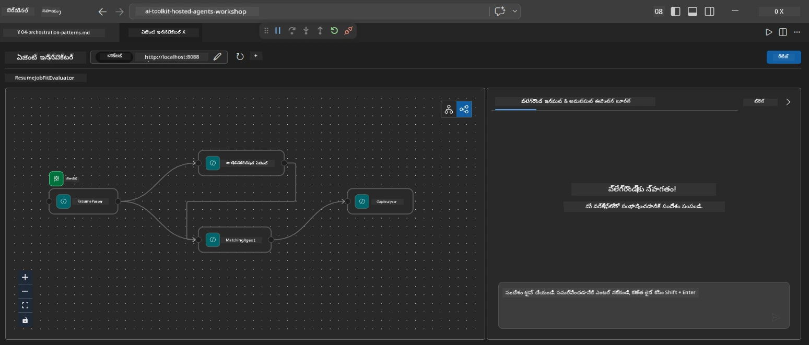
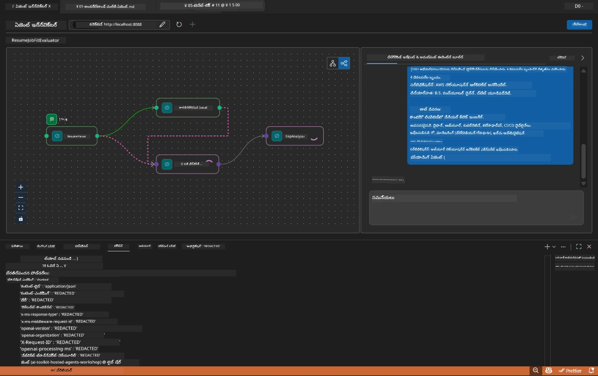
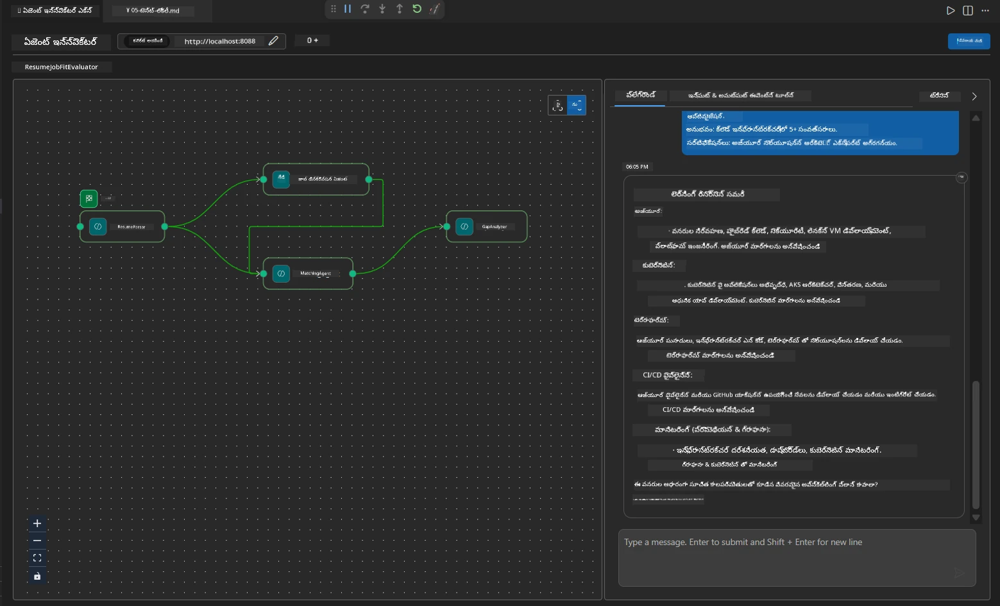

# మాడ్యూల్ 5 - స్థానికంగా పరీక్షించండి

⏱️ ~15 నిమిషాలు

ఈ మాడ్యూల్‌లో, మీరు బహు-ఏజెంట్ వర్క్‌ఫ్లోను స్థానికంగా నడిపించి, Agent Inspectorతో పరీక్షించి, అన్ని నాలుగు ఏజెంట్లు మరియు MCP సాధనం సరైన పనితీరులో ఉన్నాయో లేదో యథార్థం చేస్తారు, తర్వాత డిప్లాయ్ చేస్తారు.

---

## దశ 1: ఏజెంట్ సర్వర్ మొదలు పెట్టండి

### ఎంపిక A: VS కోడ్ టాస్క్ ఉపయోగించడం (సిఫార్సు చేయబడినది)

1. `workshop/lab02-multi-agent/PersonalCareerCopilot/` ను మీ VS కోడ్ ఫోల్డర్‌గా ఓపెన్ చేయండి.
2. `Ctrl+Shift+P` నొక్కండి → **Tasks: Run Task** టైప్ చేయండి → **Run Agent HTTP Server** ఎంచుకోండి.
3. ఈ టాస్క్ డీబగ్గీగా `5679` పోర్ట్ పై debugpy అనుబంధం తో సర్వర్ మరియు ఏజెంట్ కోసం `8088` పోర్ట్ ను స్టార్ట్ చేస్తుంది.
4. అవుట్‌పుట్ లో ఈ సందేశం కనిపించేవరకు వేచి ఉండండి:

```
INFO:resume-job-fit:Starting Resume -> Job Fit Evaluator HTTP server...
INFO:resume-job-fit:Server running on http://localhost:8088
```

### ఎంపిక B: F5 ఉపయోగించడం (డీబగ్గింగ్ మోడ్)

1. `F5` నొక్కండి → **Debug Local Agent HTTP Server** ఎంచుకోండి.
2. సర్వర్ పూర్తి బ్రేక్‌పాయింట్ మద్దతుతో ప్రారంభమవుతుంది - ఇది MCP ప్రతిస్పందనలు లేదా ఏజెంట్ ఔట్‌పుట్‌లను పరిశీలించడానికి ఉపకరించును.

---

## దశ 2: ఏజెంట్ ఇన్‌స్పెక్టర్ ఓపెన్ చేయండి

1. `Ctrl+Shift+P` నొక్కండి → **Foundry Toolkit: Open Agent Inspector** టైప్ చేయండి.
2. Agent Inspector ఒక VS కోడ్ ప్యానల్‌గా ఓపెన్ అవుతుంది, ఇది `http://localhost:8088` కి కనెక్ట్ అయి ఉంటుంది.
3. మీరు ఏజెంట్ ఇంటర్‌ఫేస్ సందేశాలు స్వీకరించడానికి సిద్ధంగా ఉందని చూడాలి.



> **ఏజెంట్ ఇన్‌స్పెక్టర్ ఓపెన్ కాకపోతే:** సర్వర్ పూర్తిగా ప్రారంభమయ్యిందో లేదో నిర్ధారించుకోండి ("Server running" లాగ్ చూపుతుంది). పోర్ట్ 5679 యుంది అయితే, [Module 8 - Troubleshooting](08-troubleshooting.md) ని చూడండి.

---

## దశ 2b: (ఐచ్ఛికం) వర్క్‌ఫ్లో విజువలైజర్ ఓపెన్ చేయండి

Foundry Toolkit నందు రియల్-టైమ్ **Workflow Visualizer** ఉంది, ఇది ఏజెంట్లు ఎలా పరస్పరక్రియ చేస్తున్నారు అనే గ్రాఫ్‌ను చూపిస్తుంది. ఇది బహుళ ఏజెంట్ డీబగ్గింగ్‌కు బాగా ఉపయోగపడుతుంది.

1. `Ctrl+Shift+P` నొక్కి → **Foundry Toolkit: Open Visualizer for Hosted Agents** టైప్ చేయండి.
2. ఒక కొత్త VS కోడ్ ట్యాబ్ లైవ్ ఎగ్జిక్యూషన్ గ్రాఫ్ ను చూపిస్తుంది.
3. మీరు ఏజెంట్ ఇన్‌స్పెక్టర్ లో సందేశాలు పంపగానే, విజువలైజర్ ఆటోమేటిక్‌గా అప్‌డేట్ అవుతుంది - గ్రీన్ నోడ్‌లు పూర్తయిన ఏజెంట్లను సూచిస్తాయి, మరియు యానిమేటెడ్ ఎడ్జెస్ డేటా ప్రవాహాన్ని చూపిస్తాయి.

> **పోర్ట్ గందరగోళం:** విజువలైజర్ పోర్ట్ ఇప్పటికే ఉపయోగంలో ఉంటే, VS కోడ్ సెట్టింగ్స్ → **Extensions** → **Microsoft Foundry Configuration** → **Hosted Agents: Visualizer Port** లో మార్చండి.

---

## దశ 3: స్మోక్ పరీక్షలు నడపండి

ఈ మూడు పరీక్షలను క్రమంగా నడపండి. ప్రతి పరీక్ష వర్క్‌ఫ్లోని మరింత భాగాన్ని పరీక్షిస్తుంది.

### పరీక్ష 1: ప్రాథమిక రిజ్యూమే + ఉద్యోగ వివరణ

క్రింది టెక్స్ట్ ను Agent Inspectorలో పేస్ట్ చేయండి:

```
Resume:
Jane Doe
Senior Software Engineer with 5 years of experience in Python, Django, and AWS.
Built microservices handling 10K+ requests/second. Led a team of 4 developers.
Certifications: AWS Solutions Architect Associate.
Education: B.S. Computer Science, State University.

Job Description:
Senior Cloud Engineer at Contoso Ltd.
Required: Python, Azure, Kubernetes, Terraform, CI/CD pipelines.
Preferred: Go, monitoring (Prometheus/Grafana), cost optimization.
Experience: 5+ years in cloud infrastructure.
Certifications: Azure Solutions Architect Expert preferred.
```

**అంచనా అవుట్‌పుట్ నిర్మాణం:**

ప్రతిస్పందనలో నాలుగు ఏజెంట్ల నుండి క్రమంగా అవుట్‌పుట్ ఉండాలి:

1. **రిజ్యూమే పార్సర్ అవుట్‌పుట్** - రెండు లేబుల్ చేసిన విభాగాలు: `[PARSED RESUME]` (అభ్యర్థి ప్రొఫైలు స్కిల్స్ తో గ్రూపింగ్) మరియు `[JOB DESCRIPTION PASS-THROUGH]` (సরাসరీ JD టెక్స్ట్, JD Agent కి అందించే)
2. **JD ఏజెంట్ అవుట్‌పుట్** - అవసరమైన మరియు ప్రాధాన్యత కలిగిన స్కిల్స్ వేరు చేసిన నిర్మిత అవసరాలు
3. **మ్యాచింగ్ ఏజెంట్ అవుట్‌పుట్** - ఫిట్ స్కోర్ (0-100) బ్రేక్‌డౌన్ తో, మ్యాచ్ అయ్యిన స్కిల్స్, లేని స్కిల్స్, గ్యాప్‌లు
4. **గ్యాప్ అనలైజర్ అవుట్‌పుట్** - ప్రతి లేని స్కిల్ కొరకు వేర్వేరు గ్యాప్ కార్డులు, ప్రతీటిలో Microsoft Learn URLs





### పరీక్ష 1 లో నిర్ధారించవలసిన విషయాలు

| తనిఖీ | అంచనా | ఉత్తీర్ణా? |
|-------|----------|-------|
| ప్రతిస్పందనలో ఫిట్ స్కోర్ ఉంది | 0-100 మధ్య సంఖ్య బ్రేక్‌డౌన్ తో | |
| మ్యాచ్ అయిన స్కిల్స్ జాబితా ఉంది | Python, CI/CD (భాగస్వామ్యం), మొదలైనవి | |
| లేని స్కిల్స్ జాబితాలో ఉన్నాయి | Azure, Kubernetes, Terraform, మొదలయినవి | |
| ప్రతి లేని స్కిల్ కొరకు గ్యాప్ కార్డులు ఉన్నాయి | ప్రతీ స్కిల్ కు ఒక కార్డు | |
| Microsoft Learn URLs ఉన్నవి | నిజమైన `learn.microsoft.com` లింకులు | |
| ప్రతిస్పందనలో ఎలాంటి లోప సుమారులు లేవు | శుభ్రంగా నిర్మిత అవుట్‌పుట్ | |

### పరీక్ష 2: ఎడ్జ్ కేస్ - ఉత్సాహవంతుడైన అభ్యర్థి

JD కి సన్నిహితంగా మ్యాచ్ అయ్యే రిజ్యూమేను పేస్ట్ చేసి GapAnalyzer ఎలాంటి ఫిట్ ఉన్న అభ్యర్థుల పరిస్థితులను ఎలా నిర్వహిస్తుందో నిర్ధారించండి:

```
Resume:
Alex Chen
Senior Cloud Engineer with 7 years of experience.
Skills: Python, Azure (AKS, Functions, DevOps), Kubernetes, Terraform, CI/CD (GitHub Actions, Azure Pipelines), Go, Prometheus, Grafana, cost optimization.
Certifications: Azure Solutions Architect Expert, Azure DevOps Engineer Expert.
Led infrastructure migration to Azure for 3 enterprise clients.
Education: M.S. Computer Science, Tech University.

Job Description:
Senior Cloud Engineer at Contoso Ltd.
Required: Python, Azure, Kubernetes, Terraform, CI/CD pipelines.
Preferred: Go, monitoring (Prometheus/Grafana), cost optimization.
Experience: 5+ years in cloud infrastructure.
Certifications: Azure Solutions Architect Expert preferred.
```

**అంచనా ప్రవర్తన:**
- ఫిట్ స్కోరు **80+** ఉండాలి (మోస్ట్ స్కిల్స్ మ్యాచ్ అయ్యి ఉంటాయి)
- గ్యాప్ కార్డులు ఆధార సంబంధిత నేర్చుకునే కన్నా, మెరుగ్గా తయారీ/ఇంటర్వ్యూ సిద్ధతపై ఎక్కువ దృష్టి పెట్టాలి
- GapAnalyzer సూచనలు: "ఫిట్ >= 80 అయితే, మెరుగైన ఇంటర్వ్యూ సిద్ధతపై దృష్టి పెట్టండి"

---

## దశ 4: మీ స్వంత డేటాతో పరీక్షించండి (ఐచ్ఛికం)

మీ స్వంత రిజ్యూమే మరియు నిజమైన ఉద్యోగ వివరణని పేస్ట్ చేసి ప్రయత్నించండి. ఇది సరిగ్గా నిర్ధారించటంలో సహాయపడుతుంది:

- ఏజెంట్లు వేరు రిజ్యూమే ఫార్మాట్లను నిర్వహిస్తున్నారు (కాలానుగత, ఫంక్షనల్, హైబ్రిడ్)
- JD ఏజెంట్ వేరు JD శైలులను నిర్వహిస్తున్నది (బుల్లెట్ పాయింట్లు, పేరాగ్రాఫ్‌లు, నిర్మిత)
- MCP సాధనం నిజమైన స్కిల్స్ కొరకు సంభందిత వనరులు అందిస్తుంది
- గ్యాప్ కార్డులు మీ వ్యక్తిగత నేపథకానికి అనుగుణంగా ఉంటాయి

> **గోప్యత - మార్గం A (Foundry క్లౌడ్):** రిజ్యూమే మరియు JD టెక్స్ట్ మా Azure OpenAI డిప్లాయ్‌మెంట్ కోసం పంపబడుతుంది. వర్క్‌షాప్ ఇన్‌ఫ్రాస్ట్రక్చర్ దీనిని లాగ్ చేయదీ లేదా నిల్వచేయదీ. మీరు ఇష్టం అయితే ప్లేస్‌హోల్డర్ పేర్లను ఉపయోగించండి (ఉదా: "Jane Doe").
>
> **గోప్యత - మార్గం B (Foundry స్థానికం):** నాలుగు ఏజెంట్ ఇన్ఫరెన్సులు పూర్తిగా మీ డివైస్‌లో నడుస్తాయి. మీ రిజ్యూమే మరియు ఉద్యోగ వివరణ టెక్స్ట్ **ఒక్క సారి కూడా మీ యంత్రం నుంచి వెలుపలికి పోవదు**. ఏ MCP సాధనం వనరులు సేకరించడానికి `https://learn.microsoft.com/api/mcp` కి అవుట్బౌండ్ కాల్ చేస్తుంది; ఆ క్వెరీలో కేవలం స్కిల్ పేరు మాత్రమే ఉంటుంది, మీ వ్యక్తిగత డేటా కాదు.

---

### చెక్పాయింట్

- [ ] సర్వర్ విజయవంతంగా `8088` పోర్టు లో ప్రారంభించబడింది ("Server running" లాగ్ చూపిస్తోంది)
- [ ] ఏజెంట్ ఇన్‌స్పెక్టర్ ఓపెన్ గా మరియు ఏజెంట్ కు కనెక్ట్ అయ్యింది
- [ ] పరీక్ష 1: పూర్తి ప్రతిస్పందనతో ఫిట్ స్కోర్, మ్యాచ్ మరియు లేని స్కిల్స్, గ్యాప్ కార్డులు, Microsoft Learn URLs
- [ ] పరీక్ష 2: హై ఫిట్ అభ్యర్థికి స్కోరు 80+ మరియు మెరుగైన సూచనలు ఉన్నాయి
- [ ] అన్ని గ్యాప్ కార్డులు ఉన్నాయి (ప్రతి లేని స్కిల్ కొరకు ఒకటి, కాపీ ఎడిట్ లేకుండా)
- [ ] సర్వర్ టెర్మినల్ లో లోపాలు లేదా స్టాక్ ట్రేస్ లేవు

---

**మునుపటి:** [04 - ఆర్కెస్ట్రేషన్ ప్యాటర్న్స్](04-orchestration-patterns.md) · **తరువాత:** [06 - Foundryకి డిప్లాయ్ →](06-deploy-to-foundry.md)

---

<!-- CO-OP TRANSLATOR DISCLAIMER START -->
**అస్వీకరణ**:
ఈ పత్రం AI అనువాద సేవ [Co-op Translator](https://github.com/Azure/co-op-translator) ఉపయోగించి అనువదించబడింది. మేము ఖచ్చితత్వానికి ప్రయత్నిస్తున్నప్పటికీ, ఆటోమేటెడ్ అనువాదాలు తప్పులు లేదా అసమగ్రతలను కలిగి ఉండవచ్చు. దాని స్వదేశ భాషలో ఉన్న అసలు పత్రాన్ని అధికారం కలిగిన మూలంగా పరిగణించాలి. కీలకమైన సమాచారం కోసం, ప్రొఫెషనల్ మానవ అనువాదాన్ని సిఫారసు చేస్తాము. ఈ అనువాదం ఉపయోగం వల్ల కలిగే ఏవైనా అపార్థాలు లేదా తప్పుదారులు కోసం మేము బాధ్యత వహించము.
<!-- CO-OP TRANSLATOR DISCLAIMER END -->