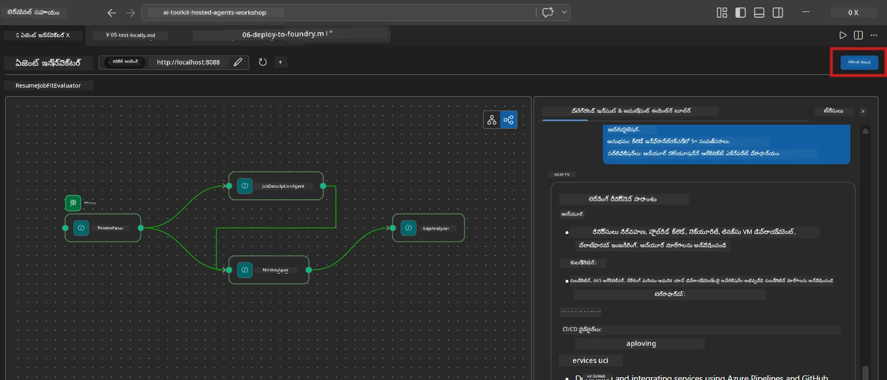
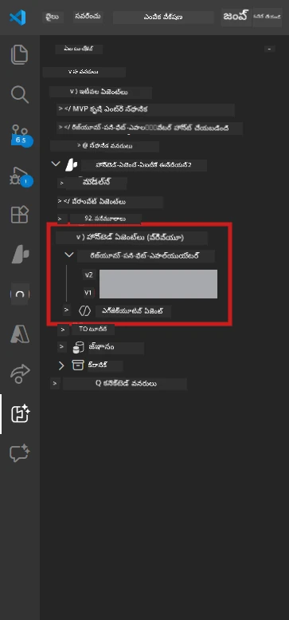

# మాడ్యూల్ 6 - Foundry ఏజెంట్ సర్వీస్‌కు డిప్లాయ్ చేయడం

ఈ మాడ్యూల్‌లో, మీరు స్థానికంగా పరీక్షించిన బహుళ ఏజెంట్ వర్క్‌ఫ్లోను [Microsoft Foundry](https://learn.microsoft.com/azure/foundry/agents/concepts/hosted-agents) లో **హోస్టెడ్ ఏజెంట్** గా డిప్లాయ్ చేయబోతున్నారు. డిప్లాయ్ ప్రక్రియ ఒక Docker కంటెయినర్ ఇమేజ్‌ను సృష్టిస్తుంది, దాన్ని [Azure Container Registry (ACR)](https://learn.microsoft.com/azure/container-registry/container-registry-intro) కు పంపిస్తుంది, మరియు [Foundry Agent Service](https://learn.microsoft.com/azure/foundry/agents/how-to/publish-agent) లో హోస్టెడ్ ఏజెంట్ వెర్షన్‌ను సృష్టిస్తుంది.

> **Lab 01 నుండి ప్రధాన తేడా:** డిప్లాయ్ ప్రక్రియ సమానమే. Foundry మీ బహుళ ఏజెంట్ వర్క్‌ఫ్లోను ఒకే హోస్టెడ్ ఏజెంట్‌గా చూస్తుంది - క్లిష్టత కంటెయినర్ లో ఉంటుంది, కానీ డిప్లాయ్ సర్ఫేస్ అదే `/responses` ఎండ్‌పాయింట్.

---

## ముందస్తు అవసరాల తనకం

డిప్లాయ్ 하기 ముందుగా, దిగువ ప్రతీ అంశాన్ని ధృవీకరించండి:

1. **ఏజెంట్ స్థానిక స్మోక్ పరీక్షలు పాస్ చేసింది:**
   - మీరు [Module 5](05-test-locally.md) లోని మొత్తం 3 పరీక్షలను పూర్తి చేశారు మరియు వర్క్‌ఫ్లో పూర్తి ఫలితాన్ని (గాప్ కార్డులు మరియు Microsoft Learn URLలతో) ఉత్పత్తి చేసింది.

2. **మీకు [Azure AI User](https://learn.microsoft.com/azure/foundry/concepts/rbac-foundry) పాత్ర ఉంది:**
   - ఇది [Lab 01, Module 2](../../lab01-single-agent/docs/02-create-foundry-project.md) లో కేటాయింపచేయబడింది. ధృవీకరించండి:
   - [Azure Portal](https://portal.azure.com) → మీ Foundry **ప్రాజెక్ట్** వనరు → **Access control (IAM)** → **Role assignments** → మీ ఖాతా కోసం **[Azure AI User](https://aka.ms/foundry-ext-project-role)** నమోదు ఉన్నదో తనుచూసుకోండి.

3. **మీరు VS Code లో Azure లో సైన్ ఇన్ అయ్యారు:**
   - VS Code లో క్రింద ఎడమవైపు ఉన్న ఖాతాలు చిహ్నాన్ని తనుచూసుకోండి. మీ ఖాతా పేరు కనిపించాలి.

4. **`agent.yaml` లో సరి అయిన విలువలు ఉన్నాయి:**
   - `PersonalCareerCopilot/agent.yaml` ను తెరిచి ధృవీకరించండి:
     ```yaml
     environment_variables:
       - name: PROJECT_ENDPOINT
         value: ${PROJECT_ENDPOINT}
       - name: MODEL_DEPLOYMENT_NAME
         value: ${MODEL_DEPLOYMENT_NAME}
     ```
   - ఇవి మీ `main.py` చదివే env vars కి సరిపోవాలి.

5. **`requirements.txt` లో సరి అయిన వర్షన్లు ఉన్నాయి:**
   ```
   agent-framework-azure-ai==1.0.0rc3
   agent-framework-core==1.0.0rc3
   azure-ai-agentserver-agentframework==1.0.0b16
   azure-ai-agentserver-core==1.0.0b16
   debugpy
   agent-dev-cli --pre
   ```

---

## దశ 1: డిప్లాయ్ ప్రారంభించండి

### ఎంపిక A: ఏజెంట్ ఇన్‌స్పెక్టర్ నుండి డిప్లాయ్ చేయండి (సిఫార్సు చేయబడింది)

ఏజెంట్ F5 ద్వారా Agent Inspector తెరిచి চলుతుంటే:

1. Agent Inspector ప్యానెల్ యొక్క **ముందుపక్క వైపు ఎడమవైపు** చూడండి.
2. **Deploy** బటన్ (మేఘం చిహ్నం, పైకి అంగుళ చిహ్నంతో ↑) పై క్లిక్ చేయండి.
3. డిప్లాయ్ విజార్డు తెరుచుకుంటుంది.



### ఎంపిక B: కమాండ్ ప్యాలెట్ నుండి డిప్లాయ్ చేయండి

1. `Ctrl+Shift+P` నొక్కి **Command Palette** తెరవండి.
2. టైప్ చేయండి: **Microsoft Foundry: Deploy Hosted Agent** మరియు ఎన్నుకోండి.
3. డిప్లాయ్ విజార్డు తెరుచుకుంటుంది.

---

## దశ 2: డిప్లాయ్ సెట్టింగ్‌లు చేయండి

### 2.1 లక్ష్య ప్రాజెక్ట్ ఎంచుకోండి

1. ఓ డ్రాప్‌డౌన్ లో మీ Foundry ప్రాజెక్ట్‌లు చూపిస్తాయి.
2. వర్క్షాప్ లో ఉపయోగించిన ప్రాజెక్టును ఎంచుకోండి (ఉదా: `workshop-agents`).

### 2.2 కంటెయినర్ ఏజెంట్ ఫైల్ ఎంచుకోండి

1. మీరు ఏజెంట్ ఎంట్రీ పాయింట్ ఎంచుకోవాలని అడిగేరు.
2. `workshop/lab02-multi-agent/PersonalCareerCopilot/` కు వెళ్ళి **`main.py`** ఫైల్ ఎంచుకోండి.

### 2.3 వనరులు సెట్టింగ్ చేయండి

| సెట్టింగ్ | సిఫార్సు చేయబడిన విలువ | గమనికలు |
|---------|--------------------------|----------|
| **CPU** | `0.25` | డిఫోల్ట్. బహుళ ఏజెంట్ వర్క్‌ఫ్లోలకు ఎక్కువ CPU అవసరం లేదు, ఎందుకంటే మోడల్ కాల్స్ I/O-బౌండ్ అవుతాయి |
| **మెమరీ** | `0.5Gi` | డిఫోల్ట్. పెద్ద డేటా ప్రాసెసింగ్ టూల్స్ జోడిస్తే `1Gi` కి పెంచండి |

---

## దశ 3: ధృవీకరించి డిప్లాయ్ చేయండి

1. విజార్డు డిప్లాయ్ సమ్మరీ చూపిస్తుంది.
2. సమీక్షించి **Confirm and Deploy** క్లిక్ చేయండి.
3. VS Code లో ప్రగతిని గమనించండి.

### డిప్లాయ్ సమయంలో ఏమిటి జరుగుతుందో

VS Code లో **Output** ప్యానెల్ (మీషన్ల నుండి "Microsoft Foundry" డ్రాప్‌డౌన్ ఎంచుకోండి) ను గమనించండి:


1. **డాకర్ బిల్డ్** - మీ `Dockerfile` నుండి కంటెయినర్‌ను నిర్మిస్తుంది:
   ```
   Step 1/6 : FROM python:3.14-slim
   Step 2/6 : WORKDIR /app
   ...
   Successfully built abc123def456
   ```

2. **డాకర్ పుష్** - ఇమేజ్‌ను ACR కు పంపిస్తుంది (మొదటి డిప్లాయ్ పైగా 1-3 నిమిషాలు పడుతుంది).

3. **ఏజెంట్ రిజిస్ట్రేషన్** - Foundry `agent.yaml` మెటాడేటాతో ఒక హోస్టెడ్ ఏజెంట్ సృష్టిస్తుంది. ఏజెంట్ పేరు `resume-job-fit-evaluator`.

4. **కంటెయినర్ ప్రారంభం** - కంటెయినర్ Foundry యొక్క నిర్వహిత ఇన్ఫ్రాస్ట్రక్చర్ లో వ్యవస్థ నిర్వహిత ఐడెంటిటీతో మొదలవుతుంది.

> **మొదటి డిప్లాయ్ స్లోగా జరుగుతుంది** (డాకర్ అన్ని లేయర్స్‌ను పుష్ చేస్తుంది). తరువాత డిప్లాయ్‌లు క్యాష్ చేసిన లేయర్స్‌ను పునర్వినియోగం చేస్తాయి కాబట్టి వేగంగా జరుగుతాయి.

### బహుళ ఏజెంట్ ప్రత్యేక గమనికలు

- **నాలుగు ఏజెంట్లు ఒకే కంటెయినర్ లో ఉంటాయి.** Foundry ఒకే హోస్టెడ్ ఏజెంట్ గానే చూస్తుంది. WorkflowBuilder గ్రాఫ్ అంతర్గతంగా నడుస్తుంది.
- **MCP కాల్స్ బాహ్యంగా వెళ్తాయి.** కంటెయినర్‌కు ఇంటర్నెట్ యాక్సెస్ కావాలి `https://learn.microsoft.com/api/mcp` ను చేరేందుకు. Foundry నిర్వహిత ఇన్ఫ్రాస్ట్రక్చర్ ఇది ప్రదేశిస్తుంది.
- **[Managed Identity](https://learn.microsoft.com/python/api/overview/azure/identity-readme#managed-identity-support).** హోస్టెడ్ వాతావరణంలో, `main.py` లో `get_credential()` `ManagedIdentityCredential()` ని తిరిగి ఇస్తుంది (ఎందుకంటే `MSI_ENDPOINT` సెట్ కావడంతో). ఇది స్వయంచాలకంగా జరుగుతుంది.

---

## దశ 4: డిప్లాయ్ స్టేటస్‌ను ధృవీకరించండి

1. **Microsoft Foundry** సైడ్‌బార్ తెరవండి (Activity Bar లో Foundry ఐకాన్ పై క్లిక్ చేయండి).
2. మీ ప్రాజెక్ట్ కింద **Hosted Agents (Preview)** విస్తరించండి.
3. **resume-job-fit-evaluator** (లేదా మీ ఏజెంట్ పేరు) కనుక్కండి.
4. ఏజెంట్ పేరుపై క్లిక్ చేసి వెర్షన్లు (ఉదా: `v1`) విస్తరించండి.
5. వెర్షన్ పై క్లిక్ చేసి **కంటెయినర్ వివరాలు** → **స్థితి** తనుచూసుకోండి:



| స్థితి | అర్ధం |
|--------|---------|
| **Started** / **Running** | కంటెయినర్ నడుస్తోంది, ఏజెంట్ సిద్ధంగా ఉంది |
| **Pending** | కంటెయినర్ ప్రారంభమవుతోంది (30-60 సెకన్లు వేచుకోండి) |
| **Failed** | కంటెయినర్ ప్రారంభించలేకపోయింది (లాగ్‌లను తనుచూసుకోండి - దిగువ చూడండి) |

> **బహుళ ఏజెంట్ ప్రారంభం కాస్త ఎక్కువ సమయం పడుతుంది** ఎందుకంటే కంటెయినర్ స్టార్ట్ అయ్యే సమయంలో 4 ఏజెంట్ ఇన్స్టెన్సులు సృష్టించడం జరుగుతుంది. "Pending" 2 నిమిషాల వరకూ ఉండటం సాధారణం.

---

## సాధారణ డిప్లాయ్ పొరపాట్లు మరియు పరిష్కారాలు

### పొరపాటు 1: అనుమతి నిరాకరణ - `agents/write`

```
Error: lacks the required data action 
Microsoft.CognitiveServices/accounts/AIServices/agents/write
```

**పరిష్కారం:** **[Azure AI User](https://learn.microsoft.com/azure/foundry/concepts/rbac-foundry)** పాత్రను **ప్రాజెక్ట్** స్థాయిలో కేటాయించండి. పూర్తిగా సూచన కోసం [Module 8 - Troubleshooting](08-troubleshooting.md) చూడండి.

### పొరపాటు 2: డాకర్ నడుస్తుండదు

```
Error: Docker build failed / Cannot connect to Docker daemon
```

**పరిష్కారం:**
1. Docker Desktop ను ప్రారంభించండి.
2. "Docker Desktop is running" వచ్చే వరకు వేచుకోండి.
3. నిర్ధారించండి: `docker info`
4. **Windows:** Docker Desktop సెట్టింగ్స్ లో WSL 2 బ్యాక్ ఎండ్ యాక్టివేట్ చేసి ఉందో చూసుకోండి.
5. తిరిగి ప్రయత్నించండి.

### పొరపాటు 3: Docker బిల్డ్ సమయంలో pip install విఫలం

```
Error: Could not find a version that satisfies the requirement agent-dev-cli
```

**పరిష్కారం:** Docker లో `requirements.txt` లోని `--pre` ఫ్లాగ్ వేరుదల గా పనిచేస్తుంది. మీ `requirements.txt` లో కనీసం ఈ విధంగా ఉండాలి:
```
agent-dev-cli --pre
```

Docker లో ఇంకా సమస్య ఉంటే `pip.conf` సృష్టించండి లేదా బిల్డ్ ఆర్గ్యుమెంట్ ద్వారా `--pre` పాస్ చేయండి. మరింత సమాచారం కోసం [Module 8](08-troubleshooting.md) చూడండి.

### పొరపాటు 4: హోస్టెడ్ ఏజెంట్ లో MCP టూల్ విఫలం

డిప్లాయ్ తర్వాత Gap Analyzer Microsoft Learn URLలను అందించటం ఆపు కొన్నట్లయితే:

**మూల కారణం:** నెట్‌వర్క్ పాలసీ కంటెయినర్ నుంచి బాహ్య HTTPS పోలీసీలు బ్లాక్ చేస్తుండవచ్చు.

**పరిష్కారం:**
1. Foundry యొక్క డిఫాల్ట్ కాన్ఫిగర్‌లో ఇది సాధారణంగా సమస్య కాదు.
2. అయితే ఉంటే, Foundry ప్రాజెక్ట్ యొక్క వర్చువల్ నెట్‌వర్క్‌లో NSG బాహ్య HTTPS ను బ్లాక్ చేస్తుందో చూసుకోండి.
3. MCP టూల్ లో ఆటోమేటిక్ fallback URLs ఉంటాయి, కాబట్టి ఏజెంట్ ఫలితాలు ఉత్పత్తి చేస్తూనే ఉంటాయి (లైవ్ URLలు లేకుండా).

---

### పదవీకరణ సూచిక

- [ ] VS Code లో డిప్లాయ్ కమాండ్ తప్పుల రహితం గా పూర్తయింది
- [ ] Agent Foundry Sidebar లో **Hosted Agents (Preview)** కింద కనిపిస్తోంది
- [ ] ఏజెంట్ పేరు `resume-job-fit-evaluator` లేదా మీ ఎంచుకున్న పేరు
- [ ] కంటెయినర్ స్థితి **Started** లేదా **Running** గా ఉంది
- [ ] (పొరపాట్లు ఉంటే) మీరు పొరపాటు గుర్తించి పరిష్కారం చేసి విజయవంతంగా తిరిగి డిప్లాయ్ చేసారు

---

**మునుపటి:** [05 - Test Locally](05-test-locally.md) · **తరువాత:** [07 - Verify in Playground →](07-verify-in-playground.md)

---

<!-- CO-OP TRANSLATOR DISCLAIMER START -->
**డిస్క్లైమర్**:  
ఈ డాక్యుమెంట్ [Co-op Translator](https://github.com/Azure/co-op-translator) అనే AI అనువాద సేవ ద్వారా అనువదించబడింది. మేము ఖచ్చితత్వానికి ప్రామాణికంగా ప్రయత్నించినప్పటికీ, ఆటోమేటెడ్ అనువాదాల్లో లోపాలు లేదా తప్పిదాలు ఉండవచ్చని దయచేసి గమనించండి. మూల భాషలో ఉన్న అసలు డాక్యుమెంట్‌ను అధికారికమైన మెట్టుగా పరిగణించాలి. ముఖ్యమైన సమాచారానికి, ప్రొఫెషనల్ మానవ అనువాదం చేయించడం మంచిది. ఈ అనువాదం వాడకం వల్ల సృష్టమైన ఏదైనా అవగాహన లోపాలు లేదా తప్పుగా అర్థం చేసుకోవడం సంబంధించి మేము బాధ్యుత పొందము.
<!-- CO-OP TRANSLATOR DISCLAIMER END -->