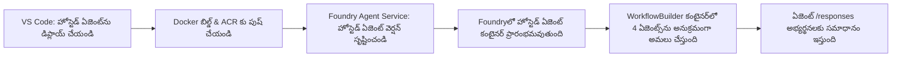
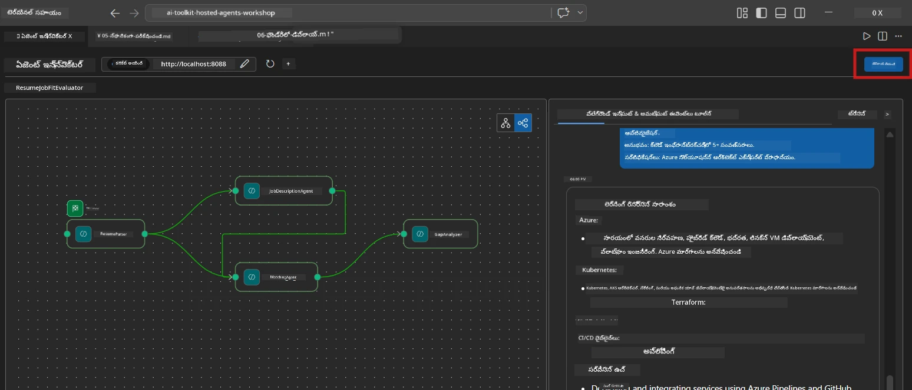

# మోడ్యూల్ 6 - ఫౌండ్రీ ఏజెంట్ సేవకు డిప్లాయ్ చేయండి

⏱️ ~10 నిమిషాలు

ఈ మోడ్యూల్‌లో, మీరు స్థానికంగా పరీక్షించిన బహుళ ఏజెంట్ వర్క్ఫ్లోను [Microsoft Foundry](https://learn.microsoft.com/azure/foundry/agents/concepts/hosted-agents) వద్ద **హోస్టెడ్ ఏజెంట్**గా డిప్లాయ్ చేస్తారు. డిప్లాయ్ ప్రక్రియ లో Docker కంటెయినర్ ఇమేజ్ తయారు చేసి, దాన్ని [Azure Container Registry (ACR)](https://learn.microsoft.com/azure/container-registry/container-registry-intro) కు పుష్ చేసి, [Foundry Agent Service](https://learn.microsoft.com/azure/foundry/agents/how-to/publish-agent) లో ఒక హోస్టెడ్ ఏజెంట్ వర్షన్ సృష్టిస్తుంది.

> **ల్యాబ్ 01 నుండి ముఖ్యమైన తేడా:** డిప్లాయ్ ప్రక్రియ అదే విధంగా ఉంటుంది. Foundry మీ బహుళ ఏజెంట్ వర్క్ఫ్లోను ఒకే ఒక హోస్టెడ్ ఏజెంట్ గా పరిగణిస్తుంది - సంక్లిష్టత కంటెయినర్ లో ఉంది, కాని డిప్లాయ్ సర్ఫేస్ అదే `/responses` ఎండ్పాయింట్.

### డిప్లాయ్‌మెంట్ పైప్‌లైన్


```mermaid
flowchart LR
    A[VS Code: హోస్టెడ్ ఏజెంట్‌ను డిప్లాయ్ చేయండి] --> B[Docker బిల్డ్ & ACR కు పుష్ చేయండి]
    B --> C[Foundry Agent Service: హోస్టెడ్ ఏజెంట్ వెర్షన్ సృష్టించండి]
    C --> D[Foundryలో హోస్టెడ్ ఏజెంట్ కంటైనర్ ప్రారంభమవుతుంది]
    D --> E[WorkflowBuilder కంటైనర్‌లో 4 ఏజెంట్స్‌ను అనుక్రమంగా అమలు చేస్తుంది]
    E --> F[ఏజెంట్ /responses అభ్యర్థనలకు సమాధానం ఇస్తుంది]
```

---

## ముందస్తు అవసరాల తనిఖీ

డిప్లాయ్ చేసే ముందుగా, క్రింది ప్రతి అంశాన్ని నిర్ధారించుకోండి:

1. **ఏజెంట్ స్థానిక స్మోక్ టెస్టులను ఉత్తీర్ణమైంది:**
   - మీరు [మోడ్యూల్ 5](05-test-locally.md) లోని 3 టెస్టులను పూర్తి చేసి, వర్క్ఫ్లో పూర్తి అవుట్పుట్ ను గ్యాప్ కార్డులు మరియు Microsoft Learn URLs తో ఉత్పత్తి చేశారని నిర్ధారించుకోండి.

2. **మీకు [Foundry యూజర్](https://learn.microsoft.com/azure/foundry/concepts/rbac-foundry) పాత్ర ఉంది** (డిప్లాయ్ చేయడానికి కనీసం ప్రాజెక్ట్ స్కోప్ వద్ద **Foundry Project Manager** అవసరం):

   > **గమనిక:** Foundry RBAC పాత్రలు సమీపంలో పేరు మార్చబడ్డాయి - **Foundry User**, **Foundry Owner**, మరియు **Foundry Project Manager** క్రమంగా Azure AI User, Azure AI Owner, మరియు Azure AI Project Manager గా ఉన్నవి. పాత్ర IDలు మరియు అనుమతులు మారలేదు.

   - [Azure Portal](https://portal.azure.com) → మీ Foundry **ప్రాజెక్ట్** రీసోర్స్ → **Access control (IAM)** → **Role assignments** → మీ ఖాతాకు **Foundry User** (లేదా ఎక్కువ) ఉంది అని ధృవీకరించండి.

3. **మీరు VS Codeలో Azureకి సైన్ ఈన్ అయ్యారు:**
   - VS Code డౌన్-ఎడమవైపున ఉన్న అకౌంట్స్ ఐకాన్ ను పరిశీలించండి. మీ ఖాతా పేరు కనబడాలి.

4. **`agent.yaml`లో సరైన విలువలు ఉన్నాయి:**
   - `PersonalCareerCopilot/agent.yaml` ను తెరవండి మరియు ధృవీకరించండి:
     ```yaml
     environment_variables:
       - name: AZURE_AI_MODEL_DEPLOYMENT_NAME
         value: ${AZURE_AI_MODEL_DEPLOYMENT_NAME}
     ```
   - `FOUNDRY_PROJECT_ENDPOINT` ఇక్కడ లిస్ట్ చేయబడలేదు - Foundry దీన్ని రంటైమ్ వద్ద ఇంజెక్ట్ చేస్తుంది. కేవలం `AZURE_AI_MODEL_DEPLOYMENT_NAME` ను ప్రకటించాలి.

5. **`requirements.txt`లో సరైన వెర్షన్లు ఉన్నాయి:**
   ```
   agent-framework-foundry
   agent-framework-foundry-hosting
   mcp<2,>=1.24.0
   debugpy
   ```

---

## దశ 1: డిప్లాయ్‌మెంట్ ప్రారంభించండి

### ఆప్షన్ A: ఏజెంట్ ఇన్‌స்பెక్టర్ నుండి డిప్లాయ్ చేయండి (సిఫార్సు)

ఏజెంట్ F5 తో నడుస్తున్నప్పుడు ఏజెంట్ ఇన్‌స్పెక్టర్ ఓపెన్ చేయండి:

1. ఏజెంట్ ఇన్‌స్పెక్టర్ ప్యానెల్ యొక్క **మేది-కుడివైపు కోణం** చూడండి.
2. **Deploy** బటన్ (మెగ cloud ఐకాన్ తో పైకి అరుగుదల ↑) నొక్కండి.
3. డిప్లాయ్ విజార్డు తెరుచుకుంటుంది.



### ఆప్షన్ B: కమాండ్ ప్యాలెట్ నుండి డిప్లాయ్ చేయండి

1. `Ctrl+Shift+P` నొక్కి **Command Palette** ను తెరుచుకోండి.
2. టైపు చేయండి: **Foundry Toolkit: Deploy Hosted Agent** మరియు సెలెక్ట్ చేయండి.
3. డిప్లాయ్ విజార్డు తెరుచుకుంటుంది.

---

## దశ 2: డిప్లాయ్‌మెంట్ కాన్ఫిగర్ చేయండి

### 2.1 లక్ష్య ప్రాజెక్ట్ ను ఎంపిక చేసుకోండి

1. ఒక డ్రాప్‌డౌన్ లో మీ Foundry ప్రాజెక్టులు చూపబడతాయి.
2. వర్క్షాప్ సమయం ఉపయోగించిన ప్రాజెక్ట్ ని సెలెక్ట్ చేయండి (ఉదాహరణకి, `workshop-agents`).

### 2.2 కంటెయినర్ ఏజెంట్ ఫైల్ ఎంచుకోండి

1. ఏజెంట్ ఎంట్రీ పాయింట్ ఎంచుకోమని అడుగుతారు.
2. `workshop/lab02-multi-agent/PersonalCareerCopilot/` కు బ్రౌజ్ చేసి **`main.py`** ఎంచుకోండి.

### 2.3 వనరులను కాన్ఫిగర్ చేయండి

| సెట్టింగ్ | సిఫార్సు విలువ | గమనికలు |
|---------|------------------|-------|
| **డిప్లాయ్‌మెంట్ పద్ధతి** | **కంటెయినర్** (సిఫార్సు) లేదా **కోడ్** | కంటెయినర్ Docker చిత్రం రూపొందిస్తుంది; కోడ్ సోర్స్ ను ZIP గా అప్‌లోడ్ చేస్తుంది (ప్రివ్యూ) |
| **కంటెయినర్ రిజిస్ట్రీ** | **డిఫాల్ట్ ACR** | Foundry మీరు కోసం ఒక దాన్ని సృష్టించి నిర్వహిస్తుంది |
| **CPU** | `0.25` | డిఫాల్ట్. బహుళ ఏజెంట్ వర్క్‌ఫ్లోలకు ఎక్కువ CPU అవసరం లేదు ఎందుకంటే మోడల్ కాల్స్ I/O-బౌండెడ్ |
| **మేమొరీ** | `0.5Gi` | డిఫాల్ట్. పెద్ద డేటా ప్రాసెసింగ్ టూల్స్ జోడిస్తే `1Gi` కు పెంచండి |

---

## దశ 3: ధృవీకరించి, డిప్లాయ్ చేయండి

1. విజార్డు డిప్లాయ్ సమారాంశం చూపిస్తుంది.
2. సమీక్షించి **Confirm and Deploy** క్లిక్ చేయండి.
3. VS Codeలో పురోగతి చూడండి.

### డిప్లాయ్ సమయంలో ఏమి జరుగుతుంది

VS Code **Output** ప్యానెల్ చూడండి ( "Microsoft Foundry" డ్రాప్‌డౌన్ ఎంచుకోండి ):

1. **Docker బిల్డ్** - మీ `Dockerfile` ఉపయోగించి కంటెయినర్ రూపొందిస్తుంది
   ```
   Step 1/6 : FROM python:3.12-slim
   Step 2/6 : WORKDIR /app
   ...
   Successfully built abc123def456
   ```

2. **Docker పుష్** - ఇమేజ్ ను ACRకు పంపుతుంది (మొదటి డిప్లాయ్ లో 1-3 నిమిషాలు పట్టవచ్చు).

3. **ఏజెంట్ రిజిస్ట్రేషన్** - Foundry `agent.yaml` మెటాడేటా ఉపయోగించి హోస్టెడ్ ఏజెంట్ సృష్టిస్తుంది. ఏజెంట్ పేరు `resume-job-fit-evaluator`.

4. **కంటెయినర్ స్టార్ట్** - కంటెయినర్ Foundry నిర్వహించిన ఇన్‌ఫ్రాస్ట్రక్చర్ లో సిస్టమ్ నిర్వహించిన ఐడెంటిటీతో ప్రారంభమవుతుంది.

> **మొదటి డిప్లాయ్ మందగించింది** (Docker అన్ని లేయర్లను పుష్ చేస్తుంది). తర్వాత డిప్లాయ్‌లు కాష్ చేయబడిన లేయర్లను పునర్వినియోగం చేస్తూ వేగంగా ఉంటాయి.

### బహుళ ఏజెంట్ సంబంధిత గమనికలు

- **అన్ని నాలుగు ఏజెంట్లు ఒకే కంటెయినర్ లో ఉన్నారు.** Foundry ఒకే ఒక హోస్టెడ్ ఏజెంట్ చూస్తుంది. WorkflowBuilder గ్రాఫ్ అంతర్గతంగా నడుస్తుంది.
- **MCP కాల్లు అవుట్‌బౌండ్‌లో ఉంటాయి.** కంటెయినర్ కు `https://learn.microsoft.com/api/mcp` కు చేరుకోవడానికి ఇంటర్నెట్ యాక్సెస్ అవసరం. Foundry నిర్వహించిన ఇన్‌ఫ్రాస్ట్రక్చర్ దీన్ని డిఫాల్ట్ గా అందిస్తుంది.
- **[Managed Identity](https://learn.microsoft.com/azure/foundry/agents/concepts/agent-identity).** Foundry ప్రతి Hosted agent కు డిప్లాయ్ సమయంలో ఆటోమేటిక్ గా ప్రత్యేక Entra ఐడెంటిటీని సృష్టిస్తుంది. హోస్టెడ్ వాతావరణంలో, `DefaultAzureCredential` ఈ ఏజెంట్ ఐడెంటిటీని సింహాసనం చేయడమవుతుంది - మాన్యువల్ మేనేజ్ ఐడెంటిటీ కాన్ఫిగరేషన్ అవసరం లేదు.

---

## దశ 4: డిప్లాయ్‌మెంట్ స్థితిని ధృవీకరించండి

1. **Microsoft Foundry** సైడ్‌బార్ తెరుచుకోండి (Activity Barలో Foundry ఐకాన్ నొక్కండి).
2. మీ ప్రాజెక్ట్ కింద **Hosted Agents (Preview)** విస్తరించండి.
3. **resume-job-fit-evaluator** ను (లేదా మీ ఏజెంట్ పేరు) కనుగొనండి.
4. ఏజెంట్ పేరుపై క్లిక్ చేయండి → వర్షన్లను విస్తరించండి (ఉదా: `v1`).
5. వర్షన్‌పై క్లిక్ చేసి → **Container Details** చూడండి → **Status**:


| స్థితి | అర్థం |
|--------|---------|
| **active** | ఏజెంట్ నడుస్తోంది మరియు అభ్యర్థనలు స్వీకరించడానికి తయారైనది |
| **creating** | కంటెయినర్ ప్రారంభమవుతోంది (30–60 సెకన్లు వేచి ఉండండి) |
| **failed** | కంటెయినర్ ప్రారంభం విఫలమైంది (లాగ్‌లను పరిశీలించండి - క్రింద చూడండి) |

> **గమనిక:** VS Code సైడ్‌బార్ "Running" లేదా "Started" లేబుల్స్ చూపించవచ్చు, కానీ దాని లోపలి API స్థితి `active`/`creating`. రెండూ అదే స్థితిని సూచిస్తాయి.

> **బహుళ ఏజెంట్ స్టార్ట్‌ప్ ఎక్కువ కాలం పడుతుంది** ఎందుకంటే కంటెయినర్ ప్రారంభంలో 4 ఏజెంట్ ఇన్స్టాన్సులు సృష్టిస్తుంది. `creating` స్థితి 2 నిమిషాలు సాధారణం.

---

## సాధారణ డిప్లాయ్ లోపాలు మరియు పరిష్కారాలు

### లోపం 1: అనుమతి నిరాకరణ - `agents/write`

```
Error: lacks the required data action 
Microsoft.CognitiveServices/accounts/AIServices/agents/write
```

**పరిష్కారం:** ప్రాజెక్ట్ స్థాయిలో **[Foundry User](https://learn.microsoft.com/azure/foundry/concepts/rbac-foundry)** పాత్ర (మునుపటి **Azure AI User**) అప్పగించండి. దశలవారీ సూచనల కోసం [మోడ్యూల్ 8 - ట్రబుల్‌షూటింగ్](08-troubleshooting.md) చూడండి.

### లోపం 2: Docker నడుస్తಿಲ್ಲ

```
Error: Docker build failed / Cannot connect to Docker daemon
```

**పరిష్కారం:**
1. Docker Desktop ప్రారంభించండి.
2. "Docker Desktop is running" వచ్చేవరకు వేచి ఉండండి.
3. నిర్ధారించుకోండి: `docker info`
4. **విండోస్:** Docker Desktop సెట్టింగ్స్ లో WSL 2 బ్యాక్‌ఎండ్ పైకి పెట్టండి.
5. మళ్లీ ప్రయత్నించండి.

### లోపం 3: Docker బిల్డ్ కొరకు pip install విఫలమవుతుంది

```
Error: Could not find a version that satisfies the requirement agent-framework-foundry
```

**పరిష్కారం:** `requirements.txt` సరైనదని నిర్ధారించుకోండి:
```
agent-framework-foundry
agent-framework-foundry-hosting
mcp<2,>=1.24.0
debugpy
```

బిల్డ్ ఇంకా విఫలమైతే, Docker నెట్‌వర్క్ PyPI ని బ్లాక్ చేస్తుండవచ్చుగా భావించండి. ప్రోక్సీ సెట్టింగులు కొరకు `docker info` చూడండి.

### లోపం 4: MCP టూల్ హోస్టెడ్ ఏజెంట్ లో విఫలమవుతుంది

గ్యాప్ అనలైజర్ డిప్లాయ్ అనంతరం Microsoft Learn URLలను ఉత్పత్తి చేయడం ఆపితే:

**మూల కారణం:** కంటెయినర్ నుండి అవుట్‌బౌండ్ HTTPS ట్రాఫిక్ బ్లాక్ చేయబడవచ్చు.

**పరిష్కారం:**
1. ఇది సాధారణంగా Foundry యొక్క డిఫాల్ట్ కాన్ఫిగరేషన్‌లో సమస్య కాదు.
2. అయితే తనిఖీ చేయండి Foundry ప్రాజెక్ట్ వర్చువల్ నెట్‌వర్క్ NSG ద్వారా అవుట్‌బౌండ్ HTTPS బ్లాక్ అవుతుందా అని.
3. MCP టూల్ లో ఫాల్బ్యాక్ URLs ఉన్నాయి, కాబట్టి ఏజెంట్ ఇంకా అవుట్పుట్ ఇస్తుంది (లైవ్ URLs లేకుండానే).

---

### చెక్‌పాయింట్

- [ ] VS Codeలో డిప్లాయ్ కమాండ్ లో లోపాలు లేకుండా పూర్తి అయింది
- [ ] Foundry సైడ్‌బార్ లో **Hosted Agents (Preview)** కింద ఏజెంట్ కనిపిస్తోంది
- [ ] ఏజెంట్ పేరు `resume-job-fit-evaluator` (లేదా మీరు ఎంచుకున్న పేరు)
- [ ] కంటెయినర్ స్థితి **Started** లేదా **Running** గా కనిపిస్తోంది
- [ ] (లోపాలు ఉంటే) మీరు లోపాన్ని గుర్తించి, పరిష్కారం చేసి, మళ్లీ విజయవంతంగా డిప్లాయ్ చేశారు

---

**మునుపటి:** [05 - స్థానికంగా పరీక్షించండి](05-test-locally.md) · **తరువాత:** [07 - ప్లేగ్రౌండ్‌లో ధృవీకరించండి →](07-verify-in-playground.md)

---

<!-- CO-OP TRANSLATOR DISCLAIMER START -->
**అస్వీకరణ**:
ఈ పత్రం AI అనువాద సేవ [Co-op Translator](https://github.com/Azure/co-op-translator) ఉపయోగించి అనువదించబడింది. మేము ఖచ్చితత్వానికి ప్రయత్నిస్తున్నప్పటికీ, ఆటోమేటెడ్ అనువాదాలు తప్పులు లేదా అసమగ్రతలను కలిగి ఉండవచ్చు. దాని స్వదేశ భాషలో ఉన్న అసలు పత్రాన్ని అధికారం కలిగిన మూలంగా పరిగణించాలి. కీలకమైన సమాచారం కోసం, ప్రొఫెషనల్ మానవ అనువాదాన్ని సిఫారసు చేస్తాము. ఈ అనువాదం ఉపయోగం వల్ల కలిగే ఏవైనా అపార్థాలు లేదా తప్పుదారులు కోసం మేము బాధ్యత వహించము.
<!-- CO-OP TRANSLATOR DISCLAIMER END -->