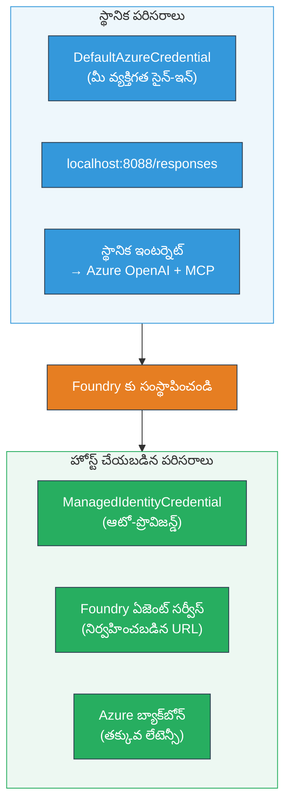

# మాడ్యూల్ 7 - ప్లేగ్రౌండ్‌లో ధృవీకరణ

ఈ మాడ్యూల్‌లో, మీరు మీ డిప్లాయ్ చేసిన మల్టీ-ఏజెంట్ వర్క్‌ఫ్లోను **VS కోడ్** మరియు **[Foundry పోర్టల్](https://ai.azure.com)** రెండు చోట్ల పరీక్షించి, ఏజెంట్ స్థానిక పరీక్షలతో సరిగ్గా పనిచేస్తుందో లేదో నిర్ధారించుకుంటారు.

---

## డిప్లాయ్‌మెంట్ తర్వాత ఎందుకు ధృవీకరించాలి?

మీ మల్టీ-ఏజెంట్ వర్క్‌ఫ్లో స్థానికంగా సరిగ్గా నడిచింది, కాబట్టి మరోసారి పరీక్షించాలా? హోస్టెడ్ వాతావరణం కొన్ని మార్గాల్లో విభిన్నంగా ఉంటుంది:


| తేడా | స్థానిక | హోస్టెడ్ |
|-----------|-------|--------|
| **అడిగిన వ్యక్తి గుర్తింపు** | [`DefaultAzureCredential`](https://learn.microsoft.com/azure/developer/python/sdk/authentication/credential-chains#defaultazurecredential-overview) (మీ వ్యక్తిగత సైన్-ఇన్) | [`ManagedIdentityCredential`](https://learn.microsoft.com/python/api/overview/azure/identity-readme#managed-identity-support) (ఆటో-ప్రొవిజన్ చేయబడింది) |
| **ఎండ్పాయింట్** | `http://localhost:8088/responses` | [Foundry Agent Service](https://learn.microsoft.com/azure/foundry/agents/concepts/hosted-agents) ఎండ్పాయింట్ (నిర్వహణ చేయబడిన URL) |
| **నెట్‌వర్క్** | స్థానిక యంత్రం → Azure OpenAI + MCP అవుట్‌బౌండ్ | Azure బాక్బోన్ (సేవల మధ్య తక్కువ లేటెన్సీ) |
| **MCP కనెక్టివిటీ** | స్థానిక ఇంటర్నెట్ → `learn.microsoft.com/api/mcp` | కంటైనర్ అవుట్‌బౌండ్ → `learn.microsoft.com/api/mcp` |

ఏదైనా ఎన్విరాన్‌మెంట్ వేరియబుల్ తప్పుగా కాన్ఫిగర్ అయితే, RBAC వేరుగా ఉంటే లేదా MCP అవుట్‌బౌండ్ బ్లాక్ అయితే, మీరు ఇక్కడ కనుగొందచ్చు.

---

## ఆప్షన్ A: VS కోడ్ ప్లేగ్రౌండ్‌లో పరీక్షించండి (మొదటిది సూచించబడింది)

[Foundry ఎక్స్టెన్షన్](https://marketplace.visualstudio.com/items?itemName=TeamsDevApp.vscode-ai-foundry)కట్టుబడి ఉన్న ప్లేగ్రౌండ్‌ను అందిస్తుంది, ఇది మీరు VS కోడ్ వదిల 않고 మీరు డిప్లాయ్ చేసిన ఏజెంట్తో చాట్ చేయడానికి సహాయపడుతుంది.

### దశ 1: మీ హోస్టెడ్ ఏజెంట్‌కు వెళ్లండి

1. VS కోడ్ **Activity Bar** (ఎడమ సైడ్బార్)లో **Microsoft Foundry** చిహ్నాన్ని క్లిక్ చేసి Foundry ప్యానెల్‌ను తెరవండి.
2. మీ కనెక్ట్ చేసుకున్న ప్రాజెక్ట్‌ను (ఉదాహరణకు, `workshop-agents`) విస్తరించండి.
3. **Hosted Agents (Preview)** విస్తరించండి.
4. మీ ఏజెంట్ పేరును చూడాలి (ఉదా: `resume-job-fit-evaluator`).

### దశ 2: ఒక వెర్షన్ ఎంచుకోండి

1. ఏజెంట్ పేరుపై క్లిక్ చేసి దాని వెర్షన్లను విస్తరించండి.
2. మీరు డిప్లాయ్ చేసిన వెర్షన్‌పై క్లిక్ చేయండి (ఉదా: `v1`).
3. ఒక **వివరాల ప్యానెల్** తెరుస్తుంది, డిప్లాయ్ చేసిన కంటైనర్ వివరాలు చూపుతుంది.
4. స్థితి **Started** లేదా **Running** అని నిర్ధారించుకోండి.

### దశ 3: ప్లేగ్రౌండ్ ఓపెన్ చేయండి

1. వివరాల ప్యానెల్లో, **Playground** బటన్‌ను క్లిక్ చేయండి (లేదా వెర్షన్‌పై రైట్-క్లిక్ చేసి → **Open in Playground**).
2. VS కోడ్ ట్యాబ్‌లో చాట్ ఇంటర్‌ఫేస్ తెరుస్తుంది.

### దశ 4: మీ స్మోక్ పరీక్షలను నడపండి

[Module 5](05-test-locally.md) నుండి అదే 3 పరీక్షలను ఉపయోగించండి. ప్రతి సందేశాన్ని ప్లేగ్రౌండ్ ఇన్‌పుట్ బాక్స్‌లో టైప్ చేసి **Send** (లేదా **Enter**) నొక్కండి.

#### పరీక్ష 1 - పూర్తి రిజ్యూమ్ + JD (సాధారణ ఫ్లో)

Module 5, Test 1 లోని పూర్తి రిజ్యూమ్ + JD ప్రాంప్ట్ (Jane Doe + Senior Cloud Engineer at Contoso Ltd) ను పేస్టు చేయండి.

**అంచనా:**
- ఫిట్ స్కోరు విభజన గణాంకంతో (100-పాయింట్ల స్కేల్)
- సరిపోయే నైపుణ్యాలు విభాగం
- కనుమరుగైన నైపుణ్యాలు విభాగం
- **ప్రతీ కనుమరుగైన నైపుణ్యానికి ఒక గాప్ కార్డ్** Microsoft Learn URLలతో
- అభ్యాస మార్గదర్శక పట్టికతో టైమ్‌లైన్

#### పరీక్ష 2 - త్వరిత నచ్చని పరీక్ష (కనిష్ట ఇన్‌పుట్)

```
RESUME: 3 years Python developer, knows Django and PostgreSQL, no cloud experience.

JOB: Cloud DevOps Engineer requiring AWS, Kubernetes, Terraform, CI/CD. 5 years needed.
```

**అంచనా:**
- తక్కువ ఫిట్ స్కోరు (< 40)
- నిజాయతీతో అంచనా మరియు దశల వారీ అభ్యాస మార్గం
- బహుళ గాప్ కార్డులు (AWS, Kubernetes, Terraform, CI/CD, అనుభవ గ్యాప్)

#### పరీక్ష 3 - అధిక ఫిట్ అభ్యర్ధి

```
RESUME:
10 years Azure Cloud Architect. AZ-305 certified. Expert in AKS, Terraform, Azure DevOps, 
Azure Functions, Helm, Prometheus, Grafana, Python, Go. Led platform team of 8.

JOB:
Senior Cloud Engineer. Required: AKS, Terraform, Azure DevOps, Python. Preferred: Helm, Go.
5+ years experience. AZ-305 preferred.
```

**అంచనా:**
- అధిక ఫిట్ స్కోరు (≥ 80)
- ఇంటర్వ్యూ సిద్ధత మరియు పాళిశింగ్ పై దృష్టి
- తక్కువ గాప్ కార్డులు లేదా లేకపోవడం
- చిన్న టైమ్‌లైన్, ప్రిపరేషన్‌కు కేంద్రీకృతం

### దశ 5: స్థానిక ఫలితాలతో సరిపోల్చండి

Module 5 లోని మీ నోట్లు లేదా బ్రౌజర్ టాబ్ తెరవండి, అక్కడ మీరు స్థానిక స్పందనలను సేవ్ చేసారు. ప్రతి పరీక్ష కోసం:

- స్పందనలో **ఆకృతి ఒకేలా ఉందా** (ఫిట్ స్కోరు, గాప్ కార్డులు, మార్గదర్శక పట్టిక)?
- అదే **స్కోరింగ్ రూబ్రిక్** (100-పాయింట్ల విభజన) అనుసరిస్తుందా?
- గాప్ కార్డుల్లో ఇంకా **Microsoft Learn URLలు** ఉన్నాయా?
- ప్రతి కనుమరుగైన నైపుణ్యానికి **ఒక గాప్ కార్డ్** ఉందా (తగిలించలేదు)?

> **తక్కువ భేదాల పద ప్రయోగాలు సహజమే** - మోడల్ నిర్దేశితమయినది కాదు. ఆకృతి, స్కోరింగ్ సారూప్యత మరియు MCP టూల్ వినియోగంపై దృష్టి పెట్టండి.

---

## ఆప్షన్ B: Foundry పోర్టల్‌లో పరీక్షించండి

[Foundry పోర్టల్](https://ai.azure.com) ఒక వెబ్ ఆధారిత ప్లేగ్రౌండ్ అందిస్తుంది, ఇది టీమ్ సభ్యులు లేదా మొదలి వర్గాలతో పంచుకోవడానికి ఉపయోగపడుతుంది.

### దశ 1: Foundry పోర్టల్ ఓపెన్ చేయండి

1. మీ బ్రౌజర్ తెరవండి మరియు [https://ai.azure.com](https://ai.azure.com) కు వెళ్లండి.
2. వర్క్‌షాప్ నడుస్తున్న అదే Azure ఖాతాతో సైన్ ఇన్ చేయండి.

### దశ 2: మీ ప్రాజెక్ట్‌కు వెళ్లండి

1. హోమ్ పేజీలో ఎడమ సైడ్బార్‌లో **Recent projects** చూడండి.
2. మీ ప్రాజెక్ట్ పేరుపై క్లిక్ చేయండి (ఉదా: `workshop-agents`).
3. కనిపించకపోతే, **All projects** క్లిక్ చేసి సెర్చ్ చేయండి.

### దశ 3: డిప్లాయ్ చేసిన ఏజెంట్‌ను కనుగొనండి

1. ప్రాజెక్ట్ ఎడమ నావిగేషన్‌లో, **Build** → **Agents** క్లిక్ చేయండి (లేదా **Agents** సెక్షన్ చూడండి).
2. ఏజెంట్ల జాబితా కనిపిస్తుంది. మీ డిప్లాయ్ చేసిన ఏజెంట్ కనుగొనండి (ఉదా: `resume-job-fit-evaluator`).
3. ఏజెంట్ పేరుపై క్లిక్ చేసి వివరాల పేజీ తెరవండి.

### దశ 4: ప్లేగ్రౌండ్ ఓపెన్ చేయండి

1. ఏజెంట్ వివరాల పేజీలో, టాప్ టూల్‌బార్ చూడండి.
2. **Open in playground** (లేదా **Try in playground**) క్లిక్ చేయండి.
3. చాట్ ఇంటర్‌ఫేస్ తెరుస్తుంది.

### దశ 5: అదే 3 స్మోక్ పరీక్షలు నడపండి

పై VS కోడ్ ప్లేగ్రౌండ్ విభాగంలోని 3 పరీక్షలను మళ్ళీ నడిపి, ప్రతిస్పందనను స్థానిక ఫలితాలు (Module 5) మరియు VS కోడ్ ప్లేగ్రౌండ్ ఫలితాలతో (ఆప్షన్ A) సరిపోల్చండి.

---

## మల్టీ-ఏజెంట్ నిర్దిష్ట ధృవీకరణ

బేసిక్ సరైనతకు మించి, ఈ మల్టీ-ఏజెంట్ నిర్దిష్ట ప్రవర్తనలను ధృవీకరించండి:

### MCP టూల్ అమలు

| తనిఖీ | ధృవీకరించుట ఎలా | పాస్ షరతు |
|-------|---------------|----------------|
| MCP కాల్స్ విజయవంతం | గాప్ కార్డుల్లో `learn.microsoft.com` URLలు ఉండాలి | నిజమైన URLలు, fallback సందేశాలు కాదీ |
| బహుళ MCP కాల్స్ | ప్రతి హై/మిడియం ప్రాధాన్యత గల గాప్కి వనరులు ఉండాలి | మొదటి గాప్ కార్డులో మాత్రమే కాదు |
| MCP fallback పని చేస్తుందా | URLలు లేవంటే fallback టెక్స్ట్ కోసం చూడండి | ఏజెంట్ ఇంకా గాప్ కార్డులు ఇస్తుంది (URLలతో లేదా లేకపోయినా) |

### ఏజెంట్ సమన్వయం

| తనిఖీ | ధృవీకరించుట ఎలా | పాస్ షరతు |
|-------|---------------|----------------|
| మొత్తం 4 ఏజెంట్లు నడిచాయా | అవుట్పుట్‌లో ఫిట్ స్కోరు మరియు గాప్ కార్డులు ఉంటాయి | స్కోరు MatchingAgent నుండి, కార్డులు GapAnalyzer నుండి ఉండాలి |
| సమాంతర ఫ్యాన్-ఆవుట్ | రెస్పాన్స్ సమయం సరైనది (< 2 నిమిషాలు) | 3 నిమిషాలకంటే ఎక్కువ అయితే, సమాంతర అమలు పనిచేస్తుందనుకోవద్దు |
| డేటా ఫ్లో సమగ్రత | గాప్ కార్డులు మ్యాచ్ చేసిన రిపోర్ట్ నైపుణ్యాలను సూచిస్తాయి | JD లో లేని కల్పించిన నైపుణ్యాలు లేకపోవాలి |

---

## నిర్ధారణ రూబ్రిక్

మీ మల్టీ-ఏజెంట్ వర్క్‌ఫ్లో హోస్టెడ్ ప్రవర్తనను ఈ రూబ్రిక్‌తో మూల్యాంకనం చేయండి:

| # | ప్రమాణం | పాస్ షరతు | పాస్? |
|---|----------|---------------|-------|
| 1 | **ఫంక్షనల్ సరైనత** | ఏజెంట్ రిజ్యూమ్ + JD కి ఫిట్ స్కోరు మరియు గాప్ విశ్లేషణతో స్పందిస్తాడు | |
| 2 | **స్కోరింగ్ సారూప్యత** | ఫిట్ స్కోరు 100-పాయింట్ల స్కేల్‌తో విభజన గణాంకాల తో ఉంటుంది | |
| 3 | **గాప్ కార్డ్ సంపూర్ణత** | ప్రతీ కనుమరుగైన నైపుణ్యానికి ఒక కార్డ్ (తగిలించలేదు లేదా కలిపి కాదు) | |
| 4 | **MCP టూల్ ఇంటిగ్రేషన్** | గాప్ కార్డుల్లో నిజమైన Microsoft Learn URLలు ఉన్నాయి | |
| 5 | **ఆకృతి సారూప్యత** | స్థానిక మరియు హోస్టెడ్ రన్స్ మధ్య అవుట్పుట్ ఆకృతి సరిపోతుంది | |
| 6 | **స్పందన సమయం** | హోస్టెడ్ ఏజెంట్ పూర్తి అంచనాకు 2 నిమిషాల్లో స్పందిస్తుంది | |
| 7 | **ఏదైనా లోపాలు లేవు** | HTTP 500 లోపాలు, సమయపు ముగింపులు, లేదా ఖాళీ స్పందనలు లేవు | |

> "పాస్" అంటే ఈ 7 ప్రమాణాల్లో అన్ని 3 స్మోక్ పరీక్షలకూ కనీసం ఒక ప్లేగ్రౌండ్ (VS కోడ్ లేదా పోర్టల్) లో ఇంతే అన్నమాట.

---

## ప్లేగ్రౌండ్ సమస్యల పరిష్కారం

| లక్షణం | కారణం | పరిష్కారం |
|---------|-------------|-----|
| ప్లేగ్రౌండ్ లోడ్ కావడం లేదు | కంటైనర్ స్థితి "Started" కాదు | [Module 6](06-deploy-to-foundry.md) కి తిరిగి వెళ్లి డిప్లాయ్‌మెంట్ స్థితిని ధృవీకరించండి. "Pending" అయితే వేచి ఉండండి |
| ఏజెంట్ ఖాళీ స్పందన ఇస్తోంది | మోడల్ డిప్లాయ్‌మెంట్ పేరు సరిపోలడం లేదు | `agent.yaml` → `environment_variables` → `MODEL_DEPLOYMENT_NAME` మీరు డిప్లాయ్ చేసిన మోడల్ పేరుతో సరిపోతుందో చూడండి |
| ఏజెంట్ లోపపు సందేశం ఇస్తోంది | [RBAC](https://learn.microsoft.com/azure/foundry/concepts/rbac-foundry) అనుమతి లేదు | ప్రాజెక్ట్ స్కోప్‌లో **[Azure AI User](https://aka.ms/foundry-ext-project-role)** ని అప్పగించండి |
| గాప్ కార్డుల్లో Microsoft Learn URLలు లేవు | MCP అవుట్‌బౌండ్ బ్లాక్ అయి ఉంది లేదా MCP సర్వర్ అందుబాటులో లేదు | కంటైనర్ `learn.microsoft.com` కి చేరగలదా చూడండి. చూడండి [Module 8](08-troubleshooting.md) |
| ఒంటి గాప్ కార్డ్ మాత్రమే ఉంది (తగ్గింపుగా) | GapAnalyzer సూచనలు "CRITICAL" బ్లాక్ లేకపోవడం | చూసుకోండి [Module 3, Step 2.4](03-configure-agents.md) |
| ఫిట్ స్కోరు స్థానిక దquiloకంటే చాలా భిన్నంగా ఉంది | వేరే మodel్ లేదా సూచనలు deployed అయ్యాయి | `agent.yaml` యొక్క_ENV వేరియబుల్స్ స్థానిక .env తో పోల్చండి. అవసరమైతే మళ్లీ డిప్లాయ్ చేయండి |
| పోర్టల్‌లో "Agent not found" సందేశం | డిప్లాయ్‌మెంట్ ఇంకా ప్రోపగేట్ అవ్వడం లేదా విఫలం | 2 నిమిషాలు వేచి, పేజీ రిఫ్రెష్ చేయండి. ఇంకా కనిపించకపోతే [Module 6](06-deploy-to-foundry.md) నుండి మళ్లీ డిప్లాయ్ చేయండి |

---

### చెక్పాయింట్

- [ ] VS కోడ్ ప్లేగ్రౌండ్‌లో ఏజెంట్ పరీక్షించారు - 3 స్మోక్ టెస్టులు 모두 ఉత్తీర్ణత సాధించాయి
- [ ] [Foundry పోర్టల్](https://ai.azure.com) ప్లేగ్రౌండ్‌లో ఏజెంట్ పరీక్షించారు - 3 స్మోక్ టెస్టులు 모두 ఉత్తీర్ణత
- [ ] స్పందనలు స్థానిక పరీక్షలతో ఆకృతిగా సారూప్యంగా ఉన్నాయి (ఫిట్ స్కోర్, గ్యాప్ కార్డులు, మార్గదర్శక పట్టిక)
- [ ] గాప్ కార్డుల్లో Microsoft Learn URLలు ఉన్నాయి (హోస్టెడ్ వాతావరణంలో MCP టూల్ పని చేస్తోంది)
- [ ] ప్రతీ కనుమరుగైన నైపుణ్యానికి ఒక గాప్ కార్డు ఉంది (తగ్గింపు లేదు)
- [ ] పరీక్షల సమయంలో లోపాలు లేదా సమయపు ముగింపులు లేవు
- [ ] ధృవీకరణ రూబ్రిక్ పూర్తి చేయబడింది (7 ప్రమాణాలు 모두 పాస్)

---

**గతం:** [06 - Foundry కి డిప్లాయ్ చేయడం](06-deploy-to-foundry.md) · **తరువాత:** [08 - సమస్య పరిష్కారం →](08-troubleshooting.md)

---

<!-- CO-OP TRANSLATOR DISCLAIMER START -->
**డిస claims లేమర్**:  
ఈ డాక్యుమెంట్‌ను AI అనువాద సర్వీస్ [Co-op Translator](https://github.com/Azure/co-op-translator) ఉపయోగించి అనువదించబడింది. మేము ఖచ్చితత్వానికి ప్రయత్నించినప్పటికీ, ఆటోమేటెడ్ అనువాదాల్లో పొరపాట్లు లేదా తప్పులు ఉండొచ్చు. అది ప్రసిద్ధ భాషలో ఉన్న అసలు డాక్యుమెంట్ ను అధికారిక మూలంగా పరిగణించాలి. ముఖ్యమైన సమాచారానికి, ప్రొఫెషనల్ మానవ అనువాదం సూచించబడుతుంది. ఈ అనువాదం ఉపయోగించినందున సంభవించే ఏవైనా అపార్థాలు లేదా తప్పుద్రష్ట్యాన్నికి మేము బాధ్యులు కాదు.
<!-- CO-OP TRANSLATOR DISCLAIMER END -->