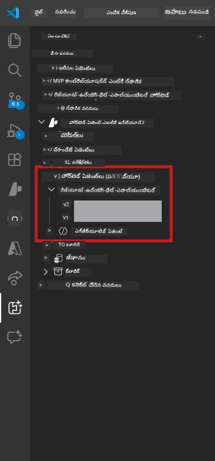

# మాడ్యూల్ 7 - ప్లేగ్రౌండ్లో ధృవీకరణ

⏱️ ~10 నిమిషాలు

ఈ మాడ్యూల్లో, మీరు VS కోడ్ మరియు Foundry పోర్టల్‌లో మీ నిక్షిప్త బహుళ-ఏజెంట్ పనిముట్లు పరీక్షించి, ఏజెంట్ లోకల్ పరీక్షలతో సమానంగా వ్యవహరిస్తుందో లేదో ధృవీకరిస్తారు.

---

## నిక్షేపం తరువాత మళ్ళీ ఎందుకు పరీక్షించాలి?

హోస్టెడ్ వాతావరణం లోకల్ నుండి కొన్ని ముఖ్యమైన మార్గాల్లో భిన్నంగా ఉంటుంది:

| | లోకల్ | హోస్టెడ్ |
|--|-------|--------|
| **గుర్తింపు** | మీ వ్యక్తిగత సైన్-ఇన్ (`DefaultAzureCredential`) | ప్రతి ఏజెంట్ కోసం కేటాయించబడిన Entra గుర్తింపు (నిక్షేప సమయంలో ఆటో ప్రావిజన్ చేయబడింది) |
| **ఎండ్‌పాయింట్** | `http://localhost:8088/responses` | Foundry ఏజెంట్ సర్వీస్ నిర్వహించే URL |
| **నెట్వర్క్** | మీ యంత్రం → Azure OpenAI + MCP | Azure బ్యాక్‌బోన్ (తక్కువ లేటెన్సీ) |

తప్పు కాన్ఫిగర్ చేసిన env var, RBAC సమస్య లేదా అడ్డుకునే MCP అవుట్‌బౌండ్ కాల్ మొదటగా ఇక్కడ కనిపిస్తుంది.

---

## ఎంపిక A: VS కోడ్ ప్లేగ్రౌండ్లో పరీక్ష (మొదట సిఫార్సు చేయబడింది)

### దశ 1: మీ హోస్టెడ్ ఏజెంట్‌కు నావిగేట్ చేయండి

1. అక్టివిటీ బార్‌లో **Foundry టూల్‌కిట్** ఐకాన్ పై క్లిక్ చేయండి.
2. మీ ప్రాజెక్ట్‌ను విస్తరించి → **Hosted Agents (Preview)** → మీ ఏజెంట్‌ను కనుగొనండి.



### దశ 2: ఒక వెర్షన్ ఎంచుకోండి

1. ఏజెంట్ పై క్లిక్ చేసి దాని వెర్షన్లను విస్తరించండి.
2. `v1` పై క్లిక్ చేయండి → స్థితి **active** ఉందని ధృవీకరించండి (సైడ్‌బార్ "Running" లేదా "Started" చూపించవచ్చు - రెండూ ఒకే సిద్ధమైన స్థితిని సూచిస్తాయి).

### దశ 3: ప్లేగ్రౌండ్ ను తెరవండి

1. **Playground** పై క్లిక్ చేయండి (లేదా వెర్షన్ పై రైట్-క్లిక్ చేస్తూ → **Open in Playground**).
2. VS కోడ్ ట్యాబ్‌లో చాట్ విండో తెరవబడుతుంది.

### దశ 4: మీ స్మోక్ టెస్ట్‌లు నడపండి

[Module 5](05-test-locally.md) నుండి అదే 3 పరీక్షలను ఉపయోగించండి. ప్లేగ్రౌండ్ ఇన్‌పుట్ బాక్స్‌లో ప్రతి సందేశం టైప్ చేసి **Send** (లేదా **Enter**) నొక్కండి.

#### టెస్ట్ 1 - పూర్తి రిజ్యూమ్ + JD (స్టాండర్డ్ ఫ్లో)

Module 5, Test 1 (జేన్ డో + Contoso Ltd లో సీనియర్ క్లౌడ్ ఇంజినీర్) నుండి పూర్తి రిజ్యూమ్ + JD ప్రాంప్ట్‌ను పేస్ట్ చేయండి.

**అంచనావేసినది:**
- విభజన గణితంతో ఫిట్ స్కోరు (100-పాయింట్ స్కేల్)
- సరిపోయే నైపుణ్యాలు సెక్షన్
- లేనిది నైపుణ్యాలు సెక్షన్
- **లేనిది ప్రతి నైపుణ్యానికి ఒక గ్యాప్ కార్డ్** Microsoft Learn URLs తో
- టైంలైన్ ఉన్న నేర్చుకునే రోడ్‌మ్యాప్

#### టెస్ట్ 2 - తక్కువ ఇన్‌పుట్ తో క్విక్ శార్ట్ టెస్ట్

```
RESUME: 3 years Python developer, knows Django and PostgreSQL, no cloud experience.

JOB: Cloud DevOps Engineer requiring AWS, Kubernetes, Terraform, CI/CD. 5 years needed.
```

**అంచనావేసినది:**
- తక్కువ ఫిట్ స్కోరు (< 40)
- రుజువైన అంచనా మరియు దశల వారీ నేర్చుకునే మార్గం
- అనేక గ్యాప్ కార్డులు (AWS, Kubernetes, Terraform, CI/CD, అనుభవ లోపం)

#### టెస్ట్ 3 - హై-ఫిట్ అభ్యర్థి

```
RESUME:
10 years Azure Cloud Architect. AZ-305 certified. Expert in AKS, Terraform, Azure DevOps, 
Azure Functions, Helm, Prometheus, Grafana, Python, Go. Led platform team of 8.

JOB:
Senior Cloud Engineer. Required: AKS, Terraform, Azure DevOps, Python. Preferred: Helm, Go.
5+ years experience. AZ-305 preferred.
```

**అంచనావేసినది:**
- హై ఫిట్ స్కోరు (≥ 80)
- ఇంటర్వ్యూకి సిద్ధం కావడంపై దృష్టి మరియు మెరుగుదల
- కొద్ది గ్యాప్ కార్డులు లేదా లేవు
- సిద్ధతపై దృష్టి పెట్టిన షార్ట్ టైంలైన్

### దశ 5: లోకల్ ఫలితాలతో పోల్చండి

మీరు లోకల్ స్పందనలను కోరికలేదా మాడ్యూల్ 5 నుంచి బ్రౌజర్ ట్యాబ్ ను తెరవండి. ప్రతి పరీక్షకు:

- స్పందన **ఏకరకమైన నిర్మాణం** కలిగి ఉందా? (ఫిట్ స్కోరు, గ్యాప్ కార్డులు, రోడ్‌మ్యాప్)
- అదే **స్కోరింగ్ రూపకం** అనుసరిస్తుందా? (100-పాయింట్ విభజన)
- గ్యాప్ కార్డులలో ఇంకా **Microsoft Learn URLs** ఉన్నాయా?
- **లేనిది ప్రతి నైపుణ్యానికి ఒక గ్యాప్ కార్డ్** ఉన్నదా? (తగ్గించబడలేదు)

> **సర్వసాధారణంగా చిన్న భిన్నమైన పదాలు ఉంటాయి** - మోడల్ అప్రాప్త్యత. నిర్మాణం, స్కోరింగ్ సరిగా ఉండటం, MCP టూల్ వినియోగంపై దృష్టి పెట్టండి.

---

## ఎంపిక B: Foundry పోర్టల్‌లో పరీక్ష

[Foundry పోర్టల్](https://ai.azure.com) ఒక వెబ్-ఆధారిత ప్లేగ్రౌండ్ అందిస్తుంది, ఇది సహచరులు లేదా స్టేక్‌హోల్డర్లకు పంచుకోవడానికీ ఉపయోగకరంగా ఉంటుంది.

### దశ 1: Foundry పోర్టల్ తెరవండి

1. మీ బ్రౌజర్ తెరవండి మరియు [https://ai.azure.com](https://ai.azure.com) కు నావిగేట్ అవ్వండి.
2. వర్క్‌షాప్ సమయమంతా ఉపయోగించిన అదే Azure అకౌంట్‌తో సైన్ ఇన్ అవ్వండి.

### దశ 2: మీ ప్రాజెక్ట్‌కు నావిగేట్ చేయండి

1. హోమ్ పేజీనుంచి ఎడమ సైడ్‌బార్‌లో **Recent projects** కోసం చూడండి.
2. మీ ప్రాజెక్ట్ పేరుపై క్లిక్ చేయండి (ఉదా: `workshop-agents`).
3. కనిపించకపోతే, **All projects** పై క్లిక్ చేసి అందులో శోధించండి.

### దశ 3: మీ నిక్షిప్త ఏజెంట్‌ను కనుగొనండి

1. ప్రాజెక్ట్ ఎడమ నావిగేషన్‌లో **Build** → **Agents** (లేదా **Agents** విభాగం) పై క్లిక్ చేయండి.
2. ఏజెంట్‌ ల జాబితా కనిపిస్తుంది. మీ నిక్షిప్త ఏజెంట్‌ను కనుగొనండి (ఉదా: `resume-job-fit-evaluator`).
3. ఏజెంట్ పేరుపై క్లిక్ చేసి దాని వివరాల పేజీని తెరవండి.

### దశ 4: ప్లేగ్రౌండ్ తెరవండి

1. ఏజెంట్ వివరాల పేజీలో పై టూల్‌బార్‌ను చూడండి.
2. **Open in playground** (లేదా **Try in playground**) పై క్లిక్ చేయండి.
3. చాట్ ఇంటర్‌ఫేస్ తెరవబడుతుంది.

### దశ 5: అదే స్మోక్ టెస్ట్‌లు నడపండి

ఇక్కడ ఉన్న VS కోడ్ ప్లేగ్రౌండ్ విభాగం నుంచి అన్ని 3 పరీక్షలను మరల నడపండి. ప్రతి స్పందనను లోకల్ ఫలితాలు (Module 5) మరియు VS కోడ్ ప్లేగ్రౌండ్ ఫలితాలతో (Option A పై) పోల్చండి.

---

## బహుళ-ఏజెంట్ ప్రత్యేక ధృవీకరణ

ప్రాథమిక సరిగ్గా ఉండడాన్ని మించి, ఈ బహుళ-ఏజెంట్-స్పెసిఫిక్ ప్రవర్తనలను ధృవీకరించండి:

### MCP టూల్ నడుము

| పరీక్షించండి | ఎలా ధృవీకరించాలి | ఉత్తీర్ణత స్థితి |
|-------|---------------|----------------|
| MCP కాల్లు విజయవంతం | గ్యాప్ కార్డులు `learn.microsoft.com` URLs కలిగి ఉండాలి | వాస్తవ URLs, fallback సందేశాలు కాదు |
| అనేక MCP కాల్లు | ప్రతి High/Medium ప్రాధాన్యత గ్యాప్ కు వనరులు ఉండాలి | మొదటి గ్యాప్ కార్డ్ కాదు మాత్రమే |
| MCP fallback పనిచేస్తుంది | URLs లేమి ఉంటే fallback టెక్స్ట్ తనిఖీ చేయండి | ఏజెంట్ URL లేకుండా కూడా గ్యాప్ కార్డులు ఉత్పత్తి చేస్తుంది |

### ఏజెంట్ సమన్వయం

| పరీక్షించండి | ఎలా ధృవీకరించాలి | ఉత్తీర్ణత స్థితి |
|-------|---------------|----------------|
| అన్ని 4 ఏజెంట్లు పరుగులో ఉన్నాయి | అవుట్‌పుట్ లో ఫిట్ స్కోరు మరియు గ్యాప్ కార్డులు ఉంటాయి | స్కోరు MatchingAgent నుండి, కార్డులు GapAnalyzer నుండి |
| క్రమంగా నడపడం | స్పందన సమయం సహన విధంగా (< 2 నిమిషాలు) | 3 నిమిషాలకు పైగా అయితే, టెర్మినల్ లాగ్ లో పొరపాట్లు తనిఖీ చేయండి |
| డేటా ఫ్లో సమగ్రత | గ్యాప్ కార్డులు మ్యాచ్ చేస్తున్న నివేదిక నుండి నైపుణ్యాలను సూచిస్తాయి | JD లో లేనివి హలనაციას కలిగి ఉండరాదు |

---

## ధృవీకరణ రూపకం

ఈ రూపకాన్ని ఉపయోగించి మీ బహుళ-ఏజెంట్ వర్క్‌ఫ్లో యొక్క హోస్టెడ్ ప్రవర్తనను మూల్యాంకనం చేయండి:

| # | ప్రమాణం | ఉత్తీర్ణత స్థితి | ఉత్తీర్ణమయ్యిందా? |
|---|----------|---------------|-------|
| 1 | **ఫంక్షనల్ సరైనత** | ఏజెంట్ రిజ్యూమ్ + JD కి ఫిట్ స్కోరు మరియు గ్యాప్ విశ్లేషణతో స్పందిస్తుంది | |
| 2 | **స్కోరింగ్ సారూప్యత** | ఫిట్ స్కోరు 100-పాయింట్ స్కేల్‌తో విభజన గణితం చేస్తుంది | |
| 3 | **గ్యాప్ కార్డ్ పూర్తి స్థాయిలో ఉంటాయి** | లేనిది ప్రతి నైపుణ్యానికి ఒక కార్డూ (తగ్గించబడలేదు లేదా కలిపి చేర్చలేదు) | |
| 4 | **MCP టూల్ ఇంటిగ్రేషన్** | గ్యాప్ కార్డులు వాస్తవ Microsoft Learn URLs కలిగి ఉంటాయి | |
| 5 | **నిర్మాణ సారూప్యత** | లోకల్ మరియు హోస్టెడ్ పరుగులలో అవుట్‌పుట్ నిర్మాణం సరిపోలుతుంది | |
| 6 | **స్పందన సమయం** | పూర్తి మదింపు కోసం హోస్టెడ్ ఏజెంట్ 2 నిమిషాల్లో స్పందిస్తుంది | |
| 7 | **లోపాలు లేవు** | HTTP 500 లోపాలు, టైమ్‌అవుట్లు లేదా ఖాళీ స్పందనలు లేవు | |

> ఒక "ఉత్తీర్ణత" అంటే కనీసం ఒక ప్లేగ్రౌండ్‌లో (VS కోడ్ లేదా పోర్టల్) అన్ని 3 స్మోక్ పరీక్షల కోసం 7 ప్రమాణాలు అన్నీ తీర్చబడినట్లు anlam.

---

## ప్లేగ్రౌండ్ సమస్యల పరిష్కారం

| లక్షణం | సంభావ్య కారణం | పరిష్కారం |
|---------|-------------|-----|
| ప్లేగ్రౌండ్ లోడ్ అవడం లేదు | కంటైనర్ `active` స్థితిలో లేదు | [Module 6](06-deploy-to-foundry.md) కి తిరిగి వెళ్లండి, నిక్షేప స్థితిని ధృవీకరించండి. `creating` అయితే వేచిఉండండి |
| ఏజెంట్ ఖాళీ స్పందన ఇస్తోంది | మోడల్ డిప్లాయ్‌మెంట్ పేరు సరిపోలడం లేదు | `agent.yaml` → `environment_variables` → `AZURE_AI_MODEL_DEPLOYMENT_NAME` మీ మోడల్‌కి సరిపోతుందో చెక్ చేయండి |
| ఏజెంట్ లోపం సందేశం ఇస్తోంది | [RBAC](https://learn.microsoft.com/azure/foundry/concepts/rbac-foundry) అనుమతి లేదు | ప్రాజెక్ట్ స్కోప్‌లో **[Foundry User](https://aka.ms/foundry-ext-project-role)** కేటాయించండి (మునుపటి Azure AI User) |
| గ్యాప్ కార్డుల్లో Microsoft Learn URLs లేవు | MCP అవుట్‌బౌండ్ బ్లాక్ లేదా MCP సర్వర్ అందుబాటులో లేదు | కంటైనర్ `learn.microsoft.com` చేరగలదా తనిఖీ చేయండి. [Module 8](08-troubleshooting.md) చూడండి |
| ఒకే గ్యాప్ కార్డ్ ఉంది (తగ్గించబడింది) | GapAnalyzer సూచనల్లో "CRITICAL" బ్లాక్ లేదు | [Module 3, దశ 2.4](03-configure-agents.md) సమీక్షించండి |
| ఫిట్ స్కోరు లోకల్ నుండి విరుద్ధంగా ఉంది | వేరే మోడల్ లేదా సూచనలు నిక్షిప్తం చేయబడ్డాయి | `agent.yaml` env varsని లోకల్ `.env` తో పోల్చండి. అవసరమైతే మళ్లీ నిక్షిప్తం చేయండి |
| పోర్టల్‌లో "Agent not found" అని చూపుతుంది | డిప్లాయ్‌మెంట్ ఇంకా వ్యాప్తి చెందుతోంది లేదా విఫలమైంది | 2 నిమిషాలు వేచి, రిఫ్రెష్ చేయండి. ఇంకా కనపడకపోతే [Module 6](06-deploy-to-foundry.md) నుండి మళ్లీ నిక్షిప్తం చేయండి |

---

### చెక్పాయింట్

- [ ] VS కోడ్ ప్లేగ్రౌండ్‌లో ఏజెంట్‌ను పరీక్షించాను - అన్ని 3 స్మోక్ పరీక్షలు ఉత్తీర్ణమయ్యాయి
- [ ] [Foundry పోర్టల్](https://ai.azure.com) ప్లేగ్రౌండ్‌లో ఏజెంట్‌ను పరీక్షించాను - అన్ని 3 స్మోక్ పరీక్షలు ఉత్తీర్ణమయ్యాయి
- [ ] స్పందనలు లోకల్ పరీక్షలతో నిర్మాణపరంగా సారూప్యంగానే ఉన్నాయి (ఫిట్ స్కోరు, గ్యాప్ కార్డులు, రోడ్‌మ్యాప్)
- [ ] గ్యాప్ కార్డుల్లో Microsoft Learn URLs ఉన్నాయి (హోస్టెడ్ వాతావరణంలో MCP టూల్ పనిచేస్తుంది)
- [ ] లేనిది ప్రతి నైపుణ్యానికి ఒక గ్యాప్ కార్డు (తగ్గింపులు లేవు)
- [ ] పరీక్ష సమయంలో లోపాలు లేదా టైమ్‌అవుట్స్ లేవు
- [ ] ధృవీకరణ రూపకం పూర్తి చేశాను (అన్ని 7 ప్రమాణాలు ఉత్తీర్ణత పొందింది)

---

**మునుపటి:** [06 - Foundryకి నిక్షిప్తం చేయడం](06-deploy-to-foundry.md) · **మ volgende:** [08 - సమస్య పరిష్కారం →](08-troubleshooting.md)

---

<!-- CO-OP TRANSLATOR DISCLAIMER START -->
**అస్వీకరణ**:
ఈ పత్రం AI అనువాద సేవ [Co-op Translator](https://github.com/Azure/co-op-translator) ఉపయోగించి అనువదించబడింది. మేము ఖచ్చితత్వానికి ప్రయత్నిస్తున్నప్పటికీ, ఆటోమేటెడ్ అనువాదాలు తప్పులు లేదా అసమగ్రతలను కలిగి ఉండవచ్చు. దాని స్వదేశ భాషలో ఉన్న అసలు పత్రాన్ని అధికారం కలిగిన మూలంగా పరిగణించాలి. కీలకమైన సమాచారం కోసం, ప్రొఫెషనల్ మానవ అనువాదాన్ని సిఫారసు చేస్తాము. ఈ అనువాదం ఉపయోగం వల్ల కలిగే ఏవైనా అపార్థాలు లేదా తప్పుదారులు కోసం మేము బాధ్యత వహించము.
<!-- CO-OP TRANSLATOR DISCLAIMER END -->