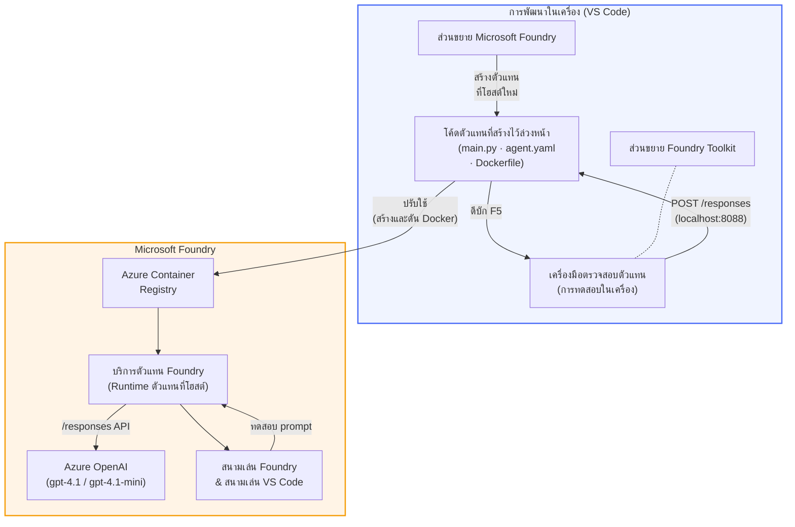

# ชุดเครื่องมือ Foundry + เวิร์กช็อปตัวแทนโฮสต์ของ Foundry

[](https://www.python.org/)
[](https://github.com/microsoft/agents)
[](https://learn.microsoft.com/azure/ai-foundry/agents/concepts/hosted-agents/)
[](https://ai.azure.com/)
[](https://learn.microsoft.com/azure/ai-services/openai/)
[](https://learn.microsoft.com/cli/azure/install-azure-cli)
[](https://learn.microsoft.com/azure/developer/azure-developer-cli/install-azd)
[](https://www.docker.com/)
[](https://marketplace.visualstudio.com/items?itemName=ms-windows-ai-studio.windows-ai-studio)
[](LICENSE)

สร้าง ทดสอบ และปรับใช้ตัวแทน AI ไปยัง **Microsoft Foundry Agent Service** เป็น **Hosted Agents** - ทั้งหมดจาก VS Code โดยใช้ **ส่วนขยาย Microsoft Foundry** และ **Foundry Toolkit**

> **Hosted Agents ยังอยู่ในสถานะพรีวิว ขณะนี้** ภูมิภาคที่รองรับมีจำนวนจำกัด - ดูได้ที่ [ความพร้อมใช้งานตามภูมิภาค](https://learn.microsoft.com/azure/foundry/agents/concepts/hosted-agents#region-availability)

> โฟลเดอร์ `agent/` ภายในแต่ละแลปจะถูก **สร้างขึ้นอัตโนมัติ** โดยส่วนขยาย Foundry - คุณจึงสามารถปรับแต่งโค้ด ทดสอบในเครื่อง และปรับใช้ได้

<!-- CO-OP TRANSLATOR LANGUAGES TABLE START -->
[Arabic](../ar/README.md) | [Bengali](../bn/README.md) | [Bulgarian](../bg/README.md) | [Burmese (Myanmar)](../my/README.md) | [Chinese (Simplified)](../zh-CN/README.md) | [Chinese (Traditional, Hong Kong)](../zh-HK/README.md) | [Chinese (Traditional, Macau)](../zh-MO/README.md) | [Chinese (Traditional, Taiwan)](../zh-TW/README.md) | [Croatian](../hr/README.md) | [Czech](../cs/README.md) | [Danish](../da/README.md) | [Dutch](../nl/README.md) | [Estonian](../et/README.md) | [Finnish](../fi/README.md) | [French](../fr/README.md) | [German](../de/README.md) | [Greek](../el/README.md) | [Hebrew](../he/README.md) | [Hindi](../hi/README.md) | [Hungarian](../hu/README.md) | [Indonesian](../id/README.md) | [Italian](../it/README.md) | [Japanese](../ja/README.md) | [Kannada](../kn/README.md) | [Khmer](../km/README.md) | [Korean](../ko/README.md) | [Lithuanian](../lt/README.md) | [Malay](../ms/README.md) | [Malayalam](../ml/README.md) | [Marathi](../mr/README.md) | [Nepali](../ne/README.md) | [Nigerian Pidgin](../pcm/README.md) | [Norwegian](../no/README.md) | [Persian (Farsi)](../fa/README.md) | [Polish](../pl/README.md) | [Portuguese (Brazil)](../pt-BR/README.md) | [Portuguese (Portugal)](../pt-PT/README.md) | [Punjabi (Gurmukhi)](../pa/README.md) | [Romanian](../ro/README.md) | [Russian](../ru/README.md) | [Serbian (Cyrillic)](../sr/README.md) | [Slovak](../sk/README.md) | [Slovenian](../sl/README.md) | [Spanish](../es/README.md) | [Swahili](../sw/README.md) | [Swedish](../sv/README.md) | [Tagalog (Filipino)](../tl/README.md) | [Tamil](../ta/README.md) | [Telugu](../te/README.md) | [Thai](./README.md) | [Turkish](../tr/README.md) | [Ukrainian](../uk/README.md) | [Urdu](../ur/README.md) | [Vietnamese](../vi/README.md)

> **ต้องการโคลนลงเครื่องไหม?**
>
> ที่เก็บนี้มีการแปลภาษามากกว่า 50 ภาษา ซึ่งเพิ่มขนาดดาวน์โหลดอย่างมาก หากต้องการโคลนโดยไม่รวมการแปล ให้ใช้ sparse checkout:
>
> **Bash / macOS / Linux:**
> ```bash
> git clone --filter=blob:none --sparse https://github.com/microsoft-foundry/Foundry_Toolkit_for_VSCode_Lab.git
> cd Foundry_Toolkit_for_VSCode_Lab
> git sparse-checkout set --no-cone '/*' '!translations' '!translated_images'
> ```
>
> **CMD (Windows):**
> ```cmd
> git clone --filter=blob:none --sparse https://github.com/microsoft-foundry/Foundry_Toolkit_for_VSCode_Lab.git
> cd Foundry_Toolkit_for_VSCode_Lab
> git sparse-checkout set --no-cone "/*" "!translations" "!translated_images"
> ```
>
> นี่จะให้ทุกอย่างที่คุณต้องการเพื่อเรียนจบคอร์สด้วยการดาวน์โหลดที่รวดเร็วกว่าเยอะ
<!-- CO-OP TRANSLATOR LANGUAGES TABLE END -->

---

## สถาปัตยกรรม


**ลำดับขั้นตอน:** ส่วนขยาย Foundry สร้างโครงร่างตัวแทน → คุณปรับแต่งโค้ดและคำสั่ง → ทดสอบในเครื่องด้วย Agent Inspector → ปรับใช้กับ Foundry (Docker image ถูกส่งไปยัง ACR) → ตรวจสอบใน Playground

---

## สิ่งที่คุณจะสร้าง

| แลป | คำอธิบาย | สถานะ |
|-----|-----------|--------|
| **แลป 01 - ตัวแทนเดี่ยว** | สร้าง **"ตัวแทนอธิบายแบบผู้บริหาร"** ทดสอบในเครื่อง และปรับใช้กับ Foundry | ✅ พร้อมใช้งาน |
| **แลป 02 - ระบบทำงานตัวแทนหลายตัว** | สร้าง **"ตัวประเมินเรซูเม่ → ความเหมาะสมงาน"** - ตัวแทน 4 ตัวทำงานร่วมกันเพื่อให้คะแนนความเหมาะสมเรซูเม่และสร้างแผนที่เรียนรู้ | ✅ พร้อมใช้งาน |

---

## พบกับตัวแทนผู้บริหาร

ในเวิร์กช็อปนี้คุณจะสร้าง **"ตัวแทนอธิบายแบบผู้บริหาร"** — ตัวแทน AI ที่นำคำศัพท์เทคนิคที่ซับซ้อนมาแปลงเป็นสรุปที่เข้าใจง่าย พร้อมสำหรับการนำเสนอในห้องประชุม เพราะถ้าพูดตรง ๆ ไม่มีใครในระดับผู้บริหารอยากฟังเรื่อง "thread pool exhaustion ที่เกิดจาก synchronous calls ที่เพิ่มเข้ามาใน v3.2"

ฉันสร้างตัวแทนนี้หลังจากเกิดเหตุการณ์หลายครั้งที่โพสต์มอร์เต็มของฉันที่ร่างไว้ดีมากกลับได้รับคำตอบว่า: *"งั้น... เว็บไซต์ล่มไหม?"*

### วิธีการทำงาน

คุณป้อนข้อมูลอัพเดตทางเทคนิคเข้าไป ตัวแทนจะตอบกลับด้วยสรุปสำหรับผู้บริหาร — 3 ข้อความย่อย ไม่มีศัพท์เทคนิค ไม่มี stack trace ไม่มีความกังวลแบบสุดขีด มีแค่ **สิ่งที่เกิดขึ้น**, **ผลกระทบทางธุรกิจ** และ **ขั้นตอนถัดไป**

### ดูตัวอย่างการทำงาน

**คุณพูดว่า:**
> "ระยะเวลาตอบสนองของ API เพิ่มขึ้นเนื่องจาก thread pool exhaustion ที่เกิดจาก synchronous calls ที่เพิ่มเข้ามาใน v3.2"

**ตัวแทนตอบกลับ:**

> **สรุปสำหรับผู้บริหาร:**
> - **สิ่งที่เกิดขึ้น:** หลังจากอัปเดตล่าสุด ระบบทำงานช้าลง
> - **ผลกระทบทางธุรกิจ:** ผู้ใช้บางคนประสบกับความล่าช้าในการใช้บริการ
> - **ขั้นตอนถัดไป:** ยกเลิกการเปลี่ยนแปลงแล้วกำลังเตรียมการแก้ไขก่อนทำการปรับใช้ใหม่

### ทำไมต้องใช้ตัวแทนนี้?

เป็นตัวแทนที่ง่ายมาก ทำหน้าที่เดียว — เหมาะอย่างยิ่งสำหรับเรียนรู้กระบวนการทำงานของตัวแทนโฮสต์ตั้งแต่ต้นจนจบโดยไม่ซับซ้อน และพูดตรง ๆ ทุกทีมวิศวกรควรมีตัวนี้ไว้ใช้งาน

---

## โครงสร้างเวิร์กช็อป

```
📂 Foundry_Toolkit_for_VSCode_Lab/
├── 📄 README.md                      ← You are here
├── 📂 ExecutiveAgent/                ← Standalone hosted agent project
│   ├── agent.yaml
│   ├── Dockerfile
│   ├── main.py
│   └── requirements.txt
└── 📂 workshop/
    ├── 📂 lab01-single-agent/        ← Full lab: docs + agent code
    │   ├── README.md                 ← Hands-on lab instructions
    │   ├── 📂 docs/                  ← Step-by-step tutorial modules
    │   │   ├── 00-prerequisites.md
    │   │   ├── 01-install-foundry-toolkit.md
    │   │   ├── 02-create-foundry-project.md
    │   │   ├── 03-create-hosted-agent.md
    │   │   ├── 04-configure-and-code.md
    │   │   ├── 05-test-locally.md
    │   │   ├── 06-deploy-to-foundry.md
    │   │   ├── 07-verify-in-playground.md
    │   │   └── 08-troubleshooting.md
    │   └── 📂 agent/                 ← Reference solution (auto-scaffolded by Foundry extension)
    │       ├── agent.yaml
    │       ├── Dockerfile
    │       ├── main.py
    │       └── requirements.txt
    └── 📂 lab02-multi-agent/         ← Resume → Job Fit Evaluator
        ├── README.md                 ← Hands-on lab instructions (end-to-end)
        ├── 📂 docs/                  ← Step-by-step tutorial modules
        │   ├── 00-prerequisites.md
        │   ├── 01-understand-multi-agent.md
        │   ├── 02-scaffold-multi-agent.md
        │   ├── 03-configure-agents.md
        │   ├── 04-orchestration-patterns.md
        │   ├── 05-test-locally.md
        │   ├── 06-deploy-to-foundry.md
        │   ├── 07-verify-in-playground.md
        │   └── 08-troubleshooting.md
        └── 📂 PersonalCareerCopilot/ ← Reference solution (multi-agent workflow)
            ├── agent.yaml
            ├── Dockerfile
            ├── main.py
            └── requirements.txt
```

> **หมายเหตุ:** โฟลเดอร์ `agent/` ภายในแต่ละแลปคือสิ่งที่ **ส่วนขยาย Microsoft Foundry** สร้างขึ้นเมื่อคุณเรียกใช้คำสั่ง `Microsoft Foundry: Create a New Hosted Agent` จาก Command Palette ไฟล์จะถูกปรับแต่งด้วยคำสั่ง เครื่องมือต่าง ๆ และการตั้งค่าของตัวแทนคุณ แลป 01 จะพาคุณผ่านขั้นตอนการสร้างใหม่ตั้งแต่เริ่มต้น

---

## การเริ่มต้น

### 1. โคลนที่เก็บโค้ดนี้

```bash
git clone https://github.com/microsoft-foundry/Foundry_Toolkit_for_VSCode_Lab.git
cd Foundry_Toolkit_for_VSCode_Lab
```

### 2. ตั้งค่าสภาพแวดล้อมเสมือน Python

```bash
python -m venv venv
```

เปิดใช้งาน:

- **Windows (PowerShell):**
  ```powershell
  .\venv\Scripts\Activate.ps1
  ```
- **macOS / Linux:**
  ```bash
  source venv/bin/activate
  ```

### 3. ติดตั้งไลบรารีที่จำเป็น

```bash
pip install -r workshop/lab01-single-agent/agent/requirements.txt
```

### 4. กำหนดค่าตัวแปรสภาพแวดล้อม

คัดลอกไฟล์ `.env` ตัวอย่างในโฟลเดอร์ agent และกรอกค่าของคุณ:

```bash
cp workshop/lab01-single-agent/agent/.env.example workshop/lab01-single-agent/agent/.env
```

แก้ไขไฟล์ `workshop/lab01-single-agent/agent/.env`:

```env
AZURE_AI_PROJECT_ENDPOINT=https://<your-account>.services.ai.azure.com/api/projects/<your-project>
MODEL_DEPLOYMENT_NAME=<your-model-deployment-name>
```

### 5. ทำตามแลปเวิร์กช็อป

แต่ละแลปมีโมดูลของตัวเอง เริ่มที่ **แลป 01** เพื่อเรียนรู้พื้นฐาน จากนั้นไปที่ **แลป 02** สำหรับระบบตัวแทนหลายตัว

#### แลป 01 - ตัวแทนเดี่ยว ([คำแนะนำเต็ม](workshop/lab01-single-agent/README.md))

| # | โมดูล | ลิงก์ |
|---|--------|------|
| 1 | อ่านข้อกำหนดเบื้องต้น | [00-prerequisites.md](workshop/lab01-single-agent/docs/00-prerequisites.md) |
| 2 | ติดตั้ง Foundry Toolkit & ส่วนขยาย Foundry | [01-install-foundry-toolkit.md](workshop/lab01-single-agent/docs/01-install-foundry-toolkit.md) |
| 3 | สร้างโครงการ Foundry | [02-create-foundry-project.md](workshop/lab01-single-agent/docs/02-create-foundry-project.md) |
| 4 | สร้างตัวแทนโฮสต์ | [03-create-hosted-agent.md](workshop/lab01-single-agent/docs/03-create-hosted-agent.md) |
| 5 | กำหนดคำสั่งและสภาพแวดล้อม | [04-configure-and-code.md](workshop/lab01-single-agent/docs/04-configure-and-code.md) |
| 6 | ทดสอบในเครื่อง | [05-test-locally.md](workshop/lab01-single-agent/docs/05-test-locally.md) |
| 7 | ปรับใช้กับ Foundry | [06-deploy-to-foundry.md](workshop/lab01-single-agent/docs/06-deploy-to-foundry.md) |
| 8 | ตรวจสอบใน playground | [07-verify-in-playground.md](workshop/lab01-single-agent/docs/07-verify-in-playground.md) |
| 9 | แก้ปัญหา | [08-troubleshooting.md](workshop/lab01-single-agent/docs/08-troubleshooting.md) |

#### แลป 02 - ระบบทำงานตัวแทนหลายตัว ([คำแนะนำเต็ม](workshop/lab02-multi-agent/README.md))

| # | โมดูล | ลิงก์ |
|---|--------|------|
| 1 | ข้อกำหนดเบื้องต้น (แลป 02) | [00-prerequisites.md](workshop/lab02-multi-agent/docs/00-prerequisites.md) |
| 2 | เข้าใจสถาปัตยกรรมตัวแทนหลายตัว | [01-understand-multi-agent.md](workshop/lab02-multi-agent/docs/01-understand-multi-agent.md) |
| 3 | สร้างโครงร่างโครงการตัวแทนหลายตัว | [02-scaffold-multi-agent.md](workshop/lab02-multi-agent/docs/02-scaffold-multi-agent.md) |
| 4 | กำหนดค่าตัวแทนและสภาพแวดล้อม | [03-configure-agents.md](workshop/lab02-multi-agent/docs/03-configure-agents.md) |
| 5 | แบบแผนการจัดการตัวแทน | [04-orchestration-patterns.md](workshop/lab02-multi-agent/docs/04-orchestration-patterns.md) |
| 6 | ทดสอบในเครื่อง (ตัวแทนหลายตัว) | [05-test-locally.md](workshop/lab02-multi-agent/docs/05-test-locally.md) |
| 7 | การปรับใช้ไปยัง Foundry | [06-deploy-to-foundry.md](workshop/lab02-multi-agent/docs/06-deploy-to-foundry.md) |
| 8 | ตรวจสอบในสนามเด็กเล่น | [07-verify-in-playground.md](workshop/lab02-multi-agent/docs/07-verify-in-playground.md) |
| 9 | การแก้ปัญหา (multi-agent) | [08-troubleshooting.md](workshop/lab02-multi-agent/docs/08-troubleshooting.md) |

---

## ผู้ดูแลรักษา

<table>
<tr>
    <td align="center"><a href="https://github.com/ShivamGoyal03">
        <br />
        <sub><b>Shivam Goyal</b></sub>
    </a><br />
    </td>
</tr>
</table>

---

## สิทธิ์ที่จำเป็น (อ้างอิงอย่างรวดเร็ว)

| กรณี | บทบาทที่จำเป็น |
|----------|---------------|
| สร้างโปรเจกต์ Foundry ใหม่ | **เจ้าของ Azure AI** บนทรัพยากร Foundry |
| ปรับใช้กับโปรเจกต์ที่มีอยู่ (ทรัพยากรใหม่) | **เจ้าของ Azure AI** + **ผู้ร่วมมือ** บนการสมัครสมาชิก |
| ปรับใช้กับโปรเจกต์ที่กำหนดค่าเต็มรูปแบบ | **ผู้อ่าน** บัญชี + **ผู้ใช้ Azure AI** บนโปรเจกต์ |

> **สำคัญ:** บทบาท Azure `เจ้าของ` และ `ผู้ร่วมมือ` รวมถึงสิทธิ์ *การจัดการ* เท่านั้น ไม่รวมสิทธิ์ *การพัฒนา* (การดำเนินการข้อมูล) คุณจำเป็นต้องมี **ผู้ใช้ Azure AI** หรือ **เจ้าของ Azure AI** เพื่อสร้างและปรับใช้เอเจนต์

---

## เอกสารอ้างอิง

- [เริ่มต้นอย่างรวดเร็ว: ปรับใช้เอเจนต์โฮสต์ตัวแรกของคุณ (VS Code)](https://learn.microsoft.com/azure/foundry/agents/quickstarts/quickstart-hosted-agent)
- [เอเจนต์โฮสต์คืออะไร?](https://learn.microsoft.com/azure/foundry/agents/concepts/hosted-agents)
- [สร้างเวิร์กโฟลว์เอเจนต์โฮสต์ใน VS Code](https://learn.microsoft.com/azure/foundry/agents/how-to/vs-code-agents-workflow-pro-code)
- [ปรับใช้เอเจนต์โฮสต์](https://learn.microsoft.com/azure/foundry/agents/how-to/deploy-hosted-agent)
- [RBAC สำหรับ Microsoft Foundry](https://learn.microsoft.com/azure/foundry/concepts/rbac-foundry)
- [ตัวอย่างเอเจนต์ตรวจสอบสถาปัตยกรรม](https://github.com/Azure-Samples/agent-architecture-review-sample) - เอเจนต์โฮสต์ในโลกจริงที่ใช้เครื่องมือ MCP, แผนภาพ Excalidraw และการปรับใช้งานแบบคู่

---

## ใบอนุญาต

[MIT](../../LICENSE)

---

<!-- CO-OP TRANSLATOR DISCLAIMER START -->
**ข้อจำกัดความรับผิดชอบ**:  
เอกสารนี้ได้รับการแปลโดยใช้บริการแปลภาษาด้วย AI [Co-op Translator](https://github.com/Azure/co-op-translator) แม้เราจะพยายามให้มีความถูกต้อง โปรดทราบว่าการแปลโดยอัตโนมัติอาจมีข้อผิดพลาดหรือความคลาดเคลื่อน เอกสารต้นฉบับในภาษาต้นทางถือเป็นแหล่งข้อมูลที่เชื่อถือได้ ในกรณีข้อมูลที่สำคัญ ขอแนะนำให้ใช้การแปลโดยมนุษย์ที่มีความเชี่ยวชาญ เราไม่มีความรับผิดชอบต่อความเข้าใจผิดหรือการตีความผิดใด ๆ ที่เกิดจากการใช้การแปลนี้
<!-- CO-OP TRANSLATOR DISCLAIMER END -->