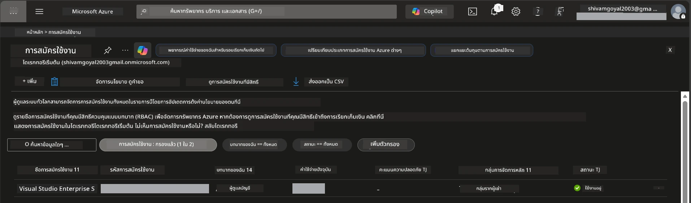

# Module 0 - สิ่งที่ต้องเตรียมก่อน

ก่อนเริ่มเวิร์กชอป ให้ยืนยันว่าคุณมีเครื่องมือ การเข้าถึง และสภาพแวดล้อมด้านล่างนี้พร้อมแล้ว ทำตามทุกขั้นตอนด้านล่าง - อย่าข้ามขั้นตอนใดๆ

---

## 1. บัญชีและการสมัครใช้งาน Azure

### 1.1 สร้างหรือยืนยันการสมัครใช้งาน Azure ของคุณ

1. เปิดเบราว์เซอร์และไปที่ [https://azure.microsoft.com/free/](https://azure.microsoft.com/free/).
2. หากคุณยังไม่มีบัญชี Azure ให้คลิก **Start free** และทำตามขั้นตอนการสมัคร คุณจะต้องมีบัญชี Microsoft (หากยังไม่มีให้สร้างใหม่) และบัตรเครดิตสำหรับยืนยันตัวตน
3. หากคุณมีบัญชีแล้ว ให้เข้าสู่ระบบที่ [https://portal.azure.com](https://portal.azure.com)
4. ใน Portal ให้คลิกที่แถบ **Subscriptions** ในเมนูทางซ้าย (หรือค้นหา "Subscriptions" ที่แถบค้นหาด้านบน)
5. ตรวจสอบว่าคุณเห็นการสมัครใช้งานที่สถานะอย่างน้อยหนึ่งรายการเป็น **Active** จดจำ **Subscription ID** ไว้ - คุณจะต้องใช้ในภายหลัง



### 1.2 เข้าใจบทบาท RBAC ที่จำเป็น

การปรับใช้ [Hosted Agent](https://learn.microsoft.com/azure/foundry/agents/concepts/hosted-agents) ต้องการสิทธิ์ **data action** ซึ่งบทบาท Azure `Owner` และ `Contributor` ปกติไม่รวมไว้ คุณจะต้องมีหนึ่งในชุดบทบาทเหล่านี้ [role combinations](https://learn.microsoft.com/azure/foundry/concepts/rbac-foundry#built-in-roles):

| สถานการณ์ | บทบาทที่ต้องการ | สถานที่กำหนดบทบาท |
|----------|---------------|----------------------|
| สร้างโปรเจกต์ Foundry ใหม่ | **Azure AI Owner** บนทรัพยากร Foundry | ทรัพยากร Foundry ใน Azure Portal |
| ปรับใช้ในโปรเจกต์ที่มีอยู่ (ทรัพยากรใหม่) | **Azure AI Owner** + **Contributor** บนการสมัครใช้งาน | การสมัครใช้งาน + ทรัพยากร Foundry |
| ปรับใช้ในโปรเจกต์ที่ตั้งค่าครบถ้วน | **Reader** บนบัญชี + **Azure AI User** บนโปรเจกต์ | บัญชี + โปรเจกต์ใน Azure Portal |

> **จุดสำคัญ:** บทบาท Azure `Owner` และ `Contributor` ครอบคลุมเฉพาะสิทธิ์ *การจัดการ* (การดำเนินการ ARM) เท่านั้น คุณต้องการ [**Azure AI User**](https://learn.microsoft.com/azure/foundry/concepts/rbac-foundry#built-in-roles) (หรือสูงกว่า) สำหรับ *data actions* เช่น `agents/write` ซึ่งจำเป็นสำหรับการสร้างและปรับใช้เอเจนต์ คุณจะกำหนดบทบาทเหล่านี้ใน [Module 2](02-create-foundry-project.md)

---

## 2. ติดตั้งเครื่องมือภายในเครื่อง

ติดตั้งเครื่องมือแต่ละชิ้นด้านล่าง หลังติดตั้งแล้ว ให้ตรวจสอบว่าใช้ได้โดยรันคำสั่งตรวจสอบ

### 2.1 Visual Studio Code

1. ไปที่ [https://code.visualstudio.com/](https://code.visualstudio.com/)
2. ดาวน์โหลดโปรแกรมติดตั้งสำหรับระบบปฏิบัติการของคุณ (Windows/macOS/Linux)
3. รันโปรแกรมติดตั้งโดยใช้การตั้งค่าเริ่มต้น
4. เปิด VS Code เพื่อยืนยันว่ารันได้

### 2.2 Python 3.10+

1. ไปที่ [https://www.python.org/downloads/](https://www.python.org/downloads/)
2. ดาวน์โหลด Python 3.10 หรือเวอร์ชันที่ใหม่กว่า (แนะนำ 3.12+)
3. **Windows:** ระหว่างการติดตั้ง ให้ติ๊กเลือก **"Add Python to PATH"** ในหน้าจอแรก
4. เปิดเทอร์มินัลและตรวจสอบ:

   ```powershell
   python --version
   ```

   ผลลัพธ์ที่คาดหวัง: `Python 3.10.x` หรือสูงกว่า

### 2.3 Azure CLI

1. ไปที่ [https://learn.microsoft.com/cli/azure/install-azure-cli](https://learn.microsoft.com/cli/azure/install-azure-cli)
2. ทำตามคำแนะนำการติดตั้งสำหรับระบบปฏิบัติการของคุณ
3. ตรวจสอบ:

   ```powershell
   az --version
   ```

   คาดหวัง: `azure-cli 2.80.0` หรือสูงกว่า

4. เข้าสู่ระบบ:

   ```powershell
   az login
   ```

### 2.4 Azure Developer CLI (azd)

1. ไปที่ [https://learn.microsoft.com/azure/developer/azure-developer-cli/install-azd](https://learn.microsoft.com/azure/developer/azure-developer-cli/install-azd)
2. ทำตามคำแนะนำการติดตั้งสำหรับระบบปฏิบัติการของคุณ บน Windows:

   ```powershell
   winget install microsoft.azd
   ```

3. ตรวจสอบ:

   ```powershell
   azd version
   ```

   คาดหวัง: `azd version 1.x.x` หรือสูงกว่า

4. เข้าสู่ระบบ:

   ```powershell
   azd auth login
   ```

### 2.5 Docker Desktop (ไม่บังคับ)

Docker จำเป็นเฉพาะถ้าคุณต้องการสร้างและทดสอบอิมเมจคอนเทนเนอร์ในเครื่องก่อนปรับใช้ ส่วนขยาย Foundry จะจัดการการสร้างคอนเทนเนอร์ในระหว่างการปรับใช้อัตโนมัติ

1. ไปที่ [https://docs.docker.com/get-docker/](https://docs.docker.com/get-docker/)
2. ดาวน์โหลดและติดตั้ง Docker Desktop สำหรับระบบปฏิบัติการของคุณ
3. **Windows:** ตรวจสอบให้แน่ใจว่าเลือก WSL 2 backend ระหว่างการติดตั้ง
4. เริ่มต้น Docker Desktop และรอจนไอคอนในระบบแสดง **"Docker Desktop is running"**
5. เปิดเทอร์มินัลและตรวจสอบ:

   ```powershell
   docker info
   ```

   ควรแสดงข้อมูลระบบ Docker ไม่มีข้อผิดพลาด หากเห็น `Cannot connect to the Docker daemon` ให้รออีกไม่กี่วินาทีเพื่อให้ Docker เริ่มต้นสมบูรณ์

---

## 3. ติดตั้งส่วนขยาย VS Code

คุณต้องติดตั้งส่วนขยายสามตัว ติดตั้งก่อนเวิร์กชอปเริ่ม

### 3.1 Microsoft Foundry สำหรับ VS Code

1. เปิด VS Code
2. กด `Ctrl+Shift+X` เพื่อเปิดแผง Extensions
3. ในช่องค้นหา พิมพ์ **"Microsoft Foundry"**
4. หา **Microsoft Foundry for Visual Studio Code** (ผู้เผยแพร่: Microsoft, ID: `TeamsDevApp.vscode-ai-foundry`)
5. คลิก **Install**
6. หลังติดตั้ง คุณจะเห็นไอคอน **Microsoft Foundry** ปรากฏในแถบ Activity Bar (แถบด้านข้างซ้าย)

### 3.2 Foundry Toolkit

1. ในแผง Extensions (`Ctrl+Shift+X`) ค้นหา **"Foundry Toolkit"**
2. หา **Foundry Toolkit** (ผู้เผยแพร่: Microsoft, ID: `ms-windows-ai-studio.windows-ai-studio`)
3. คลิก **Install**
4. ไอคอน **Foundry Toolkit** ควรปรากฏในแถบ Activity Bar

### 3.3 Python

1. ในแผง Extensions ค้นหา **"Python"**
2. หา **Python** (ผู้เผยแพร่: Microsoft, ID: `ms-python.python`)
3. คลิก **Install**

---

## 4. ลงชื่อเข้าใช้ Azure จาก VS Code

[Microsoft Agent Framework](https://learn.microsoft.com/agent-framework/overview/) ใช้ [`DefaultAzureCredential`](https://learn.microsoft.com/azure/developer/python/sdk/authentication/credential-chains#defaultazurecredential-overview) สำหรับการยืนยันตัวตน คุณต้องลงชื่อเข้าใช้ Azure ใน VS Code

### 4.1 ลงชื่อเข้าใช้ผ่าน VS Code

1. ดูมุมล่างซ้ายของ VS Code แล้วคลิกไอคอน **Accounts** (รูปร่างคน)
2. คลิก **Sign in to use Microsoft Foundry** (หรือ **Sign in with Azure**)
3. จะเปิดหน้าเบราว์เซอร์ - ลงชื่อเข้าใช้ด้วยบัญชี Azure ที่มีสิทธิ์เข้าถึงการสมัครใช้งานของคุณ
4. กลับมาที่ VS Code คุณจะเห็นชื่อบัญชีที่มุมล่างซ้าย

### 4.2 (ทางเลือก) ลงชื่อเข้าใช้ผ่าน Azure CLI

ถ้าคุณติดตั้ง Azure CLI และชอบใช้การยืนยันตัวตนผ่าน CLI:

```powershell
az login
```

จะเปิดเบราว์เซอร์เพื่อลงชื่อเข้าใช้ หลังจากลงชื่อเข้าใช้ ให้ตั้งค่าการสมัครใช้งานที่ถูกต้อง:

```powershell
az account set --subscription "<your-subscription-id>"
```

ตรวจสอบ:

```powershell
az account show --query "{name:name, id:id, state:state}" --output table
```

คุณควรเห็นชื่อการสมัครใช้งาน ID และสถานะ = `Enabled`

### 4.3 (ทางเลือก) การยืนยันตัวตนแบบ Service principal

สำหรับ CI/CD หรือสภาพแวดล้อมที่แชร์ ให้ตั้งค่าส่วนแปรสภาพแวดล้อมนี้แทน:

```powershell
$env:AZURE_TENANT_ID = "<your-tenant-id>"
$env:AZURE_CLIENT_ID = "<your-client-id>"
$env:AZURE_CLIENT_SECRET = "<your-client-secret>"
```

---

## 5. ข้อจำกัดในเวอร์ชันตัวอย่าง

ก่อนดำเนินการต่อ กรุณาทราบข้อจำกัดปัจจุบัน:

- [**Hosted Agents**](https://learn.microsoft.com/azure/foundry/agents/concepts/hosted-agents) อยู่ในสถานะ **public preview** - ไม่แนะนำสำหรับงานผลิต
- **พื้นที่ให้บริการจำกัด** - ตรวจสอบ [region availability](https://learn.microsoft.com/azure/foundry/agents/concepts/hosted-agents#region-availability) ก่อนสร้างทรัพยากร หากเลือกพื้นที่ที่ไม่รองรับ การปรับใช้จะล้มเหลว
- แพ็กเกจ `azure-ai-agentserver-agentframework` อยู่ในสถานะ pre-release (`1.0.0b16`) - API อาจมีการเปลี่ยนแปลง
- ข้อจำกัดการปรับขนาด: hosted agents รองรับ 0-5 ตัวทำงาน (รวมถึง scale-to-zero)

---

## 6. รายการตรวจสอบก่อนเริ่ม

ทำตามรายการตรวจสอบด้านล่าง หากขั้นตอนไหนล้มเหลว ให้ย้อนกลับไปแก้ไขก่อนดำเนินการต่อ

- [ ] เปิด VS Code โดยไม่มีข้อผิดพลาด
- [ ] Python 3.10+ อยู่ใน PATH (`python --version` แสดง `3.10.x` หรือสูงกว่า)
- [ ] ติดตั้ง Azure CLI แล้ว (`az --version` แสดง `2.80.0` หรือสูงกว่า)
- [ ] ติดตั้ง Azure Developer CLI แล้ว (`azd version` แสดงข้อมูลเวอร์ชัน)
- [ ] ติดตั้งส่วนขยาย Microsoft Foundry แล้ว (ไอคอนเห็นใน Activity Bar)
- [ ] ติดตั้งส่วนขยาย Foundry Toolkit แล้ว (ไอคอนเห็นใน Activity Bar)
- [ ] ติดตั้งส่วนขยาย Python แล้ว
- [ ] ลงชื่อเข้าใช้ Azure ใน VS Code แล้ว (เช็คไอคอน Accounts ที่มุมล่างซ้าย)
- [ ] `az account show` แสดงการสมัครใช้งานของคุณ
- [ ] (ไม่บังคับ) Docker Desktop รันอยู่ (`docker info` แสดงข้อมูลระบบไม่มีข้อผิดพลาด)

### จุดเช็คพอยต์

เปิดแถบ Activity Bar ของ VS Code และยืนยันว่าคุณเห็นมุมมองแถบด้านข้างของ **Foundry Toolkit** และ **Microsoft Foundry** คลิกแต่ละอันเพื่อตรวจสอบว่าโหลดโดยไม่มีข้อผิดพลาด

---

**ถัดไป:** [01 - ติดตั้ง Foundry Toolkit & Foundry Extension →](01-install-foundry-toolkit.md)

---

<!-- CO-OP TRANSLATOR DISCLAIMER START -->
**ข้อจำกัดความรับผิดชอบ**:  
เอกสารนี้ได้ถูกแปลโดยใช้บริการแปลภาษา AI [Co-op Translator](https://github.com/Azure/co-op-translator) ในขณะที่เรามุ่งมั่นเพื่อความถูกต้อง โปรดทราบว่าการแปลโดยอัตโนมัติอาจมีข้อผิดพลาดหรือความไม่แม่นยำ เอกสารต้นฉบับในภาษาต้นทางควรถูกพิจารณาเป็นแหล่งข้อมูลที่เชื่อถือได้ สำหรับข้อมูลที่สำคัญ ขอแนะนำให้ใช้บริการแปลโดยมนุษย์มืออาชีพ เราจะไม่รับผิดชอบต่อความเข้าใจผิดหรือการตีความที่ผิดพลาดใด ๆ ที่เกิดจากการใช้การแปลนี้
<!-- CO-OP TRANSLATOR DISCLAIMER END -->