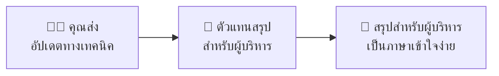

# Module 0 - บทนำ

⏱️ ~10 นาที

> [!WARNING]
> **ตัวอย่าง & ข้อจำกัด:** [Hosted Agents](https://learn.microsoft.com/azure/foundry/agents/concepts/hosted-agents) กำลังอยู่ในสถานะ **public preview** - ไม่แนะนำสำหรับงานผลิต กรุณาทราบสิ่งต่อไปนี้:
> - **พื้นที่ให้บริการมีจำกัด** - ตรวจสอบ [region availability](https://learn.microsoft.com/azure/foundry/agents/concepts/hosted-agents#region-availability) ก่อนสร้างทรัพยากร หากเลือกพื้นที่ที่ไม่รองรับ การติดตั้งจะล้มเหลว
> - แพ็กเกจ `azure-ai-agentserver-agentframework` ยังเป็นเวอร์ชันก่อนวางจำหน่าย - API อาจเปลี่ยนแปลงระหว่างเวอร์ชัน
> - ขีดจำกัดการสเกล: hosted agents รองรับ 0–5 ตัวทำซ้ำ (รวมถึง scale-to-zero)
> - คุณสมบัติบางอย่างที่แสดงในเวิร์กช็อปนี้อาจเปลี่ยนแปลงเมื่อบริการเข้าสู่ GA

## สิ่งที่คุณจะสร้าง

ในเวิร์กช็อปนี้ คุณจะสร้างเอเจนต์ **"อธิบายเหมือนว่าผมเป็นผู้บริหาร"** - เอเจนต์ AI แบบโฮสต์ที่นำข้อมูลทางเทคนิคซับซ้อนมาเขียนใหม่ให้ง่ายและสั้นแบบสรุปสำหรับผู้บริหาร

```mermaid
flowchart LR
    A["🧑‍💻 คุณส่ง\nอัปเดตทางเทคนิค"] --> B["🤖 ตัวแทนสรุป\nสำหรับผู้บริหาร"]
    B --> C["📝 สรุปสำหรับผู้บริหาร\nเป็นภาษาเข้าใจง่าย"]
```

**เอเจนต์ใช้:**
- **Microsoft Agent Framework** - สำหรับตรรกะและโครงสร้างของเอเจนต์
- **Foundry Toolkit for VS Code** - สำหรับสร้างต้นแบบ, ทดสอบในเครื่อง, และการปรับใช้
- **โมเดล AI** (เช่น `gpt-4.1-mini/gpt-5-mini`) - สำหรับสร้างสรุป

เมื่อจบแลปนี้ คุณจะมีเอเจนต์ที่ทำงานได้จริงซึ่งคุณสามารถทดสอบในเครื่องผ่าน Agent Inspector และเลือกปรับใช้ในคลาวด์ได้

---

## Hosted agents คืออะไร?

**hosted agent** คือเอเจนต์ AI ที่ทำงานในรูปแบบบริการแบบจัดการบน Microsoft Foundry แทนที่จะต้องดูแลโครงสร้างพื้นฐานเอง คุณจะบรรจุโค้ดเอเจนต์ในคอนเทนเนอร์ และ Foundry จะจัดการเรื่องการสเกล, โฮสต์, และการเปิดเผยผ่าน endpoint HTTP ที่มาตรฐาน

| แนวคิด | ความหมาย |
|---------|--------------|
| **Agent** | โค้ด Python ของคุณที่รับข้อความผู้ใช้, เรียกใช้งานโมเดล AI, และส่งคืนคำตอบที่มีโครงสร้าง |
| **Hosted** | Foundry รันคอนเทนเนอร์ของคุณแทน - ไม่มี VM, Kubernetes หรือโครงสร้างพื้นฐานให้จัดการ |
| **โปรโตคอลการตอบกลับ** | API HTTP มาตรฐาน (`POST /responses`) ที่ไคลเอนต์ใดๆ สามารถเรียกใช้เพื่อโต้ตอบกับเอเจนต์ของคุณ |
| **Agent Inspector** | UI ทดสอบในเครื่อง (ฝังใน Foundry Toolkit) ที่ให้คุณคุยกับเอเจนต์ก่อนปรับใช้ |

ในเวิร์กช็อปนี้ คุณจะสร้างเอเจนต์ที่โฮสต์ได้ตั้งแต่เริ่มต้น หรือหยุดที่การทดสอบในเครื่องถ้าคุณต้องการ

---

## เลือกเส้นทางของคุณ

> ⚠️ **เลือกเส้นทางก่อนดำเนินการต่อ** ตัวเลือกของคุณจะกำหนดเครื่องมือที่จะติดตั้งและโมดูลที่จะใช้ได้ คุณสามารถสลับจากเส้นทาง B → เส้นทาง A ได้หากคุณมี subscription

<strong>🅰️ เส้นทาง A - คลาวด์ Azure (ต้องมี Azure subscription)</strong>

| | รายละเอียด |
|---|---|
| **เหมาะกับใคร?** | คุณมี Azure subscription ที่ใช้งานได้และสร้าง Foundry resources ได้ |
| **โมเดล** | Azure OpenAI ผ่าน Foundry (เช่น `gpt-4.1-mini/gpt-5-mini`) |
| **โมดูลที่ครอบคลุม** | ทุกโมดูล (00–07) |
| **ปรับใช้สู่คลาวด์?** | ✅ ใช่ - การปรับใช้แบบครบวงจร |

<strong>🅱️ เส้นทาง B - เครื่องในท้องถิ่น / ฟรีเทียร์ (ไม่ต้องมี Azure subscription)</strong>

| | รายละเอียด |
|---|---|
| **เหมาะกับใคร?** | MVP, นักศึกษา หรือใครก็ตามที่ไม่มีการเข้าถึง Azure |
| **โมเดล** | **Foundry Local** (ฟรี, รันบนเครื่องของคุณ) |
| **โมดูลที่ครอบคลุม** | โมดูล 00–04 (ข้ามการปรับใช้และยืนยันคลาวด์) |
| **ปรับใช้สู่คลาวด์?** | ❌ ไม่ - ทดสอบเฉพาะในเครื่องผ่าน Agent Inspector |

---

## ทุกเส้นทาง: เครื่องมือที่จำเป็น

ติดตั้งเครื่องมือแต่ละอย่างด้านล่างนี้ หลังติดตั้งแล้ว ให้ตรวจสอบว่าทำงานได้โดยการรันคำสั่งตรวจสอบ

| # | เครื่องมือ | เวอร์ชัน | ติดตั้ง | ตรวจสอบ (ผลลัพธ์ที่คาดหวัง) |
|---|------|---------|---------|---------------------------|
| 1 | **Visual Studio Code** | ล่าสุด | [code.visualstudio.com](https://code.visualstudio.com/) | เปิดได้โดยไม่มีข้อผิดพลาด |
| 2 | **Python** | 3.12 ขึ้นไป | [python.org/downloads](https://www.python.org/downloads/) | `python --version` $\rightarrow$ `Python 3.12.x` |
| 3 | **Foundry Toolkit for VS Code** | ล่าสุด | Extension ID: `ms-windows-ai-studio.windows-ai-studio` | ไอคอน Foundry ใน Activity Bar |
| 4 | **ส่วนขยาย Python สำหรับ VS Code** | ล่าสุด | Extension ID: `ms-python.python` | ติดตั้งในแผง Extensions |

> [!TIP]
> **คำแนะนำสำหรับการติดตั้ง:**
> - **Python PATH (Windows):** ตรวจสอบให้แน่ใจว่าเลือก **"Add Python to PATH"** ที่หน้าจอแรกของโปรแกรมติดตั้ง Python หากไม่เลือก `python` จะไม่รู้จักในเทอร์มินัลของคุณ
> - **มี Python หลายเวอร์ชัน:** ถ้าคุณติดตั้ง Python 3.10 และ 3.12 ไว้ทั้งคู่ ให้ใช้ `python3.12 -m venv .venv` เพื่อสร้าง virtual environment ด้วยเวอร์ชันที่ถูกต้อง
> - **Docker WSL 2 (Windows):** ระหว่างติดตั้ง Docker Desktop ให้แน่ใจว่าเลือก **WSL 2 backend** Docker ที่ใช้ Hyper-V จะช้ากว่าและอาจทำให้เกิดปัญหาการ build คอนเทนเนอร์ Foundry
> - **Docker ไม่เริ่มใช้งาน?** รอ 30–60 วินาทีหลังเปิด Docker Desktop รัน `docker info` หากเห็น "Cannot connect to the Docker daemon" แปลว่า Docker กำลังเริ่มต้น
> - **ส่วนขยาย VS Code ไม่โหลด?** หลังติดตั้งส่วนขยาย ให้รีโหลดหน้าต่าง: `Ctrl+Shift+P` → `Developer: Reload Window`

> **ผู้ใช้ Windows:** ตรวจสอบให้แน่ใจว่าเลือก **"Add Python to PATH"** ระหว่างติดตั้ง Python

**ถัดไป:** [01 - การตั้งค่า →](01-setup.md)

---

<!-- CO-OP TRANSLATOR DISCLAIMER START -->
**ปฏิเสธความรับผิดชอบ**:
เอกสารนี้ได้รับการแปลโดยใช้บริการแปลภาษา AI [Co-op Translator](https://github.com/Azure/co-op-translator) ขณะที่เราพยายามให้ความถูกต้อง โปรดทราบว่าการแปลโดยอัตโนมัติอาจมีข้อผิดพลาดหรือความไม่ถูกต้อง เอกสารต้นฉบับในภาษาต้นทางควรถูกพิจารณาเป็นแหล่งข้อมูลที่เชื่อถือได้ สำหรับข้อมูลที่สำคัญ แนะนำให้ใช้การแปลโดยมนุษย์มืออาชีพ เราไม่รับผิดชอบต่อความเข้าใจผิดหรือการตีความที่ผิดพลาดที่เกิดขึ้นจากการใช้การแปลนี้
<!-- CO-OP TRANSLATOR DISCLAIMER END -->