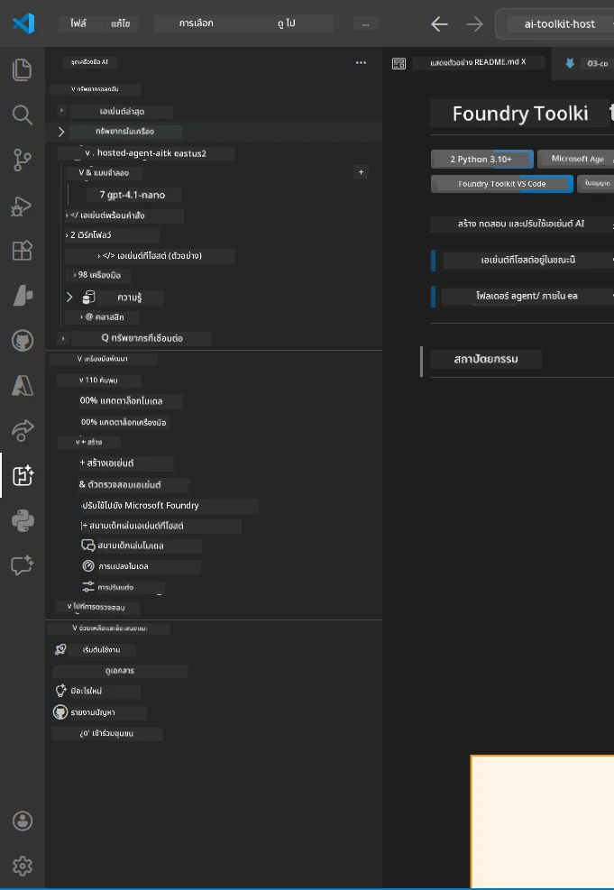
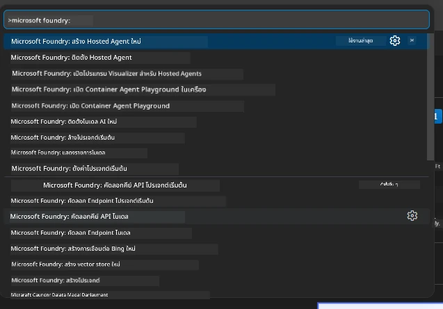

# Module 1 - ติดตั้ง Foundry Toolkit & Foundry Extension

โมดูลนี้จะแนะนำวิธีการติดตั้งและตรวจสอบส่วนขยาย VS Code สองตัวหลักสำหรับเวิร์กช็อปนี้ หากคุณได้ติดตั้งไว้แล้วในช่วง [Module 0](00-prerequisites.md) ใช้โมดูลนี้เพื่อตรวจสอบว่าทำงานอย่างถูกต้อง

---

## ขั้นตอนที่ 1: ติดตั้งส่วนขยาย Microsoft Foundry

ส่วนขยาย **Microsoft Foundry for VS Code** คือเครื่องมือหลักของคุณสำหรับสร้างโปรเจค Foundry, นำโมเดลขึ้นใช้งาน, สร้างโครงสร้างตัวแทนโฮสต์ และนำขึ้นใช้งานได้โดยตรงจาก VS Code

1. เปิด VS Code
2. กด `Ctrl+Shift+X` เพื่อเปิดแผง **Extensions**
3. ในช่องค้นหาที่ด้านบน ให้พิมพ์ว่า: **Microsoft Foundry**
4. ค้นหาผลลัพธ์ที่ชื่อ **Microsoft Foundry for Visual Studio Code**
   - ผู้เผยแพร่: **Microsoft**
   - รหัสส่วนขยาย: `TeamsDevApp.vscode-ai-foundry`
5. คลิกปุ่ม **Install**
6. รอจนการติดตั้งเสร็จสมบูรณ์ (จะเห็นตัวบ่งชี้ความคืบหน้าเล็กๆ)
7. หลังการติดตั้ง ให้ดูที่ **Activity Bar** (แถบไอคอนแนวตั้งด้านซ้ายของ VS Code) คุณจะเห็นไอคอน **Microsoft Foundry** ใหม่ (ดูเหมือนเพชร/ไอคอน AI)
8. คลิกไอคอน **Microsoft Foundry** เพื่อเปิดมุมมองแถบข้าง ควรเห็นส่วนต่างๆ เช่น:
   - **Resources** (หรือ Projects)
   - **Agents**
   - **Models**

> **ถ้าไอคอนไม่แสดง:** ลองรีโหลด VS Code (`Ctrl+Shift+P` → `Developer: Reload Window`)

---

## ขั้นตอนที่ 2: ติดตั้งส่วนขยาย Foundry Toolkit

ส่วนขยาย **Foundry Toolkit** ให้บริการ [**Agent Inspector**](https://learn.microsoft.com/azure/foundry/agents/how-to/vs-code-agents-workflow-pro-code) - อินเทอร์เฟซแบบกราฟิกสำหรับทดสอบและดีบักเอเจนต์ในเครื่อง - พร้อมกับเครื่องมือ playground, การจัดการโมเดล และการประเมินผล

1. ในแผง Extensions (`Ctrl+Shift+X`) ล้างช่องค้นหาแล้วพิมพ์ว่า: **Foundry Toolkit**
2. หา **Foundry Toolkit** ในผลลัพธ์
   - ผู้เผยแพร่: **Microsoft**
   - รหัสส่วนขยาย: `ms-windows-ai-studio.windows-ai-studio`
3. คลิก **Install**
4. หลังติดตั้ง ไอคอน **Foundry Toolkit** จะปรากฏใน Activity Bar (ดูเหมือนหุ่นยนต์/ไอคอนประกาย)
5. คลิกไอคอน **Foundry Toolkit** เพื่อเปิดมุมมองแถบข้าง คุณจะเห็นหน้าจอต้อนรับ Foundry Toolkit พร้อมตัวเลือกสำหรับ:
   - **Models**
   - **Playground**
   - **Agents**

---

## ขั้นตอนที่ 3: ตรวจสอบว่าส่วนขยายทั้งสองทำงานได้

### 3.1 ตรวจสอบ Microsoft Foundry Extension

1. คลิกไอคอน **Microsoft Foundry** ใน Activity Bar
2. หากคุณเข้าสู่ระบบ Azure แล้ว (จาก Module 0) คุณจะเห็นโปรเจคของคุณบน **Resources**
3. หากระบบขอให้เข้าสู่ระบบ ให้คลิก **Sign in** แล้วทำตามขั้นตอนการยืนยันตัวตน
4. ยืนยันว่าคุณเห็นแถบข้างโดยไม่มีข้อผิดพลาด

### 3.2 ตรวจสอบ Foundry Toolkit Extension

1. คลิกไอคอน **Foundry Toolkit** ใน Activity Bar
2. ยืนยันว่าแถบต้อนรับหรือแผงหลักโหลดขึ้นโดยไม่มีข้อผิดพลาด
3. คุณยังไม่ต้องตั้งค่าอะไร — จะใช้ Agent Inspector ใน [Module 5](05-test-locally.md)

### 3.3 ตรวจสอบผ่าน Command Palette

1. กด `Ctrl+Shift+P` เพื่อเปิด Command Palette
2. พิมพ์ว่า **"Microsoft Foundry"** - คุณควรเห็นคำสั่งต่างๆ เช่น:
   - `Microsoft Foundry: Create a New Hosted Agent`
   - `Microsoft Foundry: Deploy Hosted Agent`
   - `Microsoft Foundry: Open Model Catalog`
3. กด `Escape` เพื่อปิด Command Palette
4. เปิด Command Palette อีกครั้งแล้วพิมพ์ว่า **"Foundry Toolkit"** - คุณควรเห็นคำสั่ง เช่น:
   - `Foundry Toolkit: Open Agent Inspector`

> หากคุณไม่เห็นคำสั่งเหล่านี้ อาจเป็นเพราะส่วนขยายไม่ได้ติดตั้งอย่างถูกต้อง ลองถอนการติดตั้งแล้วติดตั้งใหม่ดู

---

## สิ่งที่ส่วนขยายเหล่านี้ทำในเวิร์กช็อปนี้

| ส่วนขยาย | สิ่งที่ทำ | ใช้เมื่อใด |
|-----------|-----------|------------|
| **Microsoft Foundry for VS Code** | สร้างโปรเจค Foundry, นำโมเดลขึ้นใช้งาน, **สร้างโครงสร้าง [hosted agents](https://learn.microsoft.com/azure/foundry/agents/concepts/hosted-agents)** (สร้างไฟล์ `agent.yaml`, `main.py`, `Dockerfile`, `requirements.txt` อัตโนมัติ), นำขึ้นใช้งานที่ [Foundry Agent Service](https://learn.microsoft.com/azure/foundry/agents/overview) | Modules 2, 3, 6, 7 |
| **Foundry Toolkit** | Agent Inspector สำหรับทดสอบ/ดีบักในเครื่อง, UI playground, การจัดการโมเดล | Modules 5, 7 |

> **ส่วนขยาย Foundry เป็นเครื่องมือที่สำคัญที่สุดในเวิร์กช็อปนี้** มันจัดการวัฏจักรตั้งแต่ ตีกรอบ → ตั้งค่า → นำขึ้นใช้งาน → ตรวจสอบ ส่วน Foundry Toolkit ช่วยเสริมด้วย Agent Inspector แบบกราฟิกสำหรับการทดสอบในเครื่อง

---

### จุดตรวจสอบ

- [ ] เห็นไอคอน Microsoft Foundry ใน Activity Bar
- [ ] คลิกแล้วเปิดแถบข้างได้โดยไม่มีข้อผิดพลาด
- [ ] เห็นไอคอน Foundry Toolkit ใน Activity Bar
- [ ] คลิกแล้วเปิดแถบข้างได้โดยไม่มีข้อผิดพลาด
- [ ] กด `Ctrl+Shift+P` → พิมพ์ "Microsoft Foundry" แสดงคำสั่งได้
- [ ] กด `Ctrl+Shift+P` → พิมพ์ "Foundry Toolkit" แสดงคำสั่งได้

---

**ก่อนหน้า:** [00 - Prerequisites](00-prerequisites.md) · **ถัดไป:** [02 - Create Foundry Project →](02-create-foundry-project.md)

---

<!-- CO-OP TRANSLATOR DISCLAIMER START -->
**ปฏิเสธความรับผิดชอบ**:  
เอกสารฉบับนี้ได้รับการแปลโดยใช้บริการแปลภาษาอัตโนมัติ [Co-op Translator](https://github.com/Azure/co-op-translator) แม้ว่าเราจะพยายามให้ความถูกต้องสูงสุด แต่โปรดทราบว่าการแปลอัตโนมัติอาจมีข้อผิดพลาดหรือความคลาดเคลื่อนได้ เอกสารต้นฉบับในภาษาต้นทางควรถูกพิจารณาเป็นแหล่งข้อมูลที่เชื่อถือได้ หากเป็นข้อมูลที่สำคัญ แนะนำให้ใช้บริการแปลโดยผู้เชี่ยวชาญมนุษย์มืออาชีพ เราจะไม่รับผิดชอบต่อความเข้าใจผิดหรือการตีความที่ผิดพลาดที่เกิดจากการใช้การแปลนี้
<!-- CO-OP TRANSLATOR DISCLAIMER END -->