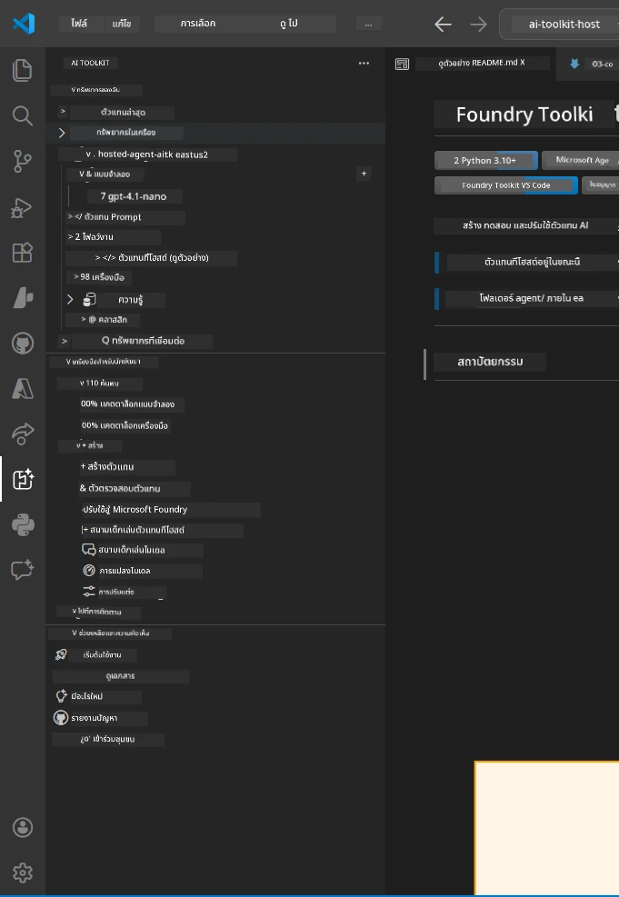
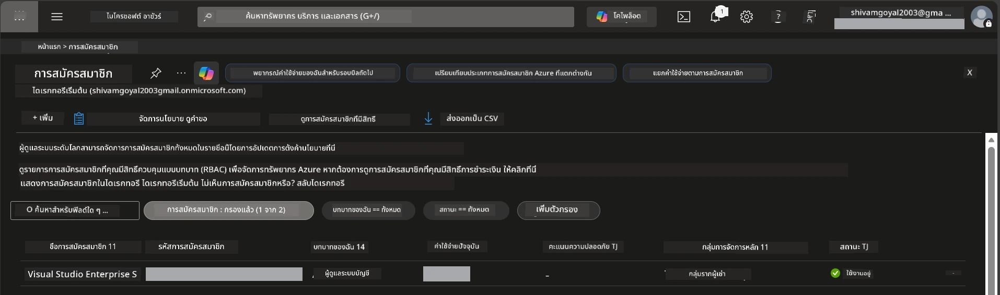
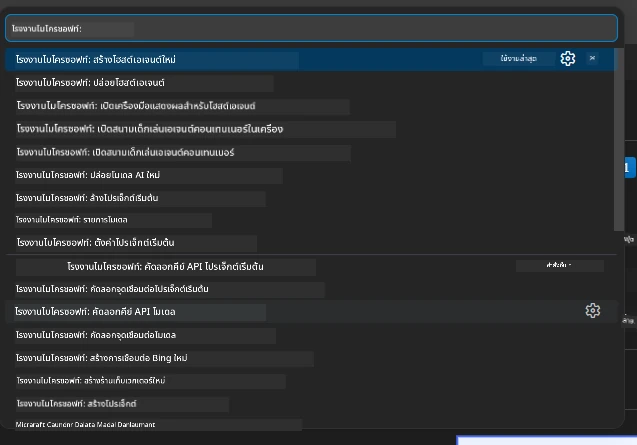
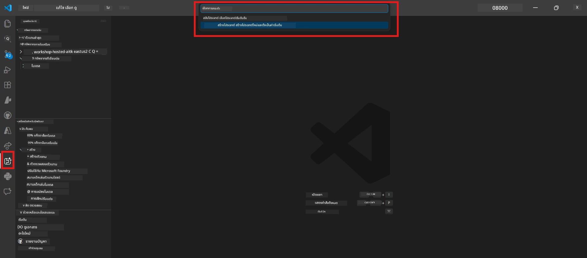
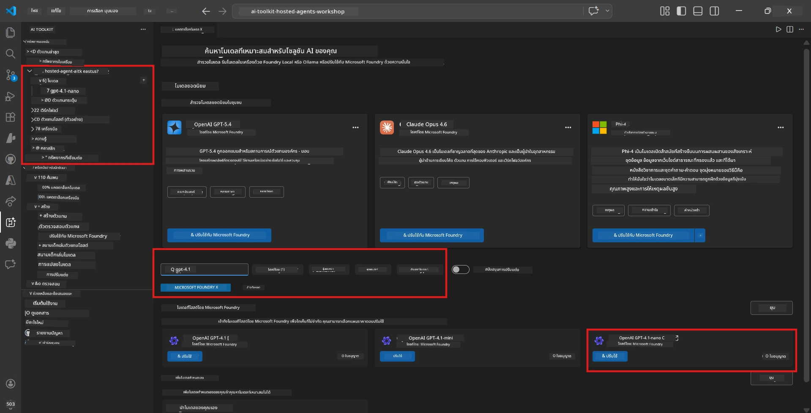
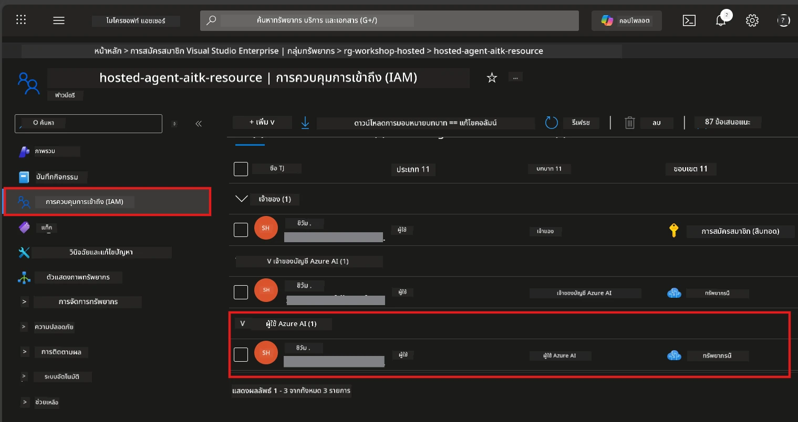

# การตั้งค่า: ส่วนขยาย โปรเจกต์ & โมเดล

⏱️ ~15 นาที

ในโมดูลนี้ คุณจะติดตั้งและตรวจสอบส่วนขยาย Foundry Toolkit สร้าง (หรือเชื่อมต่อกับ) โปรเจกต์ Foundry และปรับใช้โมเดลที่ตัวแทนของคุณจะใช้

## ขั้นตอนที่ 1: ติดตั้ง Foundry Toolkit

**Foundry Toolkit สำหรับ VS Code** คือส่วนขยายหลักสำหรับเวิร์กช็อปนี้ ซึ่งให้ความสามารถในการสร้างโปรเจกต์ ปรับใช้โมเดล สร้างโครงสร้างตัวแทน ทดสอบในเครื่อง (Agent Inspector) และปรับใช้บนคลาวด์ - ทั้งหมดจาก VS Code

1. เปิด VS Code แล้วกด `Ctrl+Shift+X` เพื่อเปิดแผง **Extensions**
2. ค้นหา **Foundry Toolkit**
3. ติดตั้ง **Foundry Toolkit for VS Code** (ผู้จัดจำหน่าย: Microsoft, ID: `ms-windows-ai-studio.windows-ai-studio`)
4. หลังติดตั้ง เสียงไอคอน **Foundry Toolkit** จะปรากฏบนแถบกิจกรรม (แถบด้านข้างซ้าย)

> *หมายเหตุ: แถบกิจกรรมอาจแสดงข้อความ "AI TOOLKIT" ในเวอร์ชันเก่าของส่วนขยาย ฟังก์ชันเหมือนกัน*



## ขั้นตอนที่ 2: ตั้งค่าขึ้นอยู่กับการเข้าถึงของคุณ

> **เลือกเส้นทางของคุณ:** คลิกขยายส่วนด้านล่างที่ตรงกับการตั้งค่าของคุณ คุณต้องทำเพียง **เส้นทางเดียว** เท่านั้น

<details>
<summary><strong>🅰️ เส้นทาง A - คลาวด์ Azure (ต้องใช้การสมัคร Azure)</strong></summary>

### Azure CLI

1. ติดตั้งจาก [learn.microsoft.com/cli/azure/install-azure-cli](https://learn.microsoft.com/cli/azure/install-azure-cli)
2. ตรวจสอบ: `az --version` (ควรเป็น 2.80.0 ขึ้นไป)
3. ลงชื่อเข้าใช้: `az login`

### ตัวเลือกการตรวจสอบสิทธิ์

[Microsoft Agent Framework](https://learn.microsoft.com/agent-framework/overview/) ใช้ [`DefaultAzureCredential`](https://learn.microsoft.com/azure/developer/python/sdk/authentication/credential-chains#defaultazurecredential-overview) ซึ่งพยายามใช้หลายวิธีการตรวจสอบสิทธิ์ตามลำดับ เลือกวิธีที่เหมาะกับสภาพแวดล้อมของคุณ:

#### ตัวเลือก 1: บัญชี VS Code (แนะนำสำหรับเวิร์กช็อป)
1. คลิกไอคอน **Accounts** (รูปคน) ที่มุมล่างซ้ายของ VS Code
2. เลือก **Sign in to use Microsoft Foundry** (หรือ **Sign in with Azure**)
3. เบราว์เซอร์จะเปิดขึ้น - ลงชื่อเข้าใช้ด้วยบัญชี Azure ที่มีสิทธิ์เข้าถึงการสมัครของคุณ
4. กลับไปที่ VS Code คุณควรเห็นชื่อบัญชีที่มุมล่างซ้าย

#### ตัวเลือก 2: Azure CLI
```bash
az login
az account set --subscription "<your-subscription-id>"
```

#### ตัวเลือก 3: Service Principal (องค์กร/CI)
สำหรับสภาพแวดล้อมที่มีการจำกัดเข้มงวดหรือท่อ CI/CD ให้ตั้งค่าตัวแปรสภาพแวดล้อมเหล่านี้ในไฟล์ `.env` ของคุณ:
```env
AZURE_TENANT_ID=<your-tenant-id>
AZURE_CLIENT_ID=<your-client-id>
AZURE_CLIENT_SECRET=<your-client-secret>
```

> **วิธีทำงานของ `DefaultAzureCredential`:** จะลองตัวแปรสภาพแวดล้อมก่อน จากนั้น identity ที่จัดการ จากนั้นลงชื่อเข้าใช้ VS Code และสุดท้าย Azure CLI - และใช้อันที่สำเร็จเป็นอันดับแรก ดู [เอกสารสายรหัสรับรอง](https://learn.microsoft.com/azure/developer/python/sdk/authentication/credential-chains#defaultazurecredential-overview)

### Azure Developer CLI (azd)

1. ติดตั้ง: `winget install microsoft.azd` (Windows) หรือดู [เอกสารการติดตั้ง](https://learn.microsoft.com/azure/developer/azure-developer-cli/install-azd)
2. ตรวจสอบ: `azd version`
3. ลงชื่อเข้าใช้: `azd auth login`

### Docker Desktop (ไม่บังคับ)

Docker จำเป็นเฉพาะถ้าคุณต้องการสร้างคอนเทนเนอร์ในเครื่อง Foundry extension จะจัดการการสร้างโดยอัตโนมัติในระหว่างการปรับใช้

1. ติดตั้งจาก [docs.docker.com/get-docker](https://docs.docker.com/get-docker/)
2. ตรวจสอบ: `docker info`

### การสมัคร Azure & RBAC

1. ลงชื่อเข้าใช้ที่ [portal.azure.com](https://portal.azure.com)
2. ไปที่ **Subscriptions** แล้วยืนยันอย่างน้อยหนึ่งรายการเป็น **Active**
3. จดจำ **Subscription ID** ของคุณ - คุณจะต้องใช้ในโมดูล 01



#### ตารางสถานการณ์ RBAC

การปรับใช้ [Hosted Agent](https://learn.microsoft.com/azure/foundry/agents/concepts/hosted-agents) ต้องการสิทธิ์ **data action** ที่บทบาทมาตรฐานของ Azure `Owner` และ `Contributor` ***ไม่มี*** ใช้ตารางด้านล่างเพื่อกำหนดบทบาทที่คุณต้องการ:

| สถานการณ์ | บทบาทที่ต้องการ | ที่ตั้งค่า |
|----------|---------------|----------------------|
| สร้างโปรเจกต์ Foundry ใหม่ | **Azure AI Owner** บนทรัพยากร Foundry | ทรัพยากร Foundry ใน Azure Portal |
| ปรับใช้ในโปรเจกต์ที่มีอยู่ (ทรัพยากรใหม่) | **Azure AI Owner** + **Contributor** บนการสมัคร | การสมัคร + ทรัพยากร Foundry |
| ปรับใช้ในโปรเจกต์ที่ตั้งค่าเต็มที่ | **Reader** บัญชี + **Azure AI User** บนโปรเจกต์ | บัญชี + โปรเจกต์ใน Azure Portal |
| ทดสอบในเครื่องเท่านั้น (ไม่ปรับใช้) | **Azure AI User** บนโปรเจกต์ | โปรเจกต์ใน Azure Portal |

> **จุดสำคัญ:** บทบาท Azure `Owner` และ `Contributor` ให้สิทธิ์เฉพาะ *จัดการ* (ARM operations) เท่านั้น คุณต้องการ [**Azure AI User**](https://learn.microsoft.com/azure/foundry/concepts/rbac-foundry#built-in-roles) (หรือสูงกว่า) สำหรับ *data actions* เช่น `agents/write` ซึ่งจำเป็นสำหรับการสร้างและปรับใช้ตัวแทน

## เชื่อมหรือสร้างโปรเจกต์ Foundry



1. กด `Ctrl+Shift+P` → พิมพ์ **Foundry Toolkit: Create Project** → เลือกคำสั่งนั้น
2. เลือก **การสมัคร Azure** ของคุณจากเมนูดรอปดาวน์
3. เลือกหรือสร้าง **กลุ่มทรัพยากร** (เช่น `rg-hosted-agents-workshop`)
4. เลือก **ภูมิภาค** ที่รองรับ hosted agents: `East US`, `West US 2` หรือ `Sweden Central` ดู [ความพร้อมใช้งานตามภูมิภาค](https://learn.microsoft.com/azure/foundry/agents/concepts/hosted-agents#region-availability)
5. กรอกชื่อโปรเจกต์ (เช่น `workshop-agents`)
6. รอ 2–5 นาทีสำหรับการจัดสรร ระบบจะแสดงการแจ้งเตือนความคืบหน้าใน VS Code
7. เมื่อเสร็จโปรเจกต์จะแสดงในแถบด้านข้าง **Foundry Toolkit** ใต้ **MY RESOURCES**



## ปรับใช้โมเดล & กำหนดบทบาท RBAC

ตัวแทนโฮสต์ของคุณต้องใช้โมเดล AI เพื่อสร้างคำตอบ

#### เมทริกซ์การเลือกโมเดล
ขึ้นอยู่กับความต้องการของคุณ คุณสามารถเลือกจากโมเดลระดับต่างๆ ได้:

| โมเดล | เหมาะสำหรับ | ค่าใช้จ่าย | หมายเหตุ |
|-------|----------|------|-------|
| `gpt-4.1` | คำตอบคุณภาพสูง ซับซ้อน | สูงกว่า | ผลลัพธ์ดีที่สุด แนะนำสำหรับการทดสอบขั้นสุดท้าย |
| `gpt-4.1-mini/gpt-5-mini` | การวนซ้ำเร็ว ราคาถูกกว่า | ต่ำกว่า | ดีสำหรับพัฒนาเวิร์กช็อปและทดสอบเร็ว |
| `gpt-4.1-nano` | งานเบา | ต่ำสุด | คุ้มค่าที่สุด แต่คำตอบง่ายกว่า |

1. กด `Ctrl+Shift+P` → **Foundry Toolkit: Open Model Catalog** (หรือคลิก **Model Catalog** ในแถบด้านข้างใต้ DEVELOPER TOOLS → Discover)
2. ค้นหา **gpt-4.1** ในแคตตาล็อก
3. หา **OpenAI GPT-4.1-mini** (หรือ `gpt-5-mini` เพื่อคุณภาพดีกว่า) แล้วคลิก **Deploy**



4. ในการกำหนดค่าการปรับใช้:
   - **ชื่อการปรับใช้:** ใช้ชื่อเริ่มต้นหรือป้อนชื่อกำหนดเอง **จดจำชื่อนี้ไว้**
   - **เป้าหมาย:** เลือก **Deploy to Foundry Toolkit** → เลือกโปรเจกต์ของคุณ
5. คลิก **Deploy** แล้วรอ 1–3 นาที

> **คำแนะนำ:** ใช้ `gpt-4.1-mini/gpt-5-mini` สำหรับเวิร์กช็อป - เร็ว คุ้มราคา และได้ผลดี

### จดบันทึกค่าของคุณ

หลังปรับใช้ ให้จดค่าสองค่านี้ (คุณจะต้องใช้ในโมดูล 03)

| ค่า | ที่พบ |
|-------|-----------------|
| **จุดสิ้นสุดโปรเจกต์** | คลิกโปรเจกต์ในแถบด้านข้าง → ดูรายละเอียดจะแสดง URL (เช่น `https://<account>.services.ai.azure.com/api/projects/<project>`) |
| **ชื่อการปรับใช้โมเดล** | ขยายโปรเจกต์ → **Models** → ชื่อถัดจากโมเดลที่คุณปรับใช้ (เช่น `gpt-4.1-mini/gpt-5-mini`) |

### กำหนดบทบาท RBAC

> ⚠️ **นี่คือขั้นตอนที่มักพลาดมากที่สุด** หากไม่มีบทบาทที่ถูกต้อง การปรับใช้ในโมดูล 05 จะล้มเหลว

#### ฉันต้องการบทบาทใด?
ขึ้นอยู่กับสถานการณ์ของคุณ คุณต้องการการรวมบทบาทดังนี้:

| สถานการณ์ | บทบาทที่ต้องการ | ที่ตั้งค่า |
|----------|---------------|----------------------|
| สร้างโปรเจกต์ Foundry ใหม่ | **Azure AI Owner** บนทรัพยากร Foundry | ทรัพยากร Foundry ใน Azure Portal |
| ปรับใช้ในโปรเจกต์ที่มีอยู่ (ทรัพยากรใหม่) | **Azure AI Owner** + **Contributor** บนการสมัคร | การสมัคร + ทรัพยากร Foundry |
| ปรับใช้ในโปรเจกต์ที่ตั้งค่าเต็มที่ | **Reader** บัญชี + **Azure AI User** บนโปรเจกต์ | บัญชี + โปรเจกต์ใน Azure Portal |

**จุดสำคัญ:** บทบาท Azure `Owner` และ `Contributor` ให้สิทธิ์เฉพาะการ *จัดการ* เท่านั้น คุณต้องการ **Azure AI User** (หรือสูงกว่า) สำหรับ *data actions* เช่น `agents/write` ที่ต้องใช้ในการสร้างและปรับใช้ตัวแทน

1. เปิด [portal.azure.com](https://portal.azure.com)
2. ค้นหาชื่อ **โปรเจกต์ Foundry** ของคุณ → คลิกรายการผลลัพธ์ประเภท **"Foundry Toolkit project"** (ไม่ใช่บัญชีหลัก)
3. คลิก **Access control (IAM)** ในเมนูนำทางซ้าย
4. คลิก **+ Add** → **Add role assignment**
5. **แท็บบทบาท:** ค้นหา **Azure AI User** เลือกแล้วคลิก **Next**
6. **แท็บสมาชิก:** เลือก **User, group, or service principal** → คลิก **+ Select members** → ค้นหาและเลือกตัวคุณเอง → คลิก **Select**
7. คลิก **Review + assign** → คลิก **Review + assign** อีกครั้ง
8. **รอ 1–2 นาที** เพื่อให้เกิดการเผยแพร่

> **ทำไมต้องบทบาทนี้?** บทบาท Azure `Owner`/`Contributor` ให้เฉพาะสิทธิ์จัดการ ส่วนบทบาท **Azure AI User** ให้สิทธิ์ `agents/write` สำหรับการทำข้อมูลที่จำเป็นในการสร้างและปรับใช้ตัวแทน ดู [เอกสาร Foundry RBAC](https://learn.microsoft.com/azure/foundry/concepts/rbac-foundry#built-in-roles)



</details>

<details>
<summary><strong>🅱️ เส้นทาง B - ในเครื่อง / ชั้นฟรี (ไม่ต้องใช้การสมัคร Azure)</strong></summary>

### Foundry Local

Foundry Local ช่วยให้คุณรันโมเดล AI บนเครื่องของคุณเอง - ไม่ต้องมีบัญชีคลาวด์ คุณสามารถเข้าถึงโมเดล Foundry Local โดยใช้ Foundry Toolkit ผ่านแคตตาล็อกโมเดลดังนี้:

1. ไปที่ส่วนขยาย Foundry Toolkit
2. ในเมนูนำทางของ Foundry Toolkit ไปที่ **Developer Tools** > เลือก **Model Catalog**
3. ในหน้าต่างใหม่ เลือก **local** จากแถบนำทาง
4. เลื่อนลงไปที่ **Phi 4 Mini,** แล้วคลิกปุ่ม **เพิ่ม** จะมีป๊อปอัพแสดงว่าโมเดลกำลังดาวน์โหลด
5. เมื่อตัวโมเดลดาวน์โหลดเสร็จแล้ว คุณสามารถดำเนินการขั้นตอนถัดไปได้

</details>

### ✅ จุดตรวจสอบ


- [ ] `Ctrl+Shift+P` → "Foundry Toolkit" แสดงคำสั่งที่พร้อมใช้
- [ ] ติดตั้งส่วนขยาย Foundry Toolkit และแถบด้านข้างโหลดไม่มีข้อผิดพลาด
- [ ] เปิด VS Code และใช้งานได้ปกติ
- [ ] `python --version` แสดง 3.10+
- [ ] สัญลักษณ์ Foundry Toolkit แสดงใน VS Code Activity Bar
- [ ] **เส้นทาง A:** `az login` สำเร็จ การสมัครเป็น Active
- [ ] **เส้นทาง B:** Foundry Local กำลังทำงาน (`foundry local status`)
- [ ] **เส้นทาง A:** โปรเจกต์ Foundry ปรากฏในแถบด้านข้าง โมเดลปรับใช้แล้ว บทบาท Azure AI User กำหนดเรียบร้อย
- [ ] **เส้นทาง B:** Foundry Local ทำงานพร้อมโมเดล
- [ ] คุณได้จดจำ **endpoint** และ **ชื่อการปรับใช้โมเดล** ไว้แล้ว


**ก่อนหน้า:** [00 - ข้อกำหนดเบื้องต้น](00-prerequisites.md) · **ถัดไป:** [02 - สร้าง Hosted Agent →](02-create-hosted-agent.md)

---

<!-- CO-OP TRANSLATOR DISCLAIMER START -->
**ปฏิเสธความรับผิดชอบ**:
เอกสารนี้ได้รับการแปลโดยใช้บริการแปลภาษา AI [Co-op Translator](https://github.com/Azure/co-op-translator) ขณะที่เราพยายามให้ความถูกต้อง โปรดทราบว่าการแปลโดยอัตโนมัติอาจมีข้อผิดพลาดหรือความไม่ถูกต้อง เอกสารต้นฉบับในภาษาต้นทางควรถูกพิจารณาเป็นแหล่งข้อมูลที่เชื่อถือได้ สำหรับข้อมูลที่สำคัญ แนะนำให้ใช้การแปลโดยมนุษย์มืออาชีพ เราไม่รับผิดชอบต่อความเข้าใจผิดหรือการตีความที่ผิดพลาดที่เกิดขึ้นจากการใช้การแปลนี้
<!-- CO-OP TRANSLATOR DISCLAIMER END -->