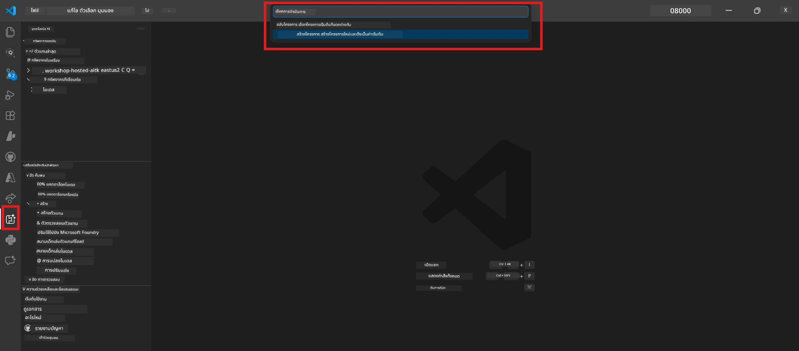
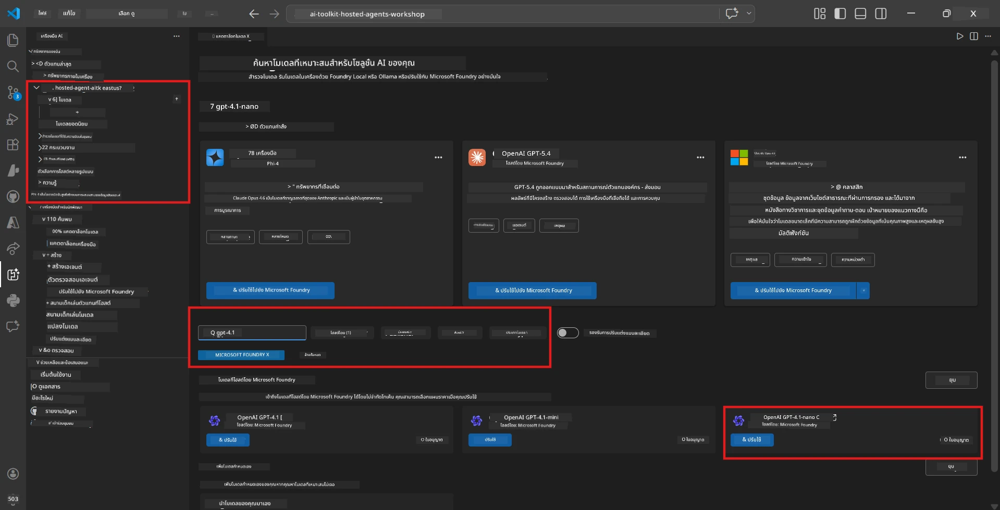
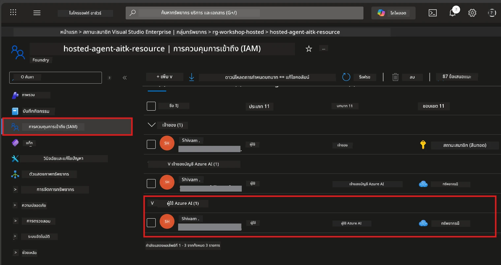

# Module 2 - สร้างโครงการ Foundry & เรียกใช้งานโมเดล

ในโมดูลนี้ คุณจะสร้าง (หรือเลือก) โครงการ Microsoft Foundry และทำการเรียกใช้งานโมเดลที่ตัวแทนของคุณจะใช้ ทุกขั้นตอนถูกเขียนไว้อย่างชัดเจน — ให้ทำตามลำดับตั้งแต่ต้นจนจบ

> หากคุณมีโครงการ Foundry ที่มีโมเดลถูกเรียกใช้งานอยู่แล้ว ให้ข้ามไปที่ [Module 3](03-create-hosted-agent.md)

---

## ขั้นตอนที่ 1: สร้างโครงการ Foundry จาก VS Code

คุณจะใช้ส่วนขยาย Microsoft Foundry เพื่อสร้างโครงการโดยไม่ต้องออกจาก VS Code

1. กด `Ctrl+Shift+P` เพื่อเปิด **Command Palette**
2. พิมพ์: **Microsoft Foundry: Create Project** แล้วเลือกคำสั่งนี้
3. จะมีรายการแบบเลื่อนลงปรากฏขึ้น – เลือก **การสมัครใช้งาน Azure (Azure subscription)** ของคุณจากรายการ
4. คุณจะถูกขอให้เลือกหรือสร้าง **resource group**:
   - หากต้องการสร้างใหม่: พิมพ์ชื่อ (เช่น `rg-hosted-agents-workshop`) แล้วกด Enter
   - หากต้องการใช้ของที่มีอยู่แล้ว: เลือกจากรายการแบบเลื่อนลง
5. เลือก **ภูมิภาค (region)** สำคัญ: เลือกภูมิภาคที่รองรับตัวแทนโฮสต์ ตรวจสอบ [ภูมิภาคที่รองรับ](https://learn.microsoft.com/azure/foundry/agents/concepts/hosted-agents#region-availability) ตัวเลือกที่พบบ่อยคือ `East US`, `West US 2` หรือ `Sweden Central`
6. ใส่ **ชื่อ** ให้กับโครงการ Foundry (เช่น `workshop-agents`)
7. กด Enter และรอจนกว่าจะเสร็จสิ้นการจัดเตรียม

> **ขั้นตอนการจัดเตรียมใช้เวลาประมาณ 2-5 นาที** คุณจะเห็นการแจ้งเตือนความคืบหน้าอยู่ที่มุมล่างขวาของ VS Code อย่าปิด VS Code ระหว่างรอการจัดเตรียม

8. เมื่อเสร็จสิ้น เมนูด้านข้าง **Microsoft Foundry** จะแสดงโครงการใหม่ของคุณภายใต้ **Resources**
9. คลิกที่ชื่อโครงการเพื่อขยาย แล้วตรวจสอบว่ามีส่วนต่าง ๆ เช่น **Models + endpoints** และ **Agents**



### ทางเลือก: สร้างผ่าน Foundry Portal

หากคุณต้องการใช้เบราว์เซอร์:

1. เปิด [https://ai.azure.com](https://ai.azure.com) แล้วลงชื่อเข้าใช้
2. คลิก **Create project** บนหน้าแรก
3. กรอกชื่อโครงการ เลือกการสมัครใช้งาน (subscription), resource group และภูมิภาค
4. คลิก **Create** และรอการจัดเตรียม
5. เมื่องานสร้างเสร็จ กลับไปที่ VS Code — โครงการควรปรากฏในแถบ Foundry หลังการรีเฟรช (คลิกไอคอนรีเฟรช)

---

## ขั้นตอนที่ 2: เรียกใช้งานโมเดล

[ตัวแทนโฮสต์](https://learn.microsoft.com/azure/foundry/agents/concepts/hosted-agents) ของคุณต้องใช้โมเดล Azure OpenAI เพื่อสร้างการตอบสนอง คุณจะ [ทำการเรียกใช้งานโมเดล](https://learn.microsoft.com/azure/ai-foundry/openai/how-to/create-resource#deploy-a-model) ในตอนนี้

1. กด `Ctrl+Shift+P` เพื่อเปิด **Command Palette**
2. พิมพ์: **Microsoft Foundry: Open [Model Catalog](https://learn.microsoft.com/azure/ai-foundry/openai/concepts/models)** แล้วเลือกคำสั่งนี้
3. มุมมอง Model Catalog จะเปิดใน VS Code ให้ค้นหาหรือใช้แถบค้นหาเพื่อหา **gpt-4.1**
4. คลิกที่การ์ดโมเดล **gpt-4.1** (หรือ `gpt-4.1-mini` หากต้องการลดต้นทุน)
5. คลิก **Deploy**



6. ในการตั้งค่าการใช้งาน:
   - **Deployment name**: ใช้ชื่อเริ่มต้น (เช่น `gpt-4.1`) หรือใส่ชื่อที่ต้องการ **จดชื่อไว้** — คุณจะต้องใช้ใน Module 4
   - **Target**: เลือก **Deploy to Microsoft Foundry** และเลือกโครงการที่คุณสร้างไว้เมื่อสักครู่นี้
7. คลิก **Deploy** และรอให้การใช้งานเสร็จสมบูรณ์ (ใช้เวลาประมาณ 1-3 นาที)

### การเลือกโมเดล

| โมเดล | เหมาะสำหรับ | ต้นทุน | หมายเหตุ |
|-------|----------|------|-------|
| `gpt-4.1` | การตอบสนองคุณภาพสูงและซับซ้อน | สูงกว่า | ให้ผลลัพธ์ดีที่สุด แนะนำสำหรับการทดสอบขั้นสุดท้าย |
| `gpt-4.1-mini` | การทำซ้ำเร็ว ต้นทุนต่ำกว่า | ต่ำกว่า | เหมาะสำหรับพัฒนาและทดสอบในเวิร์กช็อป |
| `gpt-4.1-nano` | งานที่เบา | ต่ำสุด | ประหยัดต้นทุนที่สุด แต่ตอบสนองอย่างง่าย |

> **คำแนะนำสำหรับเวิร์กช็อปนี้:** ใช้ `gpt-4.1-mini` สำหรับพัฒนาและทดสอบ เพราะรวดเร็ว ราคาถูก และให้ผลลัพธ์ดีสำหรับแบบฝึกหัด

### ตรวจสอบการใช้งานโมเดล

1. ในแถบด้านข้าง **Microsoft Foundry** ขยายโครงการของคุณ
2. ดูใต้ **Models + endpoints** (หรือส่วนที่คล้ายกัน)
3. คุณควรเห็นโมเดลที่คุณเรียกใช้งาน (เช่น `gpt-4.1-mini`) พร้อมสถานะ **Succeeded** หรือ **Active**
4. คลิกที่การใช้งานโมเดลเพื่อดูรายละเอียด
5. **จดบันทึก** ค่าทั้งสองนี้ — คุณจะต้องใช้ใน Module 4:

   | การตั้งค่า | ที่อยู่ | ตัวอย่างค่า |
   |---------|-----------------|---------------|
   | **Project endpoint** | คลิกที่ชื่อโครงการในแถบ Foundry URL ของ endpoint จะแสดงในมุมมองรายละเอียด | `https://<account>.services.ai.azure.com/api/projects/<project>` |
   | **Model deployment name** | ชื่อที่แสดงถัดจากโมเดลที่เรียกใช้งาน | `gpt-4.1-mini` |

---

## ขั้นตอนที่ 3: กำหนดบทบาท RBAC ที่จำเป็น

นี่คือ **ขั้นตอนที่พลาดบ่อยที่สุด** หากไม่มีบทบาทที่ถูกต้อง การใช้งานใน Module 6 จะล้มเหลวเนื่องจากข้อผิดพลาดสิทธิ์

### 3.1 กำหนดบทบาท Azure AI User ให้ตัวคุณเอง

1. เปิดเบราว์เซอร์และไปที่ [https://portal.azure.com](https://portal.azure.com)
2. ใช้แถบค้นหาด้านบน พิมพ์ชื่อ **โครงการ Foundry** ของคุณ แล้วคลิกในผลลัพธ์
   - **สำคัญ:** ให้เข้าสู่ทรัพยากร **project** (ประเภท: "Microsoft Foundry project") ไม่ใช่ที่ระดับบัญชีหรือฮับ
3. ในเมนูด้านซ้ายของโครงการ คลิก **Access control (IAM)**
4. คลิกปุ่ม **+ Add** ด้านบน → เลือก **Add role assignment**
5. ในแท็บ **Role** ค้นหา [**Azure AI User**](https://learn.microsoft.com/azure/foundry/concepts/rbac-foundry#built-in-roles) แล้วเลือก จากนั้นคลิก **Next**
6. ในแท็บ **Members**:
   - เลือก **User, group, or service principal**
   - คลิก **+ Select members**
   - ค้นหาชื่อหรืออีเมลของคุณ เลือกตัวคุณเอง แล้วคลิก **Select**
7. คลิก **Review + assign** → คลิก **Review + assign** อีกครั้งเพื่อยืนยัน



### 3.2 (เลือกทำ) กำหนดบทบาท Azure AI Developer

หากคุณจำเป็นต้องสร้างทรัพยากรเพิ่มเติมภายในโครงการหรือจัดการการใช้งานผ่านโปรแกรม:

1. ทำซ้ำขั้นตอนด้านบน แต่ในขั้นตอนที่ 5 เลือก **Azure AI Developer** แทน
2. กำหนดบทบาทนี้ที่ระดับ **Foundry resource (account)** ไม่ใช่แค่ระดับโครงการเท่านั้น

### 3.3 ตรวจสอบการกำหนดบทบาทของคุณ

1. ในหน้า **Access control (IAM)** ของโครงการ คลิกแท็บ **Role assignments**
2. ค้นหาชื่อของคุณ
3. คุณควรเห็นอย่างน้อยบทบาท **Azure AI User** ที่ถูกกำหนดในระดับโครงการ

> **เหตุผลที่สำคัญ:** บทบาท [`Azure AI User`](https://learn.microsoft.com/azure/foundry/concepts/rbac-foundry#built-in-roles) ให้สิทธิ์การดำเนินการข้อมูล `Microsoft.CognitiveServices/accounts/AIServices/agents/write` หากไม่มี จะพบข้อผิดพลาดนี้ในระหว่างการใช้งาน:
>
> ```
> Error: lacks the required data action 
> Microsoft.CognitiveServices/accounts/AIServices/agents/write 
> to perform POST /api/projects/{projectName}/assistants operation.
> ```
>
> ดูรายละเอียดเพิ่มเติมได้ที่ [Module 8 - Troubleshooting](08-troubleshooting.md)

---

### จุดตรวจสอบ

- [ ] โครงการ Foundry มีอยู่และมองเห็นได้ในแถบ Microsoft Foundry ใน VS Code
- [ ] มีโมเดลอย่างน้อยหนึ่งโมเดลถูกใช้งาน (เช่น `gpt-4.1-mini`) โดยมีสถานะ **Succeeded**
- [ ] คุณได้จดบันทึก URL ของ **project endpoint** และชื่อ **model deployment**
- [ ] คุณมีบทบาท **Azure AI User** กำหนดในระดับ **project** (ตรวจสอบใน Azure Portal → IAM → Role assignments)
- [ ] โครงการอยู่ใน [ภูมิภาคที่รองรับ](https://learn.microsoft.com/azure/foundry/agents/concepts/hosted-agents#region-availability) สำหรับตัวแทนโฮสต์

---

**ก่อนหน้า:** [01 - Install Foundry Toolkit](01-install-foundry-toolkit.md) · **ถัดไป:** [03 - Create a Hosted Agent →](03-create-hosted-agent.md)

---

<!-- CO-OP TRANSLATOR DISCLAIMER START -->
**ข้อจำกัดความรับผิดชอบ**:  
เอกสารนี้ได้รับการแปลโดยใช้บริการแปลภาษา AI [Co-op Translator](https://github.com/Azure/co-op-translator) แม้ว่าเราจะพยายามให้มีความถูกต้อง โปรดทราบว่าการแปลอัตโนมัติอาจมีข้อผิดพลาดหรือความไม่ถูกต้อง เอกสารต้นฉบับในภาษาดั้งเดิมควรถือเป็นแหล่งข้อมูลที่เชื่อถือได้ สำหรับข้อมูลที่สำคัญ แนะนำให้ใช้การแปลโดยมนุษย์ผู้เชี่ยวชาญ เราจะไม่รับผิดชอบต่อความเข้าใจผิดหรือการตีความผิดที่เกิดจากการใช้การแปลนี้
<!-- CO-OP TRANSLATOR DISCLAIMER END -->