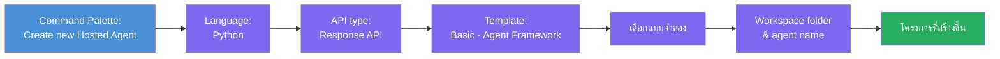
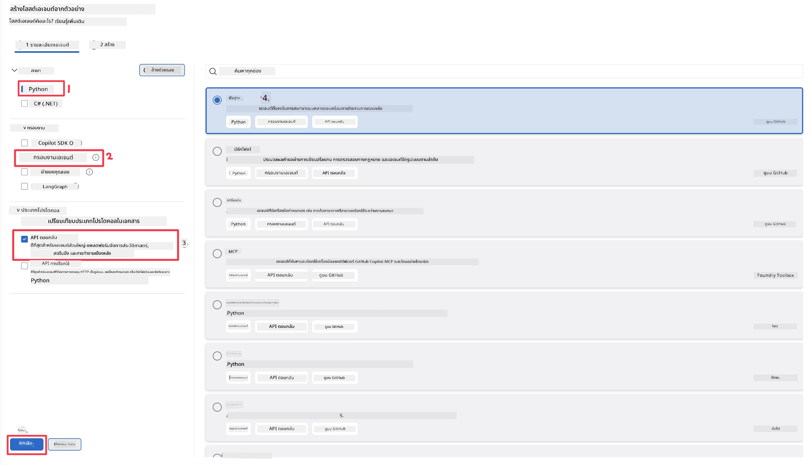
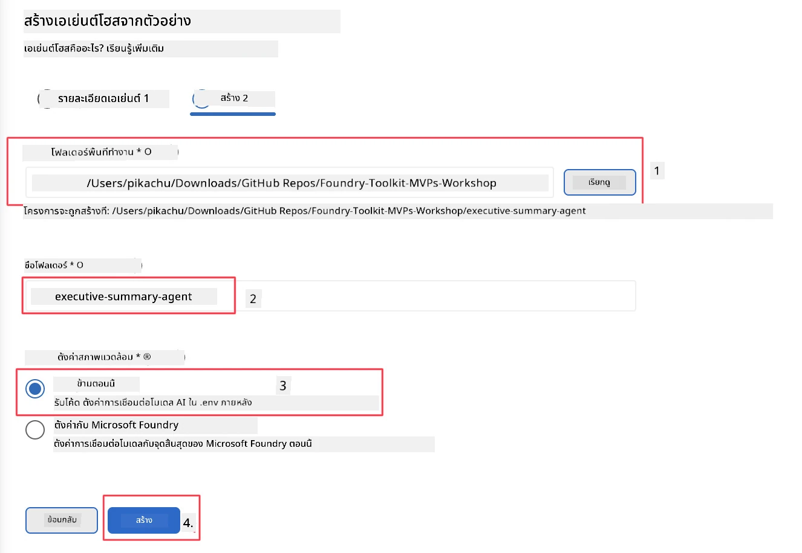

# โมดูล 2 - สร้าง Hosted Agent ใหม่

⏱️ ~5 นาที

ในโมดูลนี้ คุณจะใช้ Foundry Toolkit เพื่อ **สร้างโครงร่างโปรเจกต์ hosted agent** โครงร่างจะสร้างโครงสร้างโปรเจกต์ทั้งหมด - `agent.yaml`, `main.py`, `Dockerfile`, `requirements.txt` และการตั้งค่า debug ของ VS Code - เพื่อให้คุณสามารถมุ่งเน้นไปที่การปรับแต่งพฤติกรรมของเอเจนต์ได้

> **แนวคิดสำคัญ:** โฟลเดอร์ `agent/` ในแลปนี้เป็นตัวอย่างของสิ่งที่ Foundry Toolkit สร้างขึ้น คุณไม่ต้องเขียนไฟล์เหล่านี้ตั้งแต่ต้น

### ขั้นตอนการใช้งาน Scaffold wizard



---

## ขั้นตอนที่ 1: เปิด Create Hosted Agent wizard

1. กด `Ctrl+Shift+P` เพื่อเปิด **Command Palette**
2. พิมพ์: **Foundry Toolkit: Create new Hosted Agent** และเลือก

> **ทางเลือก: สร้างผ่าน Foundry Portal**
> หากคุณชอบใช้เบราว์เซอร์ คุณสามารถสร้างโปรเจกต์ที่ [https://ai.azure.com](https://ai.azure.com) เมื่อโปรเจกต์ถูกจัดเตรียมแล้ว ให้กลับมาที่ VS Code และใช้แถบ Foundry Toolkit เพื่อเชื่อมต่อกับโปรเจกต์นั้น

> **ทางเลือก:** คลิกไอคอน **+** ถัดจาก **Hosted Agents (Preview)** ในแถบ Foundry Toolkit

## ขั้นตอนที่ 2: เลือกการตั้งค่า



1. ในส่วนเมนูทางซ้าย/ตัวเลือก ให้เลือกดังนี้:

| เมนู | การเลือก | หมายเหตุ |
|--------|-----------|-------|
| **ภาษา** | Python | สนับสนุน C# ด้วย |
| **Framework** | Agent Framework | จุดเริ่มต้นง่ายๆ โดยใช้ Agent Framework SDK |
| **ประเภท API** | Response API | `POST /responses` - ระบบสนทนา พร้อมประวัติที่แพลตฟอร์มจัดการ |
| **แม่แบบ** | Basic | จุดเริ่มต้นง่ายๆ โดยใช้ Agent Framework SDK |

2. เมื่อตั้งค่าเสร็จ ให้คลิก **Next**



3. ในหน้าต่างถัดไป เลือกดังนี้:

| เมนู | การเลือก | หมายเหตุ |
|--------|-----------|-------|
| **โฟลเดอร์ workspace** | เลือกโฟลเดอร์เป้าหมาย | เช่น `/workspace/Foundry_Toolkit_for_VSCode_Lab/` หรือโฟลเดอร์ย่อยใน repo นี้ |
| **ชื่อเอเจนต์** | ใส่ชื่อ | เช่น `executive-summary-agent` |
| **ตั้งค่าสิ่งแวดล้อม** | ข้ามการตั้งค่าในตอนนี้ |  |

คลิก **create** เพื่อสร้างเอเจนต์ของเรา จะมีโฟลเดอร์ใหม่ถูกสร้างขึ้นโดยใช้ชื่อเอเจนต์ที่กำหนด

## ขั้นตอนที่ 3: ตรวจสอบโปรเจกต์ที่สร้างขึ้น

หลังจากโครงร่างเสร็จสมบูรณ์ ตรวจสอบว่าเห็นไฟล์เหล่านี้ใน Explorer (`Ctrl+Shift+E`):

```
📂 my-agent/
├── .env                ← Environment variables (placeholders)
├── .vscode/
│   ├── launch.json     ← Debug config (F5 → run + Agent Inspector)
│   └── tasks.json      ← VS Code task definitions
├── agent.yaml          ← Agent definition (kind: hosted)
├── Dockerfile          ← Container config for deployment
├── main.py             ← Agent entry point (your main code)
└── requirements.txt    ← Python dependencies
```

### อธิบายไฟล์สำคัญ

| ไฟล์ | วัตถุประสงค์ |
|------|---------|
| `agent.yaml` | ประกาศเอเจนต์ว่าเป็น `kind: hosted` แม็ปตัวแปรสิ่งแวดล้อม กำหนดโปรโตคอล `/responses` |
| `main.py` | สร้าง `FoundryChatClient` → ห่อด้วย `Agent` พร้อมคำแนะนำ → ให้บริการผ่าน `ResponsesHostServer` บนพอร์ต 8088 |
| `Dockerfile` | ใช้ `python:3.12-slim`, ติดตั้ง dependencies, เปิดเผยพอร์ต 8088, รัน `main.py` |
| `requirements.txt` | `agent-framework-foundry`, `agent-framework-foundry-hosting`, `mcp`, `debugpy` |

> **สำคัญ:** เปิดโฟลเดอร์เอเจนต์ที่สร้างขึ้นโดยตรงใน VS Code (โฟลเดอร์ `agent/` โดยตรง) เพื่อให้ `.vscode/launch.json` และ `tasks.json` ทำงานถูกต้องสำหรับการดีบักด้วย F5

---

### ✅ จุดตรวจสอบ

- [ ] โปรเจกต์ที่สร้างโครงร่างเสร็จสมบูรณ์ มีไฟล์ครบถ้วนตามที่คาดไว้
- [ ] `agent.yaml` แสดง `kind: hosted` และ `protocol: responses`
- [ ] `main.py` นำเข้า `Agent`, `FoundryChatClient`, `ResponsesHostServer`
- [ ] เปิดโฟลเดอร์ agent ใน VS Code เป็นราก workspace

---

**ก่อนหน้า:** [01 - Setup](01-setup.md) · **ถัดไป:** [03 - Configure & Code →](03-configure-and-code.md)

---

<!-- CO-OP TRANSLATOR DISCLAIMER START -->
**ปฏิเสธความรับผิดชอบ**:
เอกสารนี้ได้รับการแปลโดยใช้บริการแปลภาษา AI [Co-op Translator](https://github.com/Azure/co-op-translator) ขณะที่เราพยายามให้ความถูกต้อง โปรดทราบว่าการแปลโดยอัตโนมัติอาจมีข้อผิดพลาดหรือความไม่ถูกต้อง เอกสารต้นฉบับในภาษาต้นทางควรถูกพิจารณาเป็นแหล่งข้อมูลที่เชื่อถือได้ สำหรับข้อมูลที่สำคัญ แนะนำให้ใช้การแปลโดยมนุษย์มืออาชีพ เราไม่รับผิดชอบต่อความเข้าใจผิดหรือการตีความที่ผิดพลาดที่เกิดขึ้นจากการใช้การแปลนี้
<!-- CO-OP TRANSLATOR DISCLAIMER END -->