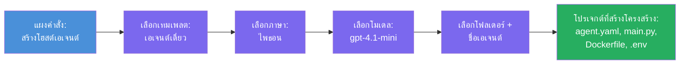

# Module 3 - สร้าง Hosted Agent ใหม่ (สร้างโครงร่างอัตโนมัติด้วยส่วนขยาย Foundry)

ในบทนี้ คุณจะใช้ส่วนขยาย Microsoft Foundry เพื่อ **สร้างโครงร่างโปรเจกต์ [hosted agent](https://learn.microsoft.com/azure/foundry/agents/concepts/hosted-agents) ใหม่** ส่วนขยายจะสร้างโครงสร้างโปรเจกต์ทั้งหมดให้คุณ - รวมถึง `agent.yaml`, `main.py`, `Dockerfile`, `requirements.txt`, ไฟล์ `.env` และการกำหนดค่า debug ของ VS Code หลังจากสร้างโครงร่างแล้ว คุณจะปรับแต่งไฟล์เหล่านี้ด้วยคำสั่ง เครื่องมือ และการกำหนดค่าของ agent ของคุณ

> **แนวคิดสำคัญ:** โฟลเดอร์ `agent/` ในแลปนี้เป็นตัวอย่างของสิ่งที่ส่วนขยาย Foundry สร้างขึ้นเมื่อคุณเรียกคำสั่ง scaffold นี้ คุณไม่ต้องเขียนไฟล์เหล่านี้ตั้งแต่ต้น - ส่วนขยายจะสร้างให้ จากนั้นคุณแก้ไขทีหลัง

### ลำดับขั้นตอนของสรรค์โครงร่าง


---

## ขั้นตอนที่ 1: เปิดตัวช่วยสร้าง Create Hosted Agent

1. กด `Ctrl+Shift+P` เพื่อเปิด **Command Palette** 
2. พิมพ์: **Microsoft Foundry: Create a New Hosted Agent** แล้วเลือก
3. จะเปิดตัวช่วยสร้างการสร้าง hosted agent ขึ้นมา

> **เส้นทางทางเลือก:** คุณยังสามารถเข้าถึงตัวช่วยสร้างนี้ได้จากแถบด้านข้าง Microsoft Foundry → คลิกไอคอน **+** ข้าง **Agents** หรือคลิกขวาแล้วเลือก **Create New Hosted Agent**

---

## ขั้นตอนที่ 2: เลือกแม่แบบ

ตัวช่วยสร้างจะขอให้คุณเลือกแม่แบบ คุณจะเห็นตัวเลือกต่างๆ เช่น:

| แม่แบบ | คำอธิบาย | เมื่อใดควรใช้ |
|--------|----------|--------------|
| **Single Agent** | Agent ตัวเดียวที่มีโมเดล คำสั่ง และเครื่องมือเสริมของตัวเอง | เวิร์กชอปนี้ (แลป 01) |
| **Multi-Agent Workflow** | Agent หลายตัวที่ทำงานร่วมกันเป็นลำดับ | แลป 02 |

1. เลือก **Single Agent**
2. คลิก **Next** (หรือการเลือกจะดำเนินการต่อโดยอัตโนมัติ)

---

## ขั้นตอนที่ 3: เลือกภาษาโปรแกรม

1. เลือก **Python** (แนะนำสำหรับเวิร์กชอปนี้)
2. คลิก **Next**

> **รองรับ C# ด้วย** หากคุณชอบ .NET โครงสร้าง scaffold คล้ายกัน (ใช้ `Program.cs` แทน `main.py`)

---

## ขั้นตอนที่ 4: เลือกโมเดลของคุณ

1. ตัวช่วยสร้างแสดงโมเดลที่ปรับใช้ในโปรเจกต์ Foundry ของคุณ (จาก Module 2)
2. เลือกโมเดลที่คุณปรับใช้ เช่น **gpt-4.1-mini**
3. คลิก **Next**

> หากไม่เห็นโมเดลใด ๆ ให้ย้อนกลับไปที่ [Module 2](02-create-foundry-project.md) และปรับใช้โมเดลก่อน

---

## ขั้นตอนที่ 5: เลือกตำแหน่งโฟลเดอร์และชื่อตัวแทน

1. จะเปิดไดอะล็อกเลือกไฟล์ - เลือก **โฟลเดอร์เป้าหมาย** ที่จะสร้างโปรเจกต์ ในเวิร์กชอปนี้:
   - ถ้าเริ่มใหม่: เลือกโฟลเดอร์ใดก็ได้ (เช่น `C:\Projects\my-agent`)
   - ถ้าทำงานภายในรีโปเวิร์กชอป: สร้างโฟลเดอร์ย่อยใหม่ภายใต้ `workshop/lab01-single-agent/agent/`
2. กรอก **ชื่อ** สำหรับ hosted agent ของคุณ (เช่น `executive-summary-agent` หรือ `my-first-agent`)
3. คลิก **Create** (หรือกด Enter)

---

## ขั้นตอนที่ 6: รอการสร้างโครงร่างเสร็จสิ้น

1. VS Code จะเปิด **หน้าต่างใหม่** พร้อมโปรเจกต์ที่ถูกสร้างโครงร่างแล้ว
2. รอสักครู่ให้โปรเจกต์โหลดอย่างครบถ้วน
3. คุณควรเห็นไฟล์ต่อไปนี้ในแผง Explorer (`Ctrl+Shift+E`):

```
📂 my-first-agent/
├── .env                ← Environment variables (auto-generated with placeholders)
├── .vscode/
│   └── launch.json     ← Debug configuration (F5 to run + Agent Inspector)
├── agent.yaml          ← Agent definition (kind: hosted)
├── Dockerfile          ← Container configuration for deployment
├── main.py             ← Agent entry point (your main code file)
└── requirements.txt    ← Python dependencies
```

> **นี่คือโครงสร้างเดียวกับโฟลเดอร์ `agent/`** ในแลปนี้ ส่วนขยาย Foundry สร้างไฟล์เหล่านี้โดยอัตโนมัติ - คุณไม่ต้องสร้างไฟล์เอง

> **หมายเหตุเวิร์กชอป:** ในรีโปเวิร์กชอปนี้ โฟลเดอร์ `.vscode/` อยู่ที่ **รากของ workspace** (ไม่ใช่ภายในแต่ละโปรเจกต์) มีไฟล์ `launch.json` และ `tasks.json` ร่วมที่มีการกำหนดค่า debug สองแบบ - **"Lab01 - Single Agent"** และ **"Lab02 - Multi-Agent"** - แต่ละแบบชี้ไปยัง `cwd` ที่ถูกต้องของแต่ละแลป เมื่อคุณกด F5 ให้เลือกการกำหนดค่าที่ตรงกับแลปที่คุณกำลังทำงานจากเมนูแบบเลื่อนลง

---

## ขั้นตอนที่ 7: เข้าใจแต่ละไฟล์ที่สร้างขึ้น

ใช้เวลาสำรวจแต่ละไฟล์ที่ตัวช่วยสร้างสร้างขึ้น การเข้าใจจะมีประโยชน์สำหรับ Module 4 (การปรับแต่ง)

### 7.1 `agent.yaml` - นิยามตัวแทน

เปิด `agent.yaml` จะมีลักษณะเช่นนี้:

```yaml
# yaml-language-server: $schema=https://raw.githubusercontent.com/microsoft/AgentSchema/refs/heads/main/schemas/v1.0/ContainerAgent.yaml

kind: hosted
name: my-first-agent
description: >
  A hosted agent deployed to Microsoft Foundry Agent Service.
metadata:
  authors:
    - Microsoft
  tags:
    - Azure AI AgentServer
    - Microsoft Agent Framework
    - Hosted Agent
protocols:
  - protocol: responses
    version: v1
environment_variables:
  - name: AZURE_AI_PROJECT_ENDPOINT
    value: ${PROJECT_ENDPOINT}
  - name: AZURE_AI_MODEL_DEPLOYMENT_NAME
    value: ${MODEL_DEPLOYMENT_NAME}
dockerfile_path: Dockerfile
resources:
  cpu: '0.25'
  memory: 0.5Gi
```

**ฟิลด์สำคัญ:**

| ฟิลด์ | จุดประสงค์ |
|-------|-------------|
| `kind: hosted` | ประกาศว่านี่คือ hosted agent (บนคอนเทนเนอร์ ปรับใช้กับ [Foundry Agent Service](https://learn.microsoft.com/azure/foundry/agents/overview)) |
| `protocols: responses v1` | ตัวแทนเปิดเผย HTTP endpoint `/responses` ที่เข้ากันได้กับ OpenAI |
| `environment_variables` | แม็ปค่าจาก `.env` ไปยังตัวแปร environment ของคอนเทนเนอร์ตอนปรับใช้ |
| `dockerfile_path` | ชี้ไปที่ Dockerfile ที่ใช้สร้างอิมเมจคอนเทนเนอร์ |
| `resources` | กำหนด CPU และหน่วยความจำสำหรับคอนเทนเนอร์ (0.25 CPU, 0.5Gi หน่วยความจำ) |

### 7.2 `main.py` - จุดเริ่มต้นของ Agent

เปิด `main.py` นี่คือไฟล์ Python หลักที่มีตรรกะของ agent ของคุณ โครงร่างรวมถึง:

```python
from agent_framework.azure import AzureAIAgentClient
from azure.ai.agentserver.agentframework import from_agent_framework
from azure.identity.aio import DefaultAzureCredential
```

**ไลบรารีที่นำเข้า (import) สำคัญ:**

| นำเข้า | จุดประสงค์ |
|--------|------------|
| `AzureAIAgentClient` | เชื่อมต่อกับโปรเจกต์ Foundry ของคุณและสร้าง agent ผ่าน `.as_agent()` |
| [`DefaultAzureCredential`](https://learn.microsoft.com/azure/developer/python/sdk/authentication/credential-chains#defaultazurecredential-overview) | จัดการการยืนยันตัวตน (Azure CLI, ลงชื่อเข้าใช้ VS Code, managed identity หรือ service principal) |
| `from_agent_framework` | ห่อหุ้ม agent เป็น HTTP server ที่เปิดเผย endpoint `/responses` |

โฟลว์หลักคือ:
1. สร้าง credential → สร้าง client → เรียก `.as_agent()` เพื่อรับ agent (async context manager) → ห่อเป็น server → รัน

### 7.3 `Dockerfile` - อิมเมจคอนเทนเนอร์

```dockerfile
FROM python:3.14-slim

WORKDIR /app

COPY ./ .

RUN pip install --upgrade pip && \
    if [ -f requirements.txt ]; then \
        pip install -r requirements.txt; \
    else \
        echo "No requirements.txt found" >&2; exit 1; \
    fi

EXPOSE 8088

CMD ["python", "main.py"]
```

**รายละเอียดสำคัญ:**
- ใช้ `python:3.14-slim` เป็นฐานอิมเมจ
- คัดลอกไฟล์โปรเจกต์ทั้งหมดไปยัง `/app`
- อัปเกรด `pip`, ติดตั้ง dependencies จาก `requirements.txt` และล้มเหลวทันทีถ้าไฟล์นี้ขาดหาย
- **เปิดเผยพอร์ต 8088** - นี่คือพอร์ตที่ required สำหรับ hosted agent ห้ามเปลี่ยนแปลง
- เริ่ม agent ด้วยคำสั่ง `python main.py`

### 7.4 `requirements.txt` - ไลบรารีที่ต้องใช้

```
agent-framework-azure-ai==1.0.0rc3
agent-framework-core==1.0.0rc3
azure-ai-agentserver-agentframework==1.0.0b16
azure-ai-agentserver-core==1.0.0b16
debugpy
agent-dev-cli
```

| แพ็กเกจ | จุดประสงค์ |
|-----------|-------------|
| `agent-framework-azure-ai` | การผสานรวม Azure AI สำหรับ Microsoft Agent Framework |
| `agent-framework-core` | Core runtime สำหรับสร้าง agent (รวม `python-dotenv`) |
| `azure-ai-agentserver-agentframework` | runtime สำหรับ hosted agent server บน Foundry Agent Service |
| `azure-ai-agentserver-core` | นามธรรมหลักสำหรับ agent server |
| `debugpy` | รองรับการดีบัก Python (ช่วยให้ดีบักใน VS Code ด้วย F5 ได้) |
| `agent-dev-cli` | CLI สำหรับการพัฒนาและทดสอบ agent บนเครื่อง (ใช้โดยการกำหนดค่าดีบัก/รัน) |

---

## ทำความเข้าใจกับโปรโตคอล agent

Hosted agent สื่อสารผ่านโปรโตคอล **OpenAI Responses API** เมื่อตัวแทนทำงาน (ทั้งบนเครื่องหรือบนคลาวด์) agent จะเปิด HTTP endpoint เพียงจุดเดียว:

```
POST http://localhost:8088/responses
Content-Type: application/json

{
  "input": "Your prompt here",
  "stream": false
}
```

Foundry Agent Service เรียก endpoint นี้เพื่อส่ง prompt ของผู้ใช้และรับคำตอบจาก agent โปรโตคอลนี้เหมือนกับที่ใช้โดย OpenAI API ดังนั้น agent ของคุณจึงเข้ากันได้กับไคลเอนต์ใด ๆ ที่รองรับรูปแบบ OpenAI Responses

---

### จุดตรวจสอบ

- [ ] ตัวช่วยสร้างโครงร่างเสร็จสมบูรณ์และเปิด **หน้าต่าง VS Code ใหม่**
- [ ] คุณเห็นไฟล์ 5 ไฟล์ทั้งหมด: `agent.yaml`, `main.py`, `Dockerfile`, `requirements.txt`, `.env`
- [ ] ไฟล์ `.vscode/launch.json` มีอยู่ (เปิดใช้งานการดีบักด้วย F5 - ในเวิร์กชอปนี้อยู่ที่ราก workspace พร้อมคอนฟิกเฉพาะแลป)
- [ ] คุณได้อ่านและเข้าใจแต่ละไฟล์และจุดประสงค์ของมัน
- [ ] คุณเข้าใจว่าพอร์ต `8088` เป็นพอร์ตที่ต้องใช้งาน และ endpoint `/responses` คือตามโปรโตคอล

---

**ก่อนหน้า:** [02 - Create Foundry Project](02-create-foundry-project.md) · **ถัดไป:** [04 - Configure & Code →](04-configure-and-code.md)

---

<!-- CO-OP TRANSLATOR DISCLAIMER START -->
**ข้อจำกัดความรับผิดชอบ**:  
เอกสารฉบับนี้ได้รับการแปลโดยใช้บริการแปลภาษาด้วย AI [Co-op Translator](https://github.com/Azure/co-op-translator) แม้เราจะพยายามเพื่อความถูกต้อง โปรดทราบว่าการแปลอัตโนมัติอาจมีข้อผิดพลาดหรือความไม่ถูกต้อง เอกสารต้นฉบับในภาษาต้นฉบับควรถูกพิจารณาเป็นแหล่งข้อมูลที่เชื่อถือได้ ในกรณีข้อมูลที่สำคัญ แนะนำให้ใช้การแปลโดยผู้เชี่ยวชาญที่เป็นมนุษย์ เราไม่รับผิดชอบต่อความเข้าใจผิดหรือการตีความที่ผิดพลาดใด ๆ ที่เกิดจากการใช้การแปลนี้
<!-- CO-OP TRANSLATOR DISCLAIMER END -->