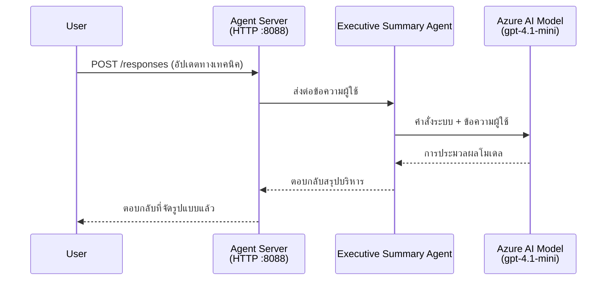
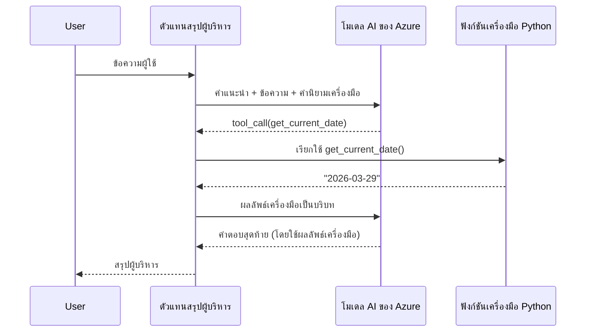

# Module 4 - กำหนดค่าคำสั่ง, สภาพแวดล้อม & ติดตั้ง dependencies

ในโมดูลนี้ คุณจะปรับแต่งไฟล์ตัวแทนอัตโนมัติที่สร้างขึ้นจากโมดูล 3 ที่นี่คือที่ที่คุณเปลี่ยนโครงสร้างทั่วไปให้เป็น **ตัวแทนของคุณ** - โดยการเขียนคำสั่ง กำหนดค่าตัวแปรสภาพแวดล้อม เพิ่มเครื่องมือถ้าต้องการ และติดตั้ง dependencies

> **เตือน:** ส่วนขยาย Foundry สร้างไฟล์โครงการของคุณโดยอัตโนมัติ ตอนนี้คุณจะปรับแต่งมัน ดูโฟลเดอร์ [`agent/`](../../../../../workshop/lab01-single-agent/agent) สำหรับตัวอย่างการใช้งานตัวแทนที่ปรับแต่งแล้วอย่างครบถ้วน

---

## ส่วนประกอบทำงานร่วมกันอย่างไร

### วงจรชีวิตคำขอ (ตัวแทนเดียว)


> **พร้อมเครื่องมือ:** ถ้าตัวแทนมีการลงทะเบียนเครื่องมือ โมเดลอาจส่งกลับคำเรียกเครื่องมือแทนคำตอบตรง โดยที่กรอบงานจะรันเครื่องมือในเครื่อง, ส่งผลลัพธ์กลับไปยังโมเดล แล้วโมเดลจะสร้างคำตอบสุดท้าย


---

## ขั้นตอนที่ 1: กำหนดค่าตัวแปรสภาพแวดล้อม

โครงสร้างสร้างไฟล์ `.env` ขึ้นด้วยค่าแทนที่ คุณต้องใส่ค่าจริงจากโมดูล 2

1. ในโครงการที่สร้างขึ้น เปิดไฟล์ **`.env`** (อยู่ที่ root ของโครงการ)
2. แทนที่ค่าตัวแทนที่ด้วยรายละเอียดโครงการ Foundry ของคุณ:

   ```env
   PROJECT_ENDPOINT=https://<your-account>.services.ai.azure.com/api/projects/<your-project>
   MODEL_DEPLOYMENT_NAME=gpt-4.1-mini
   ```

3. บันทึกไฟล์

### ที่มาของค่าตัวแปรเหล่านี้

| ค่า | วิธีหา |
|-------|---------------|
| **จุดเชื่อมต่อโครงการ** | เปิดแถบด้านข้าง **Microsoft Foundry** ใน VS Code → คลิกที่โครงการของคุณ → URL จุดเชื่อมต่อแสดงในรายละเอียด ดูเหมือน `https://<account-name>.services.ai.azure.com/api/projects/<project-name>` |
| **ชื่อการปรับใช้โมเดล** | ในแถบ Foundry ขยายโครงการของคุณ → ดูใต้ **Models + endpoints** → ชื่อจะแสดงถัดจากโมเดลที่ปรับใช้ (เช่น `gpt-4.1-mini`) |

> **ความปลอดภัย:** อย่าคอมมิตไฟล์ `.env` ในระบบควบคุมเวอร์ชัน มันถูกเพิ่มใน `.gitignore` โดยค่าเริ่มต้น หากยังไม่มีก็เพิ่มเข้าไป:
> ```
> .env
> ```

### การไหลของตัวแปรสภาพแวดล้อม

ห่วงโซ่แมปคือ: `.env` → `main.py` (อ่านผ่าน `os.getenv`) → `agent.yaml` (แมปเป็นตัวแปร env ของคอนเทนเนอร์ตอน deploy)

ใน `main.py` โครงสร้างอ่านค่าดังนี้:

```python
PROJECT_ENDPOINT = os.getenv("AZURE_AI_PROJECT_ENDPOINT") or os.getenv("PROJECT_ENDPOINT")
MODEL_DEPLOYMENT_NAME = os.getenv("AZURE_AI_MODEL_DEPLOYMENT_NAME", os.getenv("MODEL_DEPLOYMENT_NAME", "gpt-4.1-mini"))
```

ทั้ง `AZURE_AI_PROJECT_ENDPOINT` และ `PROJECT_ENDPOINT` สามารถใช้ได้ (`agent.yaml` ใช้คำนำหน้า `AZURE_AI_*`)

---

## ขั้นตอนที่ 2: เขียนคำสั่งตัวแทน

นี่คือขั้นตอนปรับแต่งที่สำคัญที่สุด คำสั่งกำหนดบุคลิกภาพ พฤติกรรม รูปแบบผลลัพธ์ และข้อจำกัดความปลอดภัยของตัวแทนคุณ

1. เปิด `main.py` ในโครงการของคุณ
2. หา string คำสั่ง (โครงสร้างมีคำสั่งเริ่มต้น/ทั่วไป)
3. แทนที่ด้วยคำสั่งที่ละเอียดและมีโครงสร้าง

### คำสั่งที่ดีควรรวมอะไรบ้าง

| ส่วนประกอบ | จุดประสงค์ | ตัวอย่าง |
|-----------|---------|---------|
| **บทบาท** | ตัวแทนคือใครและทำอะไร | "คุณคือตัวแทนสรุปผู้บริหาร" |
| **กลุ่มเป้าหมาย** | ใครคือผู้รับคำตอบ | "ผู้นำระดับสูงที่มีพื้นฐานทางเทคนิคจำกัด" |
| **คำนิยามอินพุต** | คำถามประเภทใดที่จัดการได้ | "รายงานเหตุการณ์ทางเทคนิค, อัปเดตการปฏิบัติงาน" |
| **รูปแบบผลลัพธ์** | โครงสร้างคำตอบที่ชัดเจน | "สรุปผู้บริหาร: - เกิดอะไรขึ้น: ... - ผลกระทบธุรกิจ: ... - ขั้นตอนถัดไป: ..." |
| **กฎเกณฑ์** | ข้อจำกัดและเงื่อนไขการปฏิเสธ | "ห้ามเพิ่มข้อมูลที่ไม่ได้ให้มา" |
| **ความปลอดภัย** | ป้องกันการใช้งานผิดและการหลอกลวง | "ถ้าอินพุตไม่ชัดเจน ให้ขอคำชี้แจง" |
| **ตัวอย่าง** | ตัวอย่างคำถาม-คำตอบเพื่อควบคุมพฤติกรรม | รวม 2-3 ตัวอย่างกับอินพุตต่างกัน |

### ตัวอย่าง: คำสั่งตัวแทนสรุปผู้บริหาร

นี่คือคำสั่งที่ใช้ในเวิร์กช็อป [`agent/main.py`](../../../../../workshop/lab01-single-agent/agent/main.py):

```python
AGENT_INSTRUCTIONS = """You are an "Explain Like I'm an Executive" agent.

Purpose:
Your job is to translate complex technical or operational information into
clear, concise, and outcome-focused summaries that can be easily understood
by non-technical executives.

Audience:
Senior leaders with limited technical background who care about impact,
risk, and what happens next.

What you must do:
- Rephrase the input so it is understandable to a non-technical audience
- Prioritize clarity, brevity, and outcomes over technical accuracy
- Remove technical jargon, logs, metrics, stack traces, and deep root-cause details
- Translate technical causes into simple cause-and-effect statements
- Explicitly call out business impact
- Always include a clear next step or action
- Maintain a neutral, factual, and calm executive tone
- Do NOT add new facts or speculate beyond the input

Standard Output Structure (always use this wording):

Executive Summary:
- What happened: <plain-language description>
- Business impact: <clear, non-technical impact>
- Next step: <clear action or mitigation>

Rules:
- Keep responses under 100 words
- Do NOT add facts beyond the input
- If input is unclear, ask for clarification
"""
```

4. แทนที่ string คำสั่งที่มีอยู่ใน `main.py` ด้วยคำสั่งของคุณ
5. บันทึกไฟล์

---

## ขั้นตอนที่ 3: (ถ้าต้องการ) เพิ่มเครื่องมือกำหนดเอง

ตัวแทนที่โฮสต์สามารถรัน **ฟังก์ชัน Python ในเครื่อง** เป็น [เครื่องมือ](https://learn.microsoft.com/azure/foundry/agents/concepts/tool-catalog) นี่คือข้อได้เปรียบหลักของตัวแทนที่ใช้โค้ดเมื่อเทียบกับตัวแทนที่ใช้แค่ prompt — ตัวแทนของคุณรันตรรกะฝั่งเซิร์ฟเวอร์ได้

### 3.1 กำหนดฟังก์ชันเครื่องมือ

เพิ่มฟังก์ชันเครื่องมือใน `main.py`:

```python
from agent_framework import tool

@tool
def get_current_date() -> str:
    """Returns the current date in YYYY-MM-DD format."""
    from datetime import date
    return str(date.today())
```

`@tool` decorator แปลงฟังก์ชัน Python ปกติเป็นเครื่องมือของตัวแทน ข้อความ docstring จะเป็นคำอธิบายเครื่องมือที่โมเดลเห็น

### 3.2 ลงทะเบียนเครื่องมือกับตัวแทน

ตอนสร้างตัวแทนผ่าน context manager `.as_agent()` ให้ส่งเครื่องมือในพารามิเตอร์ `tools`:

```python
async with AzureAIAgentClient(
    project_endpoint=PROJECT_ENDPOINT,
    model_deployment_name=MODEL_DEPLOYMENT_NAME,
    credential=credential,
).as_agent(
    name="my-agent",
    instructions=AGENT_INSTRUCTIONS,
    tools=[get_current_date],
) as agent:
    server = from_agent_framework(agent)
    await server.run_async()
```

### 3.3 การทำงานของการเรียกเครื่องมือ

1. ผู้ใช้ส่ง prompt
2. โมเดลตัดสินใจว่าต้องใช้เครื่องมือไหม (อ้างอิงจาก prompt, คำสั่ง, และคำอธิบายเครื่องมือ)
3. ถ้าต้องใช้เครื่องมือ กรอบงานจะเรียกฟังก์ชัน Python ของคุณในเครื่อง (ภายในคอนเทนเนอร์)
4. ค่าที่เครื่องมือส่งกลับจะถูกส่งไปยังโมเดลเป็นบริบท
5. โมเดลสร้างคำตอบสุดท้าย

> **เครื่องมือรันฝั่งเซิร์ฟเวอร์** — เครื่องมือทำงานภายในคอนเทนเนอร์ของคุณ ไม่ใช่ในเบราว์เซอร์ของผู้ใช้หรือโมเดล ทำให้คุณเข้าถึงฐานข้อมูล, API, ระบบไฟล์ หรือไลบรารี Python ใดๆ ได้

---

## ขั้นตอนที่ 4: สร้างและเปิดใช้งานสภาพแวดล้อมเสมือน

ก่อนติดตั้ง dependencies ให้สร้างสภาพแวดล้อม Python แยกต่างหาก

### 4.1 สร้างสภาพแวดล้อมเสมือน

เปิดเทอร์มินัลใน VS Code (`` Ctrl+` ``) แล้วรัน:

```powershell
python -m venv .venv
```

จะสร้างโฟลเดอร์ `.venv` ในไดเรกทอรีโครงการของคุณ

### 4.2 เปิดใช้งานสภาพแวดล้อมเสมือน

**PowerShell (Windows):**

```powershell
.\.venv\Scripts\Activate.ps1
```

**Command Prompt (Windows):**

```cmd
.venv\Scripts\activate.bat
```

**macOS/Linux (Bash):**

```bash
source .venv/bin/activate
```

คุณควรเห็น `(.venv)` ปรากฏที่จุดเริ่มต้นพรอมต์เทอร์มินัล แสดงว่าสภาพแวดล้อมเสมือนเปิดใช้งานแล้ว

### 4.3 ติดตั้ง dependencies

เมื่อเปิดสภาพแวดล้อมเสมือน ให้ติดตั้งแพ็กเกจที่ต้องการ:

```powershell
pip install -r requirements.txt
```

จะติดตั้ง:

| แพ็คเกจ | จุดประสงค์ |
|---------|---------|
| `agent-framework-azure-ai==1.0.0rc3` | การผสาน Azure AI สำหรับ [Microsoft Agent Framework](https://learn.microsoft.com/agent-framework/overview/) |
| `agent-framework-core==1.0.0rc3` | รันไทม์หลักสำหรับสร้างตัวแทน (รวม `python-dotenv`) |
| `azure-ai-agentserver-agentframework==1.0.0b16` | รันไทม์เซิร์ฟเวอร์ตัวแทนโฮสต์สำหรับ [Foundry Agent Service](https://learn.microsoft.com/azure/foundry/agents/overview) |
| `azure-ai-agentserver-core==1.0.0b16` | นามธรรมหลักของเซิร์ฟเวอร์ตัวแทน |
| `debugpy` | การดีบัก Python (เปิดใช้งานดีบัก F5 ใน VS Code) |
| `agent-dev-cli` | CLI สำหรับพัฒนาและทดสอบตัวแทนในเครื่อง |

### 4.4 ตรวจสอบการติดตั้ง

```powershell
pip list | Select-String "agent-framework|agentserver"
```

ผลลัพธ์ที่คาดหวัง:
```
agent-framework-azure-ai   1.0.0rc3
agent-framework-core       1.0.0rc3
azure-ai-agentserver-agentframework 1.0.0b16
azure-ai-agentserver-core  1.0.0b16
```

---

## ขั้นตอนที่ 5: ตรวจสอบการรับรองความถูกต้อง

ตัวแทนใช้ [`DefaultAzureCredential`](https://learn.microsoft.com/azure/developer/python/sdk/authentication/credential-chains#defaultazurecredential-overview) ซึ่งพยายามวิธีรับรองความถูกต้องหลายวิธีในลำดับนี้:

1. **ตัวแปรสภาพแวดล้อม** - `AZURE_CLIENT_ID`, `AZURE_TENANT_ID`, `AZURE_CLIENT_SECRET` (service principal)
2. **Azure CLI** - ดึงเซสชัน `az login` ของคุณ
3. **VS Code** - ใช้บัญชีที่คุณลงชื่อเข้าใช้ VS Code
4. **Managed Identity** - ใช้เมื่อรันใน Azure (ตอน deploy)

### 5.1 ตรวจสอบสำหรับการพัฒนาในเครื่อง

ควรมีวิธีใดวิธีหนึ่งนี้ใช้งานได้:

**ทางเลือก A: Azure CLI (แนะนำ)**

```powershell
az account show --query "{name:name, id:id}" --output table
```

ผลลัพธ์ที่คาดหวัง: แสดงชื่อและ ID การสมัครสมาชิกของคุณ

**ทางเลือก B: ลงชื่อเข้าใช้ VS Code**

1. ดูที่มุมล่างซ้ายของ VS Code สำหรับไอคอน **Accounts**
2. หากเห็นชื่อบัญชีของคุณ แสดงว่าคุณได้รับการรับรองความถูกต้องแล้ว
3. หากไม่ใช่ ให้คลิกไอคอน → **Sign in to use Microsoft Foundry**

**ทางเลือก C: Service principal (สำหรับ CI/CD)**

```powershell
$env:AZURE_TENANT_ID = "<your-tenant-id>"
$env:AZURE_CLIENT_ID = "<your-client-id>"
$env:AZURE_CLIENT_SECRET = "<your-client-secret>"
```

### 5.2 ปัญหาทั่วไปเกี่ยวกับการรับรองความถูกต้อง

ถ้าคุณลงชื่อเข้าใช้หลายบัญชี Azure ให้ตรวจสอบว่าเลือกการสมัครสมาชิกถูกต้อง:

```powershell
az account set --subscription "<your-subscription-id>"
```

---

### จุดตรวจสอบ

- [ ] ไฟล์ `.env` มีค่า `PROJECT_ENDPOINT` และ `MODEL_DEPLOYMENT_NAME` ที่ถูกต้อง (ไม่ใช่ตัวแทน)
- [ ] คำสั่งตัวแทนใน `main.py` ถูกปรับแต่ง — กำหนดบทบาท กลุ่มเป้าหมาย รูปแบบผลลัพธ์ กฎเกณฑ์ และข้อจำกัดความปลอดภัย
- [ ] (ถ้าต้องการ) เครื่องมือกำหนดเองถูกสร้างและลงทะเบียนแล้ว
- [ ] สภาพแวดล้อมเสมือนถูกสร้างและเปิดใช้งาน (`(.venv)` ปรากฏในพรอมต์เทอร์มินัล)
- [ ] `pip install -r requirements.txt` ติดตั้งสำเร็จไม่มีข้อผิดพลาด
- [ ] `pip list | Select-String "azure-ai-agentserver"` แสดงว่าแพ็กเกจถูกติดตั้ง
- [ ] การรับรองความถูกต้องถูกต้อง — `az account show` คืนค่าการสมัครสมาชิก หรือคุณได้ลงชื่อเข้าใช้ VS Code แล้ว

---

**ก่อนหน้า:** [03 - Create Hosted Agent](03-create-hosted-agent.md) · **ถัดไป:** [05 - Test Locally →](05-test-locally.md)

---

<!-- CO-OP TRANSLATOR DISCLAIMER START -->
**ข้อจำกัดความรับผิดชอบ**:  
เอกสารนี้ได้รับการแปลโดยใช้บริการแปลภาษาด้วย AI [Co-op Translator](https://github.com/Azure/co-op-translator) แม้ว่าเราจะพยายามให้การแปลมีความถูกต้อง แต่โปรดทราบว่าการแปลโดยอัตโนมัติอาจมีข้อผิดพลาดหรือความไม่ถูกต้อง เอกสารต้นฉบับในภาษาต้นทางควรถือเป็นแหล่งข้อมูลที่เชื่อถือได้ สำหรับข้อมูลที่สำคัญ การแปลโดยมนุษย์ผู้เชี่ยวชาญขอแนะนำ เราไม่รับผิดชอบต่อความเข้าใจผิดหรือการตีความที่ผิดพลาดใด ๆ ที่เกิดขึ้นจากการใช้การแปลนี้
<!-- CO-OP TRANSLATOR DISCLAIMER END -->