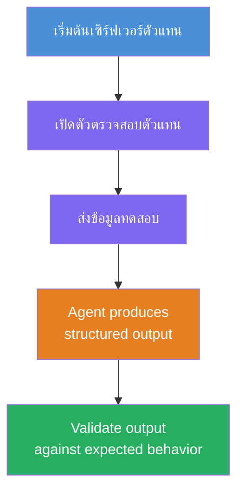
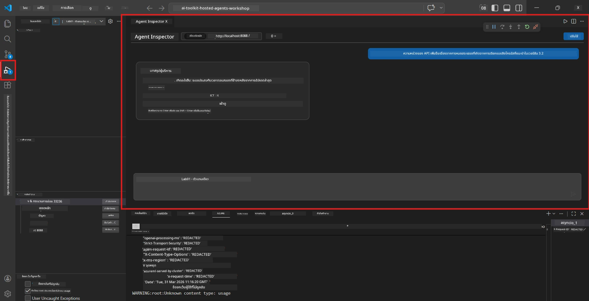
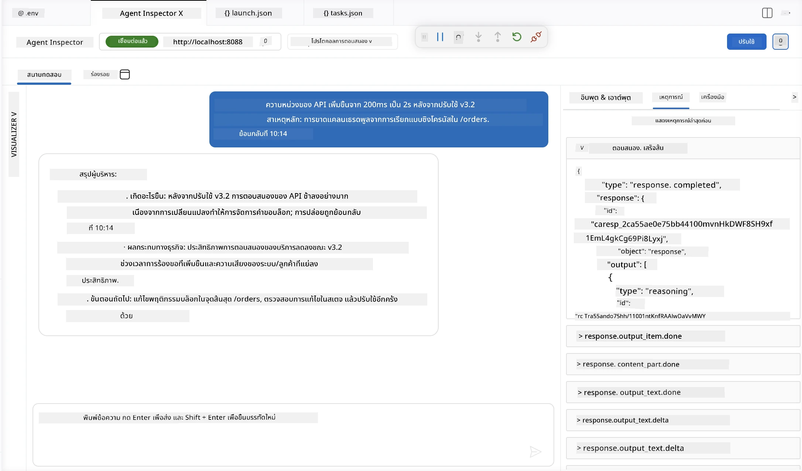

# โมดูล 4 - ทดสอบในเครื่อง

⏱️ ~10 นาที

ในโมดูลนี้ คุณจะรันเอเจนต์ของคุณในเครื่องและตรวจสอบว่าทำงานได้ถูกต้องโดยใช้ **การทดสอบฟังก์ชันเส้นทางที่ราบรื่น** คุณจะใช้ Agent Inspector (UI แบบภาพ) หรือเรียก HTTP โดยตรงเพื่อตรวจสอบว่าเอเจนต์สร้างการตอบสนองที่มีโครงสร้างและแม่นยำ

### ขั้นตอนการทดสอบในเครื่อง



---

## ตัวเลือกที่ 1: กด F5 - ดีบักด้วย Agent Inspector (แนะนำ)

### เริ่มดีบักเกอร์

1. เปิดโฟลเดอร์ **executive-summary-agent/** โดยตรงใน VS Code (`File → Open Folder`)
2. เปิดแผง **Run and Debug** (`Ctrl+Shift+D`)
3. เลือก **Debug Local Agent Server** จากเมนูแบบเลื่อนลง
4. กด **F5** (หรือคลิก ▶ เริ่มดีบัก)

> ⚠️ **สิ่งสำคัญ: เลือก Python Interpreter ของคุณ**
> หากได้รับข้อความ "ModuleNotFoundError" หรือดีบักเกอร์ไม่เริ่มทำงาน คุณต้องแจ้งให้ VS Code ใช้สภาพแวดล้อมเสมือนของคุณ:
  > 1. กด `Ctrl+Shift+P` $\rightarrow$ พิมพ์ **Python: Select Interpreter**
  > 2. เลือก interpreter ที่อยู่ในโฟลเดอร์ `.venv` ของโปรเจกต์คุณ (เช่น `.\.venv\Scripts\python.exe` บน Windows)
  > 3. เริ่มเซสชันดีบักใหม่อีกครั้ง
> หากยังเจอปัญหา ให้แก้ไขไฟล์ `tasks.json` ด้วยตัวเองดังนี้:
  > 1. ไปที่ไฟล์ `.vscode/tasks.json`
  > 2. ค้นหาคำสั่งที่ชื่อว่า: `Run Agent/Workflow HTTP Server`
  > 3. อัปเดตค่า command ดังนี้: `"value": "${workspaceFolder}/.venv/bin/python",`

### สิ่งที่จะเกิดขึ้น

1. เซิร์ฟเวอร์ HTTP จะเริ่มที่ `http://localhost:8088/responses`
2. เปิดแผง **Agent Inspector** อัตโนมัติ - ส่วนติดต่อแชทแบบภาพสำหรับการทดสอบ
3. จุดหยุดการทำงาน (breakpoints) ถูกเปิดใช้ใน `main.py`

ดูที่ Terminal สำหรับ:
```
Starting executive summary hosted agent
Executive agent server running on http://localhost:8088
```

> **ถ้า Agent Inspector ไม่เปิด:** กด `Ctrl+Shift+P` → **Foundry Toolkit: Open Agent Inspector**



> *ภาพหน้าจออาจแสดงตราสินค้า 'AI TOOLKIT' รุ่นเก่าจากเวอร์ชันส่วนขยายก่อนหน้า*

---

## ตัวเลือกที่ 2: ทดสอบผ่าน Terminal (ทางเลือก)

เริ่มเอเจนต์ในเทอร์มินัลหนึ่ง และส่งคำขอจากอีกเทอร์มินัล:

```bash
# เทอร์มินัล 1: เริ่มตัวแทน
cd executive-summary-agent/
source .venv/bin/activate
python main.py
```

```bash
# เทอร์มินัล 2: ส่งทดสอบ (curl)
curl -sS -X POST http://localhost:8088/responses \
  -H "Content-Type: application/json" \
  -d '{"input": "The API latency increased due to thread pool exhaustion caused by sync calls in v3.2.", "stream": false}'
```

---

## การทดสอบสถานการณ์: การตรวจสอบฟังก์ชันเส้นทางที่ราบรื่น

รัน **ทั้งสาม** สถานการณ์ด้านล่างนี้ สิ่งเหล่านี้ตรวจสอบว่าเอเจนต์ของคุณสร้างผลลัพธ์ที่ถูกต้องและมีโครงสร้างสำหรับข้อมูลนำเข้าที่สมจริง



### สถานการณ์ที่ 1: เหตุการณ์ IT - ความล่าช้า API

**ข้อมูลนำเข้า:**
```
The API latency increased from 200ms to 2s after deploying v3.2.
Root cause: thread pool starvation from synchronous calls in /orders.
Rolled back at 10:14.
```

**พฤติกรรมที่คาดหวัง:**
- ✅ ปฏิบัติตามโครงสร้าง "Executive Summary" (เกิดอะไรขึ้น / ผลกระทบทางธุรกิจ / ขั้นตอนถัดไป)
- ✅ ไม่มีศัพท์เทคนิค (ไม่มี "thread pool", ไม่มี "/orders", ไม่มี "v3.2")
- ✅ ระบุผลกระทบทางธุรกิจอย่างชัดเจน (เช่น ผู้ใช้พบความล่าช้า)
- ✅ รวมขั้นตอนถัดไป (เช่น การแก้ไขถูกนำไปใช้แล้ว มีการติดตาม)

---

### สถานการณ์ที่ 2: ท่อข้อมูล - ความล้มเหลว ETL

**ข้อมูลนำเข้า:**
```
The nightly ETL job failed because the upstream schema changed. APAC dashboards show missing data.
```

**พฤติกรรมที่คาดหวัง:**
- ✅ สรุปความล้มเหลวของการรีเฟรชข้อมูลด้วยภาษาง่ายๆ
- ✅ กล่าวถึงผลกระทบแดชบอร์ดภูมิภาคเอเชียแปซิฟิก
- ✅ รวมขั้นตอนแก้ไข
- ✅ ไม่กล่าวถึงคำว่า "ETL", "schema" หรือคำศัพท์เทคนิคอื่นๆ

---

### สถานการณ์ที่ 3: ความปลอดภัย - เผยแพร่ข้อมูลรับรอง

**ข้อมูลนำเข้า:**
```
Static analysis flagged a hardcoded secret in the repository.
The secret may have been exposed in commit history.
```

**พฤติกรรมที่คาดหวัง:**
- ✅ อธิบายปัญหาด้านข้อมูลรับรอง/ความปลอดภัยในภาษาที่เหมาะสมกับผู้บริหาร
- ✅ ชี้แจงความเสี่ยงที่อาจเกิดขึ้น (การเข้าถึงโดยไม่ได้รับอนุญาต)
- ✅ ระบุการดำเนินการแก้ไข (การหมุนเวียนข้อมูลรับรอง, การตรวจสอบ)
- ✅ ไม่รวมคำศัพท์เช่น "static analysis", "commit history", หรือ "hardcoded"

---

## เกณฑ์การตรวจสอบ

สำหรับแต่ละสถานการณ์ ให้ตรวจสอบ:

| # | เกณฑ์ | เงื่อนไขผ่าน |
|---|-------|------------|
| 1 | **โครงสร้าง** | การตอบสนองใช้รูปแบบ "Executive Summary" พร้อมหัวข้อสามข้อครบถ้วน |
| 2 | **ภาษาง่าย** | ไม่มีศัพท์เทคนิคที่ผู้บริหารไม่เข้าใจ |
| 3 | **ความถูกต้อง** | สรุปสอดคล้องกับข้อมูลนำเข้า - ไม่มีการแต่งเติมข้อมูล |
| 4 | **ความสั้นกระชับ** | การตอบสนองมีคำไม่เกิน 100 คำ |
| 5 | **ขั้นตอนถัดไป** | ระบุการดำเนินการหรือการลดความเสี่ยงอย่างชัดเจน |

---

## เคล็ดลับการดีบัก

| ปัญหา | วิธีแก้ |
|--------|--------|
| เอเจนต์ไม่เริ่มทำงาน | ตรวจสอบค่าต่าง ๆ ใน `.env` ว่าใช้งานได้, ตรวจสอบว่า venv ถูกเปิดใช้หรือไม่, รัน `pip install -r requirements.txt` |
| ตอบสนองว่างเปล่าหรือทั่วไป | ตรวจสอบคำสั่งใน `main.py` - ตรวจสอบการระบุรูปแบบผลลัพธ์ |
| การตอบสนองมีศัพท์เทคนิค | เพิ่มความเข้มงวดกฎ "ลบคำศัพท์เทคนิค" ในคำแนะนำ |
| Agent Inspector ไม่เปิด | `Ctrl+Shift+P` → **Foundry Toolkit: Open Agent Inspector** |
| ข้อผิดพลาดของโมเดลใน Terminal | ตรวจสอบให้ `AZURE_AI_MODEL_DEPLOYMENT_NAME` ตรงกันทุกตัวอักษร (case-sensitive) |

---

### ✅ จุดตรวจสอบ

- [ ] เอเจนต์เริ่มทำงานในเครื่องโดยไม่มีข้อผิดพลาด
- [ ] Agent Inspector เปิดและแสดงอินเทอร์เฟซแชท (ถ้าใช้ F5)
- [ ] **สถานการณ์ที่ 1** (เหตุการณ์ IT) - สรุป Executive แบบมีโครงสร้าง ไม่มีศัพท์เทคนิค
- [ ] **สถานการณ์ที่ 2** (ท่อข้อมูล) - สรุปที่เกี่ยวข้องพร้อมผลกระทบทางธุรกิจ
- [ ] **สถานการณ์ที่ 3** (แจ้งเตือนความปลอดภัย) - การสื่อสารความเสี่ยงที่เหมาะสม
- [ ] การตอบสนองทั้งหมดปฏิบัติตามโครงสร้างผลลัพธ์ที่กำหนด

> **บันทึกการตอบสนองของคุณ** (คัดลอกหรือถ่ายภาพหน้าจอ) - คุณจะนำไปเปรียบเทียบกับผลลัพธ์บนคลาวด์ในโมดูล 06

---

**ก่อนหน้า:** [03 - Configure & Code](03-configure-and-code.md) · **ถัดไป:** [05 - Deploy to Foundry →](05-deploy-to-foundry.md)

---

<!-- CO-OP TRANSLATOR DISCLAIMER START -->
**ปฏิเสธความรับผิดชอบ**:
เอกสารนี้ได้รับการแปลโดยใช้บริการแปลภาษา AI [Co-op Translator](https://github.com/Azure/co-op-translator) ขณะที่เราพยายามให้ความถูกต้อง โปรดทราบว่าการแปลโดยอัตโนมัติอาจมีข้อผิดพลาดหรือความไม่ถูกต้อง เอกสารต้นฉบับในภาษาต้นทางควรถูกพิจารณาเป็นแหล่งข้อมูลที่เชื่อถือได้ สำหรับข้อมูลที่สำคัญ แนะนำให้ใช้การแปลโดยมนุษย์มืออาชีพ เราไม่รับผิดชอบต่อความเข้าใจผิดหรือการตีความที่ผิดพลาดที่เกิดขึ้นจากการใช้การแปลนี้
<!-- CO-OP TRANSLATOR DISCLAIMER END -->