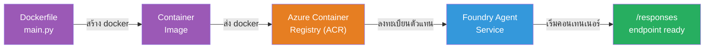
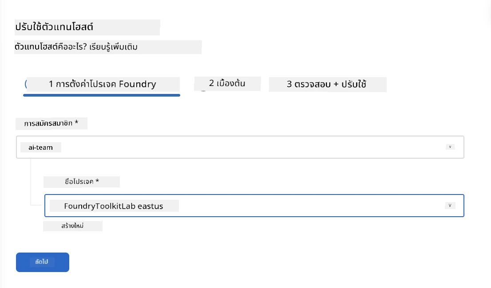
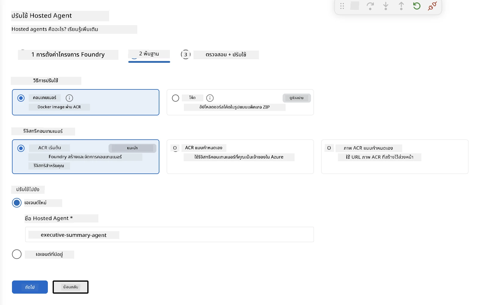
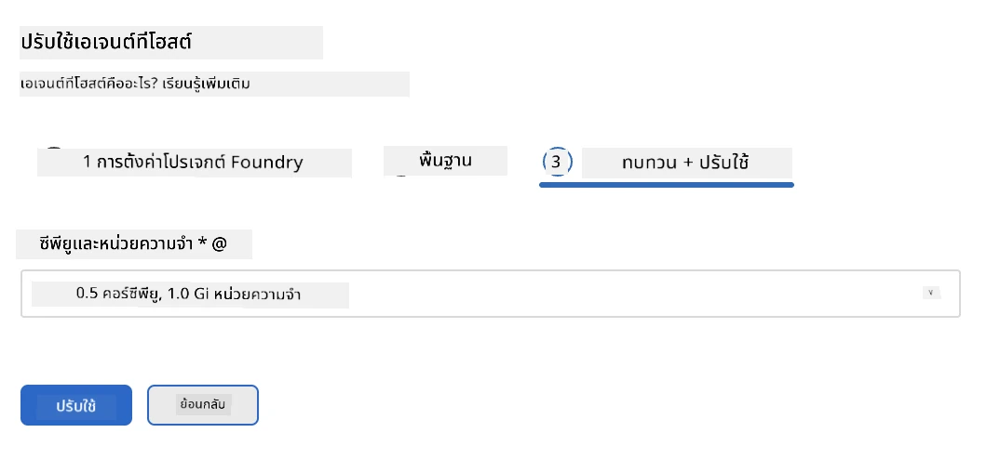
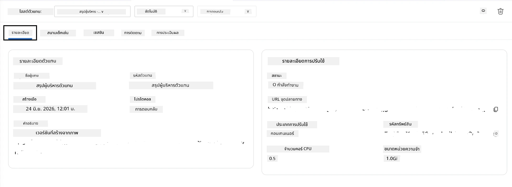

# โมดูล 5 - การปรับใช้ไปยัง Foundry Agent Service

⏱️ ~10 นาที

> ⚠️ **ผู้ใช้เส้นทาง B:** โมดูลนี้ต้องการการสมัครสมาชิก Foundry หากคุณใช้ Foundry Local ให้ข้ามไปที่ [โมดูล 07 - สรุป](07-summary.md) คุณได้ทำงานพัฒนาท้องถิ่นเสร็จสิ้นเรียบร้อยแล้ว!

ในโมดูลนี้ คุณจะปรับใช้ agent ที่ทดสอบในเครื่องของคุณไปยัง Microsoft Foundry ในฐานะ **Hosted Agent** การปรับใช้จะสร้างอิมเมจคอนเทนเนอร์ ผลักดันไปยัง Azure Container Registry และเริ่ม agent บนโครงสร้างพื้นฐานที่มีการจัดการของ Foundry

### กระบวนการปรับใช้

---

## ตรวจสอบความพร้อมก่อน

ก่อนปรับใช้ โปรดตรวจสอบ:

- [ ] Agent ผ่านทั้ง 3 สถานการณ์การทดสอบในเครื่องจาก [โมดูล 04](04-test-locally.md)
- [ ] คุณมีบทบาท **Azure AI User** ในระดับโปรเจกต์ ([โมดูล 01, มอบหมาย RBAC](01-setup.md#deploy-a-model--assign-rbac))
- [ ] คุณได้เข้าสู่ระบบ Azure ใน VS Code (ไอคอนบัญชีแสดงชื่อของคุณ)

---

## ขั้นตอนที่ 1: เริ่มการปรับใช้

### ตัวเลือก ก: ปรับใช้จาก Agent Inspector (แนะนำ)

หาก Agent Inspector เปิดอยู่ (จากการทดสอบ):
1. คลิกปุ่ม **Deploy** ที่มุมบนขวา (ไอคอนรูปเมฆ ↑)

### ตัวเลือก ข: ปรับใช้จาก Command Palette

1. กด `Ctrl+Shift+P` → **Foundry Toolkit: Deploy Hosted Agent**

---

## ขั้นตอนที่ 2: กำหนดค่าการปรับใช้

ตัวช่วยจะให้คุณกรอกข้อมูล:

| รายการคำถาม | ตัวเลือก |
|--------|-----------|
| **Subscription** | การสมัคร Azure ของคุณ |
| **โปรเจกต์เป้าหมาย** | โปรเจกต์ Foundry ของคุณ (เช่น `workshop-agents`) |

คลิก **ถัดไป** เพื่อกำหนดค่า agent ของคุณ

| รายการคำถาม | ตัวเลือก |
|--------|-----------|
| **วิธีการปรับใช้** | Container |
| **คลังเก็บคอนเทนเนอร์** | **ACR เริ่มต้น** (Microsoft Foundry สร้างและจัดการให้คุณ) |
| **ปรับใช้ไปยัง** | Agent ใหม่ (ชื่อ, `executive-summary-agent`) |

คลิก **ถัดไป** เพื่อตรวจสอบและปรับใช้ agent ของคุณ

| รายการคำถาม | ตัวเลือก |
|--------|-----------|
| **CPU และหน่วยความจำ** | **0.25 CPU cores, 0.5 Gi memory** (เพียงพอสำหรับ workshop) |

---

## ขั้นตอนที่ 3: ปรับใช้และเฝ้าติดตาม

1. คลิก **Deploy**
2. ดูที่แผง **Output** (เลือก **Microsoft Foundry** จากเมนูดรอปดาวน์)
3. การปรับใช้จะผ่านขั้นตอนดังนี้:
   - **Docker build** - สร้างคอนเทนเนอร์จาก Dockerfile ของคุณ
   - **Docker push** - ดันอิมเมจไปยัง ACR (ใช้เวลา 1–3 นาทีในการปรับใช้ครั้งแรก)
   - **Agent registration** - สร้าง hosted agent ใน Foundry
   - **Container start** - เริ่มด้วยระบบจัดการตัวตน (system-managed identity)

4. เมื่อเสร็จแล้ว จะมีการแจ้งเตือน:
   > **my-agent ถูกปรับใช้อย่างสำเร็จแล้ว** `แสดงบันทึก` `เรียกใช้ agent`

5. คลิก **Run agent** เพื่อเปิด Agent Playground

### ค่าสถานะการปรับใช้

| สถานะ | ความหมาย |
|--------|---------|
| **Running** | คอนเทนเนอร์พร้อมใช้งาน, agent ตอบสนอง |
| **Pending** | กำลังเริ่มคอนเทนเนอร์ - รอ 30–60 วินาที |
| **Failed** | ตรวจสอบบันทึก (ดูวิธีแก้ไขด้านล่าง) |

---

## ข้อผิดพลาดทั่วไปในการปรับใช้

| ข้อผิดพลาด | สาเหตุหลัก | การแก้ไข |
|-------|-----------|-----|
| ไม่ได้รับอนุญาต `agents/write` | ขาดบทบาท **Azure AI User** ในระดับโปรเจกต์ | [โมดูล 01, มอบหมาย RBAC](01-setup.md#deploy-a-model--assign-rbac) |
| Docker ไม่ทำงาน | Docker Desktop ยังไม่เริ่ม | เริ่ม Docker Desktop → ตรวจสอบ `docker info` |
| การอนุญาต ACR | managed identity ดึงอิมเมจไม่ได้ | ดู [โมดูล 08 - การแก้ไขปัญหา](08-troubleshooting.md) |

---

### ✅ จุดตรวจสอบ

- [ ] ปรับใช้เสร็จสมบูรณ์โดยไม่มีข้อผิดพลาด
- [ ] agent ปรากฏใน **Hosted Agents (Preview)** ที่แถบ Foundry
- [ ] สถานะคอนเทนเนอร์แสดง **Running**
- [ ] แท็บ Agent Playground เปิดขึ้น แสดงรายละเอียด agent และ URL จุดเชื่อมต่อ

---

**ก่อนหน้า:** [04 - ทดสอบในเครื่อง](04-test-locally.md) · **ถัดไป:** [06 - ตรวจสอบใน Playground →](06-verify-in-playground.md)

---

<!-- CO-OP TRANSLATOR DISCLAIMER START -->
**ปฏิเสธความรับผิดชอบ**:
เอกสารนี้ได้รับการแปลโดยใช้บริการแปลภาษา AI [Co-op Translator](https://github.com/Azure/co-op-translator) ขณะที่เราพยายามให้ความถูกต้อง โปรดทราบว่าการแปลโดยอัตโนมัติอาจมีข้อผิดพลาดหรือความไม่ถูกต้อง เอกสารต้นฉบับในภาษาต้นทางควรถูกพิจารณาเป็นแหล่งข้อมูลที่เชื่อถือได้ สำหรับข้อมูลที่สำคัญ แนะนำให้ใช้การแปลโดยมนุษย์มืออาชีพ เราไม่รับผิดชอบต่อความเข้าใจผิดหรือการตีความที่ผิดพลาดที่เกิดขึ้นจากการใช้การแปลนี้
<!-- CO-OP TRANSLATOR DISCLAIMER END -->