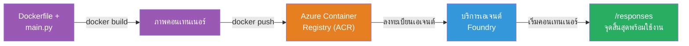
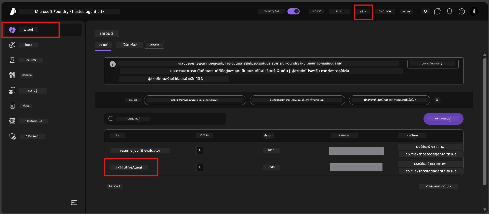

# Module 6 - การปรับใช้ไปยังบริการ Foundry Agent

ในโมดูลนี้ คุณจะปรับใช้ตัวแทนที่ทดสอบแล้วในเครื่องของคุณไปยัง Microsoft Foundry ในฐานะ [**Hosted Agent**](https://learn.microsoft.com/azure/foundry/agents/concepts/hosted-agents) กระบวนการปรับใช้จะสร้างอิมเมจ Docker container จากโปรเจกต์ของคุณ ดันไปยัง [Azure Container Registry (ACR)](https://learn.microsoft.com/azure/container-registry/container-registry-intro) และสร้างเวอร์ชันตัวแทนที่โฮสต์ใน [Foundry Agent Service](https://learn.microsoft.com/azure/foundry/agents/overview)

### สายงานการปรับใช้


---

## การตรวจสอบข้อกำหนดล่วงหน้า

ก่อนปรับใช้ ให้ตรวจสอบรายการแต่ละข้อด้านล่าง การข้ามข้อเหล่านี้เป็นสาเหตุที่พบบ่อยที่สุดของความล้มเหลวในการปรับใช้

1. **ตัวแทนผ่านการทดสอบเบื้องต้นในเครื่อง:**
   - คุณทำครบทั้ง 4 การทดสอบใน [Module 5](05-test-locally.md) และตัวแทนตอบสนองถูกต้อง

2. **คุณมีบทบาท [Azure AI User](https://learn.microsoft.com/azure/foundry/concepts/rbac-foundry#built-in-roles):**
   - ได้รับมอบหมายใน [Module 2, Step 3](02-create-foundry-project.md) หากไม่แน่ใจให้ตรวจสอบตอนนี้:
   - Azure Portal → แหล่งข้อมูล **project** ของ Foundry ของคุณ → **Access control (IAM)** → แท็บ **Role assignments** → ค้นหาชื่อของคุณ → ยืนยันว่า **Azure AI User** ปรากฏอยู่

3. **คุณเข้าสู่ระบบ Azure ใน VS Code แล้ว:**
   - ตรวจสอบไอคอนบัญชีที่มุมล่างซ้ายของ VS Code ชื่อบัญชีของคุณควรแสดงอยู่

4. **(ไม่บังคับ) Docker Desktop ทำงานอยู่:**
   - Docker จำเป็นต่อเมื่อส่วนขยาย Foundry ขอให้คุณสร้างในเครื่องท้องถิ่น ในกรณีส่วนใหญ่ ส่วนขยายจะจัดการการสร้างคอนเทนเนอร์โดยอัตโนมัติระหว่างการปรับใช้
   - หากติดตั้ง Docker แล้ว ให้ตรวจสอบว่ากำลังทำงานอยู่: `docker info`

---

## ขั้นตอนที่ 1: เริ่มการปรับใช้

คุณมีสองวิธีในการปรับใช้ - ทั้งสองวิธีนำไปสู่ผลลัพธ์เดียวกัน

### ตัวเลือก A: ปรับใช้จาก Agent Inspector (แนะนำ)

หากคุณกำลังรันตัวแทนพร้อมดีบักเกอร์ (F5) และ Agent Inspector เปิดอยู่:

1. ดูที่ **มุมบนขวา** ของแผง Agent Inspector
2. คลิกปุ่ม **Deploy** (ไอคอนเมฆพร้อมลูกศรขึ้น ↑)
3. ตัวช่วยปรับใช้จะเปิดขึ้น

### ตัวเลือก B: ปรับใช้จาก Command Palette

1. กด `Ctrl+Shift+P` เพื่อเปิด **Command Palette**
2. พิมพ์: **Microsoft Foundry: Deploy Hosted Agent** แล้วเลือก
3. ตัวช่วยปรับใช้จะเปิดขึ้น

---

## ขั้นตอนที่ 2: กำหนดค่าการปรับใช้

ตัวช่วยปรับใช้จะพาคุณตั้งค่าต่างๆ กรอกข้อมูลในทุกคำถามที่ปรากฏ:

### 2.1 เลือกโปรเจกต์เป้าหมาย

1. รายการแบบเลื่อนลงจะแสดงโปรเจกต์ Foundry ของคุณ
2. เลือกโปรเจกต์ที่คุณสร้างใน Module 2 (เช่น `workshop-agents`)

### 2.2 เลือกไฟล์ container agent

1. คุณจะถูกขอให้เลือกจุดเข้าใช้งานของตัวแทน
2. เลือก **`main.py`** (Python) - ไฟล์นี้คือไฟล์ที่ตัวช่วยใช้ระบุโปรเจกต์ตัวแทนของคุณ

### 2.3 กำหนดค่าทรัพยากร

| การตั้งค่า    | ค่าที่แนะนำ  | หมายเหตุ                       |
|--------------|--------------|------------------------------|
| **CPU**       | `0.25`       | ค่าเริ่มต้นเพียงพอสำหรับ workshop เพิ่มเมื่อใช้จริง |
| **Memory**    | `0.5Gi`      | ค่าเริ่มต้นเพียงพอสำหรับ workshop |

ค่านี้ตรงกับค่าใน `agent.yaml` คุณสามารถใช้ค่าเริ่มต้นได้เลย

---

## ขั้นตอนที่ 3: ยืนยันและปรับใช้

1. ตัวช่วยแสดงสรุปการปรับใช้ประกอบด้วย:
   - ชื่อโปรเจกต์เป้าหมาย
   - ชื่อตัวแทน (จาก `agent.yaml`)
   - ไฟล์ container และทรัพยากร
2. ตรวจสอบสรุปและคลิก **Confirm and Deploy** (หรือ **Deploy**)
3. ติดตามความคืบหน้าใน VS Code

### สิ่งที่จะเกิดขึ้นระหว่างการปรับใช้ (ทีละขั้นตอน)

การปรับใช้เป็นกระบวนการหลายขั้นตอน ติดตามที่แผง **Output** ใน VS Code (เลือก "Microsoft Foundry" จากเมนูแบบเลื่อนลง) เพื่อดูรายละเอียด:

1. **Docker build** - VS Code สร้างอิมเมจ Docker container จาก `Dockerfile` คุณจะเห็นข้อความเลเยอร์ของ Docker:
   ```
   Step 1/6 : FROM python:<version>-slim
   Step 2/6 : WORKDIR /app
   ...
   Successfully built abc123def456
   ```

2. **Docker push** - อิมเมจจะถูกดันไปที่ **Azure Container Registry (ACR)** ที่เชื่อมกับโปรเจกต์ Foundry ของคุณ ขั้นตอนนี้อาจใช้เวลาประมาณ 1-3 นาทีในครั้งแรก (เพราะอิมเมจฐานมีขนาด >100MB)

3. **Agent registration** - Foundry Agent Service สร้างตัวแทนที่โฮสต์ใหม่ (หรือเวอร์ชันใหม่ถ้าตัวแทนมีอยู่แล้ว) ข้อมูลเมตาของตัวแทนจาก `agent.yaml` จะถูกใช้งาน

4. **Container start** - คอนเทนเนอร์เริ่มทำงานในโครงสร้างพื้นฐานที่จัดการโดย Foundry แพลตฟอร์มจะกำหนด [system-managed identity](https://learn.microsoft.com/azure/foundry/agents/concepts/agent-identity) และเปิดใช้งานเอนด์พอยต์ `/responses`

> **การปรับใช้ครั้งแรกจะช้า** (Docker ต้องดันเลเยอร์ทั้งหมด) การปรับใช้ครั้งต่อไปจะเร็วขึ้นเพราะ Docker เก็บเลเยอร์ที่ไม่เปลี่ยนแปลงไว้ในแคชแล้ว

---

## ขั้นตอนที่ 4: ตรวจสอบสถานะการปรับใช้

หลังคำสั่งปรับใช้เสร็จสิ้น:

1. เปิดแถบ **Microsoft Foundry** โดยคลิกไอคอน Foundry ในแถบกิจกรรม (Activity Bar)
2. ขยายส่วน **Hosted Agents (Preview)** ภายใต้โปรเจกต์ของคุณ
3. คุณควรเห็นชื่อตัวแทนของคุณ (เช่น `ExecutiveAgent` หรือชื่อจาก `agent.yaml`)
4. **คลิกที่ชื่อตัวแทน** เพื่อขยายรายการ
5. คุณจะเห็นเวอร์ชันหนึ่งหรือมากกว่า (เช่น `v1`)
6. คลิกที่เวอร์ชันเพื่อดู **รายละเอียดคอนเทนเนอร์**
7. ตรวจสอบช่อง **Status**:

   | สถานะ         | ความหมาย                                 |
   |---------------|------------------------------------------|
   | **Started** หรือ **Running** | คอนเทนเนอร์กำลังทำงานและตัวแทนพร้อมใช้งาน  |
   | **Pending**   | คอนเทนเนอร์กำลังเริ่มทำงาน (รอ 30-60 วินาที)  |
   | **Failed**    | คอนเทนเนอร์เริ่มงานล้มเหลว (ตรวจสอบบันทึก - ดูวิธีแก้ไขด้านล่าง) |



> **ถ้าเห็น "Pending" เกิน 2 นาที:** อาจเป็นเพราะคอนเทนเนอร์กำลังดึงอิมเมจฐาน รออีกสักครู่ ถ้ายังคงค้างอยู่ ให้ตรวจสอบบันทึกของคอนเทนเนอร์

---

## ข้อผิดพลาดและการแก้ไขที่พบบ่อยในการปรับใช้

### ข้อผิดพลาด 1: ไม่อนุญาต - `agents/write`

```
Error: lacks the required data action 
Microsoft.CognitiveServices/accounts/AIServices/agents/write 
to perform POST /api/projects/{projectName}/assistants operation.
```

**สาเหตุหลัก:** คุณไม่มีบทบาท `Azure AI User` ที่ระดับ **โปรเจกต์**

**แนวทางแก้ไขทีละขั้นตอน:**

1. เปิด [https://portal.azure.com](https://portal.azure.com)
2. ในแถบค้นหา พิมพ์ชื่อ **โปรเจกต์** Foundry ของคุณและคลิกเข้าไป
   - **สำคัญ:** ตรวจสอบให้แน่ใจว่าเข้าไปที่แหล่งข้อมูล **โปรเจกต์** (ประเภท: "Microsoft Foundry project") ไม่ใช่บัญชีหลักหรือแหล่งข้อมูลฮับ
3. ในเมนูซ้าย คลิก **Access control (IAM)**
4. คลิก **+ Add** → **Add role assignment**
5. ในแท็บ **Role** ค้นหาและเลือก [**Azure AI User**](https://learn.microsoft.com/azure/foundry/concepts/rbac-foundry#built-in-roles) คลิก **Next**
6. ในแท็บ **Members** เลือก **User, group, or service principal**
7. คลิก **+ Select members** ค้นหาชื่อ/อีเมลของคุณ เลือกตัวเองแล้วคลิก **Select**
8. คลิก **Review + assign** → อีกครั้งที่ **Review + assign**
9. รอ 1-2 นาทีเพื่อให้บทบาทถูกกำหนดและเผยแพร่
10. **ลองปรับใช้ใหม่** ตั้งแต่ขั้นตอนที่ 1

> บทบาทต้องอยู่ที่ขอบเขต **โปรเจกต์** ไม่ใช่แค่ขอบเขตบัญชี ซึ่งเป็นสาเหตุอันดับหนึ่งของความล้มเหลวในการปรับใช้

### ข้อผิดพลาด 2: Docker ไม่ทำงาน

```
Error: Docker build failed / Cannot connect to Docker daemon
```

**แก้ไข:**
1. เริ่มโปรแกรม Docker Desktop (หาได้จากเมนูเริ่มหรือ system tray)
2. รอจนแสดงสถานะ "Docker Desktop is running" (30-60 วินาที)
3. ตรวจสอบ: `docker info` ในเทอร์มินัล
4. **สำหรับ Windows:** ตรวจสอบให้เปิดใช้งาน WSL 2 backend ในการตั้งค่า Docker Desktop → **General** → **Use the WSL 2 based engine**
5. ลองปรับใช้ใหม่

### ข้อผิดพลาด 3: การอนุญาต ACR - `AcrPullUnauthorized`

```
Error: AcrPullUnauthorized
```

**สาเหตุหลัก:** บัญชีตัวแทนที่จัดการของโปรเจกต์ Foundry ไม่มีสิทธิ์ดึงข้อมูลจาก container registry

**แนวทางแก้ไข:**
1. ใน Azure Portal เข้าสู่หน้าของ **[Container Registry](https://learn.microsoft.com/azure/container-registry/container-registry-intro)** (อยู่ใน resource group เดียวกับโปรเจกต์ Foundry)
2. ไปที่ **Access control (IAM)** → **Add** → **Add role assignment**
3. เลือกบทบาท **[AcrPull](https://learn.microsoft.com/azure/container-registry/container-registry-roles)**
4. ที่สมาชิก เลือก **Managed identity** → หาบัญชีตัวแทนที่จัดการของโปรเจกต์ Foundry
5. **Review + assign**

> โดยปกติส่วนขยาย Foundry จะตั้งค่านี้ให้อัตโนมัติ หากพบข้อผิดพลาดนี้ อาจแสดงว่าการตั้งค่าอัตโนมัติไม่สำเร็จ

### ข้อผิดพลาด 4: แพลตฟอร์มคอนเทนเนอร์ไม่ตรงกัน (Apple Silicon)

หากปรับใช้จาก Mac ที่ใช้ Apple Silicon (M1/M2/M3) คอนเทนเนอร์ต้องสร้างสำหรับ `linux/amd64`:

```bash
docker build --platform linux/amd64 -t myagent:v1 .
```

> ส่วนขยาย Foundry จะจัดการเรื่องนี้ให้อัตโนมัติสำหรับผู้ใช้ส่วนใหญ่

---

### เช็คลิสต์

- [ ] คำสั่งปรับใช้เสร็จสมบูรณ์ไม่มีข้อผิดพลาดใน VS Code
- [ ] ตัวแทนแสดงอยู่ภายใต้ **Hosted Agents (Preview)** ในแถบข้างของ Foundry
- [ ] คุณคลิกตัวแทน → เลือกเวอร์ชัน → ดู **รายละเอียดคอนเทนเนอร์**
- [ ] สถานะคอนเทนเนอร์แสดงเป็น **Started** หรือ **Running**
- [ ] (หากเกิดข้อผิดพลาด) คุณระบุปัญหา แก้ไข และปรับใช้ใหม่สำเร็จ

---

**ก่อนหน้า:** [05 - ทดสอบในเครื่อง](05-test-locally.md) · **ถัดไป:** [07 - ตรวจสอบใน Playground →](07-verify-in-playground.md)

---

<!-- CO-OP TRANSLATOR DISCLAIMER START -->
**ข้อจำกัดความรับผิดชอบ**:  
เอกสารฉบับนี้ถูกแปลโดยใช้บริการแปลด้วย AI [Co-op Translator](https://github.com/Azure/co-op-translator) แม้เราจะพยายามให้มีความถูกต้อง แต่โปรดทราบว่าการแปลอัตโนมัติอาจมีข้อผิดพลาดหรืความไม่ถูกต้อง เอกสารต้นฉบับในภาษาต้นทางควรถูกพิจารณาเป็นแหล่งข้อมูลที่น่าเชื่อถือ สำหรับข้อมูลที่สำคัญ ควรใช้การแปลโดยมนุษย์มืออาชีพ เราไม่รับผิดชอบต่อความเข้าใจผิดหรือการตีความผิดใด ๆ ที่เกิดจากการใช้การแปลนี้
<!-- CO-OP TRANSLATOR DISCLAIMER END -->