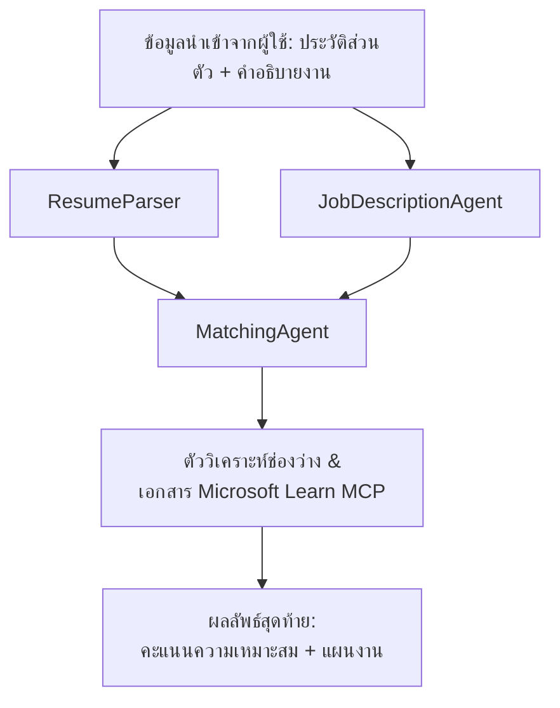

# PersonalCareerCopilot - ตัวประเมินความเหมาะสมระหว่างเรซูเม่กับงาน

โฟลว์การทำงานแบบหลายเอเจนท์ที่ประเมินว่ารายละเอียดในเรซูเม่ตรงกับคำบรรยายงานมากน้อยแค่ไหน จากนั้นสร้างแผนที่การเรียนรู้ส่วนบุคคลเพื่อเติมเต็มช่องว่างนั้น

---

## เอเจนท์

| เอเจนท์ | บทบาท | เครื่องมือ |
|-------|------|-------|
| **ResumeParser** | ดึงข้อมูลทักษะ โครงสร้าง ประสบการณ์ ใบรับรองจากข้อความเรซูเม่ | - |
| **JobDescriptionAgent** | ดึงทักษะที่ต้องการ/ที่ชอบ ประสบการณ์ ใบรับรองจากคำบรรยายงาน | - |
| **MatchingAgent** | เปรียบเทียบโปรไฟล์กับข้อกำหนด → คะแนนความเหมาะสม (0-100) + ทักษะที่ตรง/ขาด | - |
| **GapAnalyzer** | สร้างแผนที่การเรียนรู้ส่วนบุคคลด้วยทรัพยากรจาก Microsoft Learn | `search_microsoft_learn_for_plan` (MCP) |

## โฟลว์งาน


---

## เริ่มต้นอย่างรวดเร็ว

### 1. ตั้งค่าสภาพแวดล้อม

```powershell
cd workshop\lab02-multi-agent\PersonalCareerCopilot
python -m venv .venv
.\.venv\Scripts\Activate.ps1          # Windows PowerShell
# source .venv/bin/activate            # macOS / Linux
pip install -r requirements.txt
```

### 2. กำหนดค่าข้อมูลประจำตัว

คัดลอกไฟล์ env ตัวอย่างและกรอกข้อมูลโปรเจกต์ Foundry ของคุณ:

```powershell
cp .env.example .env
```

แก้ไข `.env`:

```env
PROJECT_ENDPOINT=https://<your-account>.services.ai.azure.com/api/projects/<your-project>
MODEL_DEPLOYMENT_NAME=gpt-4.1-mini
```

| ค่า | แหล่งที่หาได้ |
|-------|-----------------|
| `PROJECT_ENDPOINT` | แถบ Foundry ของ Microsoft ใน VS Code → คลิกขวาที่โปรเจกต์ของคุณ → **Copy Project Endpoint** |
| `MODEL_DEPLOYMENT_NAME` | แถบ Foundry → ขยายโปรเจกต์ → **Models + endpoints** → ชื่อ deployment |

### 3. รันในเครื่อง

```powershell
python -m debugpy --listen 127.0.0.1:5679 -m agentdev run main.py --verbose --port 8088
```

หรือใช้คำสั่งใน VS Code: `Ctrl+Shift+P` → **Tasks: Run Task** → **Run Lab02 HTTP Server**.

### 4. ทดสอบด้วย Agent Inspector

เปิด Agent Inspector: `Ctrl+Shift+P` → **Foundry Toolkit: Open Agent Inspector**.

วางคำสั่งทดสอบนี้:

```
Resume:
Jane Doe
Senior Software Engineer with 5 years of experience in Python, Django, and AWS.
Built microservices handling 10K+ requests/second. Led a team of 4 developers.
Certifications: AWS Solutions Architect Associate.
Education: B.S. Computer Science, State University.

Job Description:
Senior Cloud Engineer at Contoso Ltd.
Required: Python, Azure, Kubernetes, Terraform, CI/CD pipelines.
Preferred: Go, monitoring (Prometheus/Grafana), cost optimization.
Experience: 5+ years in cloud infrastructure.
Certifications: Azure Solutions Architect Expert preferred.
```

**คาดหวัง:** คะแนนความเหมาะสม (0-100), ทักษะที่ตรง/ขาด, และแผนที่การเรียนรู้ส่วนบุคคลพร้อม URL ของ Microsoft Learn.

### 5. ติดตั้งบน Foundry

`Ctrl+Shift+P` → **Microsoft Foundry: Deploy Hosted Agent** → เลือกโปรเจกต์ของคุณ → ยืนยัน.

---

## โครงสร้างโปรเจกต์

```
PersonalCareerCopilot/
├── .env.example        ← Template for environment variables
├── .env                ← Your credentials (git-ignored)
├── agent.yaml          ← Hosted agent definition (name, resources, env vars)
├── Dockerfile          ← Container image for Foundry deployment
├── main.py             ← 4-agent workflow (instructions, MCP tool, WorkflowBuilder)
└── requirements.txt    ← Python dependencies
```

## ไฟล์สำคัญ

### `agent.yaml`

กำหนดเอเจนท์โฮสต์สำหรับ Foundry Agent Service:
- `kind: hosted` - รันในคอนเทนเนอร์ที่จัดการโดยระบบ
- `protocols: [responses v1]` - เปิดเผย HTTP endpoint `/responses`
- `environment_variables` - `PROJECT_ENDPOINT` และ `MODEL_DEPLOYMENT_NAME` จะถูกใส่ตอนดีพลอย

### `main.py`

ประกอบด้วย:
- **คำแนะนำเอเจนท์** - ค่าคงที่ `*_INSTRUCTIONS` สี่ตัวสำหรับแต่ละเอเจนท์
- **เครื่องมือ MCP** - `search_microsoft_learn_for_plan()` เรียก `https://learn.microsoft.com/api/mcp` ผ่าน Streamable HTTP
- **การสร้างเอเจนท์** - `create_agents()` ด้วย context manager ใช้ `AzureAIAgentClient.as_agent()`
- **กราฟโฟลว์งาน** - `create_workflow()` ใช้ `WorkflowBuilder` เพื่อล่ามเอเจนท์ด้วยรูปแบบ fan-out/fan-in/ลำดับ
- **สตาร์ทเซิร์ฟเวอร์** - `from_agent_framework(agent).run_async()` บนพอร์ต 8088

### `requirements.txt`

| แพ็กเกจ | เวอร์ชัน | วัตถุประสงค์ |
|---------|---------|---------|
| `agent-framework-azure-ai` | `1.0.0rc3` | การรวม Azure AI สำหรับ Microsoft Agent Framework |
| `agent-framework-core` | `1.0.0rc3` | รันไทม์หลัก (รวม WorkflowBuilder) |
| `azure-ai-agentserver-agentframework` | `1.0.0b16` | รันไทม์เซิร์ฟเวอร์เอเจนท์โฮสต์ |
| `azure-ai-agentserver-core` | `1.0.0b16` | นามธรรมของเซิร์ฟเวอร์เอเจนท์หลัก |
| `debugpy` | ล่าสุด | เครื่องมือดีบัก Python (F5 ใน VS Code) |
| `agent-dev-cli` | `--pre` | CLI สำหรับพัฒนาในเครื่อง + backend ของ Agent Inspector |

---

## การแก้ไขปัญหา

| ปัญหา | วิธีแก้ |
|-------|-----|
| `RuntimeError: Missing required environment variable(s)` | สร้าง `.env` พร้อม `PROJECT_ENDPOINT` และ `MODEL_DEPLOYMENT_NAME` |
| `ModuleNotFoundError: No module named 'agent_framework'` | เปิดใช้งาน venv แล้วรัน `pip install -r requirements.txt` |
| ไม่พบ URL ของ Microsoft Learn ในผลลัพธ์ | ตรวจสอบการเชื่อมต่ออินเทอร์เน็ตกับ `https://learn.microsoft.com/api/mcp` |
| มีช่องว่างเพียง 1 ชุด (ถูกตัด) | ตรวจสอบว่า `GAP_ANALYZER_INSTRUCTIONS` มีบล็อก `CRITICAL:` รวมอยู่ด้วย |
| พอร์ต 8088 ถูกใช้งานอยู่ | หยุดเซิร์ฟเวอร์อื่น ๆ: `netstat -ano \| findstr :8088` |

สำหรับการแก้ไขปัญหาโดยละเอียด ดู [โมดูล 8 - การแก้ไขปัญหา](../docs/08-troubleshooting.md).

---

**อ่านแบบเต็ม:** [Lab 02 Docs](../docs/README.md) · **กลับไปที่:** [Lab 02 README](../README.md) · [โฮมเวิร์กช็อป](../../../README.md)

---

<!-- CO-OP TRANSLATOR DISCLAIMER START -->
**ข้อจำกัดความรับผิดชอบ**:
เอกสารนี้ได้รับการแปลโดยใช้บริการแปลด้วย AI [Co-op Translator](https://github.com/Azure/co-op-translator) แม้เราจะพยายามให้ความถูกต้องสูงสุด โปรดทราบว่าการแปลอัตโนมัติอาจมีข้อผิดพลาดหรือความไม่ถูกต้อง เอกสารต้นฉบับในภาษาดั้งเดิมควรถูกพิจารณาเป็นแหล่งข้อมูลที่เชื่อถือได้ สำหรับข้อมูลที่สำคัญ ควรใช้การแปลโดยมืออาชีพที่เป็นมนุษย์ เราไม่รับผิดชอบต่อความเข้าใจผิดหรือการตีความผิดที่เกิดขึ้นจากการใช้การแปลนี้
<!-- CO-OP TRANSLATOR DISCLAIMER END -->