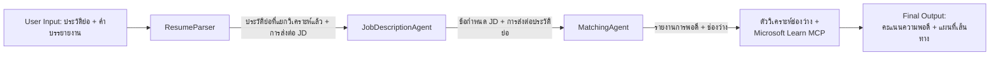

# PersonalCareerCopilot - ตัวประเมินความเหมาะสมของเรซูเม่กับงาน

แอปหลายเอเจนต์ที่เน้นกระบวนการทำงานเป็นหลัก ซึ่งประเมินความเหมาะสมของเรซูเม่กับคำบรรยายงาน จากนั้นสร้างแผนการเรียนรู้เฉพาะบุคคลเพื่อเติมเต็มช่องว่าง

---

## เอเจนต์

| Agent | บทบาท | เครื่องมือ |
|-------|------|-------|
| **ResumeParser** | ดึงทักษะ โครงสร้างประสบการณ์ และใบรับรองจากข้อความเรซูเม่ | - |
| **JobDescriptionAgent** | ดึงทักษะที่ต้องการ/ที่ชอบ ประสบการณ์ และใบรับรองจากคำบรรยายงาน | - |
| **MatchingAgent** | เปรียบเทียบโปรไฟล์กับข้อกำหนด → คะแนนความเหมาะสม (0-100) + ทักษะที่ตรง/ขาด | - |
| **GapAnalyzer** | สร้างแผนการเรียนรู้เฉพาะบุคคลด้วยทรัพยากร Microsoft Learn | `search_microsoft_learn_for_plan` (MCP) |

## กระบวนการทำงาน


```mermaid
flowchart LR
    UserInput["User Input: ประวัติย่อ + คำบรรยายงาน"] --> ResumeParser
    ResumeParser -- "ประวัติย่อที่แยกวิเคราะห์แล้ว + การส่งต่อ JD" --> JobDescriptionAgent
    JobDescriptionAgent -- "ข้อกำหนด JD + การส่งต่อประวัติย่อ" --> MatchingAgent
    MatchingAgent -- "รายงานการพอดี + ช่องว่าง" --> GapAnalyzerMCP["ตัววิเคราะห์ช่องว่าง +\nMicrosoft Learn MCP"]
    GapAnalyzerMCP --> FinalOutput["Final Output:\nคะแนนความพอดี + แผนที่เส้นทาง"]
```

---

## เริ่มต้นอย่างรวดเร็ว

### 1. ตั้งค่าสภาพแวดล้อม

โฟลเดอร์นี้เป็นการใช้งานตัวอย่างสำหรับโครงร่าง Lab 02 แบบกระบวนการทำงาน `main.py` ใช้บล็อกพรอมต์ที่มีอยู่พร้อมกับ `WorkflowBuilder` เพื่อต่อเชื่อมเอเจนต์ทั้งสี่เข้าด้วยกัน

```powershell
cd workshop\lab02-multi-agent\PersonalCareerCopilot
python -m venv .venv
.\.venv\Scripts\Activate.ps1          # Windows PowerShell
# source .venv/bin/activate            # macOS / Linux
pip install -r requirements.txt
```

### 2. กำหนดค่าข้อมูลรับรอง

สร้างไฟล์ `.env` ในโฟลเดอร์นี้:

```powershell
copy .env .env.bak 2>$null; echo $null > .env
```

แก้ไข `.env`:

```env
FOUNDRY_PROJECT_ENDPOINT=https://<your-account>.services.ai.azure.com/api/projects/<your-project>
AZURE_AI_MODEL_DEPLOYMENT_NAME=gpt-4.1-mini
```

| ค่า | แหล่งที่มา |
|-------|------------------|
| `FOUNDRY_PROJECT_ENDPOINT` | Foundry Toolkit sidebar → คลิกขวาที่โปรเจกต์ → **คัดลอกที่อยู่โปรเจกต์** |
| `AZURE_AI_MODEL_DEPLOYMENT_NAME` | Foundry sidebar → ขยายโปรเจกต์ → **Models + endpoints** → ชื่อ deployment |

### 3. รันในเครื่อง

```powershell
python -m debugpy --listen 127.0.0.1:5679 main.py --port 8088
```

หรือใช้คำสั่งใน VS Code: `Ctrl+Shift+P` → **Tasks: Run Task** → **Run Agent HTTP Server**.

สำหรับการดีบัก F5 ให้ใช้ **Debug Local Agent HTTP Server**.

### 4. ทดสอบด้วย Agent Inspector

เปิด Agent Inspector: `Ctrl+Shift+P` → **Foundry Toolkit: Open Agent Inspector**.

วางพรอมต์ทดสอบนี้:

```
Resume:
Jane Doe
Senior Software Engineer with 5 years of experience in Python, Django, and AWS.
Built microservices handling 10K+ requests/second. Led a team of 4 developers.
Certifications: AWS Solutions Architect Associate.
Education: B.S. Computer Science, State University.

Job Description:
Senior Cloud Engineer at Contoso Ltd.
Required: Python, Azure, Kubernetes, Terraform, CI/CD pipelines.
Preferred: Go, monitoring (Prometheus/Grafana), cost optimization.
Experience: 5+ years in cloud infrastructure.
Certifications: Azure Solutions Architect Expert preferred.
```

**ผลลัพธ์ที่คาดหวัง:** คะแนนความเหมาะสม (0-100), ทักษะที่ตรง/ขาด และแผนการเรียนรู้เฉพาะบุคคลพร้อม URL ของ Microsoft Learn

### 5. ติดตั้งบน Foundry

`Ctrl+Shift+P` → **Foundry Toolkit: Deploy Hosted Agent** → เลือกโปรเจกต์ → ยืนยัน

---

## โครงสร้างโปรเจกต์

```
PersonalCareerCopilot/
├── .env                ← Your credentials (git-ignored)
├── agent.yaml          ← Hosted agent definition (name, resources, env vars)
├── Dockerfile          ← Container image for Foundry deployment
├── main.py             ← 4-agent workflow (instructions, MCP tool, WorkflowBuilder)
└── requirements.txt    ← Python dependencies
```

## ไฟล์สำคัญ

### `agent.yaml`

กำหนดเอเจนต์โฮสต์สำหรับ Foundry Agent Service:
- `kind: hosted` - รันในคอนเทนเนอร์ที่จัดการให้
- `protocols` - โปรโตคอล `responses` พร้อม `version: 1.0.0` เผยแพร่ HTTP endpoint `/responses`
- `environment_variables` - กำหนด `AZURE_AI_MODEL_DEPLOYMENT_NAME` ที่นี่; `FOUNDRY_PROJECT_ENDPOINT` จะถูกฉีดอัตโนมัติเมื่อดีพลอย

### `main.py`

ประกอบด้วย:
- **คำสั่งเอเจนต์** - ค่าคงที่ `*_INSTRUCTIONS` สำหรับแต่ละเอเจนต์สี่ตัว
- **เครื่องมือ MCP** - `search_microsoft_learn_for_plan()` เรียก `https://learn.microsoft.com/api/mcp` ผ่าน Streamable HTTP
- **การสร้างเอเจนต์** - สี่อินสแตนซ์ `Agent()` + `AgentExecutor()` เชื่อมต่อกับ `FoundryChatClient` ตัวเดียวกัน
- **กราฟกระบวนการทำงาน** - `WorkflowBuilder` เชื่อมเอเจนต์เป็นสายพานลำดับ: ResumeParser → JD Agent → MatchingAgent → GapAnalyzer
- **การเริ่มต้นเซิร์ฟเวอร์** - `ResponsesHostServer` รันที่พอร์ต 8088

### `requirements.txt`

| แพ็กเกจ | จุดประสงค์ |
|---------|----------|
| `agent-framework-foundry` | คอร์รันไทม์: `Agent`, `AgentExecutor`, `WorkflowBuilder`, `@tool`, `FoundryChatClient` |
| `agent-framework-foundry-hosting` | `ResponsesHostServer` + การผนวกโฮสต์ Foundry |
| `mcp<2,>=1.24.0` | ลูกค้า MCP สำหรับ GapAnalyzer (`streamable_http_client`) |
| `debugpy` | ดีบัก Python (F5 ใน VS Code) |

---

## การแก้ไขปัญหา

| ปัญหา | การแก้ไข |
|-------|-----|
| `KeyError: 'FOUNDRY_PROJECT_ENDPOINT'` หรือ `KeyError: 'AZURE_AI_MODEL_DEPLOYMENT_NAME'` | สร้าง `.env` พร้อมทั้งตั้งค่า `FOUNDRY_PROJECT_ENDPOINT` และ `AZURE_AI_MODEL_DEPLOYMENT_NAME` |
| `ModuleNotFoundError: No module named 'agent_framework'` | เปิดใช้งาน venv และรัน `pip install -r requirements.txt` |
| ไม่มี URL ของ Microsoft Learn ในผลลัพธ์ | ตรวจสอบการเชื่อมต่ออินเทอร์เน็ตกับ `https://learn.microsoft.com/api/mcp` |
| มีการ์ดช่องว่างเพียงใบเดียว (ถูกตัด) | ตรวจสอบให้แน่ใจว่า `GAP_ANALYZER_INSTRUCTIONS` มีบล็อก `CRITICAL:` |
| พอร์ต 8088 ถูกใช้งานอยู่ | หยุดเซิร์ฟเวอร์อื่น: `netstat -ano \| findstr :8088` |

สำหรับการแก้ไขปัญหาโดยละเอียดดูที่ [Module 8 - Troubleshooting](../docs/08-troubleshooting.md).

---

**คำแนะนำแบบละเอียด:** [Lab 02 Docs](../docs/README.md) · **ย้อนกลับ:** [Lab 02 README](../README.md) · [Workshop Home](../../../README.md)

---

<!-- CO-OP TRANSLATOR DISCLAIMER START -->
**ปฏิเสธความรับผิดชอบ**:
เอกสารนี้ได้รับการแปลโดยใช้บริการแปลภาษา AI [Co-op Translator](https://github.com/Azure/co-op-translator) ขณะที่เราพยายามให้ความถูกต้อง โปรดทราบว่าการแปลโดยอัตโนมัติอาจมีข้อผิดพลาดหรือความไม่ถูกต้อง เอกสารต้นฉบับในภาษาต้นทางควรถูกพิจารณาเป็นแหล่งข้อมูลที่เชื่อถือได้ สำหรับข้อมูลที่สำคัญ แนะนำให้ใช้การแปลโดยมนุษย์มืออาชีพ เราไม่รับผิดชอบต่อความเข้าใจผิดหรือการตีความที่ผิดพลาดที่เกิดขึ้นจากการใช้การแปลนี้
<!-- CO-OP TRANSLATOR DISCLAIMER END -->