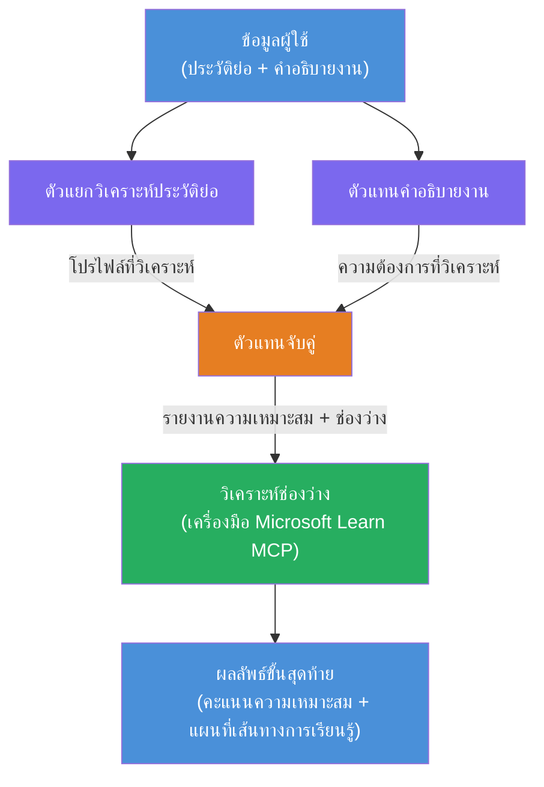

# Lab 02 - เวิร์กโฟลว์หลายเอเจนต์: ตัวประเมินความเหมาะสมระหว่างเรซูเม่กับงาน

---

## สิ่งที่คุณจะสร้าง

**ตัวประเมินความเหมาะสมระหว่างเรซูเม่กับงาน** - เวิร์กโฟลว์หลายเอเจนต์ที่มีเอเจนต์ผู้เชี่ยวชาญสี่ตัวทำงานร่วมกันเพื่อประเมินว่าเรซูเม่ของผู้สมัครตรงกับคำบรรยายงานดีแค่ไหน จากนั้นสร้างแผนการเรียนรู้ส่วนบุคคลเพื่อปิดช่องว่างนั้น

### เอเจนต์

| เอเจนต์ | บทบาท |
|-------|------|
| **Resume Parser** | ดึงทักษะ ประสบการณ์ ใบรับรองที่มีโครงสร้างจากข้อความในเรซูเม่ |
| **Job Description Agent** | ดึงทักษะ ประสบการณ์ ใบรับรองที่ต้องการ/ชอบจากคำบรรยายงาน |
| **Matching Agent** | เปรียบเทียบโปรไฟล์กับข้อกำหนด → คะแนนความเหมาะสม (0-100) + ทักษะที่ตรง/ขาด |
| **Gap Analyzer** | สร้างแผนการเรียนรู้ส่วนบุคคลพร้อมทรัพยากร ระยะเวลา และโปรเจกต์ที่ทำได้เร็ว |

### โฟลว์สาธิต

อัปโหลด **เรซูเม่ + คำบรรยายงาน** → ได้ **คะแนนความเหมาะสม + ทักษะที่ขาด** → รับ **แผนการเรียนรู้ส่วนบุคคล**

### สถาปัตยกรรมเวิร์กโฟลว์

> สีม่วง = เอเจนต์แบบขนาน | สีส้ม = จุดรวมข้อมูล | สีเขียว = เอเจนต์สุดท้ายที่มีเครื่องมือ ดู [Module 1 - Understand the Architecture](docs/01-understand-multi-agent.md) และ [Module 4 - Orchestration Patterns](docs/04-orchestration-patterns.md) สำหรับภาพและการไหลของข้อมูลโดยละเอียด

### หัวข้อที่ครอบคลุม

- การสร้างเวิร์กโฟลว์หลายเอเจนต์โดยใช้ **WorkflowBuilder**
- กำหนดบทบาทเอเจนต์และโฟลว์การจัดการ (แบบขนาน + แบบเรียงตามลำดับ)
- รูปแบบการสื่อสารระหว่างเอเจนต์
- การทดสอบแบบโลคอลด้วย Agent Inspector
- การปรับใช้เวิร์กโฟลว์หลายเอเจนต์กับ Foundry Agent Service

---

## ข้อกำหนดเบื้องต้น

ทำ Lab 01 ให้เรียบร้อยก่อน:

- [Lab 01 - Single Agent](../lab01-single-agent/README.md)

---

## เริ่มต้น

ดูคำแนะนำการติดตั้งครบถ้วน การอธิบายโค้ด และคำสั่งทดสอบได้ที่:

- [Lab 2 Docs - Prerequisites](docs/00-prerequisites.md)
- [Lab 2 Docs - Full Learning Path](docs/README.md)
- [PersonalCareerCopilot run guide](PersonalCareerCopilot/README.md)

## รูปแบบการจัดการโฟลว์ (ทางเลือกเชิงเอเจนต์)

Lab 2 ประกอบด้วยโฟลว์แบบ **ขนาน → รวมข้อมูล → วางแผน** เป็นค่าเริ่มต้น และเอกสารยังอธิบายรูปแบบทางเลือกอื่นเพื่อแสดงพฤติกรรมเอเจนต์ที่แข็งแกร่งขึ้น ได้แก่:

- **Fan-out/Fan-in พร้อมมติแบบถ่วงน้ำหนัก**
- **ผ่านการตรวจสอบ/วิจารณ์ก่อนแผนที่สุดท้าย**
- **ตัวกำหนดเส้นทางตามเงื่อนไข** (เลือกเส้นทางตามคะแนนความเหมาะสมและทักษะที่ขาด)

ดู [docs/04-orchestration-patterns.md](docs/04-orchestration-patterns.md)

---

**ก่อนหน้า:** [Lab 01 - Single Agent](../lab01-single-agent/README.md) · **กลับไปที่:** [Workshop Home](../../README.md)

---

<!-- CO-OP TRANSLATOR DISCLAIMER START -->
**ข้อจำกัดความรับผิดชอบ**:  
เอกสารนี้ได้รับการแปลโดยใช้บริการแปลภาษา AI [Co-op Translator](https://github.com/Azure/co-op-translator) แม้ว่าเราจะพยายามอย่างดีที่สุดเพื่อความถูกต้อง โปรดทราบว่าการแปลอัตโนมัติอาจมีข้อผิดพลาดหรือความไม่ถูกต้อง เอกสารต้นฉบับในภาษาต้นทางถือเป็นแหล่งข้อมูลที่ถูกต้อง สำหรับข้อมูลที่สำคัญ แนะนำให้ใช้บริการแปลโดยมืออาชีพที่เป็นมนุษย์ เราไม่รับผิดชอบต่อความเข้าใจผิดหรือการตีความผิดใดๆ ที่เกิดจากการใช้การแปลนี้
<!-- CO-OP TRANSLATOR DISCLAIMER END -->